OPMRUN is graphical user interface to Flow that has similar functionality to the commercial simulator’s ECLRUN program. Target audience are Reservoir Engineers in a production environment. Developers and experienced Linux users will already have compatible work flows. The application performs the following:

- Allows editing and management of OPM Flow’s run time parameters. Default parameters are automatically loaded from OPM Flow, and the user can reset the default parameter set either from a parameter or PRT file. Editing of a job’s parameter file is also available.
- Runs under Linux and Windows 10. For Windows 10 OPM Flow is run via the Windows Subsystem for Linux (“WSL”).
- Allows simulation jobs to be queued and run in either foreground (under OPMRUN), or in  background in a xterm terminal session in Lunux or WSL under Windows 10. Jobs in the queue can be set to run in NOSIM mode or RUN mode.
- Foreground jobs can be killed from OPMRUN, with the option of killing all the jobs in the queue.
- Queues can be edited, saved and loaded.

Various additional simulation input generation and conversion utilities are available including:

- Compressing a job to save space (DATA, and all OPM Flow output files) and uncompressing previously compressed jobs,
- Keywords, a keyword generator based on the Apache Velocity Template Language (“VTL”). The templates can therefore also be used with any editor that supports VTL, jEdit for example. There is one template per keyword, with the formatting the same as the OPM Flow manual. Over 450 templates are currently implemented. One can also customize the existing templates as well as creating User defined templates. The keywords are examples, one still has to edit the resulting deck with the actual required data, but the format with comments should make this a straight forward process.
- A Production Schedule application that takes a comma delimited CSV file containing historical production and injection data and converts the data to an OPM Flow SCHEDULE file using the WCONHIST series of keywords. Currently only production data is supported.
- Sensitivities application that generates sensitivity cases based on a "Base" case file. The Base file contains "Factors" (variable names), $X01, $X02, etc., that are substituted with user defined values using the data entered and the type of Sensitivity Scenario selected.
- A Well Specification application that uses the standard well export files from OPM ResInsight to reformat the data in a more user-friendly manner for the WELSPECS and COMPDAT keywords. Optionally, the application can generate the COMPLUMP keyword based on the OPM ResInsight layers file, with one completion per defined reservoir layer.
- Calling OPM ResInsight and loading the currently selected job into OPM ResInsight for viewing.
- A Well Trajectory Conversion application that converts a Schlumberger Petrel exported well trajectory file into an OPM ResInsight file, containing all the wells.

The software can be downloaded from the following link:

[https://github.com/OPM/opm-utilities/tree/master/opmrun](https://github.com/OPM/opm-utilities/tree/master/opmrun)

OPMRUN is written in Python 3 and tested under various Ubuntu distributions. Note that only Python 3 is supported and tested, Python2 support has been deprecated.

The program requires the following standard module Python libraries:

- datetime, getpass, importlib, os, numpy, pkg_resources, pandas, pathlib, platform, psutil, sys, re, subprocess, and tkinter as tk.

In addition, the following non-standard Python modules are required:

- airspeed, notify-py, pyDOE2, and PySimpleGUI.

For some Linux systems the relevant package manager may have to be used to install tkinter as tk; whereas for Windows 10 users the tkinter package is pre-installed with Python.

OPMRUN enables the editing and management of OPM Flow’s run time parameters, setting up job queues to run a series of simulation jobs sequentially, as well as the management of the job queues.  Figure C.1shows the initial display.

Upon launch the program runs OPM Flow to get a list of command line parameters from the current version of OPM Flow. These default parameters can be edited for each case, or alternative default parameter sets can be loaded from an existing parameter file from another job, or a *.PRT file from a completed simulation.

As can be seen in Figure C.2 the program has upper and lower display elements. The upper element shows a list of simulation jobs that are in the job queue and the lower element consists of two elements, one for the OPM Flow Output (the terminal output from OPM Flow) and a second element (OPM Run Log) that is a session log of the jobs run by OPMRUN. Clicking the OPM Flow Output and OPM Run Log tabs switches the display on the lowered element between two display types.

To add jobs to the queue use the Add Job button or load an existing job queue using the Load Queue button.   Jobs can be edited or deleted from the queue using the Edit Job and Delete Job buttons, and a series of jobs can be saved as a job queue by using the Save Queue button. The Clear Queue button deletes all jobs from the queue.

Pressing the Add Job button will display the following dialogue box:

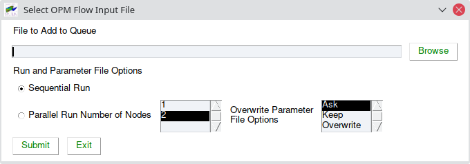

Use the Browse button to select the input file to add to the queue, then select the Run Parameters for this input file, then press the Submit button to add the input file to the job queue (Figure C.4).

The Overwrite Parameter File Options allow for different default treatments of existing *.PARAM files, which is particularly useful when adding multiple jobs at the same time.

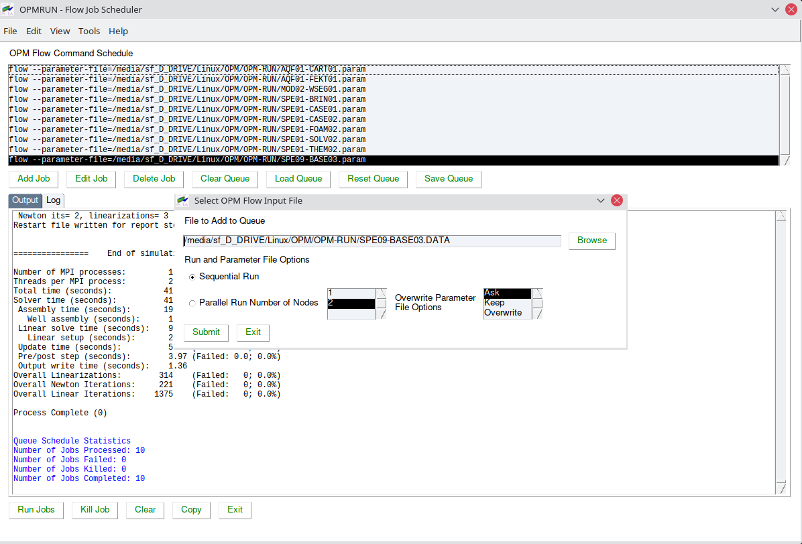

The reason for this is because different versions of OPM Flow have different parameter sets and if a newer version of OPM Flow runs with a previous version’s *.PARAM file then the simulator will stop with an error message for the various invalid parameters for the current version of the simulator.

Jobs in the queue can be edited by selecting the Edit Job button that will display two options (Figure C.5): one to edit the input file using the defined editor and the second to edit the OPM Flow Parameter File.

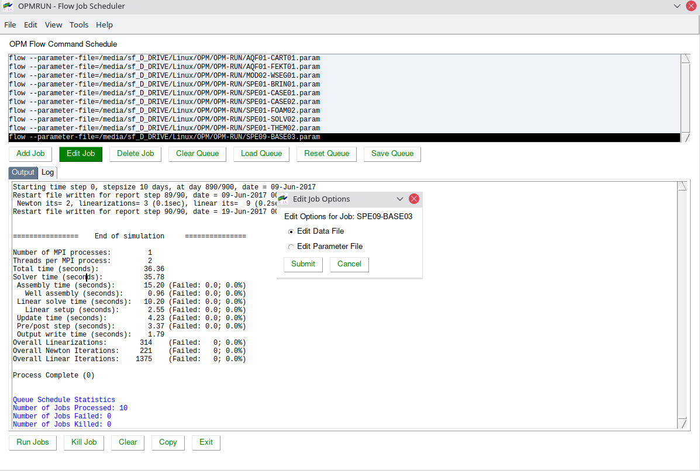

If the second option is selected OPMRUN will display a dialog box that shows a list of the OPM Flow command line parameters together with the parameter help information Figure C.7). Selecting a parameter from the list and selecting the Edit button will display the setting for the selected parameter (alternatively one can double click the required entry).  One can then edit the parameter as required. Use the Save button to save the change and use the Exit button to save all the changes to the parameter file. The Cancel button will cancel all changes to the parameter file.

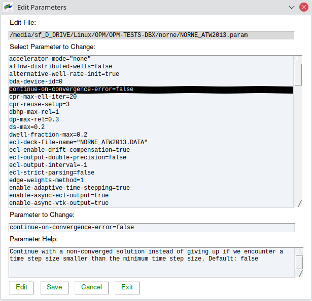

Alternatively one can use the:

    - Edit OPM Flow Parameter menu option to edit the parameter file for a job.
    - List OPM Flow Parameters menu option to list the commands in the parameter file for a job.
    - Set OPM Flow Default Parameters to set the default parameters for all subsequent jobs added to the queue. This option allows the user to load a default set of parameters from (1) OPM Flow, (2) an OPM Flow Parameter File, or (3) an OPM Flow print file (*.PRT).

One can also right-click on a job and select one of the available options.

To load a previously saved job queue, press the Load Queue button this will display a dialog box allowing the user to select a queue file (*.que), after pressing the OK button the jobs will be displayed in the Job List Element as illustrated in Figure C.7.

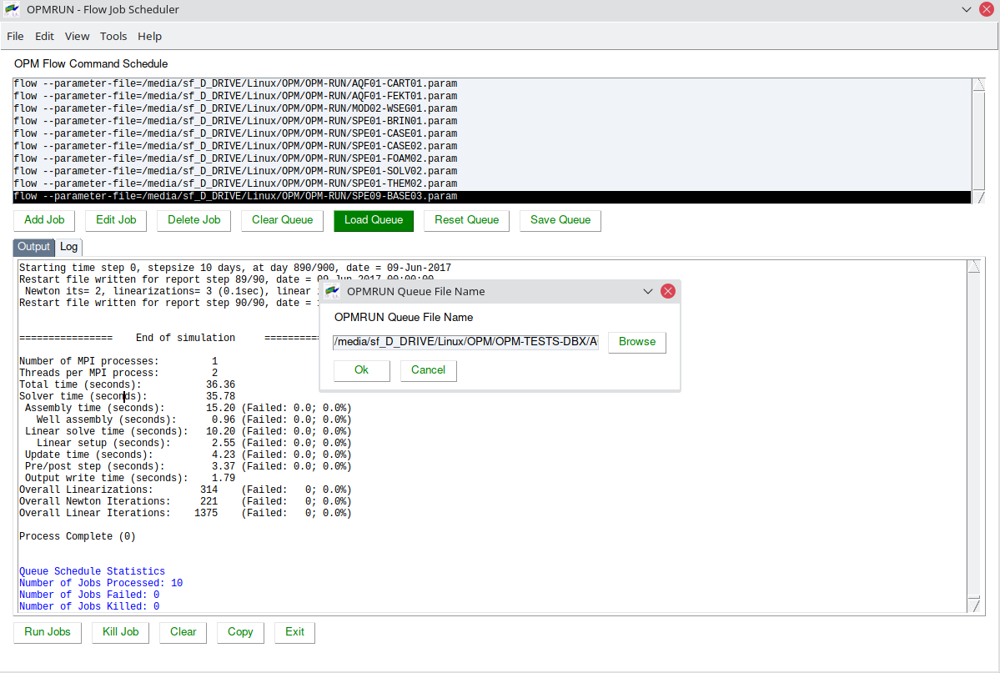

Queue files allow for various jobs to be load efficiently, especially for ensemble and sensitivity cases and may contain a large number of cases.

| Note When running under Windows 10 the Job names will follow the Windows 10 file naming convention and OPMRUN automatically handles the file names for running the jobs under the Window Subsystem for Linux. However, care is needed for any “included” file in the input deck. In this case the PATHS – Define Filename Directory Path Aliases keyword in the RUNSPEC section may be of use. |
| --- |

Reset Job Queue Parameters allows jobs run under Windows 10 WSL to be renamed for running under Linux, and changing jobs from serial to parallel and vice versa.

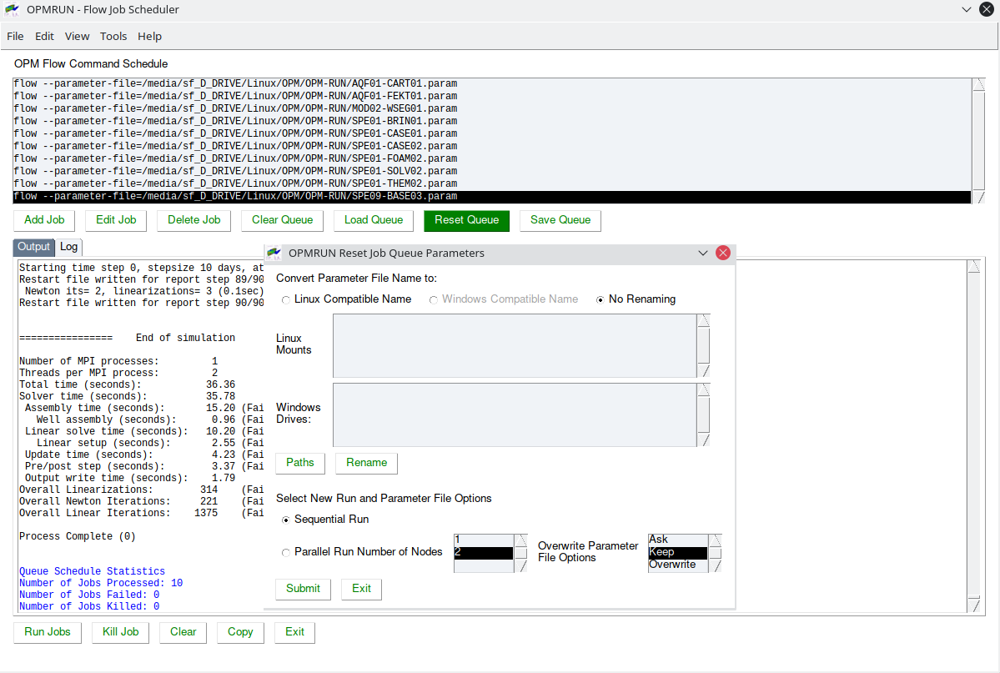

The application will attempt to list or Linux mount points and Windows drives depending on the host operating system, once the two systems mount and drive points have been selected then the files in the queue will be renamed from the previous host system to the current host system. This is only performed for the *.DATA files, included files in the input deck are currently not converted.

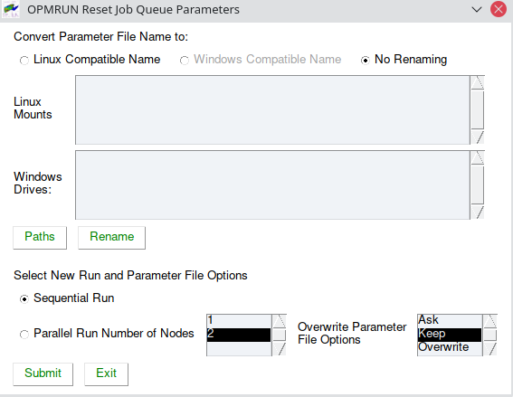

As previously mentioned, one can also change the queue run time parameters from serial to parallel or vice versa.

Selecting the Run Jobs button displays the Select Run Option dialog box shown in Figure C.10 and Figure C.11.

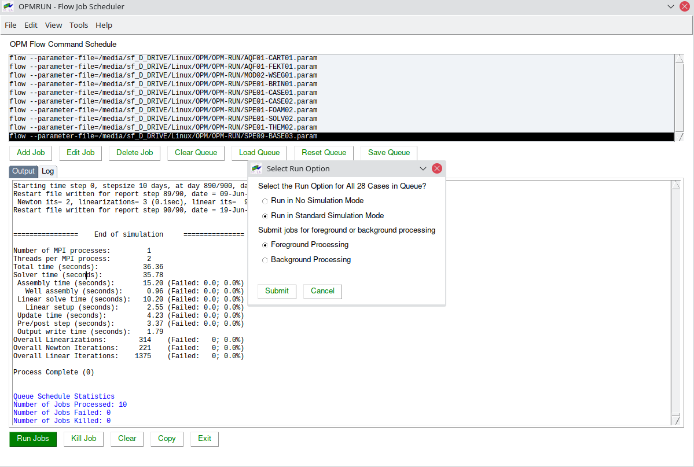

On the Select Run Dialog, the Run in No Simulation Mode option is equivalent to setting the NOSIM option in the input deck for all jobs in the queue (see section 5.3.96 NOSIM – Activate the No Simulation Mode for Data File Checking and the --enable-dry-run command line parameter in Table 2.1 in section 2.2 Running OPM Flow From The Command Line). This allows for checking all the jobs at once.

Selecting Run in Standard Simulation Mode will run all the jobs in the queue sequentially, with the OPM Flow terminal output directed to OPM Flow Output Element, as shown in Figure C.12. The terminal output is also directed to a *.LOG file as well, similar to what the commercial simulator does.

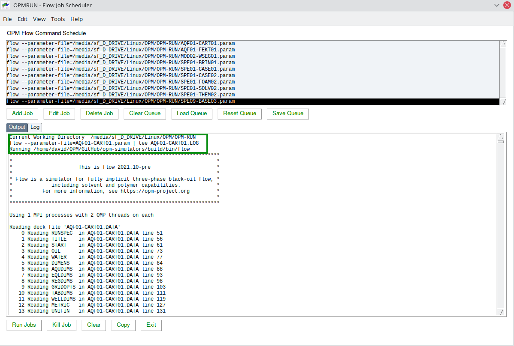

Clicking the OPM Run Log tab displays the OPMRUN’s session log file that records the time and date of the major events that have occurred, including the start and end times of each run. Notice also how OPMRUN deletes all the existing output files for a given job, if they exists, before running OPM Flow. as well as creating a Schedule Log for tracking progress (Figure C.13).

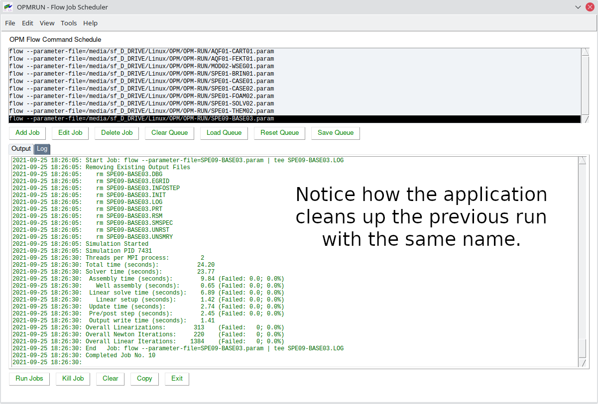

The Kill button will ask the user if the current running job should be killed, and if the job is to killed, the application will prompt as whether or not all the jobs in the queue should be killed.

The Clear clears the OPM Flow Output Element from the currently displayed tab (Output or Log) and the Copy button copies the data to the clipboard.

#### File Menu Options

Enables open and saving the job queue, switching projects and listing OPMRUN's user properties.

#### Edit Menu Options

Lets one add jobs, add jobs recursively (all jobs in the selected directory and below), edit the data file (Figure C.14) and the parameter file for the selected job,(see section C.2.2 Edit Job Data and Parameter File) edit, list and set the default parameters for running jobs that will be added to the queue, set OPMRUN options, and set the project’s project directories.

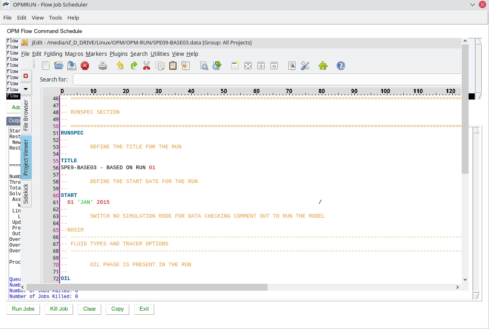

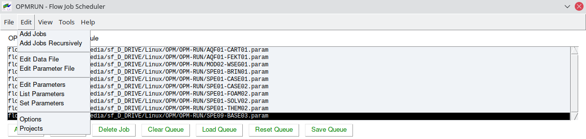

The options are also available by right-clicking a job in the Job List Element

The Edit Parameters, List Parameters and Set Parameters relate to the default parameter set, not the parameter set for a particular job. When a new job is added to the queue the application checks if a *.PARAM file exists for the job, if not then the default parameter set is used for the job. Editing the default parameter set is the same as editing a job parameter set (see section C.2.2 Edit Job Data and Parameter File for more information).

One can also define the default parameter set by using the OPM Flow default values, which is the set created when OPMRUN is first initialized. In addition, one can load an existing parameter set from an existing *.PARAM file or from an OPM Flow *.PRT file (Figure C.15).

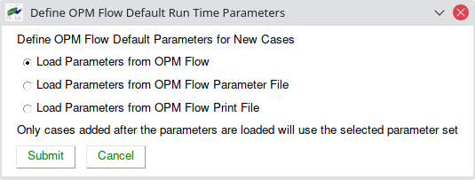

OPMRUN has several configuration options that can be set via the Edit/Options menu option as illustrated in Figure C.16.  These include setting:

- The location of the OPM Flow manual.
- The Keyword Generator Template Directory, one of tools supplied with OPMRUN, see section C.3.2 OPMRUN Tools: Simulator Input/Keywords for further information on this application.
- The location of the ResInsight program, for loading the results of a simulation run for viewing.
- The editor command to used to edit the input deck and view the resulting simulator output files.
- The terminal console to be be used for background jobs. WSL (“Windows Subsystem for Linux) should be selected if OPMRUN is running under Windows 10 to enable jobs to be submitted to the installed Linux distribution.
- The User Information series of fields are used by various supplied tools and in some templates used by the Keyword Generator application (see C.3.2 OPMRUN Tools: Simulator Input/Keywords for more information on this application). Note if a User Information” field is not defined then the template variable will be output instead – this can easily be deleted in the application.
- One can also define the main OPMRUN windows configuration parameters define:  input (Job List Element) and output panel’s (OPM Flow Output Element) size, font and font size.

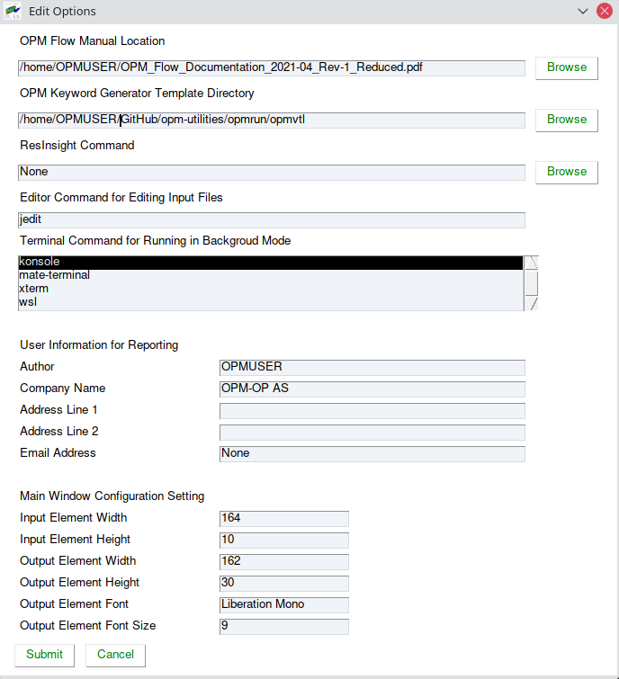

In addition to the aforementioned options, the Edit/Projects menu item enables the setting of project directories that allows the user to set a default directory for loading and saving files within OPMRUN and the auxiliary applications (Figure C.17).

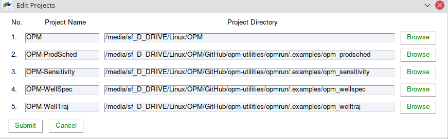

#### View Menu Options.

Allows the user to view the results of an OPM Flow simulation run using the default editor. The options are also available by right-clicking a job in the Job List Element.

#### Tools Menu Options

Contains various tool that may be useful in building a simulation model.

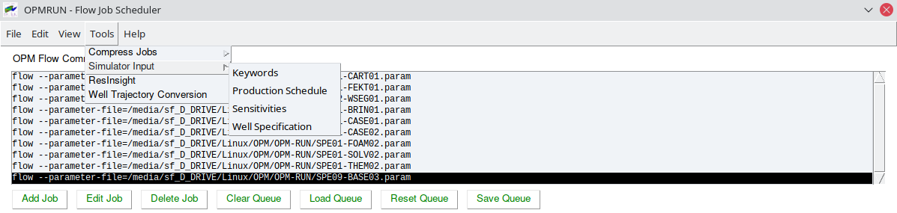

See the section C.3 OPMRUN Tools  for further details on the available tools.

Help Menu Options

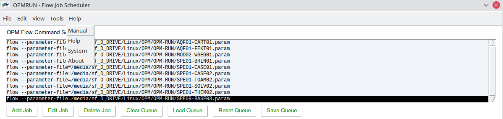

Use the Edit / Options menu option to select the location of the OPM Flow Manual.

Simulation input and output files can be extremely large, especially for large full field models. Running multiple cases in these circumstances can easily use up all available disk space, especially if multiple users are running multiple cases. The Tools/Compression Jobs option allows the user to compress a series of jobs into individual zip files (one zip file per job), as well as uncompressing previously zip job files.

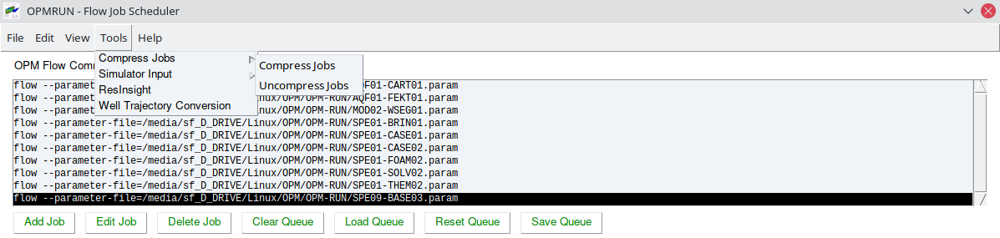

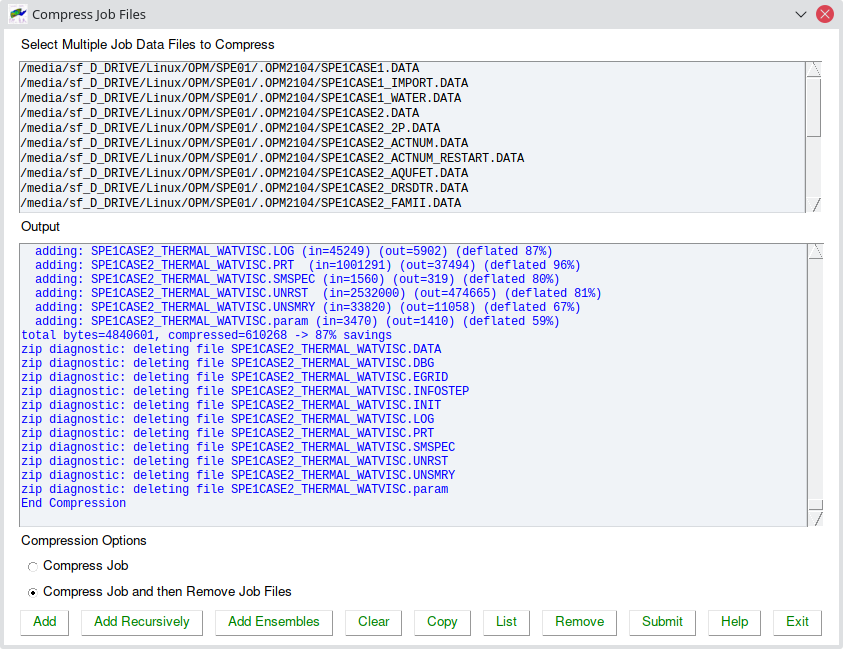

Note there is a similar application for uncompressing zip files and that the tool uses the Linux zip and unzip programs both on Linux host systems and Windows 10 systems using WSL.

The OPMRUN Keyword generator is an application that generates OPM Flow keywords that can be cut and pasted into any editor or saved to a separate file to form the basis of a new input deck (*.DATA files).   The application utilizes templates based on the Apache Velocity Template Language (“VTL”), a commonly used template language used by software engineers. The templates can therefore also be used with any editor that supports VTL, jEdit for example, a popular open source Java based editor and PyCharm, a Python integrated  development environment used in computer programming, specifically for the Python language.

There is one template per keyword, with formatting of the keywords being the same as the OPM Flow manual. Currently there are over 450 templates implemented and the intention is for additional keywords to be added as the their usage is implemented within the simulator and documented within the manual. The application allows one to customize the existing templates as well as creating user defined templates by including the templates in the template directory and following the VTL language syntax. One still has to edit the resulting keywords to match the data require, but the structure and comments are provided by the application.

The application is accessed via the Tool/Simulator Input/Keywords menu item and the tool can generate specific keywords, as well as complete sections (Figure C.20)

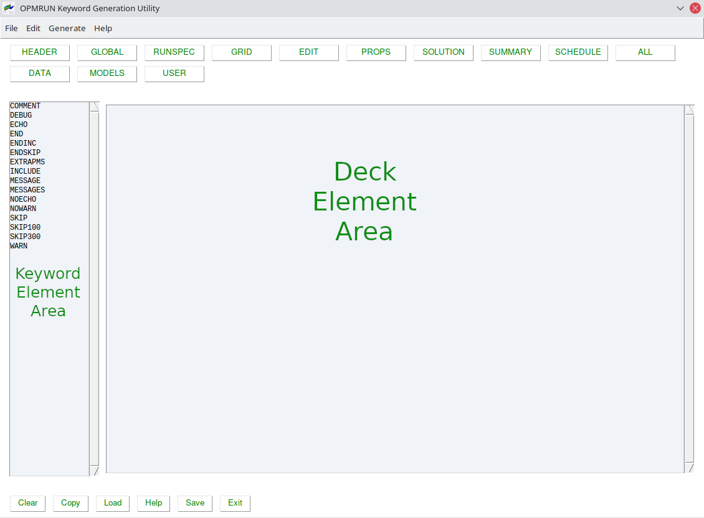

The application consists of several elements, a conventional menu system at the top, a Deck Element Area that will contain the resulting generated keywords, a Keyword Element Area for the user to select the keyword, data, models or user templates, and finally a series of buttons, HEADER, GLOBAL, etc., that are used to select the keywords in a OPM Flow section, specific data sets, models or user defined templates.  The selection will appear in the Keyword Element Area.

Clicking on an item in the Keyword Element Area will generate the data for the item in the Deck Element Area, as shown below for the OPM Flow copyright header in Figure C.21.

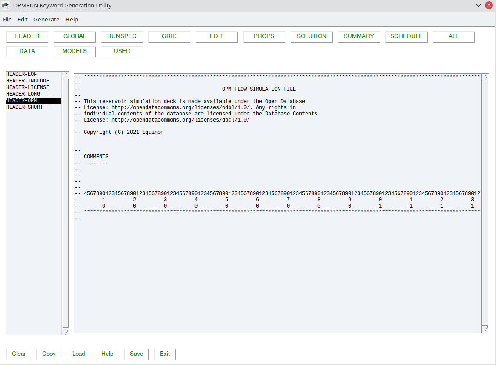

The Deck Element Area is editable by simply clicking anywhere in the element and making changes. Use the Clear button to clear the Deck Element Area display, the Copy button to copy the Deck Element Area data to the clipboard, and the Save button to save the data to a file. The Load button allows one to load an existing file into the Deck Element Area for additional editing.

Note that the HEADER section is not an OPM Flow section, but a list of various comment block headers used to make the deck more readable.

#### Keywords: Menu Options

The various menu options include the File Menu

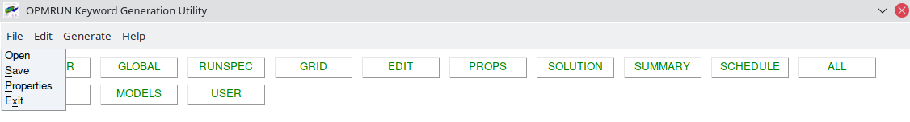

Where the Open and Save options load and save a file, and the Properties displays OPMRUN's properties.

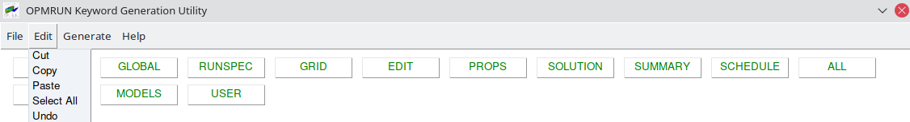

The Edit Menu provides some basic standard editing facilities

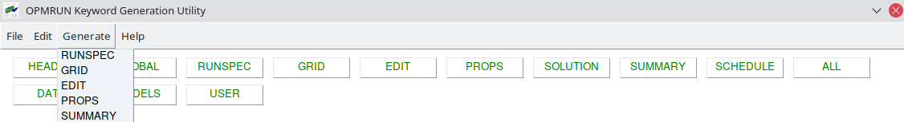

Next, the Generate Menu options allows one to generate a complete section of keywords, as described below. These options are equivalent to selecting the equivalent section keyword (RUNSPEC, GRID, etc.) in the Keyword Element Area.

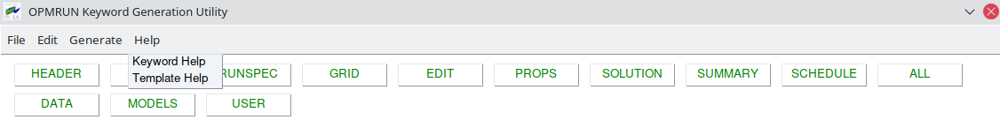

Finally, the Help Menu option display the Keyword Help information (Figure C.26):

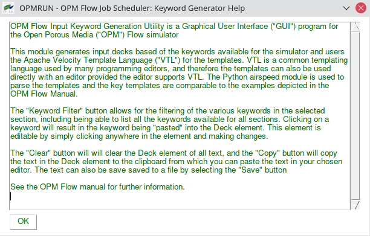

And the Velocity Template Help (Figure C.27).

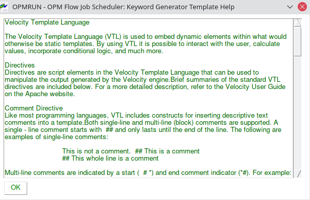

As mentioned previously, the tool uses the Apache Velocity Template Language ("VTL") for the templates,    and therefore the templates can also be used directly with an editor, provided the editor supports VTL.

#### Keywords: File Imports

If a keyword requires a file, for example, the INCLUDE and LOAD keywords, then a dialog box is presented to enable the file to be selected. The application will also allow one to select the file name format, after the file has been selected.

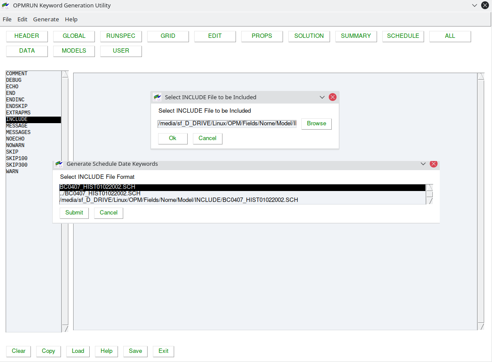

Note that COMMENT template is not an actual keyword, but a comment block to make the deck more readable for the user.

#### Keywords: Section Standard Set of Keywords

Selecting a Generate Menu option or a Section keyword (RUNSPEC, GRID,  EDIT, PROPS, SOLUTION, SUMMARY, and SCHEDULE) in the Keyword Element Area will give an option to generate a representative set of keywords for that section, as per the RUNSPEC example in Figure C.29.

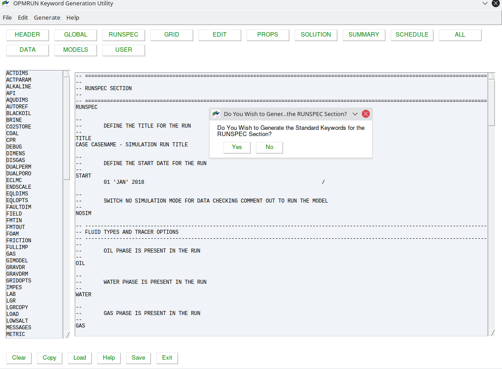

One can therefore generate a complete input deck in a matter of minutes; however, you still have to edit the generated input deck with your actual data.

#### Keywords: SUMMARY Section Variables

For the SUMMARY section keyword, one can also generate various sets of summary variables based on the options being used in the model. Note that not all the variables are currently available in OPM Flow, but additional variables are added at each release.

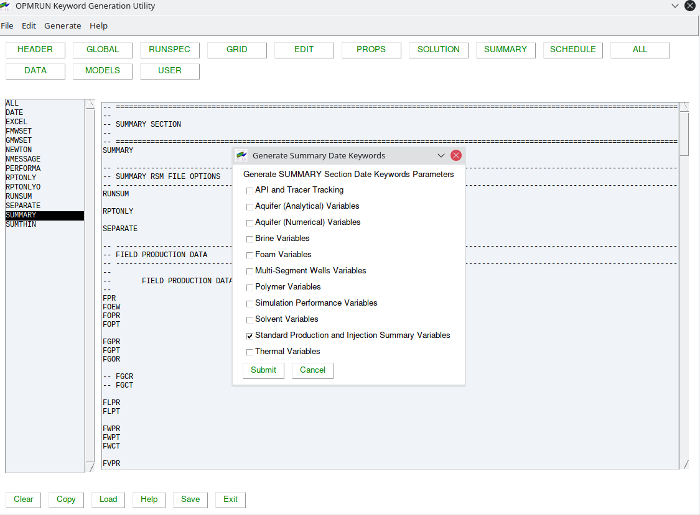

For SUMMARY variables not recognized by OPM Flow, the simulator will issue a warning message and ignore those variables not implemented.

#### Keywords: SCHEDULE Section Keywords and Date Schedule

For the SCHEDULE Section keyword, one can also generate a representative set of SCHEDULE keywords, plus a date schedule from a start year to an end year, using Annual, Quarterly, or Monthly time steps.

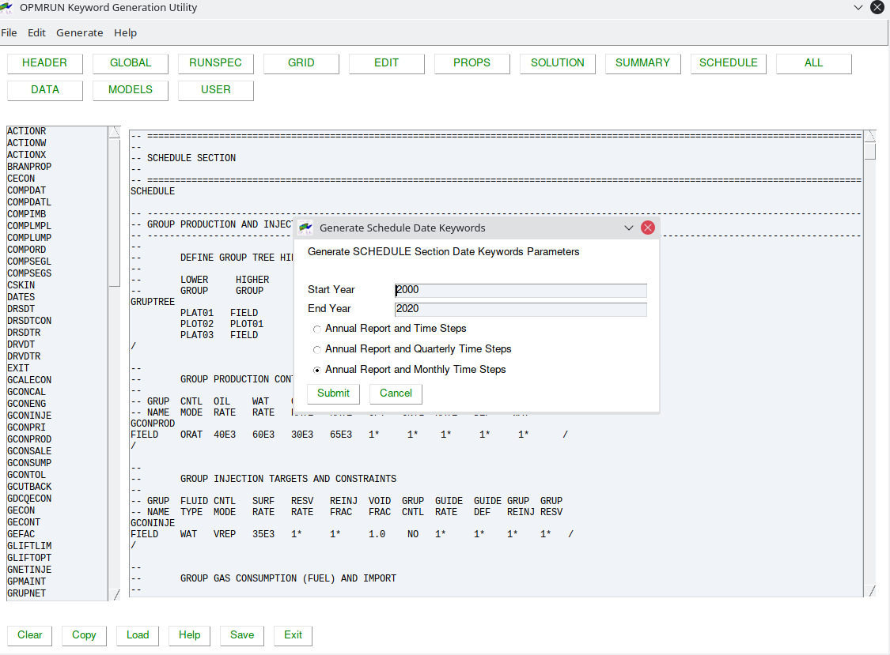

This option also writes a standard report using the RPTSCHED keyword at the beginning of each year which is subsequently switch off for the intermediate Quarterly and Monthly time steps. A final report is written at the end of the run.

#### Keywords: DATA (Sets) Option

There is also a DATA option which is not an OPM Flow section, but a series of data sets, as shown in Figure C.32.

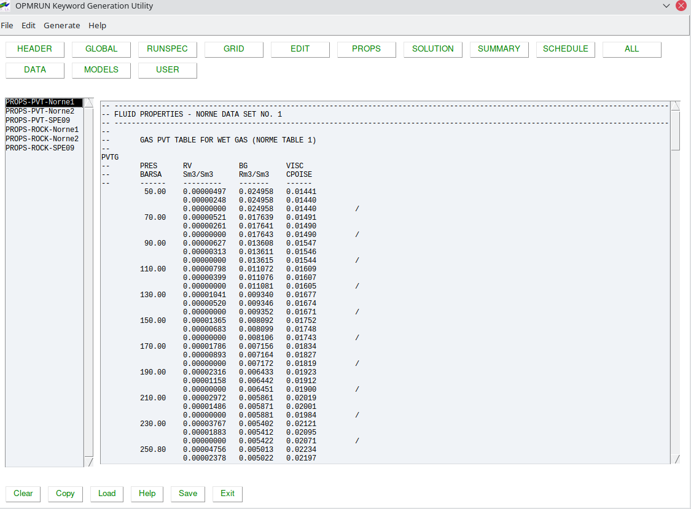

The data sets are complete examples for a given type of data used in OPM Flow, for example a PVT data set for a wet gas reservoir, or three phase relative permeability data set. The data sets are intended to be used as a guide for generating ones own keyword input, or for building models for testing.

The intention is to expand the collection of data sets over time as more data becomes available.

#### Keywords: MODEL Option

Like the DATA option, the MODEL option is not an OPM Flow section, but is instead a collection of working models, as illustrated in Figure C.33.

The purpose of the models is to illustrate the functionality of various features implemented in OPM Flow and to act as guide for users in building their own models.

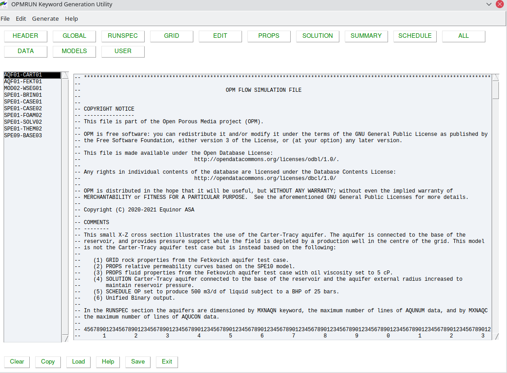

Additional models will be added when available.

#### Keywords: USER Templates Option

Finally, the USER option is where users can store their own templates. USER templates with the “vm” extension will automatically be listed by the USER button. To use this feature, after selecting a keyword, right clicking on the keyword allows one to load the actual template for the keyword. One can then edit the template and save the changes back to the same template or another template using the Save button.

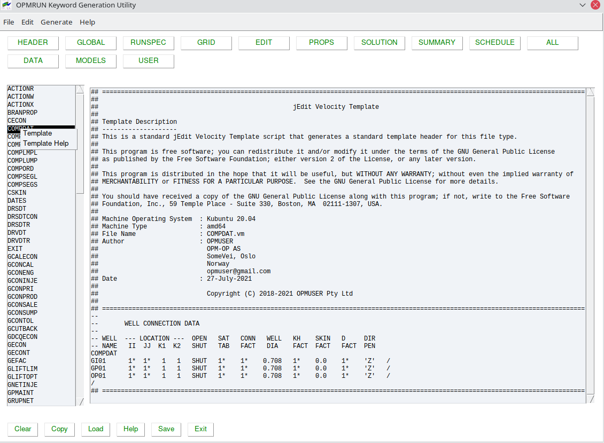

The Template Help option displays a brief introduction to VTL for further reference.

The Tools/Simulator Input/Production Schedule application takes a comma delimited CSV file containing historical production and injection data and converts the data to an OPM Flow SCHEDULE file using the WCONHIST series of keywords. An example input file is shown below:

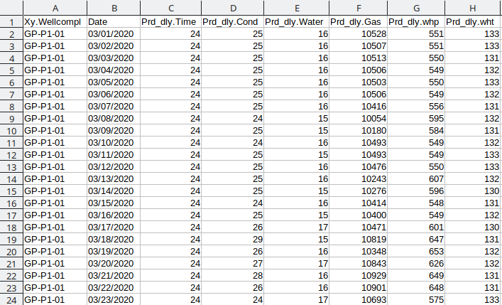

The first row in the input file is a header row that declares the data type for a column, the example shows  typical Oil Field Manager (“OFM”) header variable names, but various variable names can be used to define the data type.

The tool can convert daily production data to a: daily production schedule, monthly average, or monthly on-stream average production schedule, as shown below:

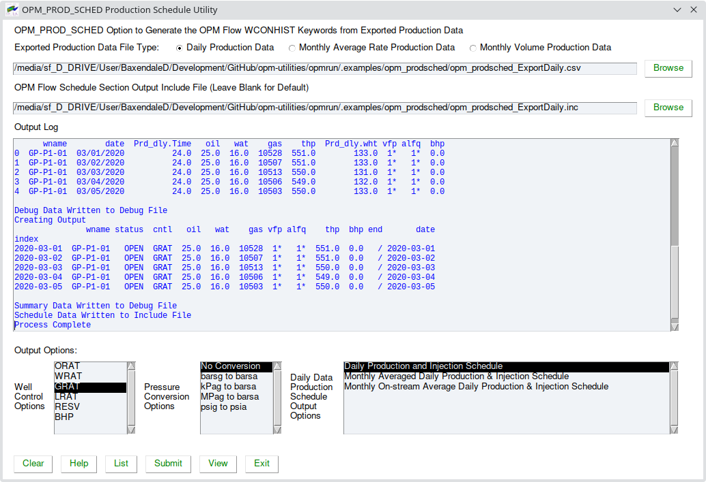

Notice that the application checks various variable names for the column headers. For example for the BHP data, the column names can be: bhp, bottom-hole pressure, BHP, or BOTTOM-HOLE PRESSURE.

A sample of the generated output file is shown in Figure C.37.

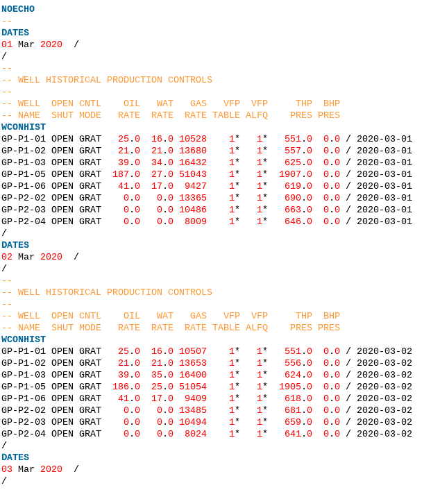

| Note Note the current release only support production data via the WCONHIST keyword, injection data via WCONINJH keyword is not supported. |
| --- |

The Tools/Simulator Input/Sensitivities option generates sensitivity cases based on a "Base" case file. The Base file contains "Factors" (variable names), $X01, $X02, etc., that are substituted with user defined values using the data entered and the type of Sensitivity Scenario selected. Thus, the first step is to configure the Base file in a text editor by replacing actual values by the variable names, previously mentioned.

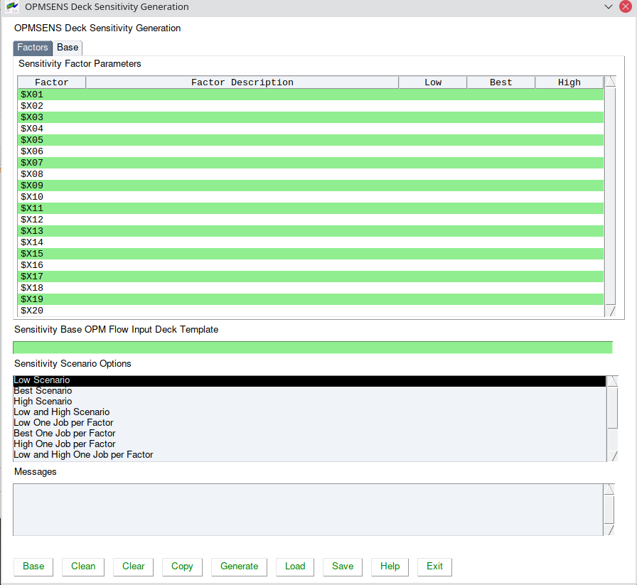

After editing the Base file, the next step is to load the Base file into the application using the Base button, which will prompt the user for the file to load and then display the file in the Base tab, as shown in Figure C.39

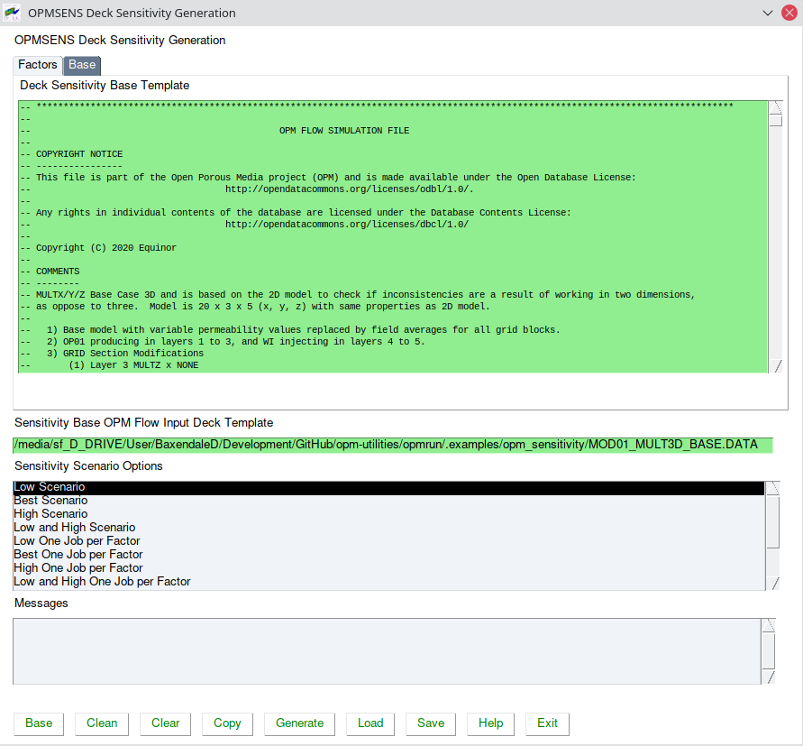

Limited editing of the Base file is supported on the above screen.

The next step is to define the "Factors" and the factor values. A total of 20 factors are available and each factor consist of a Low, Best and High estimates.  Note it is not necessary to enter all three estimates, if one wishes just to generate a limited sensitivity case. For example, if on wishes to only run a Low Scenario sensitivity then it is only necessary to enter data for the Low factor values.

Previously saved factor data can be loaded via the Load button, as shown below:

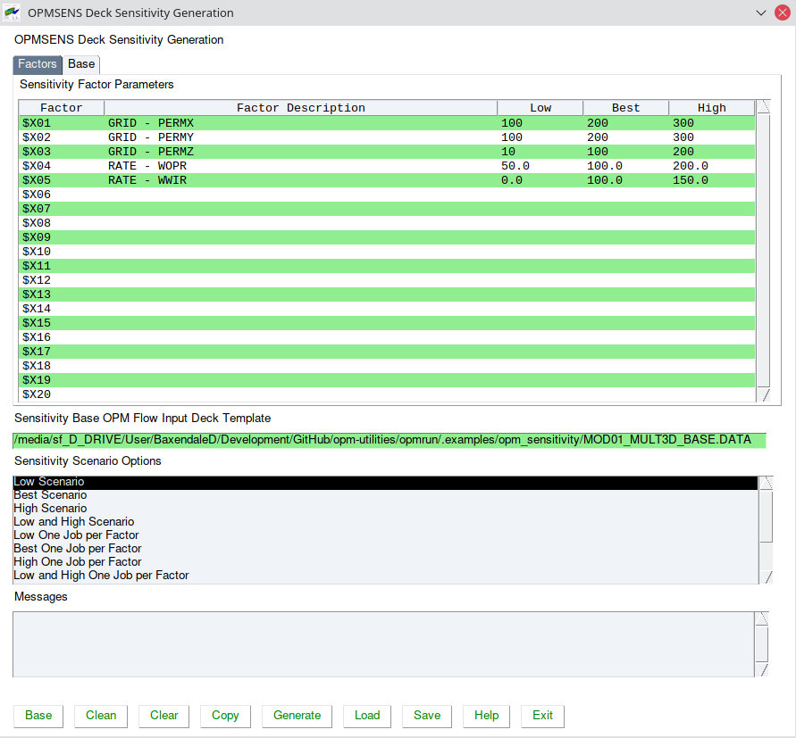

Selecting a Factor Description row allows one to define a description for the factor variable, so for $X01 in the above figure the description is GRID - PERMX. When selecting a Factor Description, a popup dialog will be displayed to enter the data, and if one right-clicks on the popup's Factor Description field one can select a description for one of the pre-defined descriptions as illustrated in the next figure.

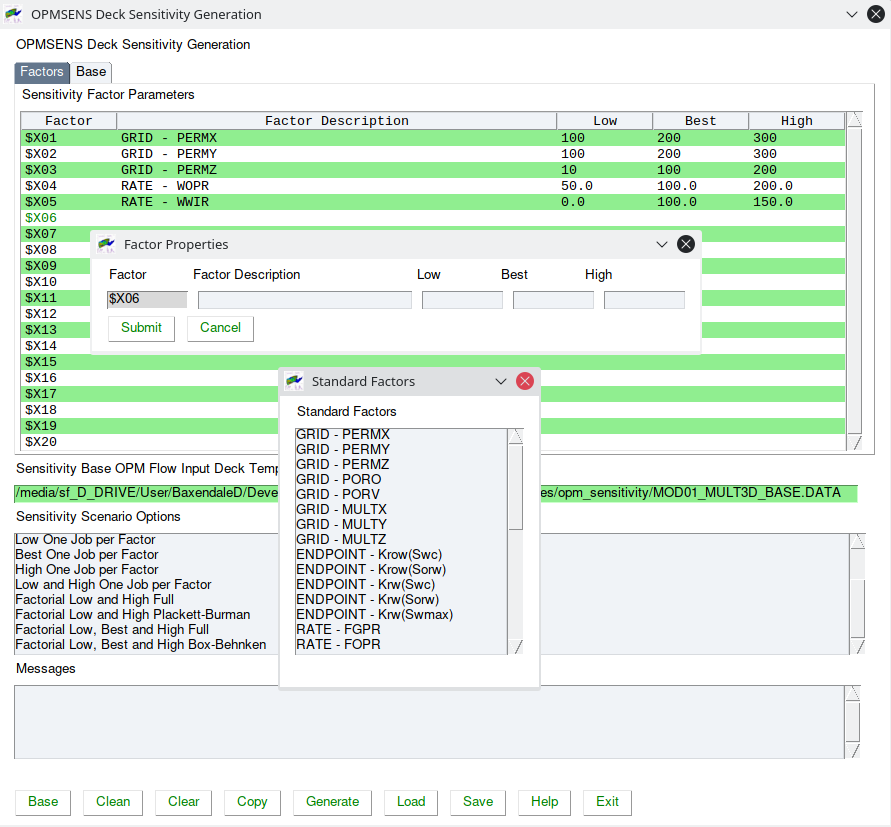

After the Sensitivity Factors have been entered one can then select the Sensitivity Scenario that one wishes to use generate the sensitivity cases. In the example in figure Figure C.42 the Factorial: Low, Best and High Box-Behnken DOE (Design of Experiments) has been selected. Selecting the Generate button, runs a series of checks, and if there are no errors the program will inquire if you wish to generate the set of cases (Figure C.42).

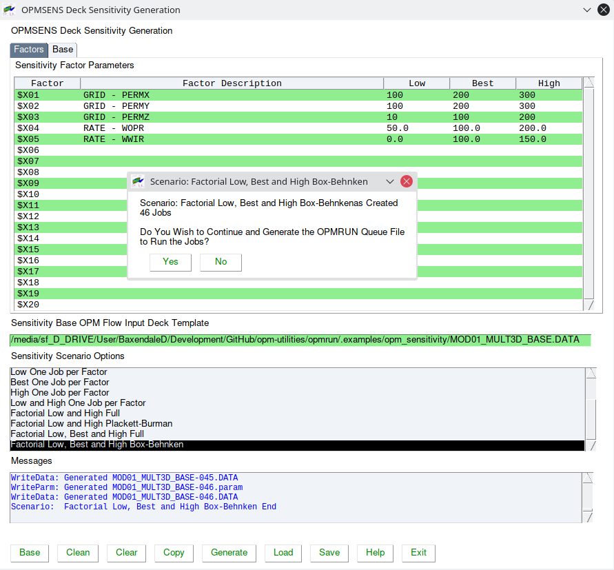

If the Yes option is selected then the cases will be generated and the application will ask for the name of OPMRUN Queue file to write the jobs to, as depicted in

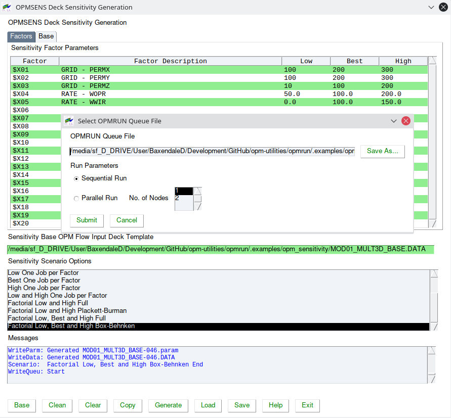

This allows the user to load the queue file into OPMRUN and to run all the jobs.

This tool, Tools/Simulator Input/Well Specification, uses the standard well export files from OPM ResInsight to reformat the data in a more user-friendly manner for the WELSPECS and COMPDAT keywords. Optionally, the application can generate the COMPLUMP keyword based on the OPM ResInsight layers file, with one completion per defined reservoir layer.

An example OPM ResInsight Exported Well Completion File Format(*.exp) is shown in Figure C.44

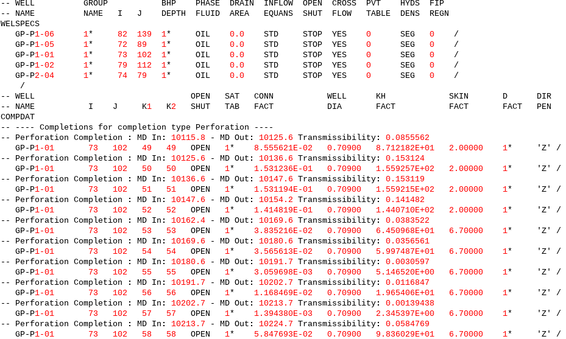

And an OPM ResInsight Imported Formation Layer File (.Lyr) example is illustrated in Figure C.45

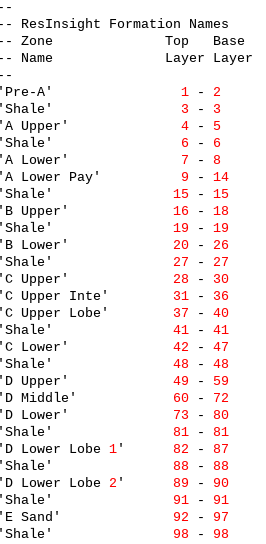

The application also can generate a well a OPM ResInsight perforation file with the formation names for cross-checking the perforations.

The application user interface is shown in Figure C.46. Note that in Figure C.46 the Output Header options  are used for comments only, no unit conversion is performed.

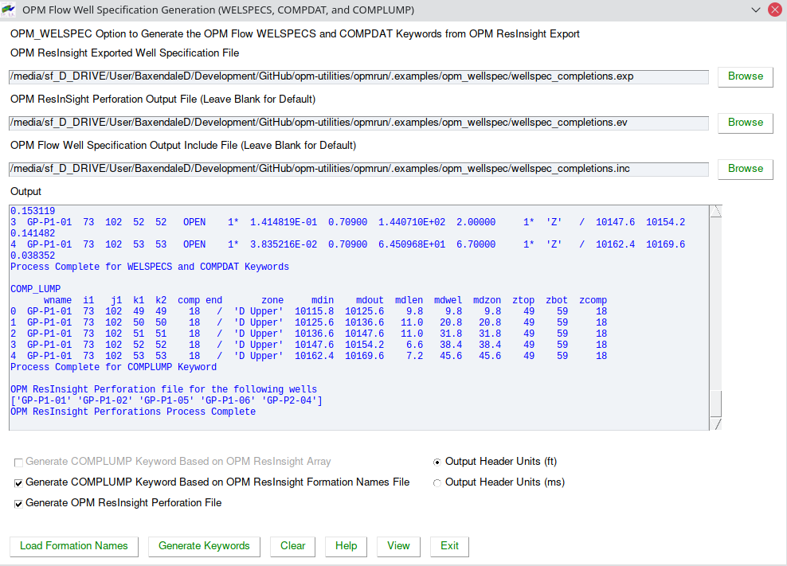

In terms of output, the next figure shows the resulting well completion file to be used with OPM Flow, showing the WELSPECS and COMPDAT keywords (the COMPLUMP keyword is not shown in this example)

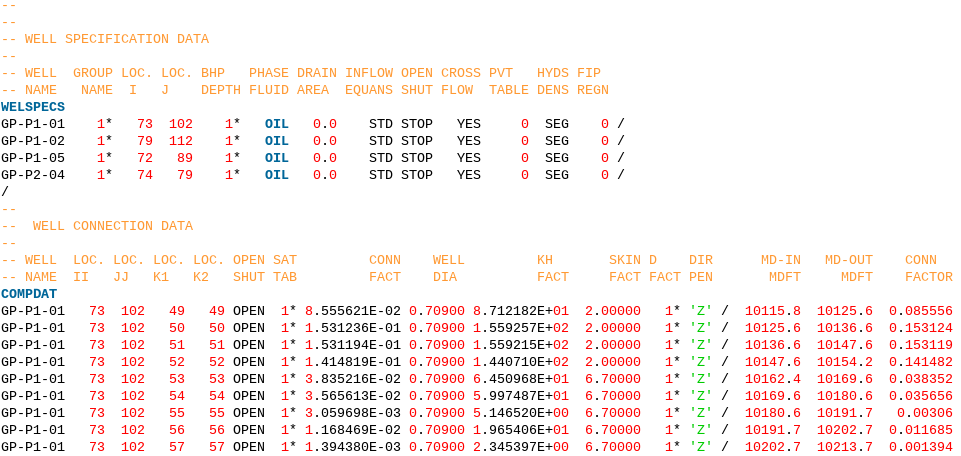

The final figure for this tool shows the resulting generated OPM ResInsight perforation file.

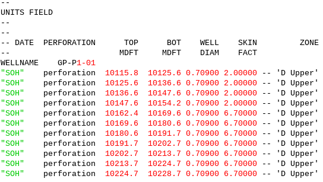

This option, Tools/ResInsight, loads the currently selected job into OPM ResInsight for viewing, this done via a Python sub-process call in OPMRUN, rather than using OPM ResInsight’s Python API.

OPM ResInsight can read well trajectories in a given format into the program, the Tools/Well Trajectory Conversion option converts a Schlumberger Petrel exported well trajectory file, as shown Figure C.49, into a OPM ResInsight well trajectory file containing all the wells.

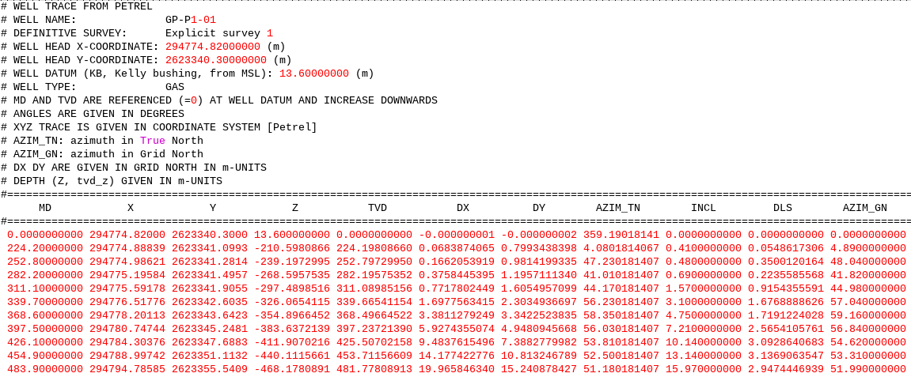

The utility allows for the multiple wells to be converted at once and for conversion of units.

Note in some areas of the world it is not uncommon for the areal units to be in UTM and the depth to be in feet. This configuration is also handled by the application.

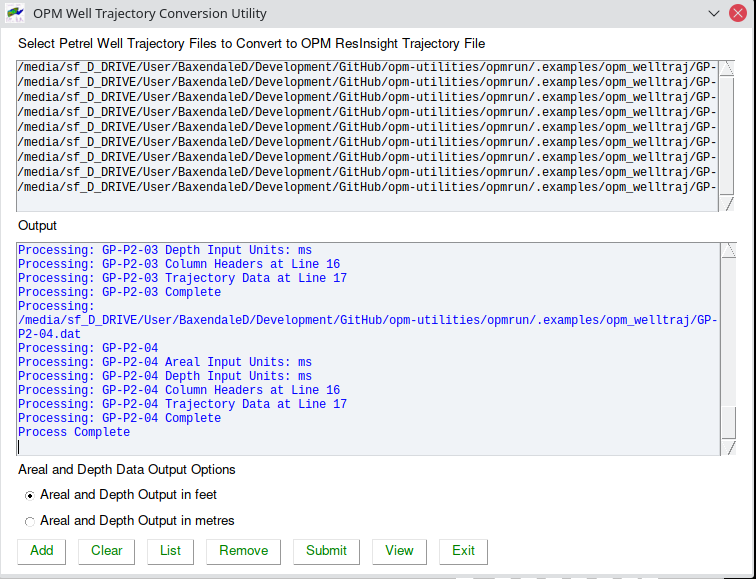

An example output file is shown in Figure C.51

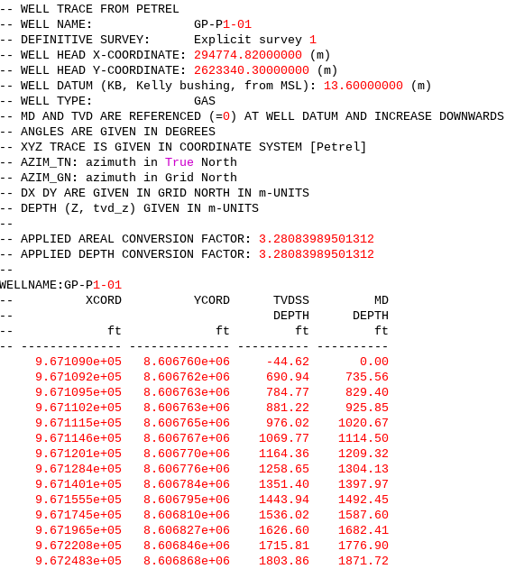
