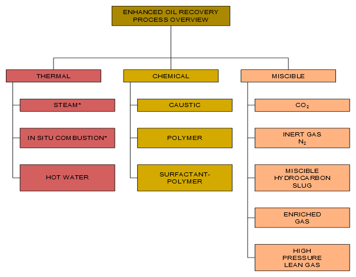
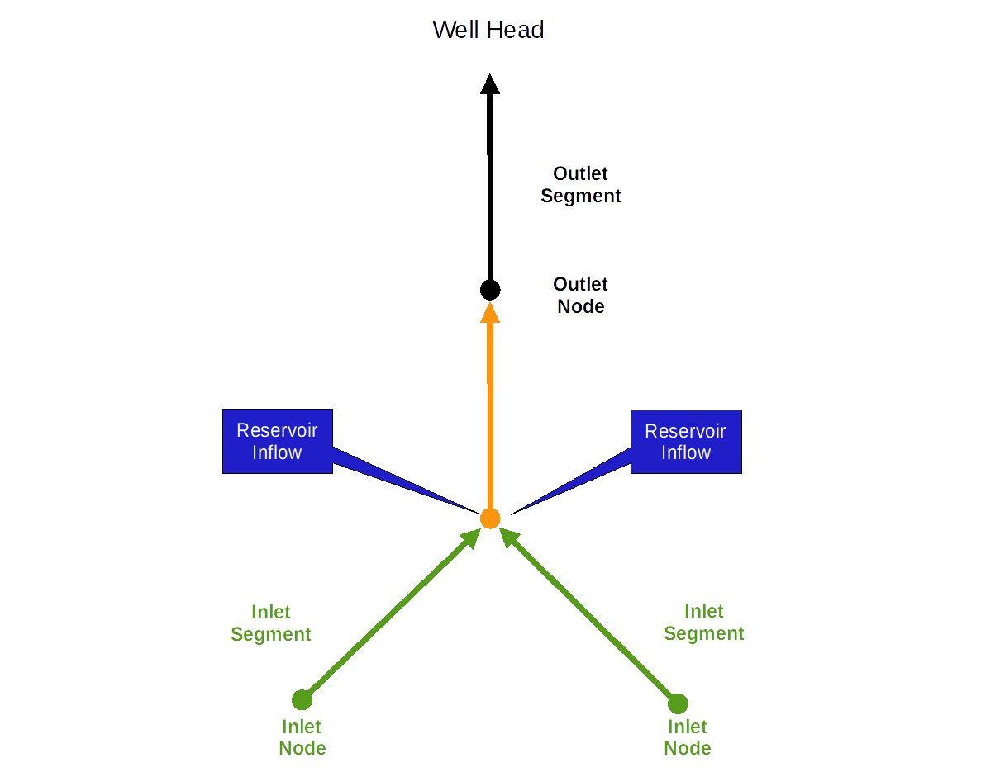
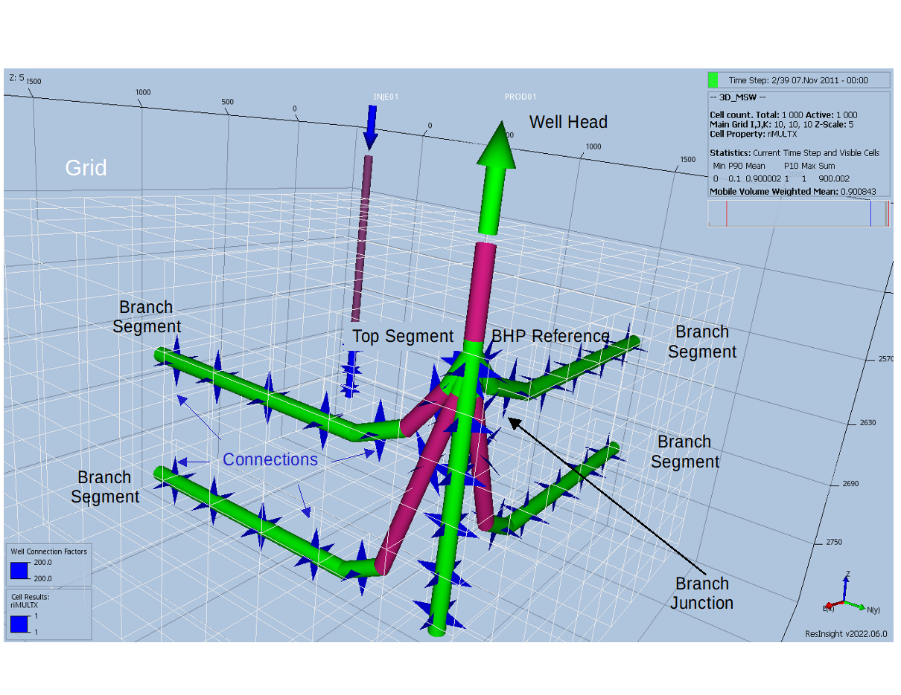
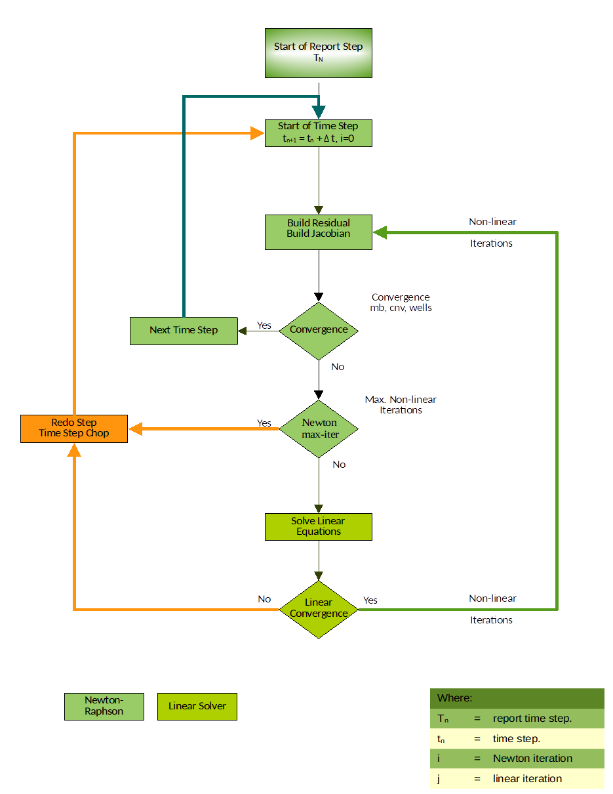
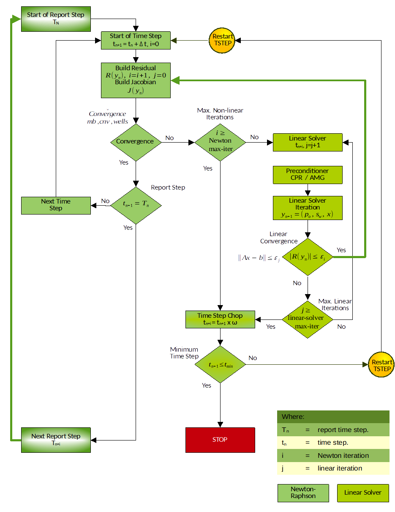

# INTRODUCTION

## Overview

The Open Porous Media (“OPM”) initiative was started in 2009 to encourage open innovation and reproducible research on modeling and simulation of porous media processes. OPM was initially founded as a collaboration between groups at Equinor (formerly Statoil), SINTEF, the University of Stuttgart, and the University of Bergen, but over time, several other groups and individuals have joined and contributed. What today forms the OPM suite of software, has mainly been developed by SINTEF, NORCE (formerly IRIS), Equinor, Ceetron Solutions (OPM Resinsight), Poware Software Solutions, Dr. Blatt HPC-Simulation-Software & Services, and OPM-OP.  The initial vision was to create long-lasting, efficient, and well-maintained, open-source software for simulating flow and transport in porous media. The scope has later been extended to also provide open data sets, thus making it easier to benchmark, compare, and test different mathematical models, computational methods, and software implementations.

All software in OPM is distributed under the GNU General Public License (“GPL”), [version 3](http://www.gnu.org/licenses/gpl-3.0.en.html), with the option of using newer versions of the license. Datasets are distributed under the Open Data Commons Open Database License (“ODbL”), [version 1.0](http://opendatacommons.org/licenses/odbl/1.0/), with individual content under the Database Contents License (“DbCL”), [version 1.0.](http://opendatacommons.org/licenses/dbcl/1.0/)

The project’s numerical simulator, OPM Flow, is a fully-implicit, black-oil simulator capable of running industry-standard simulation models [Rasmussen, A.F., Sandve, T.H., Bao, K., Lauser, A., Hove, J., Skaflestad, B., Klöfkorn, R., Blatt, M., Rustad, A.B., Sævareid, O. et al. [2019]. The Open Porous Media Flow Reservoir Simulator. https://doi.org/10.1016/j.camwa.2020.05.014.]. The simulator’s input file is compatible with the commercial simulator, although OPM Flow has extra keywords for supporting additional functionality not found in the commercial simulator. The simulator’s output files, except for the print and debug files, are compatible with the commercial simulator, and are readable by commercial post-processing software as well as by OPM ResInsight. OPM ResInsight is the Open Porous Media’s post-processing software.

The simulator is implemented using automatic differentiation to enable rapid development of new fluid models.  In most simulators the coefficients of the linearized systems of equations (Jacobian matrix) required by the non-linear Newton Solver, have traditionally been computed by evaluating the closed-form expressions obtained by differentiating the discretized flow equations analytically.  Differentiating these flow equations manually and programming the resulting formulas is time-consuming and error-prone.  Thus, even  simple extensions in functional dependencies can be difficult to accommodate into existing simulators.  Automatic differentiation eliminates these drawbacks.

OPM Flow runs under Linux and Windows Subsystem for Linux, and the program is in active development with new features added in each bi-annual release. Currently the program has the following functionality:

#### Model Formulation

- Black-oil with dissolved gas and vaporized oil.
- Rock-dependent capillary and relative-permeability curves.
- End-point scaling and hysteresis.
- Oil vaporization controls ([VAPPARS](#__RefHeading___Toc210172_2884651453)).
- Rock compaction.

#### Enhance Oil Recovery Models

Enhanced Oil Recovery (“EOR”) is a term applied to methods used for recovering oil from a petroleum reservoir beyond that recoverable by primary and secondary methods. Primary recovery normally refers to production using the energy inherent in the reservoir from gas under pressure or a natural water drive. Secondary recovery usually refers to injection of water or water flooding. Thus, Enhanced Oil Recovery is often synonymous with tertiary recovery.  Improved Oil Recovery (“IOR”) and Advanced Oil Recovery (“AOR”) have similar meaning, except they also apply to primary and secondary methods, and sometimes EOR methods can be used earlier in the sequence.  Originally water flooding was considered as Enhanced Oil Recovery,  but now EOR is generally considered to follow water flooding.

There are four major EOR groups of methods:

- thermal recovery,
- gas miscible recovery,
- chemical flooding, and
- microbial flooding.

These main groups are further subdivided into individual processes as illustrated in Figure 1.1. For example the thermal recovery methods consist of steam flooding and cyclic steam stimulation, as well as in-situ combustion. Figure 1.1 also includes hot water as a process for thermal EOR, but this process is rarely used in the industry as a drive mechanism, as steam contains significantly more heat than hot water and therefore steam is more effective in heating up the in situ oil. Note that microbial EOR methods, are not shown in Figure 1.1, due to there limited use in the industry.

Chemical flooding methods include polymer flooding (including polymer gels), micellar-polymer flooding, and alkaline flooding. Quite often these type of floods are combined to form a more efficient displacement process, for example in an Alkaline Surfactant Polymer (“ASP”) process.

Conventional gas flooding is an immiscible process, that is the oil and gas phases remain separate during the displacement drive. For the EOR gas drive process, the displacement is miscible, here the gas “mixes” with the oil to form a single phase fluid in the reservoir. Gas miscible processes are subdivided into carbon dioxide flooding, cyclic carbon dioxide stimulation, nitrogen flooding, and nitrogen-CO2 flooding.

OPM Flow has several EOR models based on extending the black-oil model with a fourth component in the simulator:

- CO2 Standard EOR Model: OPM Flow’s CO2 Standard EOR model is based on the simulators Solvent model by extending the black-oil formulation with a fourth component by adding a CO2 component to the gas phase. This is the standard formulation used by most black-oil simulators.
- CO2 Dynamic EOR Model: Although the CO2 Standard EOR model is commonly used, the formulation cannot account for the mass transfer of the various components and phases. The extended black-oil formulations often poorly represent the PVT properties of the oil-CO2 mixtures, resulting in poor agreement with the compositional formulation. OPM Flow’s CO2 Dynamic EOR Model black-oil formulation attempts to overcome this limitation by making the black-oil properties dependent on the fraction of CO2 in the cell [T. H. Sandve, O. Sævareid and I. Aavatsmark: “Improved Extended Blackoil Formulation --  for CO2 EOR Simulations.” in ECMOR XVII – The 17th European Conference on the -- Mathematics of Oil Recovery,  September 2020.]. This approach models the oil-CO2 mixture more accurately, and thus give results closer to the compositional simulator.  Note the model is not restricted to CO2 utilization, as long as the appropriate oil-injection-gas dependent properties are entered in the model.
- Foam Model: An experimental foam module has been added to OPM Flow 2019-10 release. With this it is possible to simulate certain types of surfactant injection. Such injection stimulates formation of foam to change mobility ratios, and give better reservoir sweep. The implemented foam model treats surfactant transported in the gas or water phase, and reduces the mobility of that phase depending on the surfactant concentration. In addition to mobility reduction, foam adsorption to the reservoir rock is also included in the model.
- Polymer Model (Standard): OPM Flow’s polymer model is based on a black-oil polymer formulation, which is developed by extending the black-oil model with a polymer component. The effects of the polymer mixing are simulated based on the Todd-Longstaff [M. R. Todd and W. J Longstaff, The Development, Testing, and Application Of a Numerical Simulator for Predicting Miscible Flood Performance". In: J. Petrol. Tech. 24.7 (1972), pages 874-882.] mixing model, and adsorption,  dead pore space, and permeability reduction effects are also considered. A logarithmic shear thinning/thickening model has also been incorporated since the 2015-10 Release (see [Flow-polymer](http://opm-project.org/?p=592)). Note that the Polymer model has now been incorporated into the main OPM Flow simulator and is no longer a separate simulator.
- Polymer Model (Molecular Weight Transport): In addition to the standard polymer model, the simulator also has the Polymer Molecular Weight Transport option, that uses the polymer molecular weight in calculating the polymer viscosity. Here, the Mark-Howink equation, also known as the Mark-Howink-Staudinger equation [H. Mark, in R. Saenger, Der feste Koerper, Hirzel, Leipzig, 1938.],   [R. Houwink , J. Prakt. Chem., Vol. 157, Issue 1-3, p. 15 (1940).], and   [H. Staudinger, Die Hochmolekulare Organischen Verbindungen, Julius Springer, Berlin 1932.] is used to calculate the intrinsic viscosity as a function of the molecular weight of the polymer.

- Solvent Model: Similar to the polymer model, OPM Flow’s solvent model again uses an extra component by extending the black-oil formulation with a fourth component in the simulator by adding a solvent component to the gas phase (see [Flow-solvent](http://opm-project.org/?page_id=565)). Note that Solvent model has now been incorporated into the main OPM Flow simulator and is no longer a separate simulator.

#### CO2 Storage:

- Brine-CO2 PVT module that generates brine and CO2 PVT properties directly eliminating user input for PVT.
- Thermal properties generated by OPM Flow include the CO2 enthalpy represented as a table internally in the simulator. The liquid enthalpy depends on the dissolved CO2 and salinity as well as pressure and temperature. The water enthalpy is automatically calculated and modified to account for salinity and for CO2 following.
- Diffusion for fine grid modeling is implemented via coefficients that depend on temperature, pressure, and salinity. The diffusion coefficient is computed internally for pure water and modified to account for salinity. The effect of the porous media on the diffusion is modeled using an industry standard relationship. In addition, the coefficient can also be given as an input parameter using a keyword.
- Convective dissolution of CO2 into in situ brine within a grid cell is implemented together with a convective dissolution parameter for controlling the rate of dissolution.
- Microbially Induced Calcite Precipitation (“MICP”) model for the modeling of biochemical processes in creating barriers by calcium carbonate cementation, the technology has the potential to be used for sealing leakage zones in geological formations [Landa-Marbán, D., Tveit, S., Kumar, K., Gasda, S.E., 2021. Practical approaches to study microbially induced calcite precipitation at the eld scale. Int. J. Greenh. Gas Control 106, 103256. https://doi.org/10.1016/j.ijggc.2021.103256.] and  [Landa-Marbán, D., Kumar, K., Tveit, S., Gasda, S.E., 2021. Numerical studies of CO2 leakage remediation by micp-based plugging technology. In: Røkke, N.A. and Knuutila, H.K. (Eds) Short Papers from the 11th International Trondheim CCS conference, ISBN: 978-82-536-1714-5, 284-290.].

#### Other OPM Flow Specific Enhancements:

- The Salt Precipitation and Water Evaporation Model:  The model accounts for water evaporation of the in situ brine and the resulting increasing dissolved salt concentration. Once the salt solubility limit is exceeded, salt precipitation occurs, that results in a decrease in porosity and permeability, and consequently a decrease in gas production. This feature is primary used in modeling gas fields under depletion.
- Thermal Model Enhancements: The energy black-oil implementation in OPM Flow is a mixture of the commercial simulators black-oil temperature and compositional thermal options. These commercial simulator options are two separate modeling facilities in the commercial simulator. OPM Flow’s thermal implementation is based on solving the energy equation fully coupled with the black-oil equations so the results are not directly equivalent to the commercial simulator’s black-oil temperature or compositional thermal formulations. In addition, OPM Flow can take into account the Joule–Thomson effect for oil, gas, and water. This behavior is especially important in gas wells, when a real gas expands, resulting in the temperature of the gas dropping.
- Biofilm Effects in Underground Applications: Biofilm-related effects in subsurface applications such as hydrogen storage include reduced injectivity and hydrogen loss. The conceptual model includes the following mechanisms: (1) Biofilm is present in the storage site prior to injection and (2) the biofilm consumes injected H2/CO2, leading to clogging effects.

#### Description of Geology:

- Rectilinear and fully-unstructured grid.
- Corner-point grids from the commercial simulator input, including fault and region multipliers, minimum pore volume, pinch outs, etc.
- Spider grids that are similar to radial grids for modeling near well bore effects.
- Analytical and numerical aquifers.

#### Well and Group Controls:

- Bottom-hole pressure and surface/reservoir rate.
- Group controls, including voidage replacement, network model, gas lift optimization, guide rate control for producers and injection groups and well, etc.
- Shut/stop/open individual completions.
- History-matching wells.
- Multi-segment wells together with various inflow control devices (“ICDs”).

- Well lists.
- Action conditions and command processing via the [ACTIONX](#__RefHeading___Toc152227_2992482751) and [UDQ](#__RefHeading___Toc161095_2932703077) keywords employed in the commercial simulator.
- Python interface to control and process simulator data.

#### Input and Output:

- General reader/parser for Eclipse input decks.
- XML-based or simple text-format input of additional parameters.
- Flexible output of summary and restart files in he commercial simulator's format.
- Logging to terminal and print file.
- Front-end graphical interface for running the simulator with various tools, including: case compression and uncompression, keyword generation etc.

#### Simulation Technology:

- Fully-implicit in time.
- Automatic differentiation.
- Two-point flux approximation in space with upstream-mobility weighting.
- Flexible assembly through the use of automatic differentiation.
- Bi-conjugate Gradient method (BiCG-stab) and a restarted Generalized Minimal Residual ("GMRes") iterative linear solvers with ILU0 and Constraint Pressure Residual ("CPR") preconditioners.
- Adaptive step-size controls.
- Parallel processing.

The following section briefly describe the simulator’s formulation, equation, and the various numerical procedures available to solve the equations.

| Note The material in the following sections is taken from Rasmussen et al. [Rasmussen, A.F., Sandve, T.H., Bao, K., Lauser, A., Hove, J., Skaflestad, B., Klöfkorn, R., Blatt, M., Rustad, A.B., Sævareid, O. et al. [2019]. The Open Porous Media Flow Reservoir Simulator. https://doi.org/10.1016/j.camwa.2020.05.014.], and the reader is encouraged to read the full paper to obtain a fuller understanding of the simulator’s formulation and the resulting equations. |
| --- |

## Black-Oil Model Equations

The black-oil equations constitute the most widely used flow model in the simulation of hydrocarbon reservoirs. The model is based on the premise that we have three different fluid phases (aqueous, oleic, and gaseous), and three (pseudo) components: water, oil, and gas. Oil and gas are not single hydrocarbon species, but represent all hydrocarbon species that exist in liquid and vapor form at surface conditions. Mixing is allowed, in the sense that both oil and gas can be found in the oleic phase, in the gaseous phase, or in both. The amount of dissolved gas in the oleic phase and vaporized oil in the gaseous phase must be kept track of on a grid cell basis. In the following discussions the subscripts w represents the water, o the oil, and g the gas quantities related to each of the phases or components.

The black-oil equations can be deduced from conservation of mass for each component with suitable closure relationships such as Darcy's law and initial and boundary conditions. The equations are discretized in space with an upstream finite-volume scheme using a two-point flux approximation, and in time using an implicit (backward) Euler scheme. The resulting equations are solved simultaneously in a fully implicit formulation by a Newton-type linearization with a properly preconditioned, iterative linear solver (see Rasmussen et al. [Rasmussen, A.F., Sandve, T.H., Bao, K., Lauser, A., Hove, J., Skaflestad, B., Klöfkorn, R., Blatt, M., Rustad, A.B., Sævareid, O. et al. [2019]. The Open Porous Media Flow Reservoir Simulator. https://doi.org/10.1016/j.camwa.2020.05.014.]).

The conservation laws form a system of partial differential equations, one for each pseudo component α:

|  | (1.1) |
| --- | --- |

where the accumulation terms and fluxes are given by:

|  |  | (1.2) |
| --- | --- | --- |
|  |  | (1.3) |
|  |  | (1.4) |

and the phase fluxes are given by Darcy's law:

|  | (1.5) |
| --- | --- |

In addition, the following closure relations should hold:

|  | (1.6) |
| --- | --- |
|  | (1.7) |
|  | (1.8) |

where:

	=	porosity, can be a function of (oil) pressure:.

	=	pore volume multiplier as function of pressure.

	=	reference porosity, a constant in time but varying in space.

	=	pressure for phase.

	=	shrinkage/expansion factor for phasedefined as the ratio of the surface

volume at standard conditions to the reservoir volume for a given amount of fluid:. For the oil phase,is called the shrinkage factor, whereas for gas is called the expansion factor. The reciprocal quantity is called the formation volume factor, and is usually denoted with a capital B:. The variable is usually a function of phase pressure and composition:.

	=	gas-oil ratio ("GOR"), ratio of dissolved gas to oil in the oleic phase,

commonly called or  in other literature.

 	= 	oil-gas ratio or condensate-gas ratio ("CGR"), ratio of vaporized oil to gas

in the gaseous phase, commonly calledor  in other literature.

 	=	saturation of phase , the pore volume fraction occupied by the phase.

The saturations of all phases sum to one.

	=	capillary pressure between phasesand. Typically a function of

saturation:.

	=	permeability of the porous medium.

 	=	relative permeability for phasemodeling the reduction in effective

permeability for a fluid phase in the presence of other phases. Typically a function of saturation.

 	=	viscosity of phase, typically a function of phase pressure and

composition.

	=	mobility of phase, given by.

	=	velocity of phase.

	=	velocity of component.

 	=	surface density of phaseat one atmosphere, a given constant.

 	=	density of phase in the reservoir. For water,. For the oleic

phase the relationship is more complex since it must include dissolved gas: , and similar for the gaseous phase we have:  .

	=	gravitational acceleration vector.

 	=	well out flux density of pseudo component, (negative for well in-flow).

The form of this term depends on the well model used, either the standard well model or the multi-segment model.

Equations (1.1) to (1.8) are then transformed to the discrete form using a forward finite difference scheme. In the following, let subscriptdenote a discrete quantity defined in celland subscriptdenote a discrete quantity defined at the connection between two cellsand. Two cells share a connection if they are adjacent geometrically in the computational grid or share an explicit Non-Neighbor Connection (“[NNC](#__RefHeading___Toc63285_718313858)”) [Connections between cells due to geometric adjacency are automatically calculated by the simulator, including across faults in the grid. In addition, the user can specify extra connections between arbitrary cells using the [NNC](#__RefHeading___Toc63285_718313858) keyword in the [GRID](#__RefHeading___Toc38674_784232322) section.]. For exampleis the oil flux from cellto cell. For oriented quantities such as fluxes, the orientation is taken to be from cell to cell, and the quantity is skew-symmetric (), whereas non-oriented quantities such as the transmissibilityare symmetric (). Quantities with superscript 0 are taken at the start of the discrete time step, other quantities are at the end of the time step. Superscripts or subscripts applied to an expression in parenthesis apply to each element in the expression.

The discretized equations and residuals are, for each pseudo-component and cell:

|  | (1.9) |
| --- | --- |

where the accumulation terms are the same as equations (1.2) to (1.4) and fluxes are of similar form to the velocities,  in the aforementioned equations; thus we have

|  |  | (1.10) |
| --- | --- | --- |
|  |  | (1.11) |
|  |  | (1.12) |

In addition, equations (1.6) to (1.8) also hold for each cell i, that is:

|  | (1.13) |
| --- | --- |
|  | (1.14) |
|  | (1.15) |

Finally, the fluxes are given for each connectionby the following relationships:

|  | (1.16) |
| --- | --- |
|  | (1.17) |
|  | (1.18) |
|  | (1.19) |
|  | (1.20) |

where:

	=	cell volume.

 	=	time step length for the current Euler step.

 	=	volume flux of phase (oriented quantity).

 	=	surface volume flux of pseudo component (oriented quantity).

 	=	transmissibility factor for a connection, derived from permeability.

 	=	transmissibility multiplier as function of pressure.

 	=	connections from cell , i. e. the set of cells connected to it.

 	=	upwind cell for phasefor the connection between cellsand.

 	=	potential difference for phasefor the connection between cells

and(oriented quantity).

 	=	gravitational acceleration in the z-direction.

	=	depth of center of cell .

For a grid containing a total of n active cells,  the material balance relationship expressed by equation (1.9) results in a system of 3n equations for the three phase formulation (oil, water, and gas). Similarly, for the two phase model, oil-water or gas-water, there are 2n equations to be solved.   In addition, there are also the sink and source terms associated with the wells. The solution variables for the system of equations is dependent on the state of a cell, basically, for:

    - Non-miscible: Here pressure of one of the phases (which we take to be oil pressure),  and  as our primary variables. The pressure  will then behave mostly in an elliptic fashion, whereas the saturations  and are more hyperbolic.
    - Miscible flow: Since the gaseous phase may disappear if all the gas dissolves into the oleic phase, and similarly the oleic phase may disappear if all the oil vaporizes into the gaseous phase, one cannot always use  for our third variable. Instead we use the third variable to track the composition of the phase that has not disappeared. We therefore use either ,, or  as our third primary variable, depending on the fluid state, and we call that variable x:

The next two sections describe the formulation of the two well models implemented in OPM flow: the Standard Well Model and the Multi-Segment Well Model.

## Standard Well Model

For the standard well model, in a three phase black-oil system, there are four primary variables, three fluid variables:, , and, which describe the fluid composition within the wellbore [J. Holmes, Enhancements to the strongly coupled, fully implicit well model: wellbore crossflow modeling and collective well control, in: SPE Reservoir Simulation Symposium, Society of Petroleum Engineers, 1983.], as depicted in the following equation:

|  | (1.22) |
| --- | --- |

where:

 	=	the weighted total flow rate,

	=	the weighted fraction of water, and

	=	the weighted fraction of gas.

Here,  is the flow rate of component under surface conditions and is a weighting factor. For gas, this factor is typically chosen to be a small value, for example, 0.01 to avoid gas fractions close to unity12.

The fourth variable is the bottom-hole pressure (), that is the pressure in the wellbore at the datum depth.

Volumetric inflow rates at reservoir conditions are calculated as:

|  | (1.23) |
| --- | --- |

where:

	=	is the flow rate of phase  through connection .  The rate is negative

for flow from the wellbore to reservoir, and positive for flow into the opposite direction.

	=	connection transmissibility factor.

 	=	the mobility for phase  at the connection j. For injection wells, the total

mobility of the injecting phase is used, as per Holmes12.

 	=	pressure of the grid block that contains the connection j.

 	=	the bottom-hole pressure of well.

 	=	pressure difference within the wellbore between connection  and the

well's bottom-hole datum depth. The pressure differences  between connection and the datum point are computed explicitly based on the fluid composition in the wellbore at the start of the time step.

To keep the system closed, we introduce conservation equations for each component using:

|  | (1.24) |
| --- | --- |

Equation (1.24) is solved in a fully implicit and coupled way with the black-oil equations, as per equation (1.9)). Here,  is the set of connections of the well ,  is the flow rate of phase  through connection  under surface condition, which can be calculated from defined in equation (1.23); the relationship is similar to the one between component and mass fluxes, as per equations (1.2) through (1.4). The storage term  describes the amount of component  in the wellbore (a small volume, that is 0.1 ft3  as per Holmes12), and it is introduced for better stability of the well solution.

In addition, we need equations that model how the wells are controlled. For wells controlled by a prescribed bottom-hole pressure () target, we have:

|  | (1.25) |
| --- | --- |

whereas for a rate-controlled well we have:

|  | (1.26) |
| --- | --- |

where is the desired surface-volume rate of the controlled component , typically oil or gas rate for a production well. The Standard Well model handles cross-flow, that is flow exiting from one well connection and entering another connection; however, this model assumes that the fluid composition is uniform throughout the wellbore (given by Fg and Fw), and thus the same composition will be injected through all injecting connections. When this is not a reasonable assumption, then the Multi-Segment model should be used instead, which is the topic of the next section.

## Multi-Segment Well Model

Multi-segment wells were introduced to handle more complex well configurations, including for example horizontal, multi-lateral and fish bone well types, as well Inflow Control Devices (“ICD”) [J. Holmes, T. Barkve, O. Lund, Application of a multisegment well model to simulate ow in advanced wells, in: European Petroleum Conference, Society of Petroleum Engineers, 1998.]. This model divides the wellbore into a number of arbitrary segments. Each segment has a segment node and a flow path to the neighboring segment in the direction towards the well head, that defines as the outlet segment (Figure 1.2). Most segments also have inlet segment neighbors in the direction away from the well head.  For multi-lateral wells, a segment node must be placed at the branch junction. Segments at branch junction points have additional inlet segments and segments at the end of branches do not have inlet segments. The top segment of each well does not have an outlet segment. The pressure at this segment is the bottom-hole pressure of the well, whereas the component rates equal the component rates for the well as a whole. For example, Figure 1.3 on the following page, shows the main wellbore branch together with four offsetting branches.

Each segment has the node pressure p as a primary variable in addition to the primary variables , , and  introduced for the standard well model, as per equation (1.22). Similarly,  the component equations, (1.24), are extended to include the additional  terms that represent the flow rate from the inlet segments of segment , as well as the inflow from the reservoir through the segment's connections . Thus, the equivalent standard well equation (1.24) for multi-segment wells is:

|  | (1.27) |
| --- | --- |

Each segment can thus receive inflow from more than one connection or no connection through the segment node, whereas each connection can only contribute to one segment. In the standard well model, the connection is located at the centroid of the grid block. In the multi-segment well model, the connection and

segment node can be located at any place within the grid block. The inflow calculation of the connection in the multi-segment well model is as follows:

|  | (1.28) |
| --- | --- |

where:

	=	the pressure at the cell center of the grid block that contains connection

,

	=	the hydrostatic pressure difference between the cell center and the

connection,

	=	the pressure of segment , and

	=	the hydrostatic pressure difference between the connection and the

segment.

The last equation for each segment describes the pressure relationships between the segment  and its outlet segment :

|  | (1.29) |
| --- | --- |

Here, the  terms represent the hydrostatic, frictional, and acceleration pressure drops between the segments.

The top segment does not have an outlet segment, and hence the pressure equation is replaced by a well control equation, which is the same as for the standard well model, that is either equation (1.25) or (1.26).

As with the standard well model, the well equations are solved with the reservoir mass conservation equations in a coupled, fully implicit way. The well equations are added to the global system using a Schur [Zhang, Fuzhen (2005). Zhang, Fuzhen (ed.). The Schur Complement and Its Applications. Numerical Methods and Algorithms. Vol. 4. Springer. doi:10.1007/b105056. ISBN 0-387-24271-6.] complement approach:

|  | (1.30) |
| --- | --- |

Figure 1.3 depicts a multi-segment well with the main wellbore branch as the vertical segment, together with four offsetting horizontal branches.

## Salt Precipitation Model

OPM Flow’s salt precipitation and water evaporation model is an extension of the black-oil model with a water in gas component, plus addition of a solid salt phase component to the salt transport equation. The effects of porosity and permeability reduction effects are also considered. The oil, gas, and water and salt conservation equations including these extensions are given by equations (1.31) to (1.34).

Oil:

|  | (1.31) |
| --- | --- |

Gas:

|  | (1.32) |
| --- | --- |

Water:

|  | (1.33) |
| --- | --- |

Salt:

|  | (1.34) |
| --- | --- |

where:

	=	porosity.

	=	pore volume multiplier as function of pressure.

	=	reference porosity, a constant in time but varying in space.

	=	pressure for phase.

	=	shrinkage/expansion factor for phasedefined as the ratio of the surface

volume at standard conditions to the reservoir volume for a given amount of fluid:. For the oil phase,is called the shrinkage factor, whereas for gas  is called the expansion factor. The reciprocal quantity is called the formation volume factor, and is usually denoted with a capital B: . The variable is usually a function of phase pressure and composition.

	=	gas-oil ratio ("GOR"), ratio of dissolved gas to oil in the oleic phase,

commonly called or  in other literature.

 	= 	oil-gas ratio or condensate-gas ratio ("CGR"), ratio of vaporized oil to gas

in the gaseous phase, commonly calledor  in other literature.

	=	evaporated water in gas ratio.

 	=	saturation of phase , the pore volume fraction occupied by the phase.

	=	saturation of precipitated salt (volume fraction).

 	=	surface density of phaseat one atmosphere, a given constant.

 	=	density of the solid salt.

 	=	well out flow of component, (negative for well in-flow).

The form of this term depends on the well model used, either the standard well model or the multi-segment model.

 	=	salt concentration in water (mass per unit volume).

The extension has two extra primary variable switching mechanisms. One between  and , when water disappears and reappears, and one between  and  when the salt concentration reaches the (user defined) solubility limit and salt precipitates or when solid salt dissolves. Furthermore, in the new formulation porosity becomes:

|  | (1.35) |
| --- | --- |

The resulting (reduced) permeability, , is based on a user specified permeability-porosity relation .

Both for dry and humid gas and wet and humid gas the PVT data can be provided using dedicated PVT tables. For the capillary pressure data it is recommended to extend its values towards zero water saturation to permit water saturations below the irreducible water saturation due to water evaporation.

For further details see Machado et al. [1C. G. Machado, P. Egberts, J. Alvestad, O. S. Hustad. Salt Precipitation and Water Evaporation Modelling in a Black-Oil Reservoir Simulator. SPE Reservoir Simulation Conference 2023 (SPE-212257).]

## Numerical Solution of Equations

Efficiently solving the aforementioned equations is non-trivial, and involves a step iterative process that consists of an outer, Newton-Raphson type method, of a series of iterations, and an inner set of linear iterations, as depicted in Figure 1.4, which shows a simplified schematic of the iterative scheme.

The next two sections attempt to give an overview of the two numerical schemes.

### Newton-Raphson Solver (Outer Iteration)

The aforementioned reservoir and well equations define a large system of (fully implicit) non-linear equations, which one can write in compact residual form as R(y) = 0, where y is the vector of primary variables, . This system is solved using a Newton-Raphson type method.

Let  be the primary variables after  Newton iterations, and given the initial state , the solution of  can be found by iteratively solving:

|  | (1.36) |
| --- | --- |

until  satisfies a given tolerance. Creating the Jacobian matrix  and solving this linearized problem is the core computational task of the simulator, and its performance depends largely on how this part of the code is programmed.

The coefficients of the linearized systems required by the non-linear Newton solver, in equation (1.36), have traditionally been computed by evaluating closed-form expressions obtained by differentiating the discretized flow equations analytically. Differentiating these flow equations manually and programming the resulting formulas is both time-consuming and error-prone. The problem is particularly pronounced when extending an existing simulator with new functional relationships. If a quantity is set to depend on a different or new (primary) variable, the changes in derivatives will propagate through the chain rule to the Jacobians of all quantities that depend on the modified quantity. Thus, even very simple extensions in functional dependencies may cause large modifications throughout the simulator code.

Automatic Differentiation (“AD”) is a way to mitigate this problem [R. D. Neidinger, Introduction to automatic differentiation and matlab object-oriented programming, SIAM Rev. 52 (3) (2010) 545{563. doi:10.1137/080743627.] and  [A. Griewank, A. Walther, Evaluating Derivatives, Principles and Techniques of Algorithmic Differentiation, second edition, SIAM, Philadelphia, 2008.], and there are many examples of AD tools used for scientific computing, such as Sacado [Eric T. Phipps, Roscoe A. Bartlett, David M. Gay, Robert J. Hoekstra, Large-Scale Transient Sensitivity Analysis of a Radiation-Damaged Bipolar Junction Transistor via Automatic Differentiation Advances in Automatic Differentiation, Springer, 2008.], ADOL-C [A. Walther, A. Griewank, Getting started with ADOL-C, in: U. Naumann, O. Schenk (Eds.), Combinatorial Scientific Computing, Chapman-Hall CRC Computational Science, 2012, Ch. 7, pp. 181-202.] or ADETL [Rami M. Younis, Modern Advances In Software And Solution Algorithms For Reservoir Simulation, PhD thesis, Stanford University, (August 2011)]; with the latter used for the AD-GPRS [AD-GRPS, Stanford Earth, Stanford University, https://suetri-b.stanford.edu/research/ad-gprs.] reservoir simulator at Stanford University.

The OPM Flow’s implementation of AD introduces a class that mimics the behavior of the built-in floating point types of C++ (double and float) as closely as possible. The AD object contains a value and a fixed number of derivatives and defines all basic arithmetic operators as well as common mathematical functions. Also, to allow easy comparisons with code that uses standard floating-point objects, all functions that work on AD-objects can also be used with objects of built-in floating-point types. For further detailed information on OPM Flow’s implementation of AD, again see Rasmussen et al. [Rasmussen, A.F., Sandve, T.H., Bao, K., Lauser, A., Hove, J., Skaflestad, B., Klöfkorn, R., Blatt, M., Rustad, A.B., Sævareid, O. et al. [2019]. The Open Porous Media Flow Reservoir Simulator. https://doi.org/10.1016/j.camwa.2020.05.014.].

When solving the Newton-Raphson equation (1.36), the first iteration at the new time step uses the solution at the end of the previous time step (),  as an initial estimate for the new time step (). Thus, the Newton-Raphson iteration is expected to converge rapidly for sufficiently small time steps. For large time steps and/or large changes in the solution, typically caused by changing well controls, the Newton-Raphson method may converge poorly or not at all.  There are several means in which one can increase the probability of convergence, namely:

  - Restrict the change allowed per iteration and prevent the solution from jumping far across the boundary between saturated and undersaturated states in a single iteration. Thus, like the commercial simulator, OPM Flow implements the Appleyard [J. Appleyard, I. M. Cheshire, Nested factorization, in: 7th SPE Symposium on Reservoir Simulation, San Francisco, USA, Society of Petroleum Engineers, 1983. doi:10.2118/12264-MS.] chop technique, which is often sufficient for the method to converge. However, time step chops [A time step chop occurs when convergence is not achieved within the allowable number of iterations. For example, if the simulator was attempting to take a 30 day time step and failed, then the time step would be cutback, to say ten days, and the iterations restarted. If this 10 day time step also failed to converge, then a second time step chop would occur reducing the new time step, to say three days. This process is repeated until either convergence is achieved, or the time step is too small to chop and the simulation stops.] may still occur in order to obtain convergence for some difficult cases, particularly for models with very fine grids.
  - Secondly, since the third primary variable,,may change solution state from one iteration to the next, this may disturb the convergence, and therefore a small threshold is applied () to the variable-switching logic for equation (1.21), in order to prevent oscillation between states.
  - Thirdly, and frequently the main cause of non-convergence and the lack of smoothness of the residuals, is the discontinuity or inconsistent input data, particularly the relative permeability and capillary pressure functions.  Thus, using Corey [Corey,  A. T. : “The Interrelation Between gas and Oil Relative Permeabilities”, Production  Mon., 19. 38. (1954).] or Lomeland et al. [Lomeland F., 2018.Overview Of The Let Family Of Versatile Correlations For Flow Functions. Paper SCA2018-056 presented at the International Symposium of the Society of Core Analysts held in Trondheim, Norway, 27-30 August 2018.] type of curves for these data may well improve convergence performance, see [Error: Reference source not found](#8.3.269.SGOFLET– Gas-Oil Saturation Relative Permeability LET Functions|outline), [Error: Reference source not found](#8.3.321.SWGFLET – Water-Gas LET Relative Permeability Functions |outline), and [Error: Reference source not found](#8.3.323.SWOFLET – Water-Oil LET Relative Permeability Functions |outline), for OPM Flow’s implementation of the Lomeland type of curves.
  - The final point that influences the convergence of the non-linear solver is the accuracy of the linear solvers, as discussed in the next section.

For more information about run time options and numerical controls, see section [Error: Reference source not found Error: Reference source not found](#2.2.Running OPM Flow 2018-10 |outline) on how to invoke various numerical schemes via the OPM Flow command line interface.

### Linear Solver (Inner Iteration)

As mentioned previously, efficiently solving the aforementioned equations is non-trivial, and involves a step iterative process that consists of an outer, Newton-Raphson type method, series of iterations, and an inner set of linear iterations, as depicted in the detailed work flow of the iterative process in Figure 1.5.

Depending on the fluid properties and other reservoir specific parameters, the system of equations as described by equation (1.9), that is:

|  | (1.9) |
| --- | --- |

could exhibit elliptic or degenerate parabolic behavior, or could even be hyperbolic for specif setups. Therefore, solving the linearized system stemming from these equations is challenging, since it is likely non-symmetric and ill-conditioned. Thus, instead of solving equation (1.36), that is:

|  | ((1.36)) |
| --- | --- |

directly, the solution is approximated by an iterative linear solver. Two variants are available in OPM Flow:

    - a stabilized Bi-conjugate Gradient method (BiCG-stab), and
    - a restarted Generalized Minimal Residual (GMRes) solver.

By default, BiCG-stab is used. In addition, there are several options available for preconditioning the linear system, such as the incomplete lower triangular-upper triangular factorization with level of fill in 0 (ILU0). The default option is based on an algebraic multi-grid (AMG) method for preconditioning, named the Constraint Pressure Residual ([CPR](#__RefHeading___Toc27871_3671211675)) preconditioner (originally introduced by Wallis [J. Wallis, Incomplete Gaussian Elimination as a Preconditioning for Generalized Conjugate Gradient Acceleration, in: 7th SPE Symposium on Reservoir Simulation, San Francisco, USA, Society of Petroleum Engineers, 1983. doi:10.2118/12265-MS.] using the approach of Scheichl et al. [R. Scheichl, M. Roland, J. Wendebourg, Decoupling and block preconditioning for sedimentary basin simulations, Computational Geosciences 7 (2003) 295-318.]). The solvers and preconditioners are implemented in the Dune module dune-istl and described by Blatt et al. [M. Blatt, A parallel algebraic multigrid method for elliptic problems with highly discontinuous coefficients, Ph.D. thesis, Ruprecht-Karls-Universitat Heidelberg (2010).],  [M. Blatt, P. Bastian, The Iterative Solver Template Library, in: B. Kåagström, E. Elmroth, J. Dongarra, J. Waśniewski (Eds.), Applied Parallel Computing. State of the Art in Scientific Computing, Vol. 4699 of Lecture Notes in Computer Science, Springer, 2007, pp. 666-675.], and  [M. Blatt, P. Bastian, On the generic parallelisation of iterative solvers for the finite element method, Int. J. Comput. Sci. Engrg. 4 (1) (2008) 56-69. doi:10.1504/IJCSE.2008.021112.]. The interface between OPM Flow and the linear solver packages has been designed in a flexible way so that besides dune-istl other linear algebra packages could be used.

For more information about run time options and numerical controls, see section [Error: Reference source not found Error: Reference source not found](#2.2.Running OPM Flow 2018-10 |outline) on how to invoke various numerical schemes via the OPM Flow command line interface. In addition, section [Error: Reference source not found](#2.4.Improving Simulator Convergence and Numerical Performance|outline) [Error: Reference source not found](#2.4.Improving Simulator Convergence and Numerical Performance|outline) provides some practical advice on how to address numerical performance issues.

## Formation Damage Models

### Incompressible External Filter Cake Model – Linear Geometry

This simple model assumes that all of the filtrate is captured on the formation surface to form a filter cake of constant porosity and permeability. Hence, the filter cake will simply grow in thickness as a function of the volume of deposited material, and a simple volume balance assuming linear flow yields,

|  | (1.36) |
| --- | --- |

Here  is the area of flow,  is the filter cake thickness,  is the filter cake porosity,  is the volume concentration of suspended material,  is the injection rate,  is the cumulative injected volume, and  is time. The filter cake thickness is hence,

| . | (1.36) |
| --- | --- |

Assuming a constant filter cake permeability , and viscosity , Darcy’s law for the pressure drop across the filtrate gives the damage pressure drop  as,

|  | (1.36) |
| --- | --- |

and the skin factor as,

|  | (1.36) |
| --- | --- |

Here  is the rock permeability. The linear flow assumption is valid for flow near a fracture surface, and it is also a decent approximation for radial flow assuming that the filter cake is thin compared to the well radius.

### Incompressible External Filter Cake Model – Radial Geometry

#### Deposition Inside the Wellbore

Simple volume balance on deposited filtrate inside a well in radial geometry yields, for a 2D cross section perpendicular to the well,

|  | (1.36) |
| --- | --- |

Here  and  are rate and cumulative injected volume per length, respectively. This may be solved for the filtrate inner radius  to compute the cake thickness  as,

|  | (1.36) |
| --- | --- |

The pressure drop across the filter cake is then given as,

|  | (1.36) |
| --- | --- |

The skin is simply,

|  | (1.36) |
| --- | --- |

#### Deposition in the Reservoir

If the filtrate is instead deposited in the near-well reservoir (i.e., outside the well), we will have , and the skin factor will be,

|  | (1.36) |
| --- | --- |

For implementation convenience and consistency with the linear geometry case the filter cake thickness may be expressed in terms of a connection area, , so that with  being the cumulative injected volume, the filter cake radius follows from,

|  | (1.36) |
| --- | --- |
