# INSTALLING AND RUNNING FLOW


## Installing OPM Flow

OPM Flow can be installed and used in a variety of ways. Perhaps the simplest way is to use the operating system’s package manager to install the OPM modules as binary packages, including OPM Flow and other OPM programs. That way all prerequisite libraries will automatically be installed on the system. This is supported on Ubuntu Linux version 22.04 or 24.04 and Red Hat Enterprise (or CentOS) version 7 or 8.

OPM Flow can also be used via a Docker container. This allows OPM Flow to run on any system that supports Docker, including Microsoft Windows, without installing prerequisite libraries or affecting any other software on your system.

Finally, OPM Flow can be installed by compiling from source on Linux or macOS systems.


### Ubuntu Linux 22.04 or 24.04 (64-bit version only)

The easiest way to install the Ubuntu packages is to first add the OPM personal package archive (ppa). In order to do that we need to install the apt-add-repository command.


```
    		sudo apt-get update

    		sudo apt-get install software-properties-common
```


Then we add the repository, and run update again:


```
    		sudo apt-add-repository ppa:opm/ppa

    		sudo apt-get update
```


At this point, all the OPM modules should be available to install. To see a list of (for example) the opm-simulators packages:


```
    		apt-cache search opm-simulators
```


Then to install the opm-simulators programs (including OPM Flow) and their dependencies:


```
    		sudo apt-get install mpi-default-bin

    		sudo apt-get install libopm-simulators-bin python3-opm-common
```


To optionally install the OPM Python bindings use:


```
sudo apt-get install python3-opm-simulators

```

Notes

    - The mpi install above is required for the mpi libraries which the OPM executables are linked to, even those that are not intended to be run with mpirun. The reason the OPM packages do not depend on that package is that by Debian policy the user should be allowed to choose which MPI implementation to use (above we picked the default set by Ubuntu).
    - If an old versions of prerequisite libraries have already been installed (for example from installing a previous release of OPM Flow) it might be necessary to upgrade them via the following commands:


```
sudo apt-get update

sudo apt-get upgrade

```

    - Some users have experienced trouble with OPM Flow simply aborting with no error message. In some cases that can be related to locale issues. Check by running the “locale” command. OPM Flow requires the “C” or an English locale to run correctly. One way to fix this can be to put the following in your “.bash_profile” (note the initial period or full stop in the filename), and open a new terminal (command) window:


```

		LANG="en_US.UTF-8"

		export LANG

		LC_ALL="en_US.UTF-8"

    		export LC_ALL

```


### Red Hat Enterprise or CentOS (version 7 or 8)

First add the OPM package repository:


```
    		sudo yum-config-manager --add-repo \
    		http://www.opm-project.org/package/opm.repo
```


The OPM software is split in several packages. To list all available OPM packages one can use:


```
    		sudo yum search opm-
```


For example you can install the opm-simulators binary package to get access to the OPM Flow reservoir simulator:


```
    		sudo yum install opm-simulators-bin python3-opm-common
```


Development packages are available using the -devel suffix. For example, to install the opm-upscaling development package use:


```
    		sudo yum install opm-upscaling-devel

```

Notes

- If you wish to install the MPI parallel version of Flow, you must choose an MPI implementation, either mpich or openmpi, and instead use the following command:


```
		sudo yum install opm-simulators-openmpi-bin

```

- For mpich, just replace openmpi with mpich in the above command. In order to run Flow in parallel using mpirun you must also load the required module first:


```

	    	module load mpi/openmpi-x86_64

```

To use mpich instead, replace openmpi with mpich in the above command.


```

```


### Windows 7 and 10 Using VirtualBox

Oracle VM VirtualBox’s (formerly Sun VirtualBox, Sun xVM VirtualBox and Innotek VirtualBox) is a free and open source hosted hypervisor for x86 virtualization, developed by Oracle Corporation. The software was originally created by Innotek, who were acquired by Sun Microsystems in 2008, which was in turn acquired by Oracle in 2010.  VirtualBox can be installed on Windows, macOS, Linux, Solaris and Open Solaris operating systems. The software supports the creation and management of guest virtual machines running Windows, Linux, BSD, OS/2, Solaris, Haiku, and OSx86, as well as limited virtualization of macOS guests on Apple hardware For some guest operating systems, a "Guest Additions" package of device drivers and system applications is available, which typically improves performance, especially that of graphics [After [https://en.wikipedia.org/wiki/VirtualBox](https://en.wikipedia.org/wiki/VirtualBox).].

The OPM web site outlines the install process using VirtualBox, Vagrant [See [https://www.vagrantup.com/](https://www.vagrantup.com/) for details] and a Vagrant file to automatically set up a virtual environment – see [https://opm-project.org/?page_id=294&page=2](https://opm-project.org/?page_id=294&page=2) for details on this approach.

Alternatively, one can use the more standard approach of installing virtual machines using VirtualBox. The basic outline for this method to use VirtualBox to run a guest Linux distribution and install OPM Flow in the guest Linux virtual machine. Note only the Linux distributions mentioned previously should be used as a guest virtual machine, although any of the Ubuntu “flavors” (Kubuntu, Lubuntu, Ubuntu Mate, etc.) will work as well. The steps are:

    - Installing VirtualBox [See also [https://www.virtualbox.org/wiki/Documentation](https://www.virtualbox.org/wiki/Documentation) for further and more detailed information.]

  - First download the latest VirtualBox software from Oracle’s web site at [https://www.virtualbox.org/](https://www.virtualbox.org/) for Windows host machines.
  - Install the software via double clicking on the executable and following the on screen instructions.

    - Create a Guest Linux Virtual Machine.

  - Download a suitable Linux distribution in ISO format that supports running OPM Flow, for example Ubuntu 24.04 LTS (64-bit version only) from [https://ubuntu.com/download/desktop](https://ubuntu.com/download/desktop) or CentOS Linux (version 7 or 8) from [https://www.centos.org/download/](https://www.centos.org/download/).
  - Start VirtualBox, which should display a screen similar to Figure 2.1 without all the guest virtual machines.

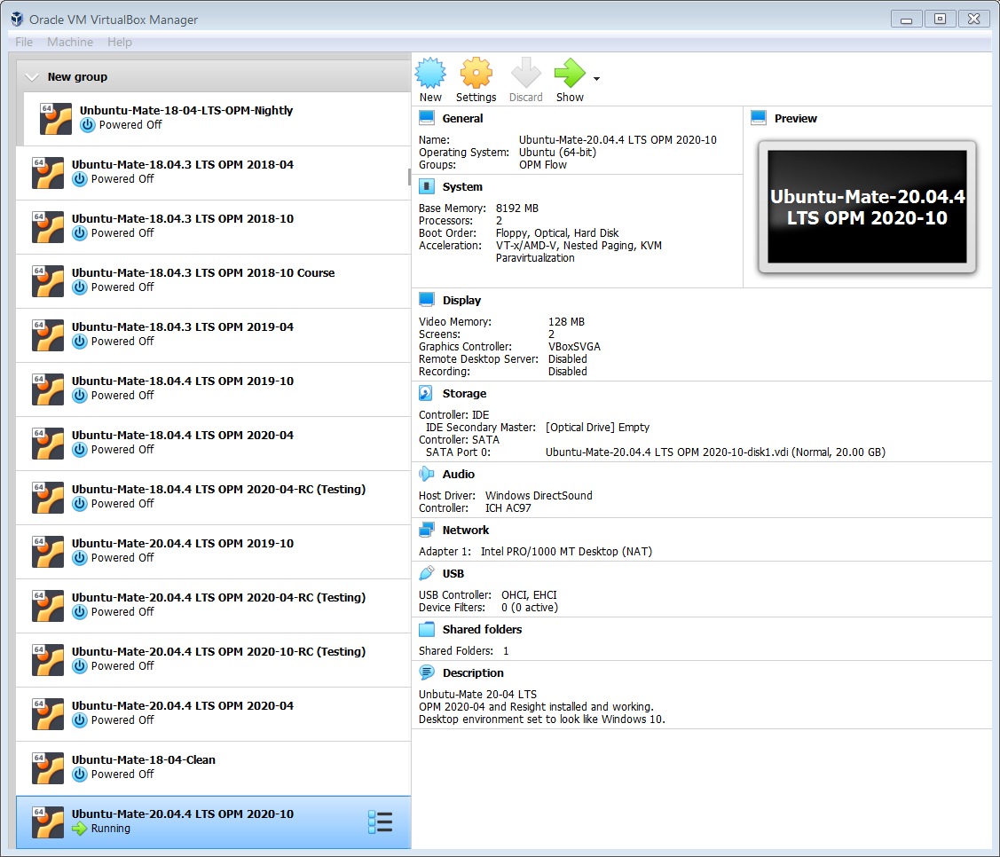


  - Then click the "New" icon button to install a new guest virtual machine.
  - Identify the operating system type (Linux) and the Linux distribution that one wishes to install (Ubuntu 64-bit or RedHat for one of the CentOS distributions).
  - Set the amount of RAM, should be 4GB or more; note the guest machine properties can subsequently be changed after the guest machine has been created.
  - Create a virtual hard drive, the default virtual disk of VDI is normally used, and select either the dynamic or the fixed option. Next select the size of the virtual disk, the size should be sufficient to allow for the operating system and any other software, including OPM Flow, to be installed. For Ubuntu 24.04 LTS the operating system needs at least 10 GB. VirtualBox will then create the guest virtual machine.
  - The next step is to start the guest virtual machine and installing the Linux operating system. This can be done by double clicking on the guest virtual machine and then selecting the previously downloaded IOS file. For Ubuntu 20.04 LTS the machine will boot into a live distribution, that is the guest virtual machine is running from a “live CD”, shown below.


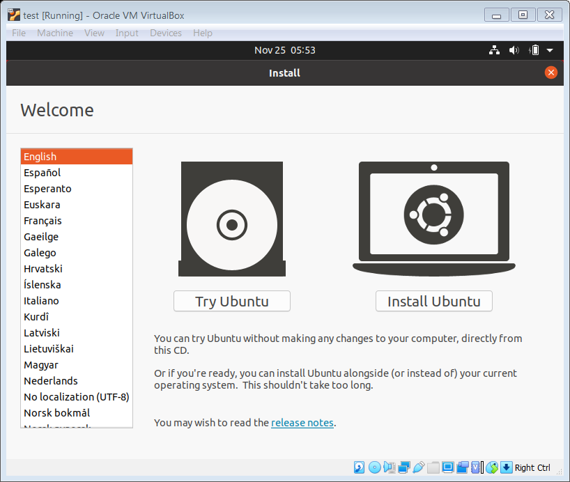

  - Select the “Install Ubuntu” option to install the operating system. The “Try Ubuntu” option means the guest machine will run from a “Live CD”.
  - Follow the on screen instructions to install the operating system, together with any updates suggested by the installer. Once the installation is complete the guest machine will re-boot as a normal guest Linux machine.

    - Installing OPM Flow in the Guest Virtual Machine.

  - Boot up your virtual machine by selecting the machine and selecting the “Start” icon on the main VirtualBox screen (Figure 2.1). One should then be presented with the newly created guest virtual machine, similar to one shown in Figure 2.3, that displays the standard Ubuntu desktop.
  - In order to install OPM Flow in the guest virtual machine one first needs to open a command terminal using ALT+CNTL+T key sequence (Figure 2.4).

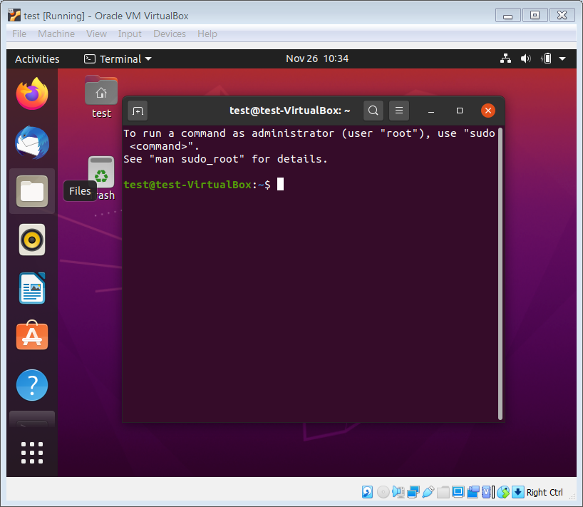


  - One can then use the same commands as for a host machine, as described earlier in Sections 2.1.1 Ubuntu Linux 22.04 or 24.04 (64-bit version only) and 2.1.2 Red Hat Enterprise or CentOS (version 7 or 8) to install the software.   To check if OPM Flow is installed, execute the following command in the terminal window:


```
flow –-help

```

which should then display the command line parameters for the installed version of OPM Flow, as depicted in Figure 2.5.

    - Using OPM Flow in a Linux Virtual Machine.

  - The guest virtual machine only has access to files within the guest machine. To enable the guest to have access to the host machine files; on the main VirtualBox screen (Figure 2.1), select the “Setting” icon and then the “Shared Folders” option to set a share directory between the guest and the host machines. One can then have all the input and output files on the host machine and run OPM Flow in the guest virtual machine.
  - Note one should shut down the guest virtual machine in the normal way to avoid potential file corruptions.
  - One may also take snapshots of the current state of the virtual machine, as a form of backup if one changes the configuration of the virtual machine, or if one updates to the latest release of OPM Flow.

Historically this has been one of  the preferred methods to run OPM Flow on Windows machines and still has several advantages, including being able to export and import various guest virtual machines for testing various versions of the simulator. However, Microsoft, with the introduction of Windows Subsystem for Linux (“WSL”) has create a more seamless method for running OPM Flow on Windows 10 and higher machines. This option is outlined in the next section.


### Windows 10 and 11 – Windows Subsystem for Linux (WSL)

The first release of WSL was on August 2nd, 2016 and there has been various updates to this version which is known as WSL 1. On May 6th, 2019 WSL 2 was announced, that was a complete re-write of the Windows Subsystem for Linux, and offers significant performance improvements over WSL 1. Note that WSL 2 requires Windows 10 version 1903 or higher, with Build 18362 or higher, for x64 systems. WSL 2 is based on a virtual machine with an actual Linux Kernel that can immediately react to system calls.  Such an architecture enables Full System call capabilities.

To run OPM Flow under WSL 1 or WSL 2 one has to first activate WSL, then install a Linux distribution from the Application store, and then finally install OPM Flow. The detail instruction are as follows:

    - Activating Windows Subsystem for Linux.

  - On the Windows machine, Click Start and navigate to Control Panel, then Select the Programs Category. Under Programs and Features, click on Turn Windows Features on or off and click the check box next to the Windows Subsystem for Linux option, to enable WSL.


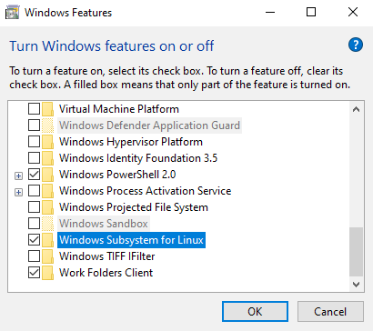

You may also have to ensure that CPU virtualization. has been activated in your computer’s BIOS.

    - Installing a Linux Distribution.

  - To install the Linux
	distribution in Windows, click Start and then select the Microsoft Store.
  - Using the search box available in the Microsoft Store, pick one of the distributions that is compatible with OPM Flow (Figure 2.7). Note that for Ubuntu these are usually the two latest LTS versions before the release, i.e. version "20XX.04 LTS" where XX is a multiple of 4.


  - After selecting the distribution, click Install or Get to install the Linux Distribution. Note the installer will ask you to sign into your account, but you can close the pop-up window if you don’t want to sign in at this time.
  - On completion of the installation process the Linux distribution will be installed on Windows and ready for use. Furthermore, the distribution will be available directly in the Start Menu itself in the form of a standard everyday application (Figure 2.8).

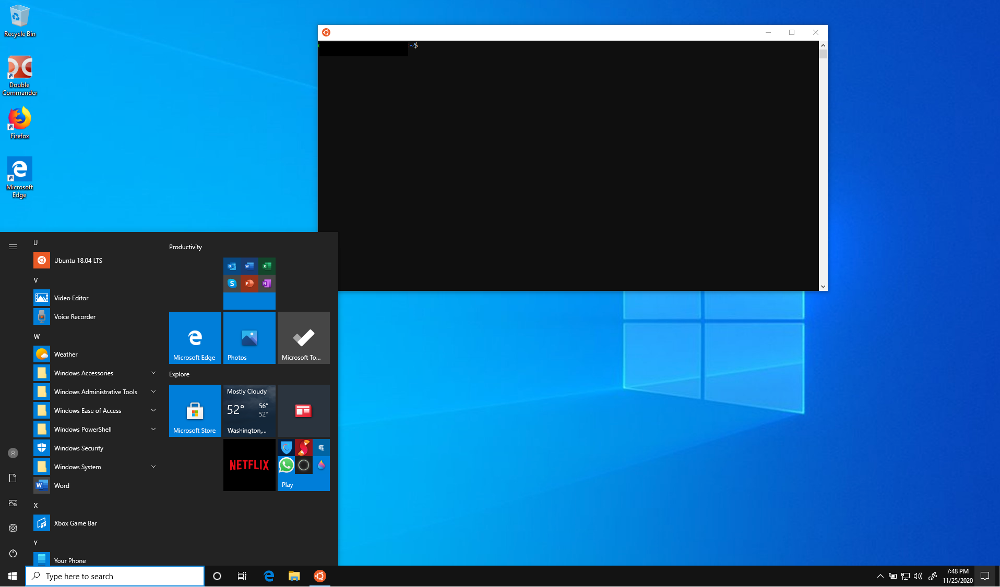


  - When starting the Linux Distribution for the first time, a brief setup process will take place. Basically, it will ask for the username and password you want to set for the Linux environment, a similar process as when you install a Linux distribution via VirtualBox.
  - To check the version of WSL that will be used to run the Linux distribution, in PowerShell use the following command:


```
wsl -l -v

```

  - To set the WSL for a given distribution, for example Ubuntu-24-04 to WSL 2, in PowerShell use the following command:


```
wsl --set-version Ubuntu-24-04 2
```


  - And finally to set the default version for WSL for all Linux distributions, use the following PowerShell command:


```
wsl --set-default-version 2

```

    - Installing OPM Flow in a WSL Linux Distribution:

  - Click on installed Linux distribution in the Start Menu to open a Linux terminal session, and then execute the Linux commands as described earlier in Sections 2.1.1 Ubuntu Linux 22.04 or 24.04 (64-bit version only) and 2.1.2 Red Hat Enterprise or CentOS (version 7 or 8) to install the software.
  - To check if OPM Flow is installed, execute the following command in the Linux terminal window:


```
flow –-help

```

which should then display the command line parameters for the installed version of OPM Flow, as depicted in Figure 2.9.


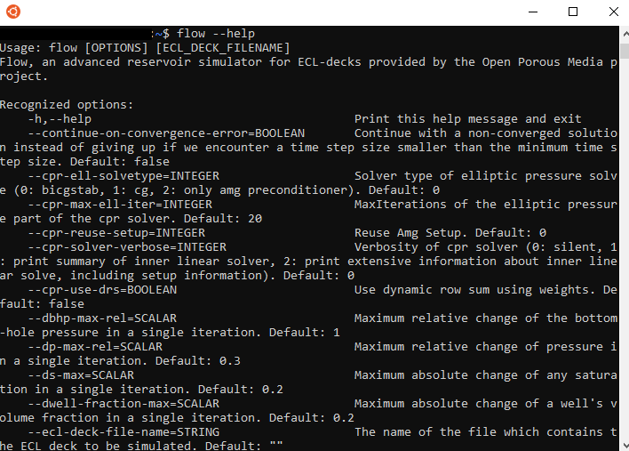

One can also use the Windows command terminal, instead of the WSL Linux Terminal, to do the same thing by adding WSL character string before the command, that is:


```
wsl flow –-help


```

    - Using OPM Flow via the Windows  WSL Linux Virtual Machine.

  - Similar to running OPM Flow using a Linux distribution installed in VirtualBox, the WSL Linux virtual machine only has access to files within WSL virtual machine.  To access the Windows file system, one has to execute the Linux CD command in the WSL Linux Terminal, the command has the form:


```
cd /mnt/<drive letter>

```

For example, to access the Windows system drive C one would use the following command:


```
cd /mnt/c

```

One can then run OPM Flow from the desired directory in the WSL Linux virtual machine and use OPM ResInsight under Windows  to view the results of the simulation run.

User experience indicates this approach of running OPM Flow under Windows is the most integrated and convenient method, compared to the VirtualBox approach, especially for the less technically advance users.


### Using a Docker Container

See the tutorial on the OPM website [Running Flow in Docker](http://opm-project.org/?page_id=853&page=2).


### Installing from Source

See instructions on the OPM website [Building from Source](http://opm-project.org/?page_id=231).


## Running OPM Flow From The Command Line

This section describes how to run the OPM Flow simulator and the various command line options associated with this release, the command line syntax for running OPM Flow is:


```

			flow [OPTIONS] CASENAME
```


and typing the following command from your terminal:


```

			flow CASENAME
```


will start the simulator and run the case specified by CASENAME.DATA.  Alternatively, you can type the path to the binary and the *.DATA file, as per the example below:


```

			path_to_binary/flow path_to_data/CASENAME
```


The simulator can also be run using command line parameters for example to run the previous CASENAME one could use:


```

			flow --ecl-deck-file-name=path_to_data/CASENAME
```


Note that there must be no spaces around the equals sign and there should be no spaces in CASENAME. If there are spaces in CASENAME, which can typically occur on Windows based systems, then the CASENAME should be enclosed in quotes; thus instead of CASE NAME use “CASE NAME”.

By default output files are generated in the same folder as the *.DATA file.  To override this one can use the --output-dir command line parameter, for instance:


```

			flow --output-dir=foo CASENAME
```


will send the output files to the foo directory.

It is also possible to put multiple command line options together in a parameter file. To do so, put one option on each line of the file with “.param” as the extension and pass that filename as a command line parameter to OPM Flow using:


```

			flow --parameter-file=CASENAME.param
```


to instruct OPM Flow to read the parameter file. Note, it is good practice to name both the *.DATA and parameter file with the same CASENAME, to avoid confusion. However, if one wishes to use the same parameter file for various cases one can specify the parameter file followed by the DATA file, for example:


```

		flow --parameter-file=path_to_params/ALLCASES.param CASENAME.DATA
```


If OPM Flow is installed with parallel capabilities then:


```

		mpirun -np 4 flow --parameter-file=path_to_data/CASENAME.param
```


will run OPM Flow on four nodes etc.


| Note On Red Hat based distributions, including centOS distributions, one needs to install the openmpi version of the simulator, opm-simulators-openmpi-bin, via: sudo yum install opm-simulators-openmpi-bin and then set the MPI version to use. The way this is done is by first making the module command available, by running the following command: . /usr/share/Modules/init/bash Then query for the installed modules with: module avail And lastly, you tell the system it to use openmpi with: module add mpi/openmpi-x86_64 On Ubuntu based distributions, there is no need for this as openmpi is installed and mpirun just works. |
| --- |


A complete list of the active user facing command line options and their function is given in the Table 2.1 for the current release. These commands are the options listed with command line --help option, there is also a --help-all option that lists all the command line options included in the release, including experimental, obsolete, hidden and deprecated options.

Additional tutorials for running OPM Flow are available on the OPM website in the [Tutorials](http://opm-project.org/?page_id=43) section.


| OPM Flow Command Line Options |  |  |  |
| --- | --- | --- | --- |
| No. | Variable Name | Description | Default |
| 1 | -h or --help | A character string. Print the help message that gives a brief description of the available command line parameters. | N/A |
| 2 | --help-all | Prints all the command line options included in the release, including obsolete, hidden and deprecated options. | N/A |
| 3 | --accelerator-mode | A character string. Choose a linear solver, usage: '--accelerator-mode=[none\|cusparse\|opencl\|amgcl\|rocalution\|rocsparse]'. | "none" |
| 4 | --action-parsing-strictness | A character string. Set strictness of parsing process for ActionX and PyAction. Available options are normal (do not apply keywords that have not been tested for ActionX or PyAction) and low (try to apply all keywords, beware: the simulation outcome might be incorrect). | "normal" |
| 5 | --add-corners | A boolean value. Add corners to partition. | false |
| 6 | --allow-distributed-wells | A boolean value. Allow the perforations of a well to be distributed to interior of multiple processes. | false |
| 7 | --allow-splitting-inactive-wells | A boolean value. Allow inactive (never non-shut) wells to be split across multiple domains. | true |
| 8 | --alternative-well-rate-init | A boolean value. Use alternative well rate initialization procedure. | true |
| 9 | --check-group-constraints-inner-well-iterations | A boolean value. Allow checking of group constraints during inner well iterations. | true |
| 10 | --check-satfunc-consistency | Saturation function consistency checking is now enabled by default. A boolean value. Whether or not to check saturation function consistency requirements. | true |
| 11 | --continue-on-convergence-error | A boolean value. Continue with a non-converged solution instead of giving up if we encounter a time step size smaller than the minimum time step size. | false |
| 12 | --convergence-monitoring | A boolean value. Enable convergence monitoring. | false |
| 13 | --convergence-monitoring-cut-off | An integer value. Cut off limit for convergence monitoring. | 6 |
| 14 | --convergence-monitoring-decay-factor | A positive real value. Decay factor for convergence monitoring. | 0.75 |
| 15 | --cpr-reuse-interval | An integer value. Reuse preconditioner interval. Used when CprReuseSetup is set to 4, then the preconditioner will be fully recreated instead of reused every N linear solve, where N is this parameter. | 30 |
| 16 | --cpr-reuse-setup | A positive integer. Specify if the CPR solver should re-use the AMG setup. Valid options are: | 4 |
| 17 | --cpr-weights-thread-parallel | A boolean value. Enable OpenMP thread parallelization of CPR weight calculation. This can improve performance for large models but is disabled by default. Usage: --cpr-weights-thread-parallel=[true\|false]. | false |
| 18 | --dbhp-max-rel | A positive real value. Maximum relative change of the bottom-hole pressure in a single iteration. | 1 |
| 19 | --debug-emit-cell-partition | A boolean value. Whether or not to emit cell partitions as a debugging aid. | false |
| 20 | --debug-verbosity-level | An integer value. Set debug verbosity level globally. Default is 1, increasing values give additional output and 0 disables most messages to the .DBG file. | 1 |
| 21 | --dp-max-rel | A positive real value. Maximum relative change of pressure in a single iteration. | 0.3 |
| 22 | --ds-max | A positive real value. Maximum absolute change of any saturation in a single iteration. | 0.2 |
| 23 | --dwell-fraction-max | A positive real value. Maximum absolute change of a well's volume fraction in a single iteration. | 0.2 |
| 24 | --ecl-deck-file-name | A character string. The name of the file which contains the ECL deck to be simulated. | "" |
| 25 | --ecl-output-double-precision | A boolean value. Tell the output writer to use double precision. Useful for 'perfect' restarts. | false |
| 26 | --ecl-output-interval | An integer value. The number of report steps that ought to be skipped between two writes of ECL results. | -1 |
| 27 | --edge-conformal | A boolean value. Edge conformal cornerpoint processing. | false |
| 28 | --edge-weights-method | This option is now specified by a string rather than an integer. A defined character string. Specify the edge-weighting strategy: | "transmissibility" |
| 29 | --enable-adaptive-time-stepping | A boolean value. Use adaptive time stepping between report steps. | true |
| 30 | --enable-async-ecl-output | A boolean value. Write the ECL-formated results in a non-blocking way (i.e., using a separate thread). | true |
| 31 | --enable-async-vtk-output | A boolean value. Dispatch a separate thread to write the VTK output. | true |
| 32 | --enable-drift-compensation | A boolean value. Enable partial compensation of systematic mass losses via the source term of the next time step. | false |
| 33 | --enable-dry-run | A boolean value. Specify if the simulation should actually run (true), or just check the input deck (false). This option is equivalent to activating the NOSIM keyword in the RUNSPEC section of the input deck. The default value of "auto" will use whatever is stipulated in the input deck via the NOSIM keyword. | "auto" |
| 34 | --enable-ecl-output | A boolean value. Write binary output which is compatible with the commercial Eclipse simulator. | true |
| 35 | --enable-esmry | A boolean value. Write ESMRY file for fast loading of summary data. | false |
| 36 | --enable-gravity | A boolean value. Use the gravity correction for the pressure gradients. | true |
| 37 | --enable-grid-adaptation | A boolean value. Enable adaptive grid refinement/coarsening. | false |
| 38 | --enable-intensive-quantity-cache | A boolean value. Turn on caching of intensive quantities. | true |
| 39 | --enable-logging-fallout-warning | A boolean value. Developer option to see whether logging was on non-root processors. In that case it will be appended to the *.DBG or *.PRT files. | false |
| 40 | --enable-opm-rst-file | A boolean value. Include OPM-specific keywords in the ECL restart file to enable restart of OPM simulators from these files. | false |
| 41 | --enable-storage-cache | A boolean value. Store previous storage terms and avoid re-calculating them. | true |
| 42 | --enable-terminal-output | A boolean value. Print high-level information about the simulation's progress to the terminal. | true |
| 43 | --enable-thermodynamic-hints | A boolean value. Enable thermodynamic hints. | false |
| 44 | --enable-tuning | A boolean value. Read the time stepping and convergence parameters from the TUNING keyword in the input deck, if set to true. Note that only some of the TUNING keyword parameters are processed. | false |
| 45 | --enable-vtk-output | A boolean value. Global switch for turning on writing VTK files. | false |
| 46 | --enable-well-operability-check | A boolean value. Enable the well operability checking. | true |
| 47 | --enable-well-operability-check-iter | A boolean value. Enable the well operability checking during iterations. | false |
| 48 | --enable-write-all-solutions | A boolean value. Write all solutions to disk instead of only the ones for the report steps. | false |
| 49 | --end-time | A positive real value. The simulation time at which the simulation is finished [s]. | 1e+100 |
| 50 | --explicit-rock-compaction | A boolean value. Use pressure from end of the last time step when evaluating rock compaction. | false |
| 51 | --external-partition | A character string. Name of file from which to load an externally generated partitioning of the model's active cells for MPI distribution purposes. If empty, the built-in partitioning method will be employed. | "" |
| 52 | --force-disable-fluid-in-place-output | A boolean value. Do not print fluid-in-place values after each report step even if requested by the deck.  Note this parameter will override the print request in the input deck. | false |
| 53 | --force-disable-resv-fluid-in-place-output | A boolean value. Do not print reservoir volumes values after each report step even if requested by the deck.  Note this parameter will override the print request in the input deck. | false |
| 54 | --full-time-step-initially | A boolean value. Always attempt to finish a report step using a single substep. | false |
| 55 | --gpu-aware-mpi | A boolean value. MPI communication use GPU aware MPI in the sense that it will use GPU direct communication. Setting this to true will require that the MPI implementation supports GPU direct communication. If you are unsure, set this to false. Usage: --gpu-aware-mpi=[true\|false]. . | false |
| 56 | --gpu-device-id | An integer value. Choose device ID for cusparseSolver or openclSolver, use 'nvidia-smi' or 'clinfo' to determine valid IDs. | 0 |
| 57 | --hy-ne-config-file | A character string. Use config files for Hybrid Newton. | "hybridNewtonConfig.json" |
| 58 | --ignore-keywords | A character string. List of Eclipse keywords which should be ignored. As a ':' separated string. | "" |
| 59 | --ilu-fillin-level | An integer value. The fill-in level of the linear solver's ILU preconditioner. | 0 |
| 60 | --ilu-redblack | A boolean value. Use red-black partitioning for the ILU preconditioner. | false |
| 61 | --ilu-relaxation | A real value ranging from zero to one. The relaxation factor of the linear solver's ILU preconditioner. | 0.9 |
| 62 | --ilu-reorder-spheres | A boolean value. Whether to reorder the entries of the matrix in the red-black ILU preconditioner in spheres starting at an edge. If false the original ordering is preserved in each color. Otherwise why try to ensure D4 ordering (in a 2D structured grid, the diagonal elements are consecutive). | false |
| 63 | --imbalance-tol | A positive real value. Tolerable imbalance of the loadbalancing. | 1.1 |
| 64 | --initial-time-step-in-days | A positive real value. The size of the initial time step in days. | 1 |
| 65 | --initial-time-step-size | A positive real value. The size of the initial time step [s]. | 86400 |
| 66 | --inj-mult-damp-mult | A real value ranging from zero to one. Injection multiplier dampening factor (dampening multiplied by this each time oscillation is detected). | 0.9 |
| 67 | --inj-mult-min-damp-factor | A real value ranging from zero to one. Minimum injection multiplier dampening factor (maximum dampening level). | 0.05 |
| 68 | --inj-mult-osc-threshold | A positive real value. Injection multiplier oscillation threshold (used for multiplier dampening). | 0.1 |
| 69 | --input-skip-mode | A defined character string. Set compatibility mode for the [SKIP100](#REF_HEADING_KEYWORD_SKIP100_11_3) and [SKIP300](#REF_HEADING_KEYWORD_SKIP300_11_3) keywords. Options are: | "100" |
| 70 | --linear-solver | A defined character string. Specify the configuration of the linear solver, valid values are: Option (1) extends the existing Constrained Pressure Residual (“CPR”) preconditioner to include wells. This option can also be invoked via the CPR keyword in the RUNSPEC section; however, the command line parameter takes precedence. For option (10) one enters a character string enclosed in quotes that defines the filename of a JSON configuration file for the flexible linear solver system. In this case the file extension should be ‘.json’. Note that the Print (PRT) file contains the “Property tree for the linear solver” listing, which is the JSON specification of the current case, and can be used to configure a user specific linear solver JSON file. | "cprw" |
| 71 | --linear-solver-accelerator | A character string. Choose the backend for the linear solver, usage: '--linear-solver-accelerator=[cpu\|gpu]'. | "cpu" |
| 72 | --linear-solver-ignore-convergence-failure | A boolean value. Continue with the simulation like nothing happened after the linear solver did not converge.  The default value for "CPR" solvers is 20. | false |
| 73 | --linear-solver-max-iter | An integer value. The maximum number of iterations of the linear solver. | 200 |
| 74 | --linear-solver-print-json-definition | A boolean value. Write the JSON definition of the linear solver setup to the DBG file.  The default value for "CPR" solvers is 0.005. | true |
| 75 | --linear-solver-reduction | A positive real value. The minimum reduction of the residual which the linear solver must achieve. | 0.01 |
| 76 | --linear-solver-restart | An integer value. The number of iterations after which GMRES is restarted. | 40 |
| 77 | --linear-solver-verbosity | An integer value. Specify the output from the linear solver: | 0 |
| 78 | --load-file | A character string. FileName for .OPMRST file used to load serialized state. If empty, CASENAME.OPMRST is used. | "" |
| 79 | --load-step | An integer value. Specify if the simulator should load the serialized state from OPM Flow's version of the restart file, and should be set to either a specific report step, or 0 to load the last stored report step. The default value of -1 does not load the data from the OPM Flow specific restart file. OPM Flow's version of the restart file, is written using the --save-step=N option. | -1 |
| 80 | --local-domains-ordering-measure | A character string. Subdomain ordering measure. Allowed values are 'maxpressure', 'averagepressure' and 'residual'. | "maxpressure" |
| 81 | --local-domains-partition-well-neighbor-levels | An integer value. Number of neighbor levels around wells to include in the same domain during NLDD partitioning. | 1 |
| 82 | --local-domains-partitioning-imbalance | A real value greater than one. Subdomain partitioning imbalance tolerance. 1.03 is 3 percent imbalance. | 1.03 |
| 83 | --local-domains-partitioning-method | A character string. Subdomain partitioning method. Allowed values are 'zoltan', 'simple', and the name of a partition file ending with '.partition'. | "zoltan" |
| 84 | --local-solve-approach | A character string. Choose local solve approach. Valid choices are jacobi and gauss-seidel. | "gauss-seidel" |
| 85 | --local-tolerance-scaling-cnv | A positive real value. Set lower than 1.0 to use stricter convergence tolerance for local solves. | 0.1 |
| 86 | --local-tolerance-scaling-mb | A positive real value. Set lower than 1.0 to use stricter convergence tolerance for local solves. | 1 |
| 87 | --local-well-solve-control-switching | A boolean value. Allow control switching during local well solutions. | true |
| 88 | --matrix-add-well-contributions | A boolean value. Explicitly specify the influences of wells between cells in the Jacobian and preconditioner matrices. | false |
| 89 | --max-inner-iter-ms-wells | An integer value. Maximum number of inner iterations for multi-segment wells. | 100 |
| 90 | --max-inner-iter-wells | An integer value. Maximum number of inner iterations for standard wells. | 50 |
| 91 | --max-local-solve-iterations | An integer value. Max iterations for local solves with NLDD nonlinear solver. | 20 |
| 92 | --max-newton-iterations-with-inner-well-iterations | An integer value. Maximum newton iterations with inner well iterations. | 8 |
| 93 | --max-pressure-change-ms-wells | A positive real value. Maximum relative pressure change for a single iteration of the multi-segment well model. | 1e+06 |
| 94 | --max-residual-allowed | A positive real value. Absolute maximum tolerated for residuals without cutting the time step size. | 1e+07 |
| 95 | --max-single-precision-days | A positive real value. Maximum time step size where single precision floating point arithmetic can be used solving for the linear systems of equations. | 20 |
| 96 | --max-temperature-change | A positive real value. Maximum absolute change of temperature in a single iteration. | 5 |
| 97 | --max-time-step-divisions | An integer value. The maximum number of divisions by two of the timestep size before the simulation bails out. | 10 |
| 98 | --max-time-step-size | A positive real value. The maximum size to which all time steps are limited to [s]. | inf |
| 99 | --max-well-status-switch-for-wells | An integer value. Maximum number of status switching (stop<->open) for a well during a time-step. | 99 |
| 100 | --max-well-status-switch-in-inner-iter-wells | An integer value. Maximum number of status switching (stop<->open) for a well during inner iterations. | 99 |
| 101 | --max-welleq-iter | An integer value. Maximum number of iterations to determine solution the well equations. | 30 |
| 102 | --maximum-number-of-group-switches | An integer value. Maximum number of times a group can switch to the same control. | 3 |
| 103 | --maximum-number-of-well-switches | An integer value. Maximum number of times a well can switch to the same control. | 3 |
| 104 | --maximum-water-saturation | A positive real value. Maximum water saturation. | 1 |
| 105 | --metis-params | A character string. Configuration of Metis partitioner. You can request a configuration to be read from a JSON file by giving the filename here, with extension '.json'. See http://glaros.dtc.umn.edu/gkhome/fetch/sw/metis/manual.pdf for available METIS options. | "default" |
| 106 | --milu-variant | Option strings have been converted to lower case. A defined character string. Specify which variant of the modified ILU preconditioner ought to be used. Possible variants are: | "ilu" |
| 107 | --min-strict-cnv-iter | An integer value. Minimum number of Newton iterations before relaxed tolerances can be used for the CNV convergence criterion. | -1 |
| 108 | --min-strict-mb-iter | An integer value. Minimum number of Newton iterations before relaxed tolerances can be used for the MB convergence criterion. Default -1 means that the relaxed tolerance is used when maximum number of Newton iterations are reached. | -1 |
| 109 | --min-time-step-based-on-newton-iterations | A real value greater than or equal to zero. The minimum time step size (in days for field and metric unit and hours for lab unit) can be reduced to based on newton iteration counts. | 0 |
| 110 | --min-time-step-before-shutting-problematic-wells-in-days | A real value greater than or equal to zero. The minimum time step size in days for which problematic wells are not shut. | 0.01 |
| 111 | --min-time-step-size | A real value greater than or equal to zero. The minimum size to which all time steps are limited to [s]. | 0 |
| 112 | --network-max-outer-iterations | An integer value. Maximum outer number of iterations in the network solver before giving up. | 10 |
| 113 | --network-max-pressure-update-in-bars | A positive real value. Maximum pressure update in the inner network pressure update iterations. | 5 |
| 114 | --network-max-strict-outer-iterations | An integer value. Maximum outer iterations in network solver before relaxing tolerance. | 10 |
| 115 | --network-max-sub-iterations | An integer value. Maximum number of sub-iterations to update network pressures (within a single well/group control update). | 20 |
| 116 | --network-pressure-update-damping-factor | A real value ranging from zero to one. Damping factor in the inner network pressure update iterations. | 0.1 |
| 117 | --newton-max-error | A positive real value. The maximum error tolerated by the Newton method to which does not cause an abort. | 1e+100 |
| 118 | --newton-max-iterations | An integer value. The maximum number of Newton iterations per time step. | 20 |
| 119 | --newton-max-relax | A positive real value. The maximum relaxation factor of a Newton iteration. | 0.5 |
| 120 | --newton-min-iterations | An integer value. The minimum number of Newton iterations per time step. | 2 |
| 121 | --newton-relaxation-type | A character string. The type of relaxation used by the Newton method. Valid options are: dampen or sor. | "dampen" |
| 122 | --newton-target-iterations | An integer value. The 'optimum' number of Newton iterations per time step. | 10 |
| 123 | --newton-tolerance | A positive real value. The maximum raw error tolerated by the Newton method for considering a solution to be converged. | 0.01 |
| 124 | --newton-verbose | A boolean value. Specify whether the Newton method should inform the user about its progress or not. | true |
| 125 | --newton-write-convergence | A boolean value. Write the convergence behaviour of the Newton method to a VTK file. | false |
| 126 | --nldd-local-linear-solver | A character string. Configuration of NLDD local linear solver. Valid options are: ilu0 (default), dilu, cpr_quasiimpes and amg. Alternatively, you can request a configuration to be read from a JSON file by giving the filename here, ending with '.json.'. | "ilu0" |
| 127 | --nldd-local-linear-solver-max-iter | An integer value. The maximum number of iterations of the NLDD local linear solver. | 200 |
| 128 | --nldd-local-linear-solver-reduction | A positive real value. The minimum reduction of the residual which the NLDD local linear solver must achieve. | 0.01 |
| 129 | --nldd-num-initial-newton-iter | An integer value. Number of initial global Newton iterations when running the NLDD nonlinear solver. | 1 |
| 130 | --nldd-relative-mobility-change-tol | A positive real value. Threshold for single cell relative mobility change in the NLDD solver. | 0.1 |
| 131 | --nonlinear-solver | A character string. Choose nonlinear solver. Valid choices are newton or nldd. | "newton" |
| 132 | --num-local-domains | An integer value. Number of local domains for NLDD nonlinear solver. | 0 |
| 133 | --num-overlap | An integer value. Numbers of layers overlap in parallel partition. | 1 |
| 134 | --num-pressure-points-equil | An integer value. Number of pressure points (in each direction) in tables used for equilibration. | 2000 |
| 135 | --num-satfunc-consistency-sample-points | An integer value. Maximum number of reported failures for each individual saturation function consistency check. | 5 |
| 136 | --nupcol-group-rate-tolerance | A positive real value. Tolerance for acceptable changes in VREP/REIN group rates. | 0.001 |
| 137 | --opencl-ilu-parallel | A boolean value. Parallelize ILU decomposition and application on GPU. | true |
| 138 | --opencl-platform-id | An integer value. Choose platform ID for openclSolver, use 'clinfo' to determine valid platform IDs. | 0 |
| 139 | --output-dir | A character string. The directory to which result files are written. | "" |
| 140 | --output-extra-convergence-info | A defined character string. Specify whether to provide additional convergence output to separate files for diagnostic purposes. The available options are: Options can be combined with commas, e.g."steps,iterations" for multiple outputs. The default value of "none" prevents the two files from being written out, for better compatibility with the commercial simulator. | "none" |
| 141 | --output-interval | An integer value. Specify the number of report steps between two consecutive writes of restart data. | 1 |
| 142 | --output-mode | A defined character string. Specify the output to the *.PRT and *.DBG files: For example to just output logging information use: --output-mode=“log” or --output-mode=false | "all" |
| 143 | --owner-cells-first | A boolean value. Order cells owned by rank before ghost/overlap cells. | true |
| 144 | --parameter-file | A character string. An .ini file which contains a set of run-time parameters. | "" |
| 145 | --parsing-strictness | A character string. Set strictness of parsing process. Available options are: | "normal" |
| 146 | --partition-method | Options are now specified by strings rather than integers. A character string. Choose partitioning strategy: | "zoltanwell" |
| 147 | --pre-solve-network | A boolean value. Pre solve and iterate the network model at start-up. | true |
| 148 | --predetermined-time-steps-file | A character string. A file with a list of predetermined time step sizes (one time step per line). | "" |
| 149 | --pressure-max | A positive real value. Maximum absolute pressure. | 1e+99 |
| 150 | --pressure-min | A real value. Minimum absolute pressure. | -1e+99 |
| 151 | --pressure-scale | A positive real value. Scaling of pressure primary variable. | 1 |
| 152 | --pri-var-oscilation-threshold | A positive real value. The threshold value for the primary variable switching conditions after its meaning has switched to hinder oscillations. | 1e-05 |
| 153 | --print-parameters | An integer value. Specify the run time parameters to be printed at the start of the run: | 2 |
| 154 | --project-saturations | A boolean value. Option for doing saturation projection. | false |
| 155 | --regularization-factor-wells | A positive real value. Regularization factor for wells. | 100 |
| 156 | --relaxed-linear-solver-reduction | A positive real value. The minimum reduction of the residual which the linear solver need to achieve for the solution to be accepted. | 0.01 |
| 157 | --relaxed-max-pv-fraction | A positive real value. The fraction of the pore volume of the reservoir where the volumetric error (CNV) may be violated during strict Newton iterations. | 0.03 |
| 158 | --relaxed-pressure-tol-msw | A positive real value. Relaxed tolerance for the MSW pressure solution. | 10000 |
| 159 | --relaxed-well-flow-tol | A positive real value. Relaxed tolerance for the well flow residual. | 0.001 |
| 160 | --restart-time | A real value. The simulation time at which a restart should be attempted [s]. | -1e+35 |
| 161 | --restart-writing-interval | An integer value. The frequencies of which time steps are serialized to disk. | 16777215 |
| 162 | --save-file | A character string. FileName for .OPMRST file used for saving serialized state. If empty, CASENAME.OPMRST is used. | "" |
| 163 | --save-step | A character string. Specify if the simulator should save the serialized state of the OPM Flow simulator at one or more report steps to a special *.OPMRST file. This is in addition to the normal restart files written, and consumes significantly more space than the normal restart files, but restarting OPM Flow from this file using the --load-step option deviates less from the original run, compared to restarting using the normal restart features. The files produced are not compatible with other simulators, and also will not be compatible between different releases of OPM Flow. The parameter should be set to one of the following: Use negative values of "x" to keep only the last written step. The default value of "" does not write anything to the OPM Flow specific restart file. | "" |
| 164 | --scale-linear-system | A boolean value. Scale linear system according to equation scale and primary variable types. | false |
| 165 | --sched-restart | A boolean value. Determine for a restart run if the case should initialize wells and groups from the historical SCHEDULE section (true), or from the well and group data on the restart file (false). Note that the commercial simulator always uses data from the restart file (false). | false |
| 166 | --serial-partitioning | A boolean value. Perform partitioning for parallel runs on a single process. | false |
| 167 | --shut-unsolvable-wells | A boolean value. Shut unsolvable wells. | true |
| 168 | --slave | A boolean value. Specify if the simulation is a slave simulation in a master-slave simulation.  Note that reservoir coupling is not currently supported. This is a developer option that should not be used. | false |
| 169 | --solve-welleq-initially | A boolean value. Fully solve the well equations before each iteration of the reservoir model.  Note that the well equations are always added to the full system and solved until convergence. | true |
| 170 | --solver-continue-on-convergence-failure | A boolean value. Continue instead of stop when minimum solver time step is reached. | false |
| 171 | --solver-growth-factor | A real value greater than one. Specify the growth factor a time step can be increased by when recovering from one or more time step chops, subject to the maximum allowable time step size set by the --solver-max-time-step-in-days parameter. For example, if the current time step has converged at 5 days after a time step chop,  and --solver-growth-factor is set to the default value of 2.0, then the next time step will be 2.0 * 5 days, that is at 10 days. | 2 |
| 172 | --solver-max-growth | A real value greater than one. Specify the maximum growth factor a time step can be increased by after a report time step, subject to the maximum allowable time step size set by the --solver-max-time-step-in-days parameter. Thus, if the current time step has converged at 5 days after at a report step,  and --solver-max-growth is set to the default value of 3.0, then the next time step will be 3.0 * 5 days, that is at 15 days. | 3 |
| 173 | --solver-max-restarts | An integer value. The maximum number of breakdowns before a substep is given up and the simulator is terminated. | 10 |
| 174 | --solver-max-time-step-in-days | A positive real value. The maximum size of a time step in days. | 365 |
| 175 | --solver-min-time-step | A positive real value. The minimum size of a time step in days for field and metric and hours for lab. If a step cannot converge without getting cut below this step size the simulator will stop. | 1e-12 |
| 176 | --solver-restart-factor | A real value between zero and one. Specify the time step chop factor of the time step after a convergence failure. For example, if the current non-convergent time step is 30 days and --solver-restart-factor  is set to the default value, then the time step will be repeated using 0.33 * 30 days as the time step, that is 9.9 days. | 0.33 |
| 177 | --solver-verbosity | An integer value. Specify the "chattiness" of the non-linear solver itself. | 1 |
| 178 | --strict-inner-iter-wells | An integer value. Number of inner well iterations with strict tolerance. | 40 |
| 179 | --strict-outer-iter-wells | An integer value. Number of newton iterations for which wells are checked with strict tolerance. | 6 |
| 180 | --temperature-max | A positive real value. Maximum absolute temperature. | 1e+09 |
| 181 | --temperature-min | A real value. Minimum absolute temperature. | 0 |
| 182 | --threads-per-process | An integer value. The maximum number of threads to be instantiated per process ('-1' means 'automatic'). | 2 |
| 183 | --time-step-after-event-in-days | A real value. Specify the maximum allowed time step after an event; for example, when a well is open or closed etc. The default value of -1 means that events do not affect the time stepping. | -1 |
| 184 | --time-step-control | A character string. The algorithm used to determine time-step sizes. Valid options are: | "pid+newtoniteration" |
| 185 | --time-step-control-decay-damping-factor | A positive real value less than or equal to one. The decay rate of the time step decrease when the target iterations is exceeded. | 1 |
| 186 | --time-step-control-decay-rate | A positive real value less than one. The decay rate of the time step size of the number of target iterations is exceeded. | 0.75 |
| 187 | --time-step-control-file-name | A character string. Specify the name of a file where time steps are specified. For instance time steps can be generated by the summary application as per the following UNIX command line: path_to_application/summary DECK TIME > timesteps Where: DECK is the name of the data deck you want to get the time steps from, TIME tells the application to return the timing for the run, and "filename" is the name of the file the times are piped to. | "timesteps" |
| 188 | --time-step-control-growth-damping-factor | A real value greater than one. The growth rate of the time step increase when the target iterations is undercut. | 3.2 |
| 189 | --time-step-control-growth-rate | A real value greater than one. The growth rate of the time step size of the number of target iterations is undercut. | 1.25 |
| 190 | --time-step-control-max-reduction-time-step | A positive real value (only applicable for the general 3rd order controller, using 'control-error-filtering' as time-step-control-tolerance-test-version). If the (proposed) relative change in time step size is larger than this parameter, the time step will be rejected. | 0.1 |
| 191 | --time-step-control-parameters | A character string (only applicable for the general 3rd order controller). Parameters for the general 3rd order controller. Should be given as 'beta_1;beta_2;beta_3;alpha_2;alpha_3'. | "0.125;0.25;0.125;0.75;0.25" |
| 192 | --time-step-control-reject-completed-step | A boolean value (only applicable for the general 3rd order controller). Include rejection of completed time steps if the relative change is larger than the time step control tolerance. | false |
| 193 | --time-step-control-safety-factor | A positive real value less than or equal to one. Value to be multiplied with the time step control tolerance to ensure that the target relative change is lower than the tolerance. | 0.8 |
| 194 | --time-step-control-target-iterations | An integer value. The number of linear iterations which the time step control scheme should aim for (if applicable). | 30 |
| 195 | --time-step-control-target-newton-iterations | An integer value. The number of Newton iterations which the time step control scheme should aim for (if applicable). | 8 |
| 196 | --time-step-control-tolerance | A positive real value. The tolerance used by the time step size control algorithm. | 0.1 |
| 197 | --time-step-control-tolerance-test-version | A character string (only applicable for the general 3rd order controller). Ways to decide if the time step should be rejected. Options: 'standard' and 'control-error-filtering'. The standard version compares relative change to tolerance directly to decide if the time step should be rejected, while the control-error-filtering version compares the relative change in time step size to the max-reduction-time-step parameter. | "standard" |
| 198 | --time-step-verbosity | An integer value. Specify the "chattiness" during the time integration. | 1 |
| 199 | --tolerance-cnv | A positive real value. Local convergence tolerance (maximum of local saturation errors). | 0.01 |
| 200 | --tolerance-cnv-energy | A positive real value. Local energy convergence tolerance (maximum of local energy errors). | 0.01 |
| 201 | --tolerance-cnv-energy-relaxed | A positive real value. Relaxed local energy convergence tolerance that applies for iterations after the iterations with the strict tolerance. | 1 |
| 202 | --tolerance-cnv-relaxed | A positive real value. Relaxed local convergence tolerance that applies for iterations after the iterations with the strict tolerance. | 1 |
| 203 | --tolerance-energy-balance | A positive real value. Tolerated energy balance error relative to (scaled) total energy present. | 1e-07 |
| 204 | --tolerance-energy-balance-relaxed | A positive real value. Relaxed tolerated energy balance error that applies for iterations after the iterations with the strict tolerance. | 1e-06 |
| 205 | --tolerance-mb | A positive real value. Tolerated mass balance error relative to total mass present. | 1e-07 |
| 206 | --tolerance-mb-relaxed | A positive real value. Relaxed tolerated mass balance error that applies for iterations after the iterations with the strict tolerance. | 1e-06 |
| 207 | --tolerance-pressure-ms-wells | A positive real value. Tolerance for the pressure equations for multi-segment wells. | 1000 |
| 208 | --tolerance-well-control | A positive real value. Tolerance for the well control equations. | 1e-07 |
| 209 | --tolerance-wells | A positive real value. Well convergence tolerance. | 0.0001 |
| 210 | --update-equations-scaling | A boolean value. Update scaling factors for mass balance equations during the run. | false |
| 211 | --use-average-density-ms-wells | A boolean value. Approximate segment densitities by averaging over segment and its outlet. | false |
| 212 | --use-gmres | A boolean value. Use the Generalized Minimal Residual (“GMRES”) [Y. Saad, A flexible inner-outer preconditioned GMRES algorithm, SIAM J. Sci. Statist. Comput.,14, (1993).] and  [Y. Saad and M.H. Schultz, GMRES: A generalized minimum residual algorithm for solving nonsymmetric linear systems, SIAM J. Sci. Statist. Comput., 7 (1986), pp. 856{869.] solver instead of Biconjugate Gradient Stabilized (“BiCGSTAB”) [Van der Vorst, H. A. (1992). "Bi-CGSTAB: A Fast and Smoothly Converging Variant of Bi-CG for the Solution of Nonsymmetric Linear Systems". SIAM J. Sci. Stat. Comput. 13 (2): 631–644. doi:10.1137/0913035. hdl:10338.dmlcz/104566] and  [Sleijpen, G. L. G.; Fokkema, D. R. (November 1993). "BiCGstab(l) for linear equations involving unsymmetric matrices with complex spectrum" (PDF). Electronic Transactions on Numerical Analysis. Kent, OH: Kent State University. 1: 11–32. ISSN 1068-9613.] as the linear solver within the Newton iterations. | false |
| 213 | --use-hy-ne | A boolean value. Wheter or not to use Hybrid Newton. | false |
| 214 | --use-implicit-ipr | A boolean value. Compute implict IPR for stability checks and stable solution search. | true |
| 215 | --use-multisegment-well | A boolean value. Use the well model for multi-segment wells instead of the one for single-segment wells. | true |
| 216 | --use-update-stabilization | A boolean value. Try to detect and correct oscillations or stagnation during the Newton method. | true |
| 217 | --verify-gpu-aware-mpi | A boolean value. Verify that the MPI implementation supports GPU aware MPI. If this is set to true *and* --gpu-aware-mpi=true, the simulation will fail if the MPI implementation does not support GPU aware MPI. Note that the verification is not exhaustive, and some configurations will not verify, but will work in practice. Usage: --verify-gpu-aware-mpi=[true\|false]. . | false |
| 218 | --water-only-threshold | A positive real value. Cells with water saturation above or equal is considered one-phase water only. | 1 |
| 219 | --well-group-constraints-max-iterations | An integer value. Maximum number of iterations in the well/group switching algorithm. | 1 |
| 220 | --zoltan-imbalance-tol | A real value. Tolerable imbalance of the loadbalancing provided by Zoltan. DEPRECATED: Use --imbalance-tol instead. | 1.1 |
| 221 | --zoltan-params | A character string. Configuration of Zoltan partitioner. Valid options are: graph, hypergraph or scotch. Alternatively, you can request a configuration to be read from a JSON file by giving the filename here, with extension '.json'. See https://sandialabs.github.io/Zoltan/ug_html/ug.html for available Zoltan options. | "graph" |
| 222 | --zoltan-phg-edge-size-threshold | A real value ranging from zero to one. Low-level threshold fraction in the range [0,1] controlling which hypergraph edge to omit. Used if --zoltan-params="graph" or if --zoltan-params="hypergraph". | 0.35 |
| Notes: |  |  |  |

*Table 2.1: OPM Flow Command Line Options*


As per all UNIX and LINUX based systems the input is case sensitive. The command line parameters must either be entered as lower case or CamelCase, for example:


```
			flow --enable-dry-run=false CASENAME.DATA
```

or:


```
			flow --EnableDryRun=false CASENAME.DATA

```

If a parameter file is used to set one of the above parameters, the leading “--” should not be incorporated in the parameter file, for example on the command line use:


```
			flow --enable-dry-run=false CASENAME.DATA

```

but in the parameter file use:


```
			ecl-deck-file-name=CASENAME.DATA

			enable-dry-run=false
```

or:


```
			EclDeckFileName=CASENAME.DATA

			EnableDryRun=false

```

OPM Flow prints out the command line run time and compile time parameters in CamelCase in both the *.PRT and *.DBG files for reference, one can therefore use this as basis for creating additional run specific parameter files.


| Note It is worth considering having a parameter file for each run of the form CASENAME.param, in order to re-run a case using the same parameters or to use the same parameters for other cases. |
| --- |


#### Example

The following example shows the parameter file NORNE_ATW2013.PARAM taken from the Norne project, where the comments below (preceded with “#”) explain the parameter settings used in the file.


```
# ----------------------------------------------------------------------------
# INPUT AND OUTPUT OPTIONS
# ----------------------------------------------------------------------------
#
# Input File
#
ecl-deck-file-name=NORNE_ATW2013.DATA
#
# Output and Output Directory
#
output-dir=’\$HOME\OPM\NORNE\’
# ----------------------------------------------------------------------------
# NEWTON SOLVER PARAMETER
# ----------------------------------------------------------------------------
#
# Define Numerical Tolerances
#
tolerance-cnv=1e-2
tolerance-mb=1e-5
tolerance-wells=1e-2
#
# Set Min Newton Solver iterations to 1 and Max to 15
#
newton-min-iterations=1
newton-max-iterations=15
#
# ----------------------------------------------------------------------------

```

Notice that the leading “--” have not be incorporated in the parameter file, as per the notes in Table 2.1.

In order to run the deck file NORNE_ATW2013.DATA in OPM Flow using the above parameter file one could use either of the following commands:


```

			flow --parameter-file=NORNE_ATW2013.PARAM
```

or:


```
			flow --ParameterFile=NORNE_ATW2013.PARAM

```


## Running OPM Flow Using OPMRUN

This section briefly describes how to run the OPM Flow simulator using the Graphical User Interface (“GUI”) program called OPMRUN, a more detailed description is given in Error: Reference source not found Error: Reference source not found, that also describes the various tools included with OPMRUN. The program is written in Python 3 and has been tested under Ubuntu-Mate 24.04 TLS. The software can be downloaded from the following link:

[https://github.com/OPM/opm-utilities/tree/master/opmrun](https://github.com/OPM/opm-utilities/tree/master/opmrun)

The intent is to develop a graphical user interface to OPM Flow that has similar functionality to the commercial simulator’s program, with the targeted audience being Reservoir Engineers in a production environment.  Developers and experienced Linux users will already have compatible work flows.  OPMRUN enables the editing and management of OPM Flow’s run time parameters, setting up job queues to run a series of simulation jobs sequentially, as well as the management of the job queues.  Figure 2.10 shows the initial display.

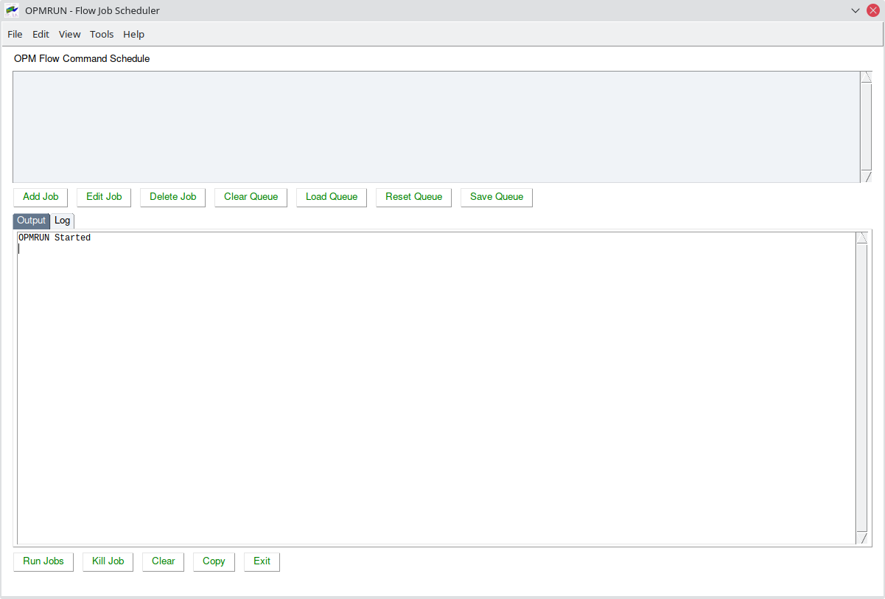


Upon launch the program runs OPM Flow to get a list of command line parameters from the current version of OPM Flow. These default parameters can be edited for each case, or alternative default parameter sets can be loaded from an existing parameter file from another job, or a *.PRT file from a completed simulation.

As can be seen in Figure 2.11 the program has upper and lower display elements. The upper element shows a list of simulation jobs that are in the job queue and the lower element consists of two elements, one for the OPM Flow Output (the terminal output from OPM Flow) and a second element (OPM Run Log) that is a session log of the jobs run by OPMRUN. Clicking the OPM Flow Output and OPM Run Log tabs switches the display on the lowered element between two display types.


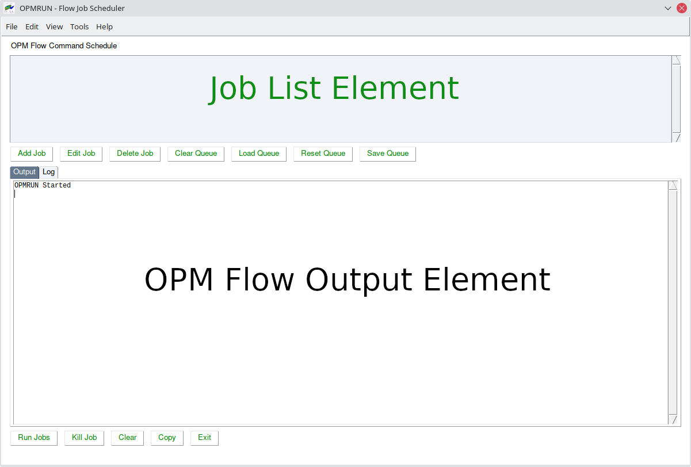

To add jobs to the queue use the Add Job button or load an existing job queue using the Load Queue button.   Jobs can be edited or deleted from the queue using the Edit Job and Delete Job buttons, and a series of jobs can be saved as a job queue by using the Save Queue button. The Clear Queue button deletes all jobs from the queue.

Pressing the Add Job button will display the following dialogue box:


Use the Browse button to select the input file to add to the queue, then select the Run Parameters for this input file, then press the Submit button to add the input file to the job queue.

The Overwrite Parameter File Options allow for different default treatments of existing *.PARAM files, which is particularly useful when adding multiple jobs at the same time. The reason for this is because different versions of OPM Flow have different parameter sets and if a newer version of OPM Flow runs with a previous version’s *.PARAM file then the simulator will stop with an error message for the various invalid parameters for the current version of the simulator.  To load a previously saved job queue, press the Load Queue button this will display a dialog box allowing the user to select a queue file (*.que), after pressing the OK button the jobs will be displayed in the Job List Element as illustrated in Figure 2.13.


Jobs in the queue can be edited by selecting the Edit Job button that will display two options: one to edit the input file using the defined editor and the second to edit the OPM Flow Parameter File.  If the second option is selected OPMRUN will display a dialog box that shows a list of the OPM Flow command line parameters  together with the parameter help information (Figure 2.14). Selecting a parameter from the list and selecting the Edit button will display the setting for the selected parameter (alternatively one can double click the required entry).  One can then edit the parameter as required. Use the Save button to save the change and use the Exit but to save all the changes to the parameter file. The Cancel button will cancel all changes to the parameter file.

Alternatively one can use the:

    - Edit OPM Flow Parameter menu option to edit the parameter file for a job.
    - List OPM Flow Parameters menu option to list the commands in the parameter file for a job.
    - Set OPM Flow Default Parameters to set the default parameters for all subsequent jobs added to the queue. This option allows the user to load a default set of parameters from (1) OPM Flow, (2) an OPM Flow Parameter File, or (3) an OPM Flow print file (*.PRT).

One can also right-click on a job in the Job List Element and select one of the available options.


Selecting the Run Jobs button displays the Select Run Option dialog box shown in Figure 2.15.


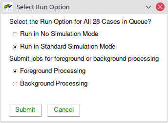


The Run in No Simulation Mode option is equivalent to setting the NOSIM option in the input deck for all jobs in the queue (see see section Error: Reference source not found Error: Reference source not found and the --enable-dry-run command line parameter in Table 2.1 in section 2.2 Running OPM Flow From The Command Line. This allows for checking all the jobs at once.

Selecting Run in Standard Simulation Mode will run all the jobs in the queue sequentially, with the OPM Flow terminal output directed to OPM Flow Output Element, as shown in Figure 2.16. The terminal output is also directed to a *.LOG file as well, similar to what the commercial simulator does.


Clicking the OPM Run Log tab displays the OPMRUN’s session log file that records the time and date of the major events that have occurred, including the start and end times of each run. Notice also how OPMRUN deletes all the existing output files for a given job, if they exists, before running OPM Flow.


The Kill button will ask the user if the current running job should be killed, and if the job is to be killed, the application will prompt as whether or not all the jobs in the queue should be killed.

The Clear clears the OPM Flow Output Element from the currently displayed tab (Output or Log) and the Copy button copies the data to the clipboard.

Finally, an example *.param file generated by OPMRUN for the 2022-10 release is shown below and on the following pages for reference:


```
#
# OPMRUN Parameter File
#
# File Name   : "/media/Fields/Norne/Model/NOR-BASE-A00.param"
# Created By  : opmuser
# Date Created: 2022-11-01 13:12:44
#
accelerator-mode="none"
allow-distributed-wells=false
alternative-well-rate-init=true
bda-device-id=0
continue-on-convergence-error=false
cpr-max-ell-iter=20
cpr-reuse-interval=10
cpr-reuse-setup=3
dbhp-max-rel=1
dp-max-rel=0.3
ds-max=0.2
dwell-fraction-max=0.2
ecl-deck-file-name="NOR-BASE-A00.DATA"
ecl-enable-drift-compensation=true
ecl-output-double-precision=false
ecl-output-interval=-1
ecl-strict-parsing=false
edge-weights-method=1
enable-adaptive-time-stepping=true
enable-async-ecl-output=true
enable-async-vtk-output=true
enable-dry-run="auto"
enable-ecl-output=true
enable-esmry=false
enable-logging-fallout-warning=false
enable-opm-rst-file=false
enable-storage-cache=true
enable-terminal-output=true
enable-tuning=false
enable-vtk-output=false
enable-well-operability-check=true
enable-well-operability-check-iter=false
enable-write-all-solutions=false
force-disable-fluid-in-place-output=false
force-disable-resv-fluid-in-place-output=false
fpga-bitstream=""
full-time-step-initially=false
ignore-keywords=""
ilu-fillin-level=0
ilu-redblack=false
ilu-relaxation=0.9
ilu-reorder-spheres=false
initial-time-step-in-days=1
linear-solver="ilu0"
linear-solver-ignore-convergence-failure=false
linear-solver-max-iter=200
linear-solver-reduction=0.01
linear-solver-require-full-sparsity-pattern=false
linear-solver-restart=40
linear-solver-verbosity=0
matrix-add-well-contributions=false
max-inner-iter-ms-wells=100
max-inner-iter-wells=50
max-newton-iterations-with-inner-well-iterations=8
max-pressure-change-ms-wells=1e+06
max-residual-allowed=1e+07
max-single-precision-days=20
max-temperature-change=5
max-welleq-iter=30
maximum-number-of-well-switches=3
milu-variant="ILU"
min-strict-cnv-iter=0
min-time-step-based-on-newton-iterations=0
min-time-step-before-shutting-problematic-wells-in-days=0.01
newton-max-iterations=20
newton-max-relax=0.5
newton-min-iterations=1
newton-relaxation-type="dampen"
opencl-ilu-parallel=true
opencl-platform-id=0
output-dir=""
output-interval=1
output-mode="all"
owner-cells-first=true
parameter-file=""
pri-var-oscilation-threshold=1e-05
print-parameters=2
print-properties=2
project-saturations=false
regularization-factor-wells=100
relaxed-max-pv-fraction=0.03
relaxed-pressure-tol-msw=10000
relaxed-well-flow-tol=0.001
scale-linear-system=false
sched-restart=false
serial-partitioning=false
shut-unsolvable-wells=true
solve-welleq-initially=true
solver-continue-on-convergence-failure=false
solver-growth-factor=2
solver-max-growth=3
solver-max-restarts=10
solver-max-time-step-in-days=365
solver-min-time-step=1e-12
solver-restart-factor=0.33
solver-verbosity=1
strict-inner-iter-wells=40
strict-outer-iter-wells=6
temperature-max=1e+09
temperature-min=0
threads-per-process=-1
time-step-after-event-in-days=-1
time-step-control="pid+newtoniteration"
time-step-control-decay-damping-factor=1
time-step-control-decay-rate=0.75
time-step-control-file-name="timesteps"
time-step-control-growth-damping-factor=3.2
time-step-control-growth-rate=1.25
time-step-control-target-iterations=30
time-step-control-target-newton-iterations=8
time-step-control-tolerance=0.1
time-step-verbosity=1
tolerance-cnv=0.01
tolerance-cnv-relaxed=1
tolerance-mb=1e-06
tolerance-pressure-ms-wells=1000
tolerance-well-control=1e-07
tolerance-wells=0.0001
update-equations-scaling=false
use-gmres=false
use-multisegment-well=true
use-update-stabilization=true
zoltan-imbalance-tol=1.1
#
# End of Parameter File

```

In the above example, all the default parameters have be used.

In addition to the functionality described in this section, the application has various additional features accessible through the application’s menus including:

    - Configuring OPMRUN various options, default editor, default terminal console for background jobs, setting default project directories, etc.
    - Various additional simulation input generation and conversion utilities are available including:

      - Compressing a job to save space (DATA, and all OPM Flow output files) and uncompressing previously compressed jobs.
      - Keywords, a keyword generator based on the Apache Velocity Template Language (“VTL”). The templates can therefore also be used with any editor that supports VTL, jEdit for example. There is one template per keyword, with the formatting the same as the OPM Flow manual. Over 450 templates are currently implemented. One can also customize the existing templates as well as creating User defined templates. The keywords are examples, one still has to edit the resulting deck with the actual required data, but the format with comments should make this a straight forward process.
      - A Production Schedule application that takes a comma delimited CSV file containing historical production and injection data and converts the data to an OPM Flow SCHEDULE file using the WCONHIST series of keywords. Currently only production data is supported.
      - Sensitivities application that generates sensitivity cases based on a "Base" case file. The Base file contains "Factors" (variable names), $X01, $X02, etc., that are substituted with user defined values using the data entered and the type of Sensitivity Scenario selected.
      - A Well Specification application that uses the standard well export files from OPM ResInsight to reformat the data in a more user-friendly manner for the WELSPECS and COMPDAT keywords. Optionally, the application can generate the COMPLUMP keyword based on the OPM ResInsight layers file, with one completion per defined reservoir layer.
      - Calling OPM ResInsight and loading the currently selected job into OPM ResInsight for viewing.
      - A Well Trajectory Conversion application that converts a Schlumberger Petrel exported well trajectory file into an OPM ResInsight file, containing all the wells.

All the aforementioned options and tools are described in detail in Error: Reference source not foundError: Reference source not found,


| Note OPMRUN can be run as either a Linux or a Windows application. If the software is installed and run under Windows, then the program automatically handles the file naming conventions of the two operating systems. That is under Windows, the application uses the Windows file name to select the files, and then automatically converts the file name to the equivalent Linux file name to run under WSL. |
| --- |


## Improving Simulator Convergence and Numerical Performance

In general, most simulator performance issues are caused by the data used by the simulator, rather than the numerical algorithms used to solve the equations presented in sections  Error: Reference source not found Error: Reference source not found through Error: Reference source not found Error: Reference source not found. Thus, it is important to verify all warning messages and to address the issues raised by these warnings. Naturally, some warnings can be safely ignored, while others should not.  Just because the simulator runs with warning messages does not mean that the results are reasonable, or that numerical performance has not been impacted.


This section is therefore broken into two parts, the first part discusses potential data errors and how to address them, and the second section outlines the numerical controls available to improve the simulator's performance.  The latter should only be done after the data quality issues have been rectified, although, it is not uncommon for users to skip the data quality step altogether, and jump to "tuning" the model's numerical controls - to be clear, skipping the data quality step is strongly not recommended.


### Data Quality and Assurance


#### GRID Section

Grid Configuration

In full field models grid distortions may occur due to faulting and the structural complexity of the geological model, and ideally one wishes to have all the cells to be orthogonal. Grid cells are orthogonal if all grid lines intersect at a right angles, that is at 90o. This is because orthogonal grids offer significant advantages in solving a system of partial differential equations used computational fluid dynamics.  In addition, they ensure that the fluid flow is not being unduly influenced by the grid orientation effects, as cell to cell flow only occurs across connected cell faces.

Most earth modeling software can produce a histogram of the cell angles as an aide to checking the orthogonality of the grid.  A common cause for cells not being orthogonal, as well as creating other grid artifacts, is the grid cells following actual the faulting traces, as oppose to using "zig-zag" fault traces that follow the grid. A typical fault trace grid is illustrated in Figure 2.18.

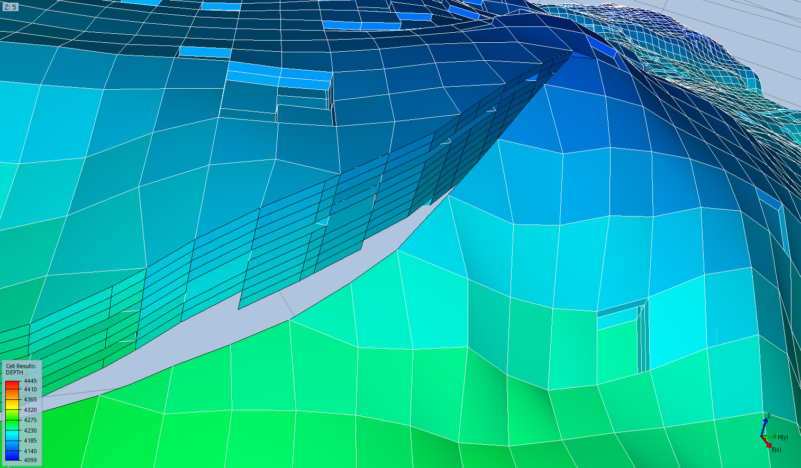


Notice in Figure 2.18 how the cells along the fault plane are severely distorted, with some cells having only three faces instead of four in the x-y plane. Now compare this to the Norne model shown in Figure 2.19, which has more complex faulting, and yet the grid along the fault planes is mainly orthogonal.


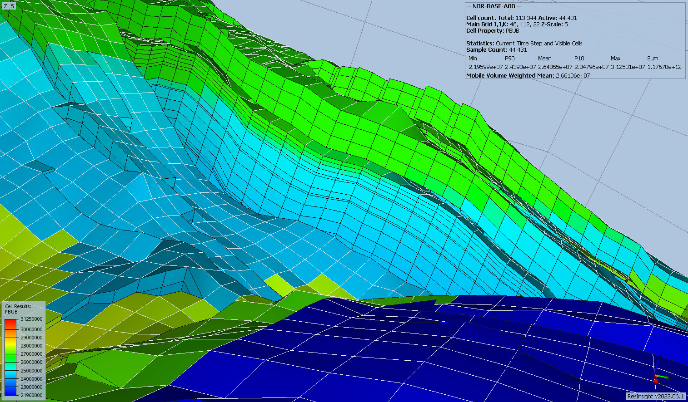

Grid Property Data and Active Cells

There is a current trend in the industry for not applying cut-offs to the petrophysical parameters used to generate the grid property data (porosity, net-to-gross, etc.).  The philosophy behind this approach is that the simulator should determine what is reservoir and is capable of contributing to flow within the reservoir, and  what is non-reservoir.  At first glance this would appear reasonable, but unfortunately the inclusion of low pore volume and low permeability grid cells will have a dramatic negative impact on the model's numerical convergence and run times.  This is because one ends up with many more active cells than otherwise, plus the fact that low pore volumes grid blocks will be connected to high pore volume cells. Because of this inter-connectedness,  a change in a large pore volume grid block will have disproportional change on a low pore volume cell, which will result in smaller time step sizes in order to satisfy the numerical controls. [The large pore volume differences make the solution of the linear system of equations more challenging, due to the residual errors in     certain grid cells or areas within the grid, that are much harder to reduce with iterative solvers. This results in more convergence failures, smaller time steps, etc. Similarly, for highly varying cell sizes.] That is, the low pore volume cell throughput will influence the simulator's selected time step size disproportionately.

Nevertheless, even if the more conventional approach to the model build is undertaken by applying some form of petrophysical cut-offs, there may well still be grid blocks containing small pore volumes. In this case the MINPV keyword in the GRID section can be used to set a minimum pore volume threshold in which cells below the threshold value will be automatically made inactive.  It is not possible to give absolute guidance for a suitable pore volume value to be used with MINPV, the best approach is to run some sensitivities to investigate the impact of different pore volume thresholds on the reduction in the number of cells and the consequent change in the fluid in-place volumes. One should also be mindful not to remove thin high permeability cells that have small pore volumes due to their size, as this will effect the model's flow behavior.

Finally, if the PINCH keyword in the GRID section is also in the input deck, then one must be cognizant of the interaction between the two keywords.

Grid Coarsening

As the number of active grid blocks directly effect a model's run time, reducing the number of active cells by coarsening areas of model that are of secondary importance, can be beneficial to the overall run time of a model. An example of where this approach should be considered is the modeling of aquifers. It is not necessary to fully model an aquifer, by having the model cells cover the whole area of the aquifer. Instead, incorporating either analytical aquifers via the  Error: Reference source not found and Error: Reference source not found keywords, or numerical aquifers using the Error: Reference source not found keyword, can effectively re-produce the aquifer response.  Both types of aquifers have advantages and disadvantages.

Analytical aquifers have the advantage that their response and behavior can be matched by using material balance techniques to quantify the aquifer properties, by history matching the measured pressure response in the hydrocarbon zones. This is an efficient analytical modeling work flow to identify the aquifer response, the properties derived can therefore be more or less directly incorporated into the dynamic model. The dis-advantage is that analytical aquifers are not directly comparable with geological interpretations, which may, or may not, be important, depending upon the circumstances.

The opposite is true for numerical aquifers in that an approximate aquifer volume and property data can be matched with current geological interpretation, but cannot be history matched in most material balance software, as numerical aquifers in general are not supported.

Nevertheless, no mater which type of aquifer is employed, they should not be directly connected to hydrocarbon bearing cells, ideally there should be between three to five water bearing cells between the aquifer connected cells and the hydrocarbon cells. However, the water cells may vary in size, such that water cells connected to the hydrocarbon zone are of similar size, and then increase in size towards the edge of the model. The reason for this is that we wish to limit "small" hydrocarbon cells being directly coupled to "large" water cells,  that will hinder the length of time steps selected by the simulator due to the convergence criteria.


Grid Isolated Cells

Simulation models should only include grid blocks that influence the flow and recovery in the model. One common issue with some of the geo-statistical formulations used to generate the grid and the associated grid property data, is the tendency to create isolated grid blocks. These isolated grid blocks are not connected to the rest of the model and therefore do not influence the behavior of the model. Figure 2.20 shows a typical example, with the cells circled in red being the isolated cells.


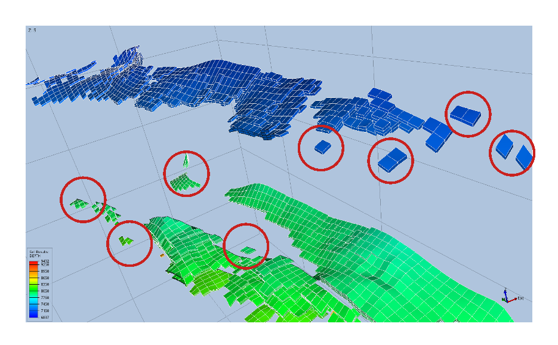

Unfortunately, these cells will be included in all the calculations, and may cause numerical issues due to their unchanging state, both pressure and saturation. They will also unnecessarily add to the active cell count, and therefore effect the simulation run time. In addition, they will give a false impression of the average reservoir pressure, as the isolated cell pressures will remain at initial conditions throughout the simulation run. If model convergence is proving difficult, then this may be a potential cause of the problem. In any case, it is recommended that the identified isolated cells be removed by making them inactive via the ACTNUM keyword in the GRID section.

If there are only a few isolated cells then they can manually be made inactive; however, in many cases this not possible due to the number of isolated grid blocks. In this case, it is better to revert back to the static model   and fix the issue in the earth modeling software. Indeed, if there are numerous isolated grid blocks this may be indicative that an inappropriate approach has been used to generate the static model, although it may be also due to the depositional environment as well.


#### PROPS Section

This section describes potential issues associated with the property data and is split into two separate sub-sections:

    - The first sub-section covers the rock properties, and in particular the saturation functions (relative permeability curves), that can have a dramatic impact on reservoir performance, especially for the non-linear solver. As will be shown later, it is important that the derivatives of the relative permeability curves are smooth and monotonically increasing or decreasing depending on the phase of the relative permeability fluid. Particular care must be taken if end-point scaling is being used, as it is not uncommon for the resulting de-normalized curves to be inappropriate, even though the normalized curves are reasonable and correct.
    - The second sub-section addresses issues that may arise with the fluid properties, and inconsistent PVT data that may result in the simulation struggling to converge in the linear solver.

PROPS Section:  Saturation Function (Derivative)

In general, one should not enter laboratory derived relative permeability data directly into the simulator. This is because it is dubious that laboratory measurements on 1½ inch core plugs can represent the flow in 100 x 100 x 1.0 m grid cell in the model. There are various upscaling techniques that can account for the scaling issue, using various forms of relative permeability curves, including the laboratory curves, piston-like curves and thickness average curves etc. However, the resulting pseudo relative permeability curves tend to not have smooth derivatives, which will have a detrimental impact on convergence efficiency. Thus, it is common practice to use the laboratory derived curves, either in an upscaling workflow or as part of the input workflow, and to fit a Corey17 type curve to the "rock" curves in order to smooth out any discontinuities.

Unfortunately, neither OPM Flow nor the commercial simulator, unlike some other simulators, support the direct entry of Corey type curves; however, OPM Flow does support the more advanced and flexible LET family of models instead. See section Error: Reference source not foundError: Reference source not found and Lomeland et al [Lomeland F., Ebeltoft E. and Thomas W.H., 2005. A New Versatile Relative Permeability Correlation. Paper SCA2005-32 presented at the International Symposium of the Society of Core Analysts held in Toronto, Canada, 21-25 August, 2005.] for further information on the model, as well as the Error: Reference source not found,  Error: Reference source not found,  and the Error: Reference source not found keywords in the PROPS section.

Corey [Corey,  A. T. : “The Interrelation Between gas and Oil Relative Permeabilities”, Production  Mon., 19. 38. (1954).] combined the work of Purcell [Purcell, W. R., “Capillary Pressures- Their Measurement Using Mercury and the Calculation of Permeability Therefrom”, Transactions AIME, 186,  39 (1949).] and Burdine [Burdine, N. T., “Relative Permeability Calculations from Pore Size Distribution Data”, Transactions AIME, 198,  71 (1953).] that was widely accepted for its simplicity.  His original equations were developed for the drainage cycle in water-wet sandstones, but have also been used in carbonate formations.  Corey's original water-oil equations were as follows:


| $$ {k}_{\mathit{ro}} ({S}_{w}) = {\left[\frac{1 - {S}_{w }}{1 - {S}_{\mathit{wcr} }}\right]}^{{n}_{o}} $$ | (2.1) |
| --- | --- |


| $$ {k}_{\mathit{rw}} ({S}_{w}) = {\left[\frac{{S}_{w} - {S}_{\mathit{wcr} }}{1 - {S}_{\mathit{wcr} }}\right]}^{{n}_{w}} $$ | (2.2) |
| --- | --- |

where:

kro(Sw) 	= relative permeability to oil,

krw(Sw) 	= relative permeability to water,

no	= Corey oil exponent, set to four in the original paper,

nw	= Corey water exponent, set to four in the original paper,

Sw 	= water saturation, and

Swcr 	= critical water saturation.


The denominator in equations (2.1) and (2.2) scales the water saturation to the mobile water phase. There are several forms of these equations, with the most common normalizing the saturation over the mobile hydrocarbon phase,  as depicted in equations (2.3) and (2.4).


| $$ {k}_{\mathit{ro}} ({S}_{w}) = {k}_{\mathit{row}}{\left[\frac{1 - {S}_{w} - {S}_{\mathit{orw}}}{1 - {S}_{\mathit{orw}} - {S}_{\mathit{wcr}}}\right]}^{{n}_{o}} $$ | (2.3) |
| --- | --- |


| $$ {k}_{\mathit{rw}} ({S}_{w}) = {k}_{\mathit{rww}}{\left[\frac{{S}_{w} - {S}_{\mathit{wc}}}{1 - {S}_{\mathit{orw}} - {S}_{\mathit{wcr}}}\right]}^{{n}_{w}} $$ | (2.4) |
| --- | --- |

where:

krow		= 	maximum oil relative permeability at Swc,

krw		= 	maximum water relative permeability st Sorw,

Swcr		=	critical water saturation, and

Sorw 		= 	residual oil saturation under a water flood (SOWCR).


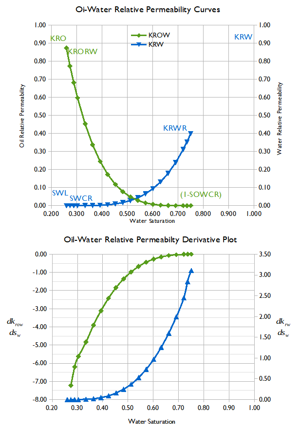

Figure 2.21 shows a typical Corey plot, with the plot at the top of the figure showing the Corey plot and the bottom plot showing the derivative plot, the data is also tabulated in Table 2.2. Notice in Figure 2.21 that the water curve does not extend to 100% water saturation, this is an error as the water below the oil-water contact would have restrictive water flow.


| Oil-Water Saturation Function and Derivative Table |  |  |  |  |  |  |
| --- | --- | --- | --- | --- | --- | --- |
| Sw | Krw | Krow | Pcow (psia) | $$ \frac{{\mathit{dk}}_{\mathit{rw}}}{{\mathit{dS}}_{w}} $$ | $$ \frac{{\mathit{dk}}_{\mathit{row}}}{{\mathit{dS}}_{w}} $$ | $$ \frac{{\mathit{dP}}_{\mathit{cow}}}{{\mathit{dS}}_{w}} $$ |
| 0.2600 | 0.0000 | 0.8750 | 16.4040 | 0.00 | 0.00 | 0.00 |
| 0.2740 | 0.0000 | 0.7737 | 13.4170 | 0.00 | -7.23 | -213.13 |
| 0.2889 | 0.0000 | 0.6814 | 11.0910 | 0.00 | -6.20 | -156.36 |
| 0.3038 | 0.0000 | 0.5976 | 9.2570 | 0.00 | -5.63 | -123.34 |
| 0.3335 | 0.0002 | 0.4535 | 6.6120 | 0.01 | -4.84 | -88.90 |
| 0.3633 | 0.0008 | 0.3372 | 4.8610 | 0.02 | -3.91 | -58.87 |
| 0.3930 | 0.0022 | 0.2448 | 3.6610 | 0.05 | -3.11 | -40.33 |
| 0.4228 | 0.0049 | 0.1728 | 2.8150 | 0.09 | -2.42 | -28.44 |
| 0.4525 | 0.0096 | 0.1181 | 2.2030 | 0.16 | -1.84 | -20.55 |
| 0.4823 | 0.0171 | 0.0775 | 1.7520 | 0.25 | -1.36 | -15.18 |
| 0.5120 | 0.0282 | 0.0484 | 1.4120 | 0.37 | -0.98 | -11.42 |
| 0.5418 | 0.0440 | 0.0283 | 1.1520 | 0.53 | -0.67 | -8.74 |
| 0.5715 | 0.0656 | 0.0153 | 0.9500 | 0.73 | -0.44 | -6.78 |
| 0.6013 | 0.0944 | 0.0074 | 0.7920 | 0.97 | -0.27 | -5.34 |
| 0.6310 | 0.1318 | 0.0030 | 0.6650 | 1.26 | -0.15 | -4.25 |
| 0.6608 | 0.1793 | 0.0010 | 0.5640 | 1.60 | -0.07 | -3.42 |
| 0.6905 | 0.2386 | 0.0002 | 0.4810 | 1.99 | -0.03 | -2.78 |
| 0.7203 | 0.3115 | 0.0000 | 0.4130 | 2.45 | -0.01 | -2.28 |
| 0.7351 | 0.3537 | 0.0000 | 0.3840 | 2.84 | 0.00 | -1.97 |
| 0.7500 | 0.4000 | 0.0000 | 0.3570 | 3.11 | 0.00 | -1.80 |
| 1.0000 | 0.9000 | 0.0000 | 0.1270 | 2.00 | 0.00 | -0.92 |

*Table 2.2: Oil-Water Saturation Function and Derivative Table*

If we correct the data shown in Figure 2.21 by extending the water curve to KRW, then we obtain the result shown in Figure 2.22, but notice what has happened to the water derivative plot, which now has a discontinuity because of the extension. Thus, small changes to the relative permeability curves can have an undue influence on the simulator's performance. In this particular case, the effect is minor as it is only one point that has the issue, but it is not uncommon to have multiple discontinuities in numerous curves that will have an impact on convergence.


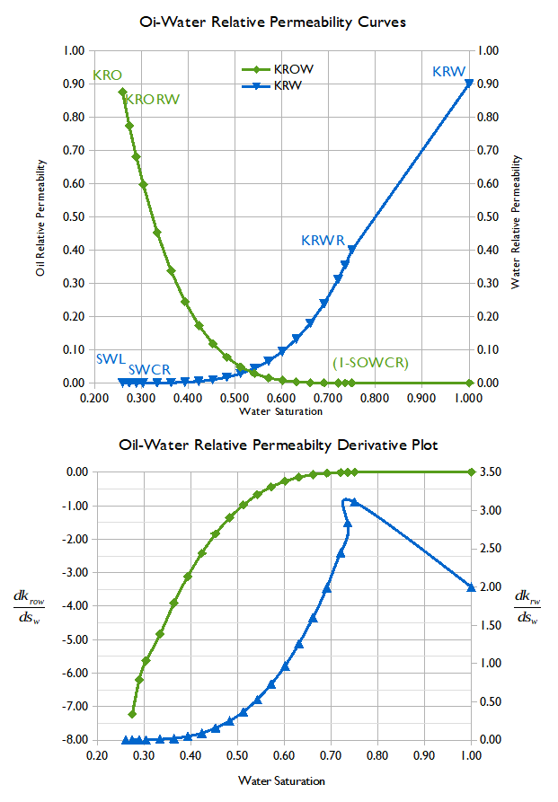


To summarize, if convergence is an issue verify that both the entered relative permeability data and capillary pressure do not have numerous discontinuities in the derivative plots.

The next section discusses the impact and relationship of lowest saturation and critical saturation, in terms of pressure depletion. However, again, care should be taken to avoid any potential discontinuities in the derivatives between these to data points.

PROPS Section:  Saturation Function (Lowest Saturation and Critical Saturation)

In most cases, time step chops caused by saturation changes may be reduced by avoiding having the lowest  and critical saturations be the same. For example for the water phase, this would mean having different values for SWL and SWCR. The reason for this due to the compressibility difference between the gas and liquids (oil and water), as illustrated Figure 2.23. Here we assume that initially 80% of cell's volume of 100 m3 is occupied by gas and the remaining 20% by water.

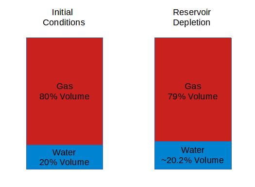


Assuming there is no flow in or out of the grid block and the cell pressure decreases due to production elsewhere in the model, that results in a small reduction (1.0%) in the cell's pore volume. And since gas is much more compressible than oil and water, then the gas volume will decrease by approximately 1.0%; whereas the water will increase slightly to approximately 20.2% [Assuming that the initial pore volume of the grid block was 100 m3, then a 1.0% reduction would result in a pore volume 99 m3, and 20 m3 of water in 99 m3 pore volume results in 20.2% of the grid block being occupied by water.]. Thus, if SWL was set to 20%, then the 0.2% increase in water saturation would become mobile and start to flow to the other connect grid blocks.  This can be a cause of instability.

The solution is to enter values for SWL and SWCR, such that there is a small difference between them, around 2% to 5% for example, instead of this:


```
--
--       WATER RELATIVE PERMEABILITY TABLES (SWFN)
--
SWFN
--       SWAT       KRW        PCOW
--       FRAC       FRAC       PSIA
--       --------   --------   -------
          0.30      0.0000     0.6190
          0.35      0.0005     0.3891
          0.40      0.0028     0.2279
          0.50      0.0237     0.0602
          0.60      0.0931     0.0077
          0.80      0.5000     0.0000
          0.90      0.7000     0.0000
          1.00      0.9000     0.0000                      / TABLE NO. 1

```

Amend the table as follows:


```
--
--       WATER RELATIVE PERMEABILITY TABLES (SWFN)
--
SWFN
--       SWAT       KRW        PCOW
--       FRAC       FRAC       PSIA
--       --------   --------   -------
          0.30      0.0000     0.6190
          0.31      0.0000     1*
          0.35      0.0005     0.3891
          0.40      0.0028     0.2279
          0.50      0.0237     0.0602
          0.60      0.0931     0.0077
          0.80      0.5000     0.0000
          0.90      0.7000     0.0000
          1.00      0.9000     0.0000                      / TABLE NO. 1

```

The incorporation of the row for Sw equal to 0.31 should assist convergence and will not influence the oil in-place, although it will slightly reduce the water mobility between the water saturations of 0.30 and 0.31. Secondly, as one can see from Table 2.3 the additional water saturation value did not cause any derivative discontinuities.


| Oil-Water Saturation Function and Derivative Table |  |  |  |  |  |  |
| --- | --- | --- | --- | --- | --- | --- |
| Sw | Krw | Krow | Pcow (psia) | $$ \frac{{\mathit{dk}}_{\mathit{rw}}}{{\mathit{dS}}_{w}} $$ | $$ \frac{{\mathit{dk}}_{\mathit{row}}}{{\mathit{dS}}_{w}} $$ | $$ \frac{{\mathit{dP}}_{\mathit{cow}}}{{\mathit{dS}}_{w}} $$ |
| 0.30 | 0.0000 | 0.6190 | 9.7247 |  |  |  |
| 0.31 | 0.0000 | 0.5918 | 9.1501 | 0.00 | -5.44 | -114.92 |
| 0.35 | 0.0005 | 0.3891 | 5.6425 | 0.01 | -4.50 | -77.95 |
| 0.40 | 0.0028 | 0.2279 | 3.4623 | 0.05 | -3.22 | -43.60 |
| 0.50 | 0.0237 | 0.0602 | 1.5494 | 0.21 | -1.68 | -19.13 |
| 0.60 | 0.0931 | 0.0077 | 0.7989 | 0.69 | -0.52 | -7.50 |
| 0.80 | 0.5000 | 0.0000 | 0.3110 | 2.03 | -0.04 | -2.44 |
| 0.90 | 0.7000 | 0.0000 | 0.2190 | 2.00 | 0.00 | -0.92 |
| 1.00 | 0.9000 | 0.0000 | 0.1270 | 2.00 | 0.00 | -0.92 |

*Table 2.3:  Oil-Water Saturation Function and Derivative Table (Modified)*


Note also that same approach can also be applied to the oil phase.


PROPS Section: Saturation Table End-point Scaling

The end-point scaling functionality in OPM Flow gives tremendous flexibility, allowing one to use a limited set of relative permeability functions by accounting for rock property variation, such that each cell in the model has its own relative permeability function. However, both the original (normalized) input functions and the grid cell’s scaled (or de-noramlized) functions should be checked for consistency. In general, it is best to input the original curves as standardized curves that have distinct end-points, rather than fully normalized curves, in the classical sense. The reason for this is shown in Figure 2.24 and Figure 2.25.


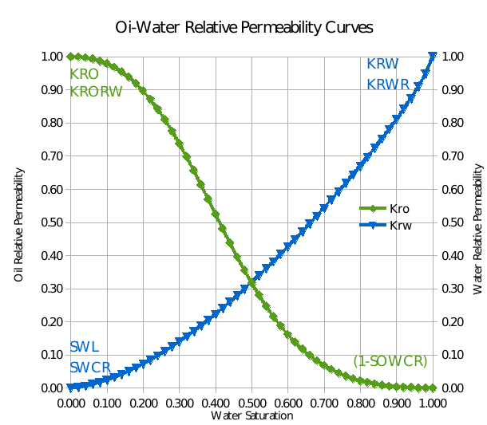


Notice how the distinction between KRO and KRORW is no longer present in the normalized curve in Figure 2.25, and similarly for KRW and KRWR, and SWL and SWCR. Thus, the simulator will ignore one of each pair of end-points - this can lead to unexpected results for the de-normalized grid cell based saturation functions. An example is shown in Figure 2.26 for a gas-water saturation table. Notice how the de-normalized end-point water relative permeability, KRW, is only 0.20 versus 1.00 for the normalized value of KRW.

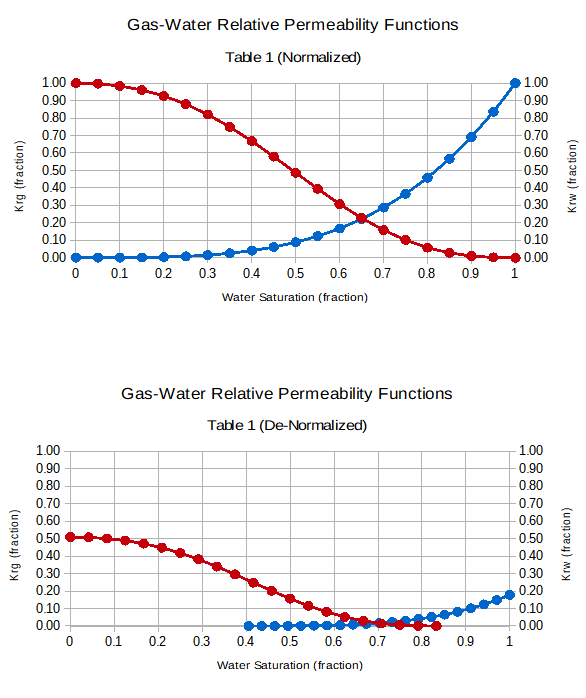


Consequently, water influx will be inhibited leading to unreliable results in terms of water production, and potentially gas production if aquifers are present in the model.

As mentioned previously, entering a correct original curve that is not normalized will automatically resolve these type of issues. If a normalized curve is entered, then ensure that simulator can distinguish between SWL and SWCR etc., based on the variable definitions provided in Error: Reference source not found, Error: Reference source not found and Error: Reference source not found.

Finally, see the SCALCERS keyword in the PROPS section, that defines the options used in the re-scaling process, including the options for two point and three point scaling. Whatever option is selected, always verify that the de-normalized curves that will be used in the model are correct and reasonable.


PROPS Section: Fluid Properties

It is important that the fluid properties are consistent to avoid convergence issues, and thus the simulator performs a series of validation checks to ensure that data is consistent. The following example indicates the oil formation volume factor is is not monotonically increasing for increasing GOR.


```
--
--       OIL PVT TABLE FOR LIVE OIL
--
PVTO
--       RS        PSAT       BO        VISC
--       MSCF/STB  PSIA       RB/STB    CPOISE
--       --------  --------   -------   ------
...............................................
                                                           /  TABLE NO. 43
         0.000    1.010      1.0388000  120924.000
                  2510.0     0.9801748  529773.445         /
         3.909      10.0     1.0563000   45850.000
                  2510.0     0.9969008  200315.440         /
         5.725      20.0     1.0617000   34198.000
                  2510.0     1.0022360  148947.825         /
         6.787      30.0     1.0648000   28808.000
                  2510.0     1.0054019  125083.718         /
         7.540      40.0     1.0671000   25508.000
                  2510.0     1.0078136  110411.450         /
         8.125      50.0     1.0688000   23210.000
                  2510.0     1.0096595  100151.779         /
         9.940     100.0     1.0742000   17312.000
                  2510.0     1.0159689   73535.291         /
        11.002     150.0     1.0774000   14583.000
                  2510.0     1.0202071   60960.876         /
        11.756     200.0     1.0797000   12912.000
                  2510.0     1.0235993   53105.652         /
        12.340     250.0     1.0814000   11749.000
                  2510.0     1.0264272   47530.728         /
        12.818     300.0     1.0829000   10877.000
                  2510.0     1.0290688   43270.164         /
        13.221     350.0     1.0841000   10191.000
                  2510.0     1.0314284   39854.509         /
        13.571     400.0     1.0851000    9631.000
                  2510.0     1.0336002   37015.563         /
        13.880     450.0     1.0861000    9163.000
                  2510.0     1.0357743   34599.472         /
        14.156     500.0     1.0869000    8763.000
                  2510.0     1.0377596   32498.634         /
        14.405     550.0     1.0877000    8417.000
                  2510.0     1.0397467   30648.326         /
        14.633     600.0     1.0884000    8113.000
                  2510.0     1.0416399   28994.746         /
        14.843     650.0     1.0890000    7843.000
                  2510.0     1.0434389   27501.353         /
        15.037     700.0     1.0896000    7601.000
                  2510.0     1.0452393   26140.639         /
        17.800    2500.0     1.0222000    4436.000
                  2510.0     1.0219701    4495.778         /
                                                           / TABLE NO. 44
```

The data is displayed above and the offending entries are shown in bold. These type of PVT warning messages are important and should be addressed before continuing with the simulation run.


#### SOLUTION Section: Initialization

The first quality control check that should be performed once the model has been initialized, is to check that the pressure distribution matches the observed data, this is especially important when there are multiple stacked reservoirs in different hydraulic pressures zones, as per the likes of the oil and gas fields in the Malay Basin and the deep water fields in Indonesia and the Gulf of Mexico. One effective way to do this is to plot the initial pressure data versus depth from exploration wells, and compared this to the equivalent model pressures at the same depth, as shown in Figure 2.27.  Here the measured data is from the RFT [Repeat Formation Tester (RFT) tool is an open hole device which is an updated version of the Formation Interval Tester (FIT), both of which are run on wire line. Both tools take multiple pressure readings (at various depths) thus enabling a pressure depth profile to be obtained from the formation, and, in addition, they can also take fluid samples from the formation. The latest tool available is the Modular Formation Dynamics Tester (MDT), which, as its name suggests, is a modular tool that can be assembled in different configurations depending on what are the objectives for running the tool. Thus, the term RFT measurements applies to all tools that measure a pressure profiles versus depth (RFT/FIT/MDT etc.).] ("Repeat Formation Tester") tool that measures the observed pressure profile in the open-hole well bore.

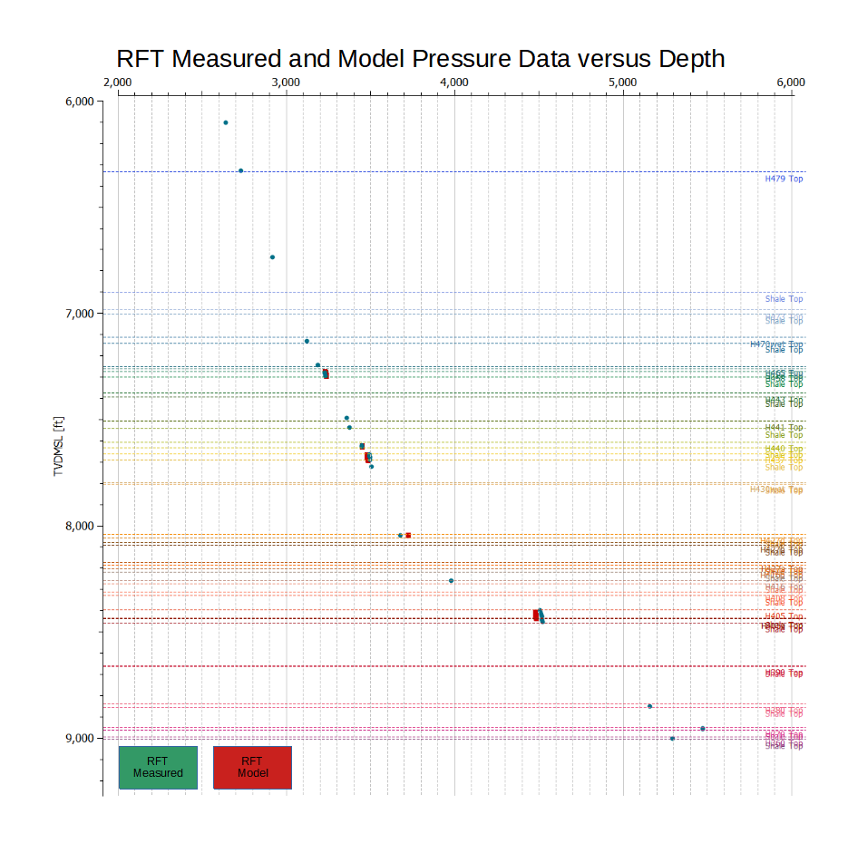


Figure 2.27 was created in OPM ResInsight, and shows good agreement between the two data sets. This type of plot is commonly constructed when assessing the history matching field performance, but is also useful in verifying the initial pressure distribution. Note that for simple models with only a few reservoir zones, then this plot can be replaced by simply checking the three dimensional pressure distribution.

If the SWATINIT keyword in the PROPS section is used to initialize the model by setting each grid block’s initial water saturation (“Sw”), then OPM Flow will re-scale the water-oil capillary pressure curves entered via the SWFN saturation functions in the PROPS section, so that the resulting initialized Sw matches the values in the SWATINIT array.

Normally the SWATINIT array is generated in the static earth model when calculating the hydrocarbons in-place volumes using a Saturation Height Functions (“SHF”) derived from capillary pressure functions. Static earth models do not directly use capillary pressure in these type of calculations as individual cell pressures are not available. There is therefore some potential for inconsistencies to arise between the two sets of formulations.  This is normally manifested by extreme scaling in the scaled capillary pressure values calculated by the simulator.  These large scaled capillary pressures values can result in numerical issues, and should be addressed, by verifying that the SHF used in the earth model to derive the SWATINIT array and the unscaled capillary pressure values on the SWFN keyword are consistent. Note in general, the scaled capillary pressure values calculated by the simulator, should be roughly in the same range as the entered unscaled data, as shown in Figure 2.28 for the Norne field.

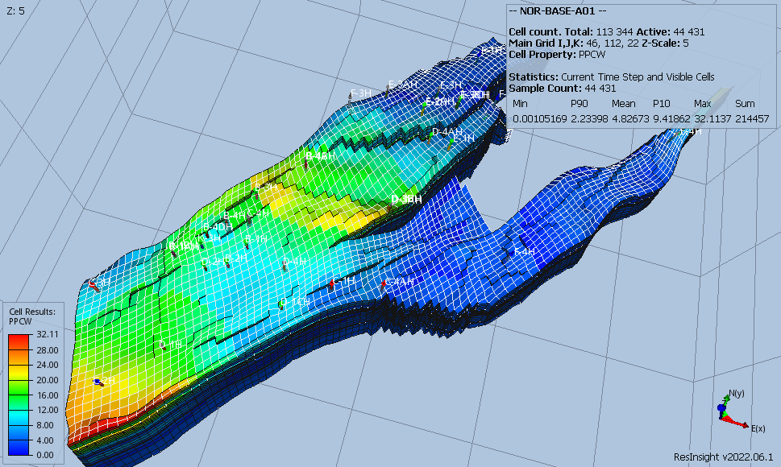


Note that although the PPCWMAX keyword can be used to set a maximum scaled capillary pressure value, a more technically sound approach is to resolve these inconsistencies before continuing with the model build.

Once a model is built and can be initialized, it is good practice to run the model with no production for several years to ensure that the initialization is stable.  Under these circumstances, there should be no fluid movement, or only very limited movement, and the pressure should remain stable, that is constant, although a small drift may be observable.  An example for the Norne model is shown in Figure 2.29 on the field level, although it can, and should be performed on a region by region basis if the model is not stable.

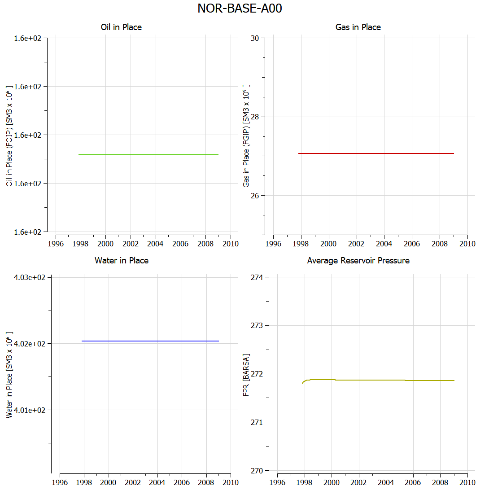


Potential causes for the instability are:


    - Aquifer Not in Equilibrium with the Connected Hydrocarbon Zones. One can check for this by switching off all the aquifer connections and see if the instability is still present. If this corrects the issue then verify the aquifer connections by reviewing the AQUIFERA array in the *.INIT file in OPM ResInsight. OPM Flow writes out the AQUIFERA value as 2(AQUID-1) for cells connected to aquifer AQUID. If a cell is connected to multiple analytical aquifers then AQUIFERA is summed for all aquifers connected to a cell. Note that connecting cells to multiple aquifers should be avoided.


Note aquifers should only be connected to grid blocks containing 100% water, or at the very least any hydrocarbons in the connected cells should be immobile.


    - Different PVT Regions in Communication. Recall that fluid proprieties are associated with a grid cell, so if two different PVT regions are in communication, then a m3 of fluid from PVT region one flowing into PVT region two, will automatically assume the properties of PVT region two. This creates a material balance error that will result in numerical difficulties.  One may be able to identify this by reviewing the inter-region flows to identify the source of the problem, either via the *.PRT file or the summary file out. It typically occurs across fault planes, when one PVT region butts against a different PVT region along the fault face.


There are several solutions to this, firstly, one can set the transmissibility along the fault plane to zero using the MULTFLT keyword in the GRID or EDIT sections.


Secondly, create a MULTNUM array based on the PVTNUM array, as the PVTNUM keyword is not available in the GRID and EDIT sections. Then use the MULTREGT keyword with MULTNUM array in the GRID or EDIT sections to set the transmissibility between the offending regions to zero.


Finally, one can use the THPRES keyword in the SOLUTION section combined with the EQLNUM array to isolate the offending regions. Normally, but not always, the PVTNUM and EQLNUM arrays are identical, if not, then it is relatively easy to copy the aforementioned MULTNUM array to the EQLNUM array, then add the additional equilibration data to the EQUIL keyword. One advantage of this option is that it will cater for the scenario when the PVT regions are initially isolated, but after a certain production period, the faults break down and there is communication between the two regions. In this scenario, one still has the material balance error as different fluids inter-mix. If this is the case then the API Tracking option should be used to account for this behavior. See the API keyword in the RUNSPEC on how to activate this option.


    - Different Equilibration Regions in Communication. This is similar to (2) above and the remedies are also similar, so the solution is not repeated here.


    - PVT Data Not Consistent with Equilibration Data. In an oil-gas system the saturation pressure, that is the bubble-point pressure should be the pressure at the GOC, and similarly for the dew point. Conveniently, OPM ResInsight can produce a plot, as depicted in Figure 2.30. The figure illustrates that gas dew point pressure gradient (shown in red), and the oil bubble-point pressure gradient (shown in green) from the PVT data intersect at the GOC, which matches the initial pressure profile (shown in blue) from the grid cells. Thus, confirming the consistency of the two data sets.

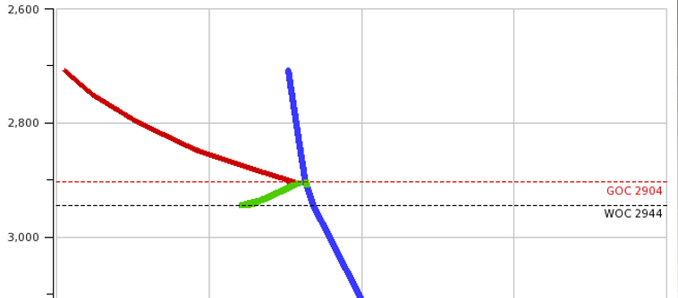


#### SCHEDULE Section

A common issue in most simulation models that employ Vertical Lift Performance ("VLP") tables to relate a well's Tubing Head Pressure ("THP") to its Bottom-Hole Pressure ("BHP"), is the consistency of the data. Note that this is not just limited to wells, but also the network pipelines, that describe the pressure drop between the inlet node and the outlet node.


| Warning: VFPPROD table 39 has 5 non-monotonic points of BHP(THP) In /media/OPM/Fields/Norne/Model/INCLUDE/VFP/B3H.Ecl line 68 This may cause convergence issues due to switching between BHP and THP control. |
| --- |

Generally, the cause of this warning is because the VFP tables have been generated with too much fidelity or resolution. Users often consider that having more detailed and higher resolution VFP tables will give more accurate results. This is not always the case and in this particular example, may very well end up causing the wells using this particular VFP table to oscillate between control modes. Figure 2.31 shows the VFP header section of the offending table, that declares the values used to generate the table.

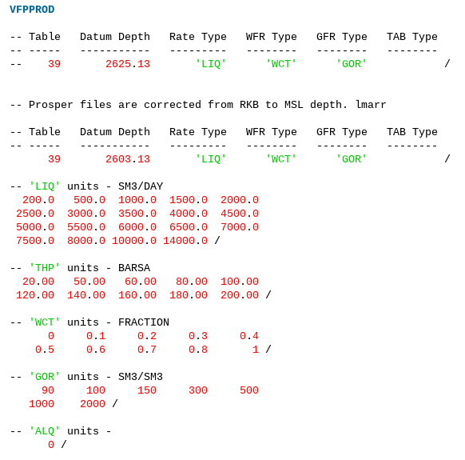


At first glance this looks reasonable, but the problem is that the variables (LIQ,  THP,  WCT and GOR) are at a too high resolution, which causes some of the resulting curves to cross, due to the numerical accuracy when generating the curves. In addition, note that the maximum water cut is defined as 100%, which is unlikely to occur in practice, perhaps 98% would be more appropriate as the maximum value. OPM ResInsight is able to load VFPPROD and VFPINJ tables and to plot the data. Here, Figure 2.32 shows a plot of BHP versus THP with the various water cut values represented by the individual curves.  The figure clearly illustrates the crossing of the water cut line of 80% over the 70% water cut curve, as well as the issue with the 100% water cut curve.


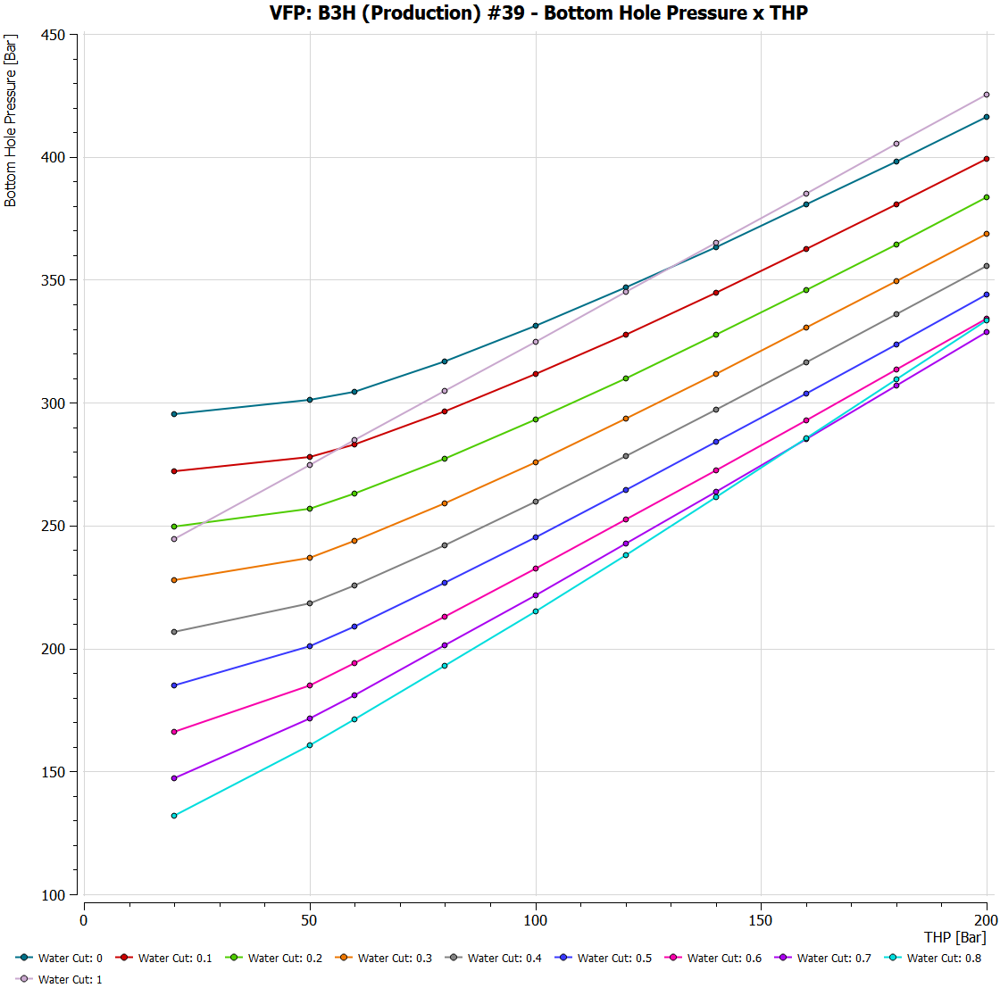


The solution is to re-generate the offending VFP tables using a coarser set of variable values. The Petroleum Experts' PROSPER [IPM Prosper Version 16.5 User Manual - November 2020, Petroleum Experts, Edinburgh, Scotland (www.petex.com).] program, as well as other nodal analysis software programs used to generate VFP tables for simulators, have options to generate the parameters based on the number of entries, and the minimum and maximum values for a variable, combined with various interval spacing options. Keeping the same range and selecting four or five entries and using the geometric spacing option normally resolves this type of issue.  The simulator will then interpolate the coarser curves and avoid any issues with crossing curves.  Note that it is important to ensure that the variable ranges cover the full range of values expected to occur during the simulation, as extrapolation, unlike interpolation of the curves, is more prone to be problematic.

Note that this warning message can be safely ignored:


| Warning: LIQ preferred phase not supported for well OP-01, using OIL instead |
| --- |

as it refers to the reference phase in a well's productivity index calculation. This is because OPM Flow only currently supports OIL, GAS and WATER well type fluids, as defined by the WELSPECS(TYPE) parameter in the SCHEDULE section, i.e., liquid (LIQ) is not supported. For producing, wells this mostly matters if one plots the WPI summary vector (productivity index for well's preferred phase). In the current treatment WPI will not have contributions from the water phase if the declared preferred phase is LIQ. Thus, if history matching a well's actual productivity index, this should be done on one of the recognized fluid well types. For injection wells the preferred phase defined by the WELSPECS keyword does not matter,  since the preferred phase is (typically) reset to the injected phase via the WCONINJE or WCONINJH keywords.


### Convergence and Numerical Performance

Given that all the potential issues with the input data have been successfully resolved, there may still be   problems with convergence and numerical performance, due to the nature of the problem the simulator is trying to solve.  In Figure 2.33, at first glance, the non-linear iterations would appear to be reasonable, ranging from one to four, combined with linear iterations averaging around ten per time step. However, the time steps are very small resulting in nearly 12,500 Newton iterations and over 60,000 linear iterations in the commercial simulator, for this relatively simple problem. In fact, at the time of the study [Christie, M. A., and M. J. Blunt. "Tenth SPE Comparative Solution Project: A Comparison of Upscaling Techniques." SPE Res Eval & Eng 4 (2001): 308–317. doi: https://doi.org/10.2118/72469-PA.], the commercial simulator was unable to complete this simulation. Re-running the model with the latest version of the commercial simulator (Figure 2.33), still gives incorrect results compared to the published data.

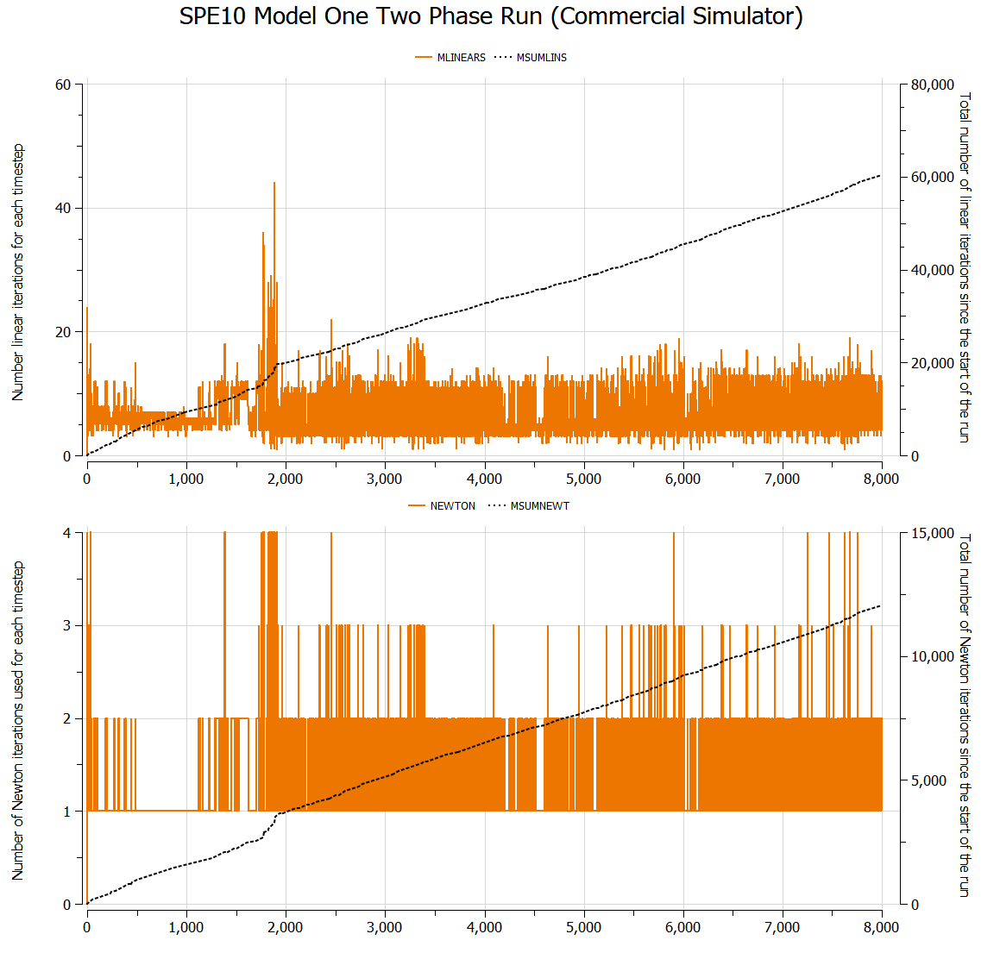


Fortunately, there are several ways to remedy poor performance, including:


    - The simplest and common approach is to manually restrict the time step size to reduce the number of time steps chops. Time step chops occurs when the simulator fails to converge at a given time step (tn+1), and therefore restarts at the last successful time step (tn) and advances to the next time step using a smaller time step size (∆tn+1) than before (∆tn.). This was the approach used for the example in Figure 2.33, which although the model now runs, the results are incorrect.
    - Alternatively, one can change the numerical controls for the Newton-Raphson (“Newton” or non-linear solver) iteration, by changing the minimum and/or maximum number of Newton iterations. Although in general this may resolve some time step chops it can also result in a significant increase in run times, and should therefore be used with caution.
    - The last option is to change the numerical parameters for the linear solver, which is generally preferable to modifying the Newton iteration parameters. OPM Flow contains various options in terms of the type of linear solver and the linear solver preconditioner to be employed, in addition to various standard linear solver parameters employed by the commercial simulator (minimum,  maximum number of iterations etc.).


For example, Figure 2.34 illustrates the impact of selecting the more appropriate numerical controls. Here, the number of Newton iterations are greatly reduced to around 2,500 at the expense of increasing the number of linear iterations from ~60,000 to over 100,000.  More importantly, the simulator results are correct, in that they are close to the published oil, gas, and pressure values23.


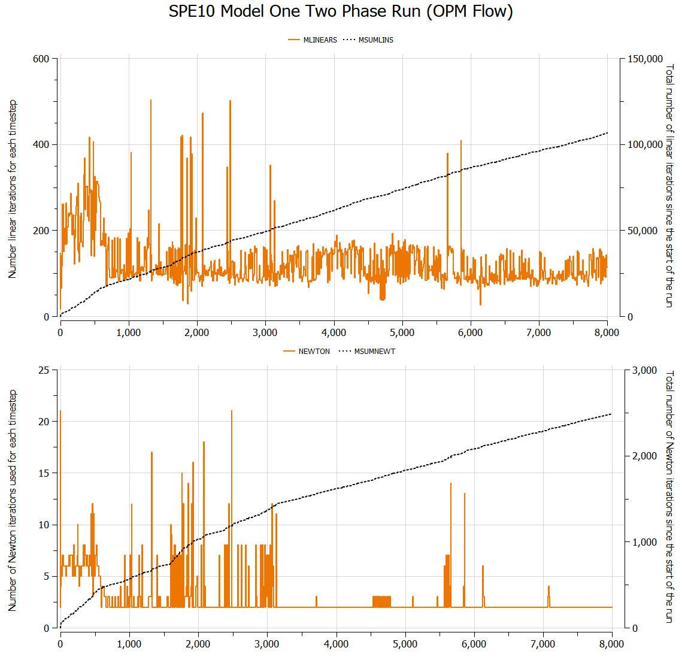

Note that the simulator has various other numerical performance parameters than can use used to identify the cause for under performance.


| Note To obtain the numerical performance data, the easiest way is to add the PERFORMA keyword in the SUMMARY section, that enables the writing out of a series of performance keywords to the summary file, which can then be plotted in OPM ResInsight as per Figure 2.33 and Figure 2.34. |
| --- |


In addition to the aforementioned PERFORMA keyword in the SUMMARY section, which is available for both OPM Flow and the commercial simulator,  OPM Flow has two additional numerical performance reports that may help in identifying numerical issues.  Both of these OPM Flow specific reports tabulate the numerical performance data available in the print file, in an easily readable format.

The first is the INFOSTEP report illustrated in Figure 2.35, which summarizes the numerical performance for each time step. The Assembly, LSetup, LSolve, LocSol, Update and Output header columns represent the time in seconds taken to complete the particular work item.


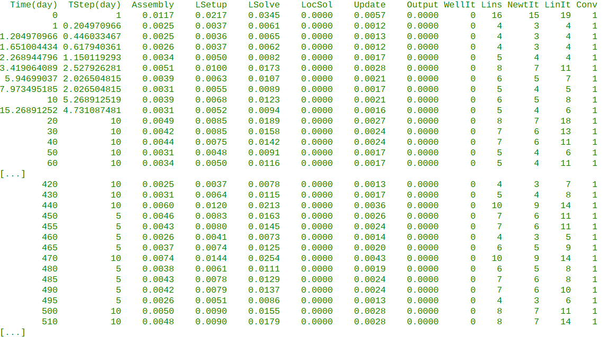


Here, the Assembly column represents the time taken to assemble the equations, LSetup is the time taken to setup the linear solver equations, LSolve is the linear solver time, LocSol is the local solver time, Update is the time taken in updating the results, and Output is the time used for writing out the results, that is the output to the print, debug, summary, and restart files.

The WellIt, Lins, NewtIt, and LinIt column headers represent the number of iterations used to complete the time step for a given work item. Thus for time step one, the number of well iterations was zero (WellIt), the number of times the linear equations were setup was 16 (Lins), the number of Newton iterations used to complete the time step was 15 (NewIt), and the total number of linear iterations to completed the time step was 19 (LinIt). The last column, Conv, indicates if the time step had successfully converged given the current convergence criteria, with a one indicating success and a zero indicating a failure.

By default the report is not generated to maintain compatibility with commercial simulator.  To generate the  report one can use the --output-extra-convergence-info command line parameter, for instance:


```
			flow --output-extra-convergence-info="steps" CASENAME
```


will write the report to the CASENAME.INFOSTEP file in the same directory as the other output files.

The second report, INFOITER, contains more detailed information by reporting the numerical performance per iteration, as can be seen in Figure 2.36.


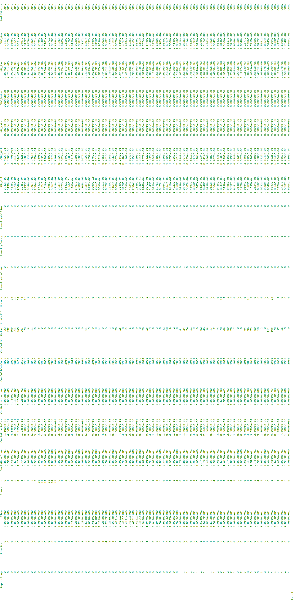

Here, the Iteration column contains the number of Newton iterations, same as the NewIt column in the INFOSTEP report. Note that adding one to the values in the Iteration column gives the number of times the linear equations were setup. Columns starting CnvPvFrac give the fractions of the pore volume that have converged under the standard convergence criteria, have converged under the relaxed convergence criteria, and have not converged. Similarly, columns starting CnvCellCnt give the number of cells that have converged under the standard convergence criteria, have converged under the relaxed convergence criteria, and have not converged. Columns starting Penalty indicate the penalty values for non-convergence, distance decay, and large well residuals. Columns containing MB indicate a phase's normalized material balance error, and columns containing CNV show a phase's normalized residual error. The last column, WelllStatus, indicates if the iteration converged (CONV) or failed (FAIL).

Like the INFOSTEP report, the INFOITER report by default is not generated in order to maintain compatibility with commercial simulator. To generate the report one can use the --output-extra-convergence-info command line parameter, for instance:


```
			flow --output-extra-convergence-info="iterations" CASENAME
```

will write the report to the CASENAME.INFOITER file in the same directory as the other output files.  Finally to generate both reports use the following command line option.


```
			flow –output-extra-convergence-info="steps,iterations" CASENAME
```

The following sections now attempt to give some guidance on how to use the numerical controls to resolve the simulator's performance, assuming that all the issues with the input data have been successfully resolved.


### Time Step Control Guidance

Figure 2.37 illustrates how the simulator advances from the start of the simulation to the end, and shows two user defined report steps, each containing two simulator selected time steps. Each time step within a report time step contains one to three Newton iterations, and each Newton iteration contains a various number of linear iterations.

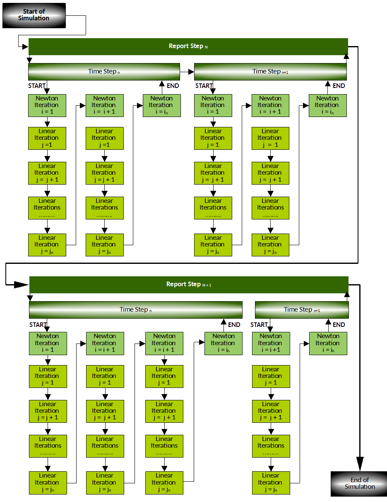


In an actual model the number of time steps are determined by the simulator's internal adaptive time stepping algorithm, combined with any user settings overriding the internal stepping algorithm and parameters.  The default initial time step of one day can be overwritten via either the command line parameter:


```
--initial-time-step-in-days
```


or via the Error: Reference source not found keyword in the SCHEDULE section, that offers more flexibility, as   the initial time step size can be reset at various report time steps, by repeating the keyword and setting TUNING(TSINIT) to a given value. Alternatively, TUNING(TSMINZ) may be used to define the minimum length of all time steps. Note, however, the simulator only reads some of the parameters from the TUNING keyword if, and only if, the following command line parameter has been set equal to true:


```
--enable-tuning=true
```


One can also set the maximum time step size via both the command line parameter:


```
--solver-max-time-step-in-days
```


or via the TUNING(TSMAXZ) parameter,  that defines the maximum length of the next time step following TUNING(TSINIT).

There are many other time stepping command line parameters, including those that are equivalent to all the first record parameters on the TUNING keyword; however, provided there are no data inconsistencies within the input deck, resetting the maximum time step size from the default value of 365 days may improve numerical performance. Typically the default value of 365 days is not binding, as the report time steps are more restrictive. So for example, in a history matching model, the production data is normally entered on a monthly basis, so the maximum report time step size would be 31 days.  Even so, time step chops may still occur even in this scenario, and therefore reducing the maximum time step to half a month, that is 16 days may avoid time step chops.  Sixteen days is preferred over 15 days as the maximum time step, because it enables only two successful time steps to complete a 31 day month (a 16 day plus a 15 day time step).  If 15 days was used for the maximum time step size, then one would need three successful time steps to complete a 31 day month. In some cases using 11, or even a five day maximum time step may increase computational efficiency by avoiding expensive computational time step chops.

Basically, one has to balance the maximum length of time steps with the required number of time steps to reach the end of the run, versus the total elapsed time [Elapsed real time, real time, wall-clock time, or wall time is the actual time taken from the start of a simulation to the end. In other words, it is the difference between the time at which the simulation finishes and the time at which the simulation started.]. Time steps chops are computationally expensive and thus should therefore be minimized in order to reduce run times.

Figure 2.38 shows a typical report step and time step report from the simulator that contains two time step chops shown in the red outline boxes. At the start of the report:

    - The simulation has advanced to 00:00:00 on October 9th, 1967 at report step 15 (Current Step) out of 33 steps (End Step) and after an elasped time of 250 days out of a total of 2000 days needed to complete the run.
    - As requested, the simulator writes out a restart record at report step 15, that is October 9th, 1967.
    - The simulator attempts to advance the simulation from October 9th, 1967 by taking a time step of 50 days, as determined by the internal adaptive time stepping algorithm. If successful, this would advance the simulator from the current report step 15 at an elapsed time of 250 days to the next report step 16 at an elapsed time of 300 days.
    - However, the time step fails due to a Numerical problem encountered, that is either the non-linear or linear solver failed to convergence within the maximum number of iterations.  Thus, the time step was chopped from 50 days to 16.5 days.
    - The simulator restarts again from report step 15, that is October 9th, 1967 and attempts to advance 16.5 days to October 25th, 1967. If successful, this would advance the simulator by 16.5 days from the current elapsed time of 250 days towards the next report step at 300 days.
    - The 16.5 day time step converges in three Newton iterations using a total of 342 linear iterations, and the simulator has successfully advanced to October 25th, 1967.
    - The simulator then attempts to advance 33.5 days, but again fails due to a Numerical problem encountered, that is either the non-linear or the linear solver again failed to convergence within the maximum number of iterations.  Thus, the time step was chopped form 33.5 days to 11.055 days.
    - The simulator restarts again from the last successful time step, that is October 25th, 1967 and attempts to advance to November 5th, 1967. The 11.055 day time step converges in three Newton iterations using a total of 317 linear iteration, and the simulator has advanced to November 5th, 1967.
    - The simulator's internal adaptive time stepping algorithm has determined that the next time step should be 22.445 days to coincide with the next report time step (report step 16) at November 28th, 1967. Again, the 22.445 day time step is successful and converges in three Newton iteration using a total of 318 linear iterations.
    - The simulation has now advanced to 00:00:00 on November 28th, 1967 at report step 16 (Current Step) out of 33 steps (End Step) and after an elasped time of 300 days out of a total of 2000 days needed to complete the run.

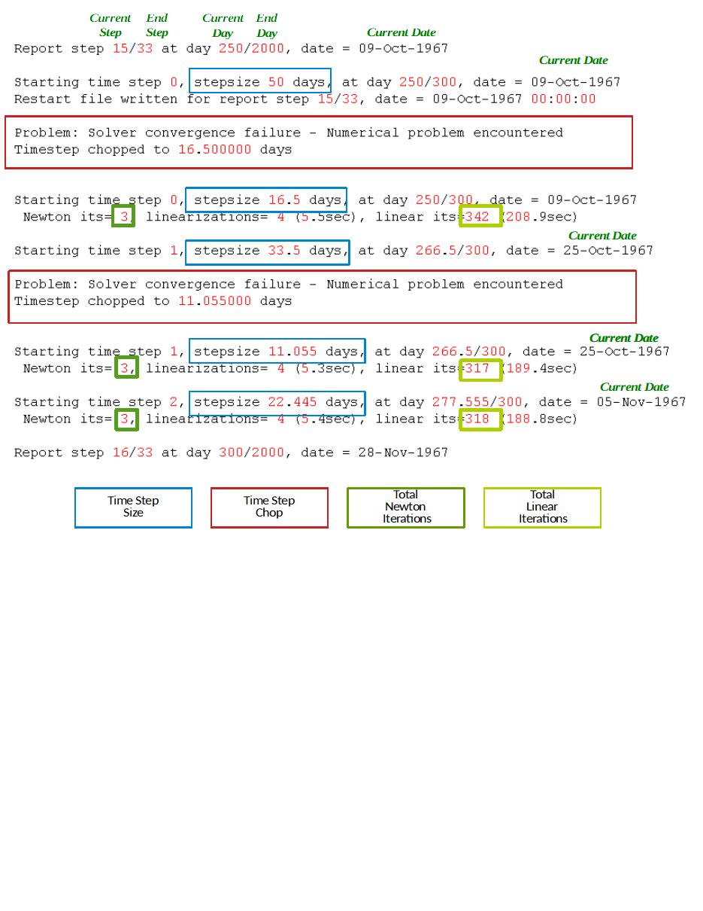


If the maximum time step was set to 16 days then advancing 50 days to November 28th, 1967 would take four time steps with a good chance of avoiding time step chops and thus reducing run times.

Various command line parameters can be used to control the behavior of the time stepping algorithm, as summarized in the Table 2.4, that lists the important time stepping control parameters for the simulator, including the TUNING equivalent parameters where applicable.


| Major Solver Time Stepping Controls |  |  |  |
| --- | --- | --- | --- |
| No. | Command Line Parameter | TUNING Keyword Equivalent | Description |
| 1 | --initial-time-step-in-days | TSINIT | A real positive value. Set the size of the initial time step in days. The default value is one day. Note that as the TUNING keyword can be entered multiple times, then TUNING(TSINIT) can be reset multiple times, whereas as --initial-time-step-in-days, is only set once at the beginning of the run. |
| 2 | --solver-growth-factor | TSDIFF | A real positive value. Set the growth factor a time step can be increased by when recovering from one or more time step chops, subject to the maximum allowable time step size set by the --solver-max-time-step-in-days parameter. For example, if the current time step has converged at 5 days after a time step chop,  and --solver-growth-factor is set to the default value of 2.0, then the next time step will be 2.0 * 5 days, that is at 10 days. |
| 3 | --solver-max-growth | TSFMAX | A real positive value. Set the maximum growth factor a time step can be increased by after a report time step, subject to the maximum allowable time step size set by the --solver-max-time-step-in-days parameter. Thus, if the current time step has converged at 5 days after at a report step,  and --solver-max-growth is set to the default value of 3.0, then the next time step will be 3.0 * 5 days, that is at 15 days. |
| 4 | --solver-max-restarts |  | A positive integer. Set the number of allowed consecutive restarts (or time step chops) before the simulation is terminated. Here the default value is 10. TUNING (TSMCHP) sets the minimum length of all chopped time steps. |
| 5 | --solver-max-time-step-in-days | TSMAXZ | A real positive value. Set the maximum allowed time step size in days. The default value of 365 days is rarely used in practise due to the report time steps being more restrictive, although in some specialized models (CO2 long term prediction cases) this may indeed be the upper limit. As mentioned previously, if the time step chops are mostly occuring when the time step size is greater than ∆t, then setting this parameter to a value less than ∆t may reduce the number of time step chops. Provided of cause the value of ∆t is reasonable. |
| 6 | --solver-min-time-step | TSMINZ | A real positive value. Set the minimum size of a time step in days for field and metric units, and hours for laboratory units If a time step cannot converge without getting cut below this time step size the simulator will stop, unless overwritten by the --solver-continue-on-convergence-failure command line parameter (see Table 2.1 for further details). Note if the current time step is smaller than this minimum and has not been subject to a time step chop,  then in some circumstances it may still be accepted due to other numeric controls. |
| 7 | --solver-restart-factor | TSFCNV | A real positive value. Set the time step chop factor of the time step after a convergence failure. For example, if the current non-convergent time step is 30 days and this parameter is set to the default value of 0.33, then the time step will be repeated using 0.33 * 30 days as the time step, that is 9.9 days. |
| Notes: |  |  |  |

*Table 2.4: Major Solver Time Stepping Controls*


| Note OPM Flow also has a series of command line parameters of the form --time-step* that are subordinate to the --solver* series of command line parameters.  The former, --time-step*, are used to select the time step control algorithm and associated parameters, and in general should only be used by users with appropriate experience. |
| --- |


As mentioned above, the --time-step* series of command line parameters should in general not be used; however, the following parameter may be useful if group and well events are resulting in time step chops:


```
--time-step-after-event-in-days
```


If the simulation is running smoothly with monthly historical report time steps, except when a new well is bought on stream in a given month, or a group control is reset resulting in a significant change in production or injection, and the event causes time step chops, then using --time-step-after-event-in-days may improve the situation. The parameter can be used to automatically enforce a small time step when an event occurs, thus reducing the probability, or even eliminating a time step chop. Typically, a one or five day time step is used, as per:


```
--time-step-after-event-in-days=5.0
```


The drawback is that the control is applied to the complete run, which again needs to be taken into consideration.

Alternatively, one could use the NEXT or NEXTSTEP keywords in the SCHEDULE section, to incorporate similar behavior at specific times in the SCHEDULE section. See Error: Reference source not found or Error: Reference source not found for further information.


### Newton-Raphson Solver Iteration Controls (Non-Linear Iterations)

Figure 2.39 shows typical time step output for two report time steps, March 1st and April 1st, 2022; with both solving the equations with two Newton iterations per time step, and between four to six linear iterations per time step. The numerical count for the number of linearizations is the number of times the Jacobian and the residuals have been constructed, and is generally one more than the number of Newton iterations. Figure 2.39, thus indicates very good performance, especially as the first iteration is taken from the previous successful time step. Note however, that the model is only using five day time steps in this case, which significantly contributes to the convergence stability of both the non-linear and linear solvers.

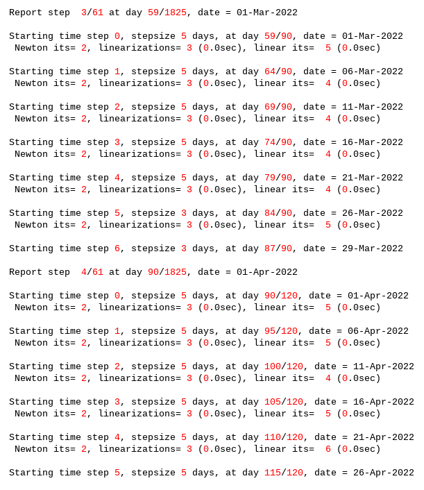


The number of Newton iterations taken to solve a time step is indicative of the degree of ease the simulator has in converging to a solution, with higher numbers of iterations indicating an increasingly difficult problem. Note, unlike Figure 2.39, the number of non-linear iterations will vary as the simulation progresses, with periods of relatively efficient convergence and periods where the simulator is struggling to reach non-linear convergence. The latter is normally associated with operational events, for example new wells being brought on stream, major changes to group controls etc.


| Note As mentioned previously, in general the number of Newton iterations is indicative of the ease of convergence, with one to three iterations indicating that converge was relatively easy and efficient, four to nine iterations indicating an increasingly difficult problem, and greater than ten would tend to suggest that there may be an issue with the model. |
| --- |


It is important to stress that the convergence of the non-linear solver is very dependent on the accuracy of the linear solver. If the accuracy of the linear solver is too relaxed or is not fully converged, the non-linear solver may fail to converge. For example, if the linear solver solution is not sufficiently converged, then the non-linear solution may no longer be well-posed [A problem in differential equations is said to be well-posed if: (1) a solution exists; (2) that the solution is unique; (3) and the solution changes continuously with the changes in the data.]. That is the solution starts digressing from the true solution, and additional iterations only exasperate the problem.  Normally, under these circumstances OPM Flow will chop the time step, which should correct the divergence by reverting to previous converged time step. However, if the time step is too small to chop and the run continues with the minimum time step, then the divergence from the true solution will continue.  This may manifest itself with various error messages and NaNs ("Not a Number"),  or eventually with the simulator aborting. Figure 2.40 shows an example of this behavior.


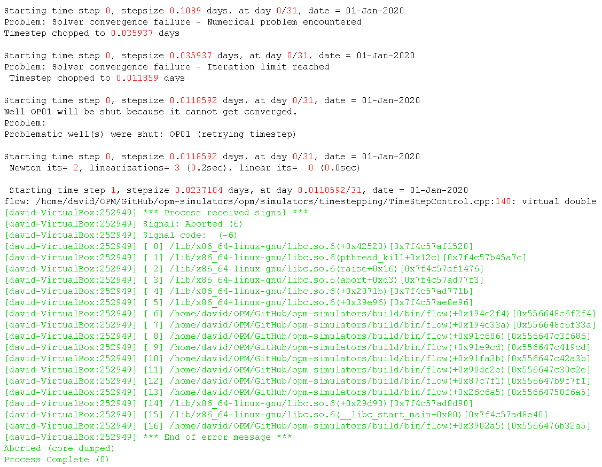


Fortunately, OPM Flow has various controls that can resolve these type of issues similar to the commercial simulator, and in addition, and unlike the commercial simulator, OPM Flow has several linear solvers and preconditioners that increase the likelihood a solution may be found for various non-convergence issues.


$$
R({y}_{n})
$$


| $$ J({y}_{n})\left({y}_{n+1} - {y}_{n}\right) = -R({y}_{n}) $$ | (2.5) |
| --- | --- |

where:

$$
J ({y}_{n})
$$

$$
{y}_{n}
$$

iteration, and

$$
{y}_{n+1}
$$

iteration.


However, as the iterations proceed during a time step the residual convergence criteria is reduced in an effort to avoid a time step chop. Thus, by relaxing the convergence criteria as the non-linear iterations progress, the simulator is attempting to avoid throwing away all the previous work performed in trying to reach a solution for the time step.

From the user prospective, there are several command-line options that can be used to control the Newton-Raphson solver, in particular:

    - To modify the maximum number of non-linear iterations per time step, the following command line parameter can be used:


```
		--newton-max-iterations
```


Although, the default value of 20 is sufficiently large that it should not be necessary to increase this value.

    - There is also a command that sets the minimum number of Newton iterations per time step used by the simulator.


```
		--newton-min-iterations
```


The default value of two ensures that at least two Newton iterations are performed after the previous time step. Increasing this parameter, may help convergence in difficult time steps, by ensuring slightly more accurate results in preceding "easy" time steps.


    - Thirdly, the mass balance error as a reservoir average saturation error, can be use to slackened or tighten the material balance tolerance.


```
										--tolerance-mb

```

In general, if the non-linear solver is having difficulty in converging, then tightening the linear mass balance error as a reservoir average saturation error, may help the non-linear solver converge more rapidly.

    - Fourthly,  maximal local residual error can be slackened or tighten using:


```
										--tolerance-cnv
```


command line parameter. And may be used to set the maximal local residual error.


For completeness, Table 2.5 lists the major non-linear command line parameters used to control the behavior of the non-linear solver, including those that relate to relaxed convergence criteria. In general, it is recommended not to modify these parameters, unless one has the sufficient expertise in this area.


| Major Newton-Raphson Solver Controls |  |  |  |
| --- | --- | --- | --- |
| No. | Command Line Parameter | TUNING Keyword Equivalent | Description |
| 1 | --newton-max-iterations | NEWTMX | A positive integer. Set the maximum number of Newton iterations per time step used by the simulator. The default value is 20 which compares to the commercial simulator's value of 12, so there should not really be a requirement to increase this parameter. |
| 2 | --newton-min-iterations | NEWTMN | A positive integer. Set the minimum number of Newton iterations per time step used by the simulator. The default values for --newton-min-iterations and NEWTMN are 2 and 1, respectively. The value of one ensures that at least one Newton iteration is performed after the previous time step. Increasing this parameter, to say three for example, may help convergence in difficult time steps, by ensuring slightly more accurate results in preceding "easy" time steps. |
| 3 | --newton-max-relax |  | A real value ranging from zero to one. Set the maximum relaxation factor of a Newton iteration used by the simulator. The default is 0.5. In general, it is not recommended to modify this parameter. |
| 4 | --newton-relaxation-type |  | A character string. The type of relaxation used by the Newton method. Valid options are: dampen (default) or sor. In general, it is not recommended to modify this parameter. |
| 5 | --max-newton-iterations-with-inner-welliterations | MXWSIT | A positive integer. Set the maximum Newton iterations with inner well iterations.  The default value is eight, the same as the commercial simulator. If there are issues with well convergence, then sometimes increasing this value, to say 12, may improve the situation. |
| 6 | --min-strict-cnv-iter |  | An integer. Set the minimum number of Newton iterations before relaxed tolerances are used for the CNV convergence criterion. The default value -1 means that relaxed convergence criterion is applied after the initial iteration, that is iteration zero in Figure 2.42 in section 2.4.5 Linear Solver Controls and Options. Increasing this parameter may improve convergence by applying stricter convergence controls over additional Newton iterations, but may also increase the number of Newton iterations over a time step before the time step is accepted. |
| 7 | --tolerance-cnv | TRGCNV | A real positive value. Set the maximum non-linear tolerance error. This is the local convergence tolerance (maximum of local saturation errors). The default value for --tolerance-cnv is 0.01 and for TRGCNV is 0.001. |
| 8 | --tolerance-cnv-relaxed | XXXCNV | A real positive value. Set the maximum non-linear relaxed tolerance error. The default value for --tolerance-cnv-relaxed is 1 and for XXXCNV is 0.01. |
| 9 | --tolerance-mb | TRGMBE | A real positive value. Set the maximum mass balance error, that is the tolerated mass balance error relative to total mass present. The default value is 1.0 x 10-7. |
| 10 | --tolerance-mb-relaxed | XXXMBE | A real positive value. Set the maximum mass balance relaxed error. The default value is 1.0 x 10-6. |
| Notes: |  |  |  |

*Table 2.5: Newton-Raphson Solver Controls*

Detailed descriptions of all of the command line parameters are given in Table 2.1 in section 2.2 Running OPM Flow From The Command Line.


### Linear Solver Controls and Options

There are numerous options for the linear solver, which can be overwhelming even for the most experienced users, given the rich feature set enabled by the various command line parameters. Fortunately, the simulator summarizes the options in use in the Linear Solver Property Tree printed in both the *.PRT and *.DBG files, right after processing the input data and just before the simulation starts.


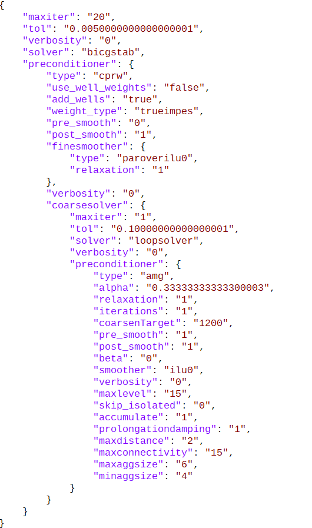

Figure 2.41 above shows an example of the Linear Property Tree, based on using mostly the linear solver default parameters. Here the tol value of 0.005 is equivalent to the --tolerance-cnv command line parameter, and maxiter is equivalent to --linear-solver-max-iter. The key parameters are summarized in Table 2.6. See also [Customizing the Linear Solver in OPM Flow](https://opm-project.org/?page_id=1798).


| No. | Property Tree Parameter | Equivalent Command Line Parameter |
| --- | --- | --- |
| 1 | tol | --tolerance-cnv |
| 2 | maxiter | --linear-solver-max-iter |
| 3 | verbosity | --linear-solver-verbosity |
| 4 | solver | --use-gmres=false |
| 5 | preconditioner |  |
| 6 | type | --linear-solver |
| Notes: |  |  |

*Table 2.6: Linear Solver Property Tree versus Command Line Parameters*


Table 2.7 lists the major linear solver command line parameters discussed in this section.


Figure 2.42 shows typical output for the linear solver for the March 1st report step advancing to the next report step. Naturally, the Newton and linear iteration counts are the same as for Figure 2.39 for the common periods; however, oil, gas, and water material balance values are printed for each non-linear iteration, together with the respective convergence values.


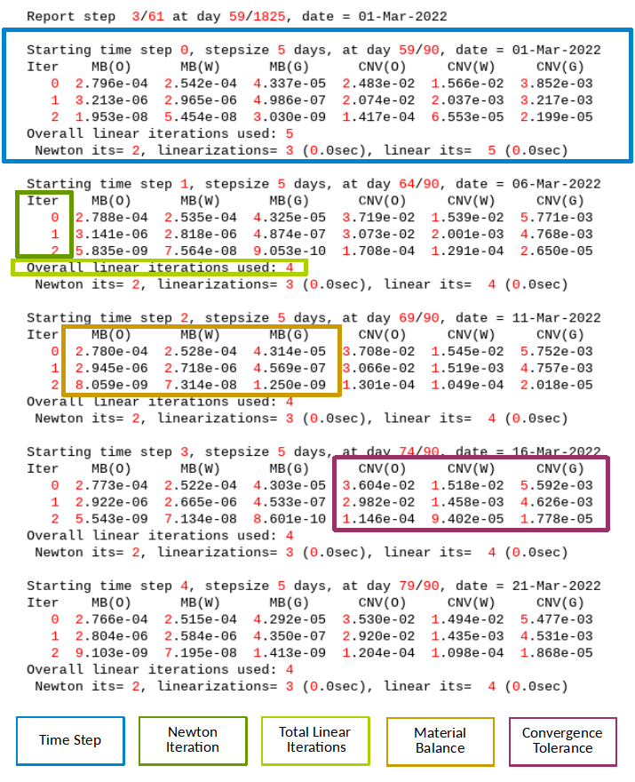

The total number of linear iterations displayed in Figure 2.42 is the total number of iterations for all the non-linear iterations, not for a particular non-linear iteration. To get the number of linear iterations per non-linear iteration use the following command line parameter:


```
--linear-solver-verbosity=1
```


which will produce a report similar to that shown in Figure 2.43, with the IT parameter indicating the number of linear iterations for the given Newton iteration.

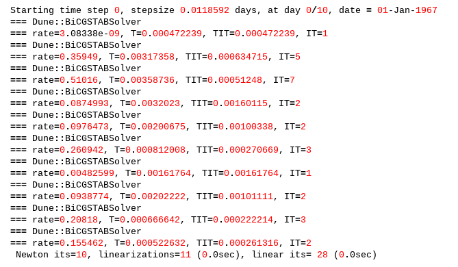


As mentioned previously, the convergence of the non-linear solver is dependent on the accuracy of the linear solvers. Solving the linear system to a loose accuracy may lead to poor convergence of the non-linear solver. The tuning of the time stepping procedure, and the tolerance used in the linear and non-linear solvers are highly related, and optimal choices are case and problem dependent.

From the user prospective, there are several command-line options that can be used to configure and control the linear solver, in particular:

    - Using an alternative linear solver by changing


```
										--use-gmres

```

The default value of false sets the linear solver to the Biconjugate Gradient Stabilized ("BiCGSTAB") linear solver, whereas a value of true will set the linear solver to use the Generalized Minimal Residual linear solver ("GMRES").  If the default linear solver is not converging then changing to the GMRES solver may help. Note, that the GMRES linear solver has a slightly higher memory consumption, as it stores some of the previous search iterations as part of the optimization process. The default number of search iterations stored is 15, which means 14 more vectors than BiCGSTAB solver.

    - Changing the linear solver preconditioner can dramatically improve the performance of the linear solver, which is accomplished by the following command line parameter:


```
										--linear-solver

```

In many cases using the default Constrained Pressure Residual ("CPR") preconditioner, instead of the widely used Incomplete Lower-triangular Upper-triangular factorization with level of fill in 0 ("ILU0"), results in difficult problems being solved at the expense of additional work. For example, model two in the Tenth SPE Comparative Solution Project [Christie, M. A., and M. J. Blunt. "Tenth SPE Comparative Solution Project: A Comparison of Upscaling Techniques." SPE Res Eval & Eng 4 (2001): 308–317. doi: https://doi.org/10.2118/72469-PA.], fails to run using the ILU0 preconditioner, but runs satisfactory with the CPR preconditioner. Note that the commercial simulator also has a CPR option that is implemented via the CPR keyword in the RUNSPEC, but the implementation is different to that of OPM Flow.

    - And finally increasing the number of linear iterations may be appropriate, via:


```
									--linear-solver-max-iter
```


that defines the maximum number of linear iterations. Sometimes increasing this value may improve performance. Note that for the default linear solver CPRW the flag is ignored, but one could set this and additional values using a JSON file, see [Customizing the Linear Solver in OPM Flow](https://opm-project.org/?page_id=1798) for details.


| Major Linear Solver Controls |  |  |  |
| --- | --- | --- | --- |
| No. | Command Line Parameter | TUNING Keyword Equivalent | Description |
| 1 | --linear-solver |  | A defined string. Specify the configuration of the linear solver, valid values are: Option (1) extends the existing Constrained Pressure Residual (“CPR”) preconditioner to include wells. This option can also be invoked via the CPR keyword in the RUNSPEC section; however, the command line parameter takes precedence. For option (10) one enters a character string enclosed in quotes that defines the filename of a JSON configuration file for the flexible linear solver system. In this case the file extension should be ‘.json’. Note that the *.PRT file contains the “Property tree for the linear solver” listing, which is the JSON specification of the current case, and can be used to configure a user specific linear solver JSON file. |
| 2 | --linear-solver-ignore-convergence-failure |  | A boolean value set to true or false. If set to true convergences failures in the linear solver are ignored. This option should be used with care, as the results may be unreliable. |
| 3 | --linear-solver-max-iter | LITMAX | A positive integer value. Set the maximum number of linear iterations. |
| 4 | --linear-solver-reduction |  | A real positive value. Set the minimum reduction of the residual for the linear solver. The linear solver convergences when the residual is reduced sufficiently. In general, it is not recommended to modify this parameter. |
| 5 | --linear-solver-restart |  | A positive integer value. Set the number of iterations after which GMRES is restarted. In general, it is not recommended to modify this parameter. |
| 6 | --use-gmres |  | A boolean value. Use Generalized Minimal Residual (“GMRES”) solver instead of Biconjugate Gradient Stabilized (“BiCGSTAB”) as the linear solver within the Newton iterations. |
| Notes: |  |  |  |

*Table 2.7: Linear Solver Controls*

Again detailed descriptions of all of the command line parameters are given in Table 2.1 in section 2.2 Running OPM Flow From The Command Line.
