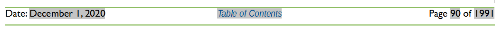
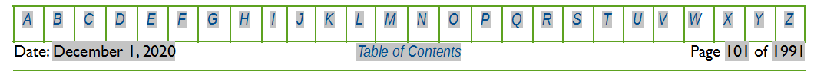
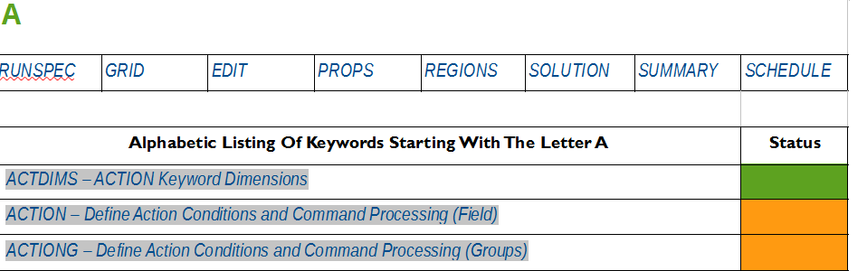

# KEYWORD DOCUMENTATION STRUCTURE


## Introduction

The OPM Flow manual is constructed in a manner to enable the reader to reference various parts of the document by using the table contents or by simply pressing on a link embedded in the text.  This automatic cross referencing has been extensively employed to ensure effective documentation of the keywords used by the simulator.

There are several key features that can be used to navigate the manual in an efficient manner. The first is the “footer” which can be used to move to various sections in the manual. For example, the “Table of Contents” footer shown below:




allows the reader to move to the Table of Contents by clicking on the link (highlighted in italic blue text on a gray background in Figure 3.1). Note also that the entries in the table of contents are also “clickable” enabling the reader to move to the desired entry.

The second type of footer is the “Keyword Index” footer that also contains the Table of Contents link mentioned above. This footer is illustrated in Figure 3.2 and is displayed on a keyword definition page.




Clicking on a letter (highlighted in italic blue text on a gray background in) takes the reader to an alphabetic listing of all the keywords beginning with the selected letter (Figure 3.3).




The list is color coded, so one instantly knows what keywords are implemented, with green colored cells indicating the keyword is available and is mostly or fully implemented. Cells colored orange show that keyword is recognized but not implemented in OPM Flow. Finally, cells colored red mean that keyword is available in the commercial simulator but has not been implemented in OPM Flow, and may cause an error if used in the input deck. Clicking on a keyword in the list will move the reader to the keyword definition. Note also that clicking one of the section names (RUNSPEC, GRID, etc.) in Figure 3.3, will take the reader to the beginning of the selected section.

Finally, in the PDF version of the manual if one displays the "bookmarks" in the PDF reading software one can jump to a particular keyword or section without having to scroll up or down.


## Keyword Definitions

Each keyword is defined in it's own section that contains a section header, that contains the keyword name in capital letters followed by a brief description of the keyword’s function. This is then followed by the Keyword Table Section which defines the status of the keyword and in which sections of the input deck the keyword can be utilized. Table 3.1 illustrates a typical Keyword Table Section defining the keyword status with the various OPM Flow sections.


| RUNSPEC | GRID | EDIT | PROPS | REGIONS | SOLUTION | SUMMARY | SCHEDULE |
| --- | --- | --- | --- | --- | --- | --- | --- |

*Table 3.1: Example Keyword Table Section*


The cells are colored in such a manner as to quickly indicate to the reader the keyword’s section availability and function availability, with green colored cells indicating the keyword is available for this section and is mostly or fully implemented. Cells colored gray indicate that keyword cannot be used in that particular section, and cells colored orange show that the keyword is only partially implemented within OPM Flow, for example OPM Flow may just recognize the keyword and ignore the keyword’s function. Finally, cells colored red mean that the keyword is available in the commercial simulator but has not been implemented in OPM Flow. In this scenario the keyword should not be used in OPM Flow as it will result in unpredictable results, including causing the simulator to abort or throw an exception.


## Multi-Section Keywords

As there are numerous keywords that can be used within multiple OPM Flow sections of the input file, for example the ADD and EQUALS keywords, there is a need to avoid duplication of the keyword definitions but at the same time attempt to define only those keywords for a given section. Thus for multi-section keywords, the keyword is defined in the first available section that the keyword can be found. The Keyword Table Section as shown below for the ADD keyword below, indicates in which sections the keyword can be utilized.


| RUNSPEC | GRID | EDIT | PROPS | REGIONS | SOLUTION | SUMMARY | SCHEDULE |
| --- | --- | --- | --- | --- | --- | --- | --- |

*Table 3.2: ADD Keyword Table Section*


Here the ADD keyword can be used in the GRID, EDIT, PROPS, REGIONS, and SOLUTION sections as indicated by those cells colored green and not for the cells colored in light gray. A full description of the ADD keyword is in the GRID section. In the EDIT, PROPS, REGIONS, and SOLUTION sections there is a brief description of the ADD keyword with a link to the full description, as shown below.

The ADD keyword adds a constant to a specified array or part of an array. The constant can be real or integer depending on the array type; however, the arrays that can be operated on is dependent on which section the ADD keyword is being applied.  See ADD – Add a Constant to a Specified Array in the GRID section for a full description.

A complete list of keywords in alphabetic order is given in APPENDIX A: KEYWORD INDEX - ALPHABETIC LISTING , and clicking on a specific keyword in the appendix will take the reader to the keyword definition in a particular section.


## Keyword Formats

All keywords in OPM Flow should be entered in capital case and start in column one, lowercase entry of keywords will produce errors, and keywords not starting in column one will not be recognized. There are five types of keyword format types used by OPM Flow for data input. The description of the five types is given in the next three sections together with some examples.


### Keyword Format Type – Comment

Comments in the input deck can occur anywhere in the file are preceded by “--” in columns one and two, for example for the EQLDIMS keyword:


```
--
--       MAX     MAX     RSVD    TVDP    TVDP
--       EQLNUM  DEPTH   NODES   TABLE   NODES
EQLDIMS
         9       1*      20      1*      1*                                    /
```


In addition, comments can be place after “/” that terminates a record entry as shown below;


```
--
-- -- ARRAY    CONSTANT --  ---------- BOX ---------
--                          I1  I2   J1  J2   K1  K2
MULTIPLY
   'PERMZ'     0.50000      1*  1*   1*  1*   1*  1* / PERMZ * 0.5
/

```


### Keyword Format Type – Activation

This type of keyword format only consists of the keyword itself and is usually used to invoke a feature or to switch on or off a processing feature. The keyword is documented by describing the functionality or action the keyword performs, followed by an example. Examples of this type of keyword include API (to switch on API tracking), GAS (to activate the gas phase in the model), ECHO (to switching echoing of the input file to the output file), and SKIP (for skipping parts of the input deck).  For example the GAS keyword in the RUNSPEC section would be described as:

Description

This keyword indicate that the gas phase is present in the model and must be used for oil-gas, gas-water, oil-water-gas input decks that contain the gas phase. The keyword will also invoke the data input file checking to ensure that all the required gas phase input parameters are defined in the input deck.

There is no data required for this keyword.

Example


```
--
--       GAS PHASE IS PRESENT IN THE RUN
--
GAS

```

The above example declares that the gas phase is active in the model.


### Keyword Format Type  - Vector (Row Vector)

Vector based keywords consist of the keyword followed by a vector of parameters on a separate line and may consists of multiple lines of vectors with each line representing a data set (see the second example for this type of vector keyword). The vector may contain integer, real, and character parameters depending on the keywords requirements. This type of keyword is documented by describing the functionality or action the keyword performs, a table describing the parameters associated with the keyword, followed by one or two examples on how to use the keyword. For example the DIMENS keyword in the RUNSPEC section would be described as:

Description

DIMENS defines the dimensions of the model entered as integer vector. The keyword can be used with all grid types.


| No. | Name | Description | Default |
| --- | --- | --- | --- |
| 1 | NX | The number of grid blocks in the x direction for Cartesian grids or the number of grid blocks in the r direction for radial grids | None |
| 2 | NY | The number of grid blocks in the y direction for Cartesian grids or the number of grid blocks in the theta direction for radial grids. | None |
| 3 | NZ | The number of grid blocks in the z direction for both Cartesian and radial grids. | None |
| Notes: |  |  |  |

*Table 3.3: DIMENS Keyword Description*


Note that NX, NY, and NZ are not maximum values but the actual size of the grid. OPM Flow applies these parameters when reading in particular data sets. For example if NX, NY, and NZ are set to 10, 10, and 10 respectively, then for the grid property data like PORO; OPM Flow expects to read in 10 x 10 x 10 or 1,000 porosity values for the PORO array.  If the number of porosity values is not equal to 1,000 then OPM Flow will produce an error.


Example


```
--
--       MAX     MAX     MAX
--       NDIVIX  NDIVIY  NDIVIZ
DIMENS
         46      112     22                                                    /

```

The above example defines the dimensions for the Norne model of 36 cells in the x direction, 122 cells in the y direction, and 22 cells in the z direction.


For vector keywords that have parameters associated with units, then there is a slightly different table format from the one used above to take into account documenting the default values for the three sets of units supported by OPM Flow, for example for the ROCK keyword is describe as follows:


Description


ROCK defines the rock compressibility for various regions in the model. The number of ROCK vector data sets is defined by the NTPVT parameter on the TABDIMS keyword in the RUNSPEC section and the allocation of the ROCK tables to different grid blocks in the model is done via the PVTNUM keyword in the REGIONS section. One data set consists of one record or line which is terminated by a “/”.

This keyword must be defined in the OPM Flow input deck.


| No. | Name | Description | Default |
| --- | --- | --- | --- |
| Field | Metric | Laboratory |  |
| 1 | Pref | Pref is a real number defining the reference pressure for the other parameters for this data set. | Default |
| psia 1.032 | barsa 1.032 | atma 1.032 |  |
| 2 | Cf | Cf is a real number defining the rock compressibility at the reference pressure, Cf(Pref) and is defined as: ${C}_{f} = -\frac{1}{V}(\frac{\mathit{dV}}{\mathit{dP}})$ | Defined |
| 1/psia 0.0 | 1/barsa 0.0 | 1/atma 0.0 |  |
| Notes: |  |  |  |

*Table 3.4: ROCK Keyword Description*


Example


The following shows the PVTW keyword for when NTPVT on the TABDIMS keyword in the RUNSPEC section is set to one.


```
--
-- ROCK COMPRESSIBILITY
--
-- (1) REFERENCE PRESSURE IS TAKEN FROM THE HCPV WEIGHTED RESERVOIR PRESSURE
--     AS THE PORV IS ALREADY AT RESERVOIR CONDITIONS (FLOW USES THE REFERENCE
--     PRESSURE) TO CONVERT THE GIVEN PORV TO RESERVOIR CONDITIONS USING THE DATA
--     ON THE ROCK KEYWORD)
--
ROCK
    3566.9    5.0E-06                             / ROCK COMPRESSIBILITY REGION 1
    3966.9    5.5E-06                             / ROCK COMPRESSIBILITY REGION 2
    4566.9    6.0E-06                             / ROCK COMPRESSIBILITY REGION 3
```


There is no terminating “/” for this keyword.


In this case the example shows a multiple data set entry of the vector format keyword, with three ROCK data sets being defined by the keyword.


### Keyword Format Type – Vector (Columnar Vector)

Columnar vector based keywords consist of the keyword followed by a columnar vector of parameters in a separate column for each parameter. The vector may contain integer, real, and character parameters depending on the keywords requirements. This type of keyword is documented by describing the functionality or action the keyword performs, a table describing the parameters associated with the keyword, followed by one or two examples on how to use the keyword. For example the SWFN keyword in the PROPS section would be described as:

Description

The SWFN keyword defines the water relative permeability and water-oil capillary pressure data versus water saturation tables for when water is present in the input deck.  This keyword should only be used if water is present in the run.


| No. | Name | Description | Default |
| --- | --- | --- | --- |
| Field | Metric | Laboratory |  |
| 1 | SWAT | A columnar vector of real monotonically increasing down the column   values starting from zero and terminating at one, that defines the water  saturation. | None |
| dimensionless | dimensionless | dimensionless |  |
| 2 | KRW | A columnar vector of real values that are either equal or increasing down the column and that are greater than or equal to zero and less than or equal to one that defines the water relative permeability with respect to gas saturation. The first value in the column should be zero. | None |
| dimensionless | dimensionless | dimensionless |  |
| 3 | PCWO | A columnar vector of real values that are either equal or increasing down the column that defines the water-oil relative capillary pressure. If the SWATINIT keyword has been used to initialize the model then columnar vector has to be strictly monotonically increasing. | None |
| psia | bars | atm |  |
| Notes: |  |  |  |

*Table 3.3: SWFN Keyword Description*

Example


```
--
--       WATER RELATIVE PERMEABILITY TABLES (SWFN)
--
SWFN
--       SWAT       KRW        PCOW
--       FRAC       FRAC       PSIA
--       --------   --------   -------
            0.15     0.00000     1*
            0.30     0.00050     1*
            0.40     0.00390     1*
            0.50     0.01500     1*
            0.60     0.04100     1*
            0.65     0.06250     1*
            0.70     0.09150     1*
            0.80     0.17850     1*
            0.90     0.31640     1*
            0.95     0.40960     1*
            1.00     0.52200     1*                        / TABLE NO. 1
```


The example defines two SWFN tables for use when water is present in the run. In the tables the water-oil capillary pressure data has been defaulted with “1*” and will be set to zero as there are no other values for the water-oil capillary pressure columns.


### Keyword Format Type – Array

This type of keyword defines a property for the grid or an area of the grid using a previously entered BOX keyword to define the area where the property will be defined. For array data a full set of values for each element in the array is required.  For example, the documentation for the PORO array would be:

Description

PORO defines the porosity for all the cells in the model via an array. The keyword can be used with all grid types.


| No. | Name | Description | Default |
| --- | --- | --- | --- |
| Field | Metric | Laboratory |  |
| 1 | PORO | PORO is an array of real numbers assigning the porosity values to each cell in the model. The number of entries should correspond to the NX x NY x NZ parameters on the DIMENS keyword. Repeat counts may be used, for example 30*100.0. | None |
| dimensionless | dimensionless | dimensionless |  |
| Notes: |  |  |  |

*Table 3.3: PORO Keyword Description*


See also the DX, DY, and TOPS keywords to fully define a Cartesian Regular Grid.


Example


```
--
--  DEFINE GRID BLOCK POROSITY DATA FOR ALL CELLS (BASED ON NX x NY x NZ = 300)
--
PORO
  300*0.300                                                                       /
```


## Input File Structure

OPM Flow input files are similar to commercial simulators that are used in the oil and gas industry, that is the input file is separated into sections in an effort to avoid errors in an engineer’s input data and a computer programmer's code to interpret the data. OPM Flow has been designed from an engineer’s prospective with an input structure similar to Schlumberger’s industry wide ECLIPSE 100 [ECLIPSE Industry-Reference Reservoir Simulator – Reference Manual 2019.1, Schlumberger.] simulator. Table 3.4 lists the various sections together with a brief description of purpose of each section, as well as declaring if a section is mandatory or not for a run to form a valid input deck.


| Section Name | Description | Required Optional |
| --- | --- | --- |
| RUNSPEC | This is the first section in the OPM Flow input file and defines the key parameters for the simulator including the dimensions of the model, phases present in the model (oil, gas, and water for example), number of tables for a given property, and the maximum number of rows for each table, the maximum number of groups, wells and well completions, as well as various options to be invoked by OPM Flow. | Required |
| GRID | Defines the basic grid properties, including structure, faults, and various static rock properties (porosity, permeability, etc.).  Upon completion of reading this section, the software calculates the pore volume (PORV) for each cell and the transmissibilities (TRANX, TRANY, and TRANZ) between all neighbouring cells, as well as calculating the transmissibilities of the Non-Neighbor Connections (“NNC”). | Required |
| EDIT | The properties calculated by OPM Flow in the GRID section are available for editing in this section (PORV, TRANX, etc.). | Optional |
| PROPS | This section defines the fluid properties for all the phases present in the run, for example oil viscosity, oil formation volume factor, etc. The section also defines the rock flow properties such as the relative permeabilities and the capillary pressure functions. | Required |
| REGIONS | This section allows the engineer to define various regions in the model for reporting purposes and to define how the fluid and rock properties defined in the PROPS section are allocated throughout the model. | Optional |
| SOLUTION | Defines the parameters to initialize the model, fluid contacts, reservoir pressures, etc., together with the data from the previous sections. This section, if requested,  reports the initial in-place volumes for phases present in the model, as well as the average pressure for the various defined regions. | Required |
| SUMMARY1 | Defines the vectors of summary results versus time to be written to various output files for reviewing the results of the simulation. This includes field, group, well and well completion production, and injection results, for example field oil rate versus time. Grid block property results can also be reported versus time, for example grid block pressure versus time2. | Optional |
| SCHEDULE | This is the final section that defines the time dependent data such as the field, group and well parameters, targets and constraints, the numerical controls, the operating schedule, and the reporting requirements. | Required |
| Notes: |  |  |

*Table 3.4: OPM Flow Input Deck Sections*
