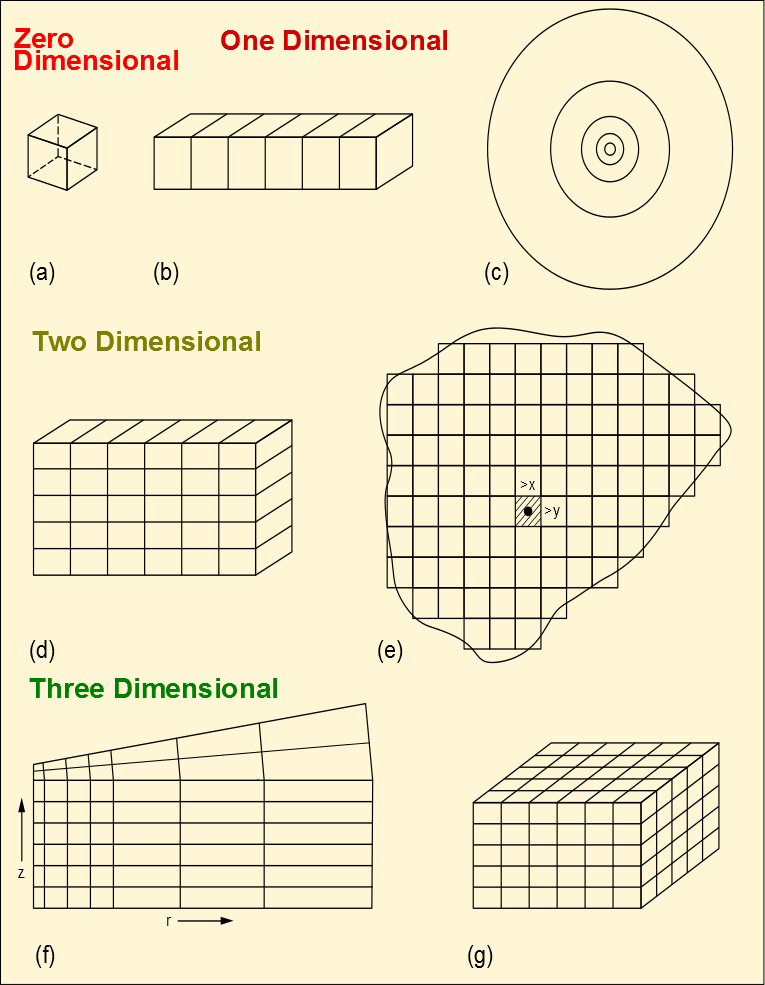

# GRID SECTION

## Introduction

The [GRID](#__RefHeading___Toc38674_784232322) section defines the basic grid properties, including structure, faults, and various static rock properties (porosity, permeability, etc.).  The information in this section will be used by the software to calculate the pore volume ([PORV](#__RefHeading___Toc96547_718313858)) for each cell, the cell mid-point depths, and the regular transmissibilities ([TRANX](#__RefHeading___Toc93085_718313858), [TRANY](#__RefHeading___Toc93087_718313858), and [TRANZ](#__RefHeading___Toc93089_718313858)) between all the cells, as well as across faults. The OPM Flow calculated parameters can then be edited in the [EDIT](#__RefHeading___Toc40641_784232322) section.

All models can be classified by the number of dimensions as show in   Figure 6.1 (after Mattax [Mattax, C.C. and Dalton R.L. 1990. Reservoir Simulation. Society of Petroleum Engineers, Henry L. Doherty Series, Monograph Vol. 13]). The zero and one dimension models are employed in analytical modeling, while the higher dimensions are used in numerical modeling.  The term 4D modeling refers to a 3D model with the fourth dimension being the time domain derived from time-lapse seismic, that is the comparison of 3D seismic surveys at two or more points in time.

OPM Flow enables the user to define 1D, 2D and 3D models using three types of grids: Cartesian Regular Grid, Radial Grid, and Irregular Corner-Point Grids.  The first two type of grids are rather limited in their ability to describe the structural complexity of oil and gas reservoirs; however, this simplicity allows the engineer to quickly build simple models to investigate reservoir performance. Indeed in the early days of numerical modeling back in the late 1970’s two-dimensional cross-section and radial models were the main models used to predict reservoir performance due to limited computer resources at the time.  That is not to say that full field models were not developed, but that these full field models were very coarse in comparison to what is designed and built today using static earth modeling software.

A brief introduction to the three types of grid and the data required to fully define the structural element of the grid together with the rock properties necessary to complete the [GRID](#__RefHeading___Toc38674_784232322) section data requirements is outlined in the following section. This is then followed by the keyword definitions applicable to this section.

## Keyword Definitions
