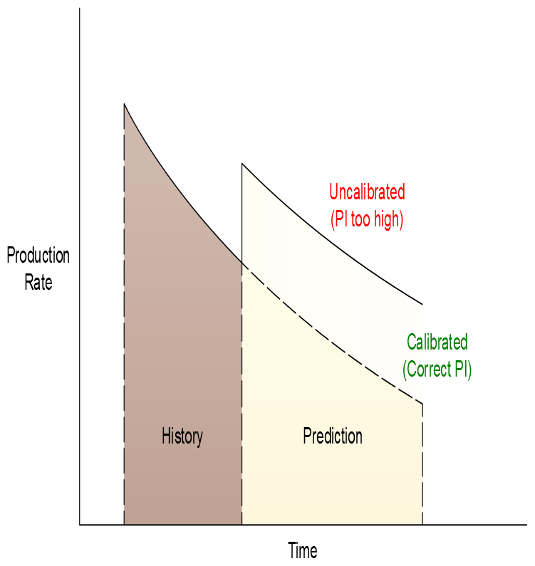
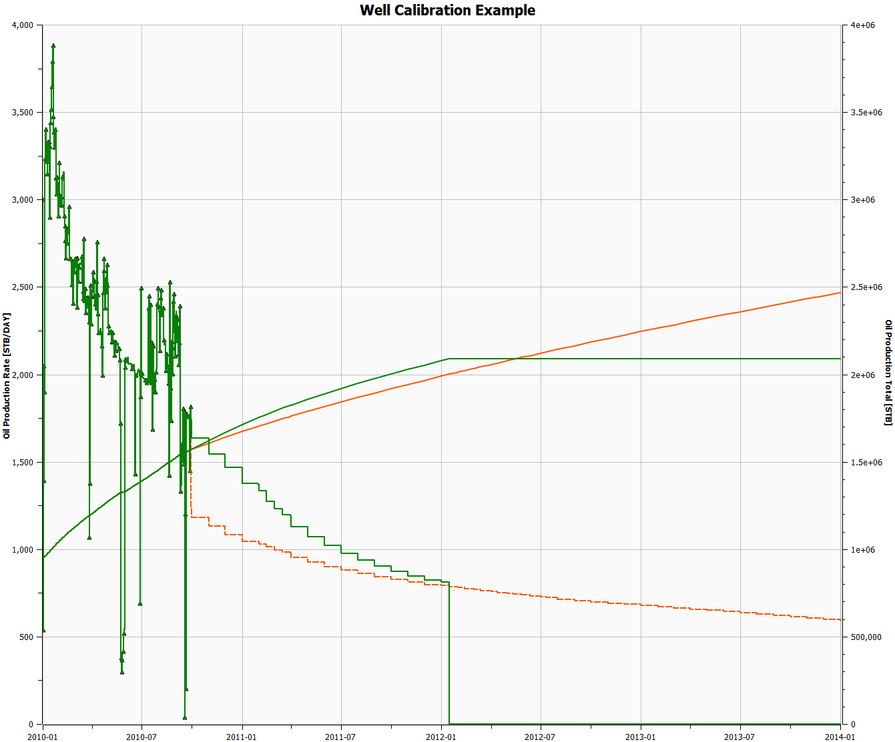

## Data Requirements

Apart from the keywords that advance the simulator through time (the [DATES](#kw-DATES), [TIME](#kw-TIME), and [TSTEP](#kw-TSTEP) keywords),  the minimum required data is associated with defining a well ([WELSPECS](#kw-WELSPECS)), defining a well’s connection to the reservoir ([COMPDAT](#kw-COMPDAT)), and the operating and production targets and constraints for the well ([WCONHIST](#kw-WCONHIST),  [WCONPROD](#kw-WCONPROD), [WCONINJH](#kw-WCONINJH), or [WCONINJE](#kw-WCONINJE)).  Well connections can be “grouped” into completions using the [COMPLUMP](#kw-COMPLUMP) keyword to represent actual physical well completions in the model. Wells can either operate independently or under group control. That is when a well is allocated to a group, then the group can dictate how the wells in the group under group control are operated. For example, a group may have production targets and constraints and all wells under group control within the group will be operated in such a manner as to satisfy the group’s targets and constraints. Note that wells can belong to a group but do not necessary have to be under group control. The top level group, level one, has the name [FIELD](#kw-FIELD) and under this level can be wells, groups, and sub groups to the higher level groups. By default three group levels are defined that sets the wells as level three, reporting directly to defined groups at level two, and the level two groups reporting to the [FIELD](#kw-FIELD) group at level one.  If a different configuration is required, then the [GRUPTREE](#kw-GRUPTREE) keyword should be used to define the group hierarchy by defining a lower level group that reports directly to a higher level group.

The major well specification keywords are summarized in @tbl-12-1 for ease of reference.


| Major Well Specification Keywords |  |  |
| --- | --- | --- |
| Purpose | Keywords | Description |
| Vertical Flow Tubing Performance Table Specification | [VFPINJ](#kw-VFPINJ) | [VFPINJ](#kw-VFPINJ) – Define Injection Vertical Flow Performance Tables. [VFPINJ](#kw-VFPINJ) declares similar data to [VFPPROD](#kw-VFPPROD) but for injection wells. |
| [VFPPROD](#kw-VFPPROD) | [VFPPROD](#kw-VFPPROD) – Define Production Vertical Flow Performance Tables. The [VFPPROD](#kw-VFPPROD) keyword defines production Vertical Flow Performance (“VFP”) tables that are used to determine the outflow or downstream pressure based on the inlet or upstream pressure and the phases flowing through the system.  For a well this means the table relates the flowing bottom-hole pressure (“FBHP”) to the well’s tubing head pressure (“THP”) based on the oil, gas, and water rates (and any artificial lift quantities like gas lift gas), or phases ratios, flowing up the wellbore. |  |
| Well Specification ‍ | [WELSPECS](#kw-WELSPECS) | [WELSPECS](#kw-WELSPECS) – Define Well Specifications. The [WELSPECS](#kw-WELSPECS) keyword defines the general well specification data for all well types, and must be used for all wells before any other well specification keywords are used in the input file. The keyword declares the name of the well, the initial group the well belongs to, the wellhead location and other key parameters. |
| Well Completion Data ‍ ‍ | [COMPDAT](#kw-COMPDAT) | [COMPDAT](#kw-COMPDAT) – Define Well Connections to the Grid. [COMPDAT](#kw-COMPDAT) defines how a well is connected to the reservoir by defining or modifying existing well connections. |
| [COMPLUMP](#kw-COMPLUMP) | [COMPLUMP](#kw-COMPLUMP) – Assign Well Connections to Completions. The [COMPLUMP](#kw-COMPLUMP) keyword assigns connections, as defined by the [COMPDAT](#kw-COMPDAT) keyword, to completion intervals. This “lumping” or “grouping” of the connections to various completion intervals allows automatic workovers and economic criteria to be applied to the completions (that is a set of connections) as opposed to the individual connections. |  |
| [COMPTRAJ](#kw-COMPTRAJ) | [COMPTRAJ](#kw-COMPTRAJ) – Define Well Trajectory Connections to the Grid. [COMPTRAJ](#kw-COMPTRAJ) keyword defines how a well that has been declared as a trajectory well, using the [WELTRAJ](#kw-WELTRAJ) keyword, is connected to the reservoir model by defining or modifying existing well perforation depths. The keyword can only be used for wells defined by the [WELTRAJ](#kw-WELTRAJ) keyword, This is an OPM Flow specific keyword and will therefore cause an error in the commercial simulator. |  |
| [WELTRAJ](#kw-WELTRAJ) | [WELTRAJ](#kw-WELTRAJ) – Define Well Trajectory Data. [WELTRAJ](#kw-WELTRAJ) defines a trajectory well together with the well trajectory data, and is used in conjunction with the [COMPTRAJ](#kw-COMPTRAJ) keyword to define the well connections to the simulation grid blocks. The keyword can only be used for trajectory wells that employ the [COMPTRAJ](#kw-COMPTRAJ) keyword to define the connections to the grid, This is an OPM Flow specific keyword and will therefore cause an error in the commercial simulator. |  |
| Historical Production and Injection Data | [WCONHIST](#kw-WCONHIST) | [WCONHIST](#kw-WCONHIST) – Define Well Historical Production Rates and Pressures. [WCONHIST](#kw-WCONHIST) defines production rates and pressures for wells that have been declared history matching wells by the use of this keyword. History matching wells are handled differently than ordinary wells that use the [WCONPROD](#kw-WCONPROD) keyword for controlling their production targets and constraints. |
| [WCONINJH](#kw-WCONINJH) | [WCONINJH](#kw-WCONINJH) – Well Historical Observed Injection Rates and Pressures. [WCONINJH](#kw-WCONINJH) declares similar data as the [WCONHIST](#kw-WCONHIST) keyword but for injection wells. |  |
| Predictive Production and Injection Data | [WCONPROD](#kw-WCONPROD) | [WCONPROD](#kw-WCONPROD) – Define Well Production Targets and Constraints. The [WCONPROD](#kw-WCONPROD) keyword defines production targets and constraints for wells that have previously been defined by the [WELSPECS](#kw-WELSPECS) keyword. |
| [WCONINJE](#kw-WCONINJE) | [WCONINJE](#kw-WCONINJE) – Well Injection Targets and Constraints. [WCONINJE](#kw-WCONINJE) declares similar data as the [WCONPROD](#kw-WCONPROD) keyword but for injection wells. |  |
| Well Control | [WELCNTL](#kw-WELCNTL) | [WELCNTL](#kw-WELCNTL) – Modify Well Control and Targets. The [WELCNTL](#kw-WELCNTL) keyword modifies a well’s target control and value, both rates and pressures, for previously defined wells without having to define all the variables on the well control keywords: [WCONPROD](#kw-WCONPROD), [WCONHIST](#kw-WCONHIST), [WCONINJE](#kw-WCONINJE), or [WCONINJH](#kw-WCONINJH) keywords. See also the [WELTARG](#kw-WELTARG) keyword below. |
| [WECON](#kw-WECON) | [WECON](#kw-WECON) – Well Economic Criteria for Production Wells. [WECON](#kw-WECON) defines the economic criteria for production wells that have previously been defined by the [WELSPECS](#kw-WELSPECS) and [WCONPROD](#kw-WCONPROD) keywords. |  |
| [WEFAC](#kw-WEFAC) | [WEFAC](#kw-WEFAC) – Define Well Efficiency. [WEFAC](#kw-WEFAC) defines a well’s efficiency or up-time factor as opposed to setting the efficiency factors at the group level. |  |
| [WHISTCTL](#kw-WHISTCTL) | [WHISTCTL](#kw-WHISTCTL) - Define Well Historical Target Phase. The [WHISTCTL](#kw-WHISTCTL) keyword changes the target control phase for wells declared as history match wells via the [WCONHIST](#kw-WCONHIST) keyword. The target phase is set on the [WCONHIST](#kw-WCONHIST) keyword and [WHISTCTL](#kw-WHISTCTL) overrides this value for all subsequent entries on the [WCONHIST](#kw-WCONHIST) keyword. |  |
| [WELOPEN](#kw-WELOPEN) | [WELOPEN](#kw-WELOPEN) – Define Well and Well Connections Flowing Status. [WELOPEN](#kw-WELOPEN) defines the status of wells and the well connections, and is used to open and shut previously defined wells and well connections without having to re-specify all the data on the well control keywords: [WCONPROD](#kw-WCONPROD),  [WCONHIST](#kw-WCONHIST), [WCONINJE](#kw-WCONINJE), or [WCONINJH](#kw-WCONINJH) keywords. |  |
| [WELTARG](#kw-WELTARG) | [WELTARG](#kw-WELTARG) – Modify Well Target and Constraint Values. The [WELTARG](#kw-WELTARG) keyword modifies the target and constraints values of both rates and pressures for previously defined wells without having to define all the variables on the well control keywords: [WCONPROD](#kw-WCONPROD),  [WCONHIST](#kw-WCONHIST), [WCONINJE](#kw-WCONINJE), or [WCONINJH](#kw-WCONINJH) keywords. See also the [WELCNTL](#kw-WELCNTL) keyword above. |  |
| Well Productivity Adjustments (Normally used in History Matching) | [WELPI](#kw-WELPI) | [WELPI](#kw-WELPI) – Define Well Productivity and Injectivity Indices. [WELPI](#kw-WELPI) is used to define a well’s productivity or injectivity index and the values entered on this keyword for a given well will override any previously calculated values, or values previously entered using this keyword. |
| [WPIMULT](#kw-WPIMULT) | [WPIMULT](#kw-WPIMULT) – Define Well Connection Multipliers. The [WPIMULT](#kw-WPIMULT) keyword defines a well connection multiplier factor that scales the existing well connection values. The resulting effect is to scale the well’s productivity at the reporting time step the keyword is entered. |  |
| Notes: |  |  |
: Major Well Specification Keywords {#tbl-12-1}
Wells are initially allocated to groups via the [WELSPECS](#kw-WELSPECS) keyword and groups have a similar set of keywords as for wells, as outlined in @tbl-12-2. However only a limited set of keywords have been implemented in OPM Flow compared with the commercial simulator’s set of keywords.


| Major Group Specification Keywords |  |  |
| --- | --- | --- |
| Purpose | Keywords | Description |
| Group Specification | [GRUPTREE](#kw-GRUPTREE) | [GRUPTREE](#kw-GRUPTREE) – Define Group Tree Hierarchy. [GRUPTREE](#kw-GRUPTREE) defines the hierarchy of groups that have been created by having wells assigned to them via the [WELSPECS](#kw-WELSPECS) keyword. By default three group levels are defined that sets the wells as level three, reporting directly to defined groups at level two, and the level two groups reporting to the [FIELD](#kw-FIELD) group at level one. |
| Predictive Production and Injection Data | [GCONPROD](#kw-GCONPROD) | [GCONPROD](#kw-GCONPROD) – Group Production Targets and Constraints. The [GCONPROD](#kw-GCONPROD) keyword defines production targets and constraints for groups, including the top most group in the group hierarchy known as the [FIELD](#kw-FIELD) group. |
| [GCONINJE](#kw-GCONINJE) | [GCONINJE](#kw-GCONINJE) – Group Injection Targets and Constraints. [GCONINJE](#kw-GCONINJE) declares similar data as for [GCONPROD](#kw-GCONPROD) but for group injection targets and constraints. |  |
| Group Control | [GECON](#kw-GECON) | [GECON](#kw-GECON) – Group Economic Criteria for Production Groups. The [GECON](#kw-GECON) keyword defines economic criteria for production groups, including the field level group [FIELD](#kw-FIELD), that have previously been defined by the [WELSPECS](#kw-WELSPECS) and [GCONPROD](#kw-GCONPROD) keyword. |
| [GEFAC](#kw-GEFAC) | [GEFAC](#kw-GEFAC) – Define Group Efficiency. [GEFAC](#kw-GEFAC) defines a group’s efficiency or up-time factor as opposed to setting the efficiency factors for individual wells. |  |
| [GRUPTARG](#kw-GRUPTARG) | [GRUPTARG](#kw-GRUPTARG) – Modify Group Targets and Constraints Values. [GRUPTARG](#kw-GRUPTARG) keyword modifies the production targets and constraints of both rates and pressures for previously defined groups without having to define all the variables on the group production control keywords: [GCONPROD](#kw-GCONPROD) or [GCONPRI](#kw-GCONPRI) keywords. |  |
| Notes: |  |  |
: Major Group Specification Keywords {#tbl-12-2}
The final set of keywords define various controls for the model, the keywords available to advance the simulator through time, and the available reporting keywords, as illustrated in @tbl-12-3.


| Schedule Advancement, Control, and Reporting Keywords |  |  |
| --- | --- | --- |
| Purpose | Keywords | Description |
| Control [RS](#kw-RS) and [RV](#kw-RV) Behavior | [DRSDT](#kw-DRSDT) | [DRSDT](#kw-DRSDT) – Solution Gas (Rs) Maximum Rate of Increase Parameters. [DRSDT](#kw-DRSDT) defines the maximum rate at which the solution gas-oil ratio (Rs) can be increased in a grid cell. The keyword is similar in functionality to the [DRSDTR](#kw-DRSDTR) keyword, that defines the maximum rate at which Rs can be increased in a grid cell by region. |
| [DRSDTR](#kw-DRSDTR) | [DRSDTR](#kw-DRSDTR) – Solution Gas (Rs) Maximum Rate of Increase Parameters by Region. [DRSDTR](#kw-DRSDTR) defines the maximum rate at which the solution gas-oil ratio (Rs) can be increased in a grid cell for various regions in the model.  The keyword is similar in functionality to the [DRSDT](#kw-DRSDT) keyword, that defines the maximum rate at which Rs can be increased in a grid cell for all cells in the model. |  |
| [DRVDT](#kw-DRVDT) | [DRVDT](#kw-DRVDT) – Solution Oil (Rv) Maximum Rate of Increase Parameters. [DRVDT](#kw-DRVDT) defines the maximum rate at which the solution oil-gas ratio or condensate-gas ratio (Rv) can be increased in a grid cell. The keyword is similar in functionality to the [DRVDTR](#kw-DRVDTR) keyword, that defines the maximum rate at which Rv can be increased in a grid cell by region. |  |
| [DRVDTR](#kw-DRVDTR) | [DRVDTR](#kw-DRVDTR) – Solution Oil (Rv) Maximum Rate of Increase Parameters by Region. [DRVDTR](#kw-DRVDTR) defines the maximum rate at which the solution oil-gas ratio or condensate-gas ratio (Rv) can be increased in a grid cell for various regions in the model.  The keyword is similar in functionality to the [DRVDT](#kw-DRVDT) keyword, that defines the maximum rate at which Rv can be increased in a grid cell for all cells in the model. |  |
| Schedule Advancement | [DATES](#kw-DATES) | [DATES](#kw-DATES) – Advance Simulation by Reporting Date. [DATES](#kw-DATES) advances the simulation to a given report date after which additional keywords may be entered to instruct OPM Flow to perform additional functions via the [SCHEDULE](#kw-SCHEDULE) section keywords, or further [DATES](#kw-DATES) keywords may be entered to advance the simulator to the next report date. |
| [TIME](#kw-TIME) | [TIME](#kw-TIME) – Advance Simulation by Cumulative Reporting Time. [TIME](#kw-TIME) advances the simulation to a given cumulative report time after which additional keywords may be entered to instruct OPM Flow to perform additional functions via the [SCHEDULE](#kw-SCHEDULE) section keywords, or further [TIME](#kw-TIME) keywords may be entered to advance the simulator to the next report time. |  |
| [TSTEP](#kw-TSTEP) | [TSTEP](#kw-TSTEP) – Advance Simulation by Reporting Time. [TSTEP](#kw-TSTEP) keyword advances the simulation to a given report time after which additional keywords may be entered to instruct OPM Flow to perform additional functions via the [SCHEDULE](#kw-SCHEDULE) section keywords, or further [TSTEP](#kw-TSTEP) keywords may be entered to advance the simulator to the next report time |  |
| Schedule Advancement Control | [TUNING](#kw-TUNING) | [TUNING](#kw-TUNING) - Numerical Tuning Control. [TUNING](#kw-TUNING) defines the parameters used for controlling the commercial simulator’s numerical convergence parameters for the global grid. The keyword is mostly ignored by OPM Flow; however, the simulator can be instructed to read the [TUNING](#kw-TUNING) keyword if the appropriate command line parameter has been activated (see section 2.2 Running OPM Flow 2023-04 From The Command Line). |
| [NEXTSTEP](#kw-NEXTSTEP) | [NEXTSTEP](#kw-NEXTSTEP) – Maximum Next Time Step Size . [NEXTSTEP](#kw-NEXTSTEP) defines the maximum time step size the simulator should take for the next time step. This keyword can be used to reset the time step for when known large changes to the model are taking place that may result in time step chops. |  |
| Reporting | [RPTSCHED](#kw-RPTSCHED) | [RPTSCHED](#kw-RPTSCHED) – Define [SCHEDULE](#kw-SCHEDULE) Section Reporting. [RPTSCHED](#kw-RPTSCHED) keyword defines the data in the [SCHEDULE](#kw-SCHEDULE) section that is to be printed to the output print file in human readable format. |
| [RPTRST](#kw-RPTRST) | [RPTRST](#kw-RPTRST) – Define Data to be Written to the [RESTART](#kw-RESTART) File. [RPTRST](#kw-RPTRST) keyword defines the data and frequency of the data to be written to the [RESTART](#kw-RESTART) file at each requested restart point. In addition to the solution data arrays required to restart a run, the user may request additional data to be written to the restart file for visualization in OPM ResInsight. |  |
| Notes: |  |  |
: Schedule Advancement, Control, and Reporting Keywords {#tbl-12-3}
In terms of structuring the format of the keywords in the [SCHEDULE](#kw-SCHEDULE) section it is advisable to declared all the VLP tables, wells and groups at the start of [SCHEDULE](#kw-SCHEDULE) section as oppose to declaring the items as they are needed, or when they come on stream at various times during the simulation. This produces a cleaner input deck and tends to limit unforeseen errors, as all items are declared upfront and only the operational changes (opening wells, changing group and well targets, etc.) are needed. The example [SCHEDULE](#kw-SCHEDULE) section given on the following pages illustrates a typical [SCHEDULE](#kw-SCHEDULE) based on this philosophy.

The first segment of the example shows the start of the [SCHEDULE](#kw-SCHEDULE) section and the group definitions and controls. Here there are group controls only at the [FIELD](#kw-FIELD) level and there are both production and injection rate targets, as well as water and liquid handling constraints applied on the [FIELD](#kw-FIELD) level. These keywords are activated from the start of the simulation as set by the [START](#kw-START) keyword in the [RUNSPEC](#kw-RUNSPEC) section, in this case January 1, 2020.


```
-- ==============================================================================
--
-- SCHEDULE SECTION
--
-- ==============================================================================
SCHEDULE
-- ------------------------------------------------------------------------------
-- GROUP PRODUCTION AND INJECTION CONTROLS
-- ------------------------------------------------------------------------------
--
--       DEFINE GROUP TREE HIERARCHY
--
--       LOWER     HIGHER
--       GROUP     GROUP
GRUPTREE
         FLTBLK1  FIELD                                                        /
         FLTBLK2  FIELD                                                        /
         FLTBLK3  FLTBK2                                                       /
/
--
--       GROUP PRODUCTION CONTROLS
--
-- GRUP  CNTL  OIL    WAT    GAS    LIQ    CNTL  GRUP  GUIDE  GUIDE  CNTL
-- NAME  MODE  RATE   RATE   RATE   RATE   OPT   CNTL  RATE   DEF    WAT
GCONPROD
FIELD    GRAT  1*     8E3   125E3   10E3   1*     1*    1*     1*     1*       /
/

--
--       GROUP INJECTION TARGETS AND CONSTRAINTS
--
-- GRUP  FLUID CNTL   SURF   RESV   REINJ  VOID  GRUP  GUIDE  GUIDE GRUP  GRUP
-- NAME  TYPE  MODE   RATE   RATE   FRAC   FRAC  CNTL  RATE   DEF   REINJ RESV
GCONINJE
FIELD    GAS   RATE  100E3   1*     1*     1.0   YES   1*     1*    1*    1*   /
/

```

The next segment covers the well specification and includes the loading of the VFP tables via include files, declaring the wells using the [WELSPECS](#kw-WELSPECS) keyword, and connecting the wells to the reservoir using the [COMPDAT](#kw-COMPDAT) keyword. In addition, the [COMPLUMP](#kw-COMPLUMP) keyword is invoked to assign the well connections to  well completions.

In multi-stacked reservoirs it is a good idea to associate the same completion number with a given reservoir for all the wells. So for example completion number one is always associated with the Lower Talang Akar Formation Unit A,  completion number two with the Lower Talang Akar Formation Unit B, and completion number three with the Upper Talang Akar Formation Unit C, etc.  In this way one can easily identify which zone a well is producing from or completed in.

Finally, the [WCONPROD](#kw-WCONPROD) keyword is used to define the operating conditions for the gas producers (GP01 and GP02) and to assign the VFP tables to the producing wells. Whereas the [WCONINJE](#kw-WCONINJE) keyword performs a similar function for the single gas injector, GI01.

Notice also the well naming convention that easily identifies the type of well:  the letter G for a gas well, O for an oil well, and W for a water well, and the function of the well, P for a producer and I for an injector.


```
-- ------------------------------------------------------------------------------
-- WELL SPECIFICATIONS AND COMPLETIONS
-- ------------------------------------------------------------------------------
--
--       LOAD INCLUDE FILES WITH VLP TABLES
--
INCLUDE
         'WEL-P50-VLP01.inc'     / VFP TABLE #1 5 1/2 inch tubing

INCLUDE
         'WEL-P50-VLP02.inc'     / VFP TABLE #2 4 1/2 inch tubing
--
--       WELL SPECIFICATION DATA
--
-- WELL  GROUP     LOCATION  BHP    PHASE  DRAIN  INFLOW  OPEN  CROSS  PVT
-- NAME  NAME        I    J  DEPTH  FLUID  AREA   EQUANS  SHUT  FLOW   TABLE
WELSPECS
GI01     FIELD      14   13   1*     GAS    1*     GPP    SHUT   NO     1*     /
GP01     FLTBLK1    64   80   1*     GAS    1*     GPP    SHUT   NO     1*     /
GP02     FLTBLK1    24  110   1*     GAS    1*     GPP    SHUT   NO     1*     /
/
--
--       WELL CONNECTION DATA
--
-- WELL  --- LOCATION ---  OPEN   SAT   CONN   WELL   KH    SKIN   D     DIR
-- NAME   II  JJ  K1  K2   SHUT   TAB   FACT   DIA    FACT  FACT   FACT  PEN
COMPDAT
GI01      1*  1*   1  60   SHUT   1*    1*    0.708   1*    0.0    1*    'Z'   /
GP01      1*  1*   1  60   SHUT   1*    1*    0.708   1*    0.0    1*    'Z'   /
GP01      1*  1*   1  60   SHUT   1*    1*    0.708   1*    0.0    1*    'Z'   /
/
--
--       ASSIGN WELL CONNECTIONS TO COMPLETIONS
--
-- WELL  --- LOCATION ---  COMPL
-- NAME   II  JJ  K1  K2   NO.
COMPLUMP
GI01      14  13   1  20    1                              / COMPLETION NO. 01
GI01      14  13  35  60    2                              / COMPLETION NO. 02
GP01      64  80   1  20    1                              / COMPLETION NO. 01
GP01      64  80  22  60    2                              / COMPLETION NO. 02
GP02      24 110   1  20    1                              / COMPLETION NO. 01
GP02      24 110  25  60    2                              / COMPLETION NO. 02
/
--
--       WELL PRODUCTION WELL CONTROLS
--
-- WELL  OPEN/  CNTL   OIL    WAT    GAS   LIQ    RES    BHP   THP   VFP    VFP
-- NAME  SHUT   MODE   RATE   RATE   RATE  RATE   RATE   PRES  PRES  TABLE  ALFQ
WCONPROD
GP01     SHUT   GRUP   1*     1*     70E3  1*     1*     500.0 120.0 1         /
GP02     SHUT   GRUP   1*     1*     70E3  1*     1*     500.0 120.0 2         /
/
--
--       WELL INJECTION CONTROLS
--
-- WELL  FLUID  OPEN/  CNTL  SURF   RESV   BHP   THP   VFP
-- NAME  TYPE   SHUT   MODE  RATE   RATE   PRSES PRES  TABLE
WCONINJE
GI01     GAS    SHUT   RATE 125E3   1*     10E3   1*    1*                     /
/
```


The final part of the well specification segment is shown below and sets the well efficiency for the wells via the [WEFAC](#kw-WEFAC) keyword, the producing wells economic limits via the [WECON](#kw-WECON) keyword,  and then advances the simulation to January 25, 2020. Thus, there is no production up to January 25, 2020 as all the wells are shut-in.


```
--
--       WELL EFFICIENCY FACTORS
--
-- WELL  EFF    NETWK
-- NAME  FACT   OPTN
WEFAC
'GI*'    0.950                                                                 /
'GP*'    0.950                                                                 /
/
--
--       WELL ECONOMIC CRITERIA FOR PRODUCTION WELLS
-- WELL  MIN    MIN    MAX    MAX    MAX    CNTL    END   WELL
-- NAME  ORAT   GRAT   WCUT   GOR    WGR    MODE    RUN   NAME
WECON
'GP*'    1*     5.0E3  1*     1*     1*    'WELL'  'NO'                        /
/
DATES
 25 JAN   2020            /
/
```

On January 25, 2020 yearly restarts are requested ([RPTRST](#kw-RPTRST)) together with various printed reports ([RPTSCHED](#kw-RPTSCHED)), as well as the maximum time step size of 31 days being set via the [TUNING](#kw-TUNING) keyword. More importantly, well GP01 is opened together with completion number one to put the well on production. Note that one needs to open both the well and the completion; hence, the two lines in the [WELOPEN](#kw-WELOPEN) keyword.


```
-- ------------------------------------------------------------------------------
-- SCHEDULE SECTION FOR PHASE 1 DEVELOPMENT
-- ------------------------------------------------------------------------------
--
--       RESTART CONTROL BASIC = 4 (ALL=2, YEARLY=4, MONTHLY=5, TSTEP=6)
--
RPTRST
         BASIC=4                                                               /
--
--       DEFINE SCHEDULE SECTION REPORT OPTION
--
RPTSCHED
         'WELLS=2'    'WELSPECS'    'CPU=2'     'FIP=2'                        /
--
-- DEFAULT TUNING PARAMETERS (SET MAX TSTEP = 31 days)
--
TUNING
1.0      31.0     0.1     0.15     3     0.3     0.1     1.25     0.75         /
                                                                               / /
--
--       DEFINE WELL AND WELL CONNECTIONS FLOWING STATUS
--
--  WELL WELL   --LOCATION--  COMPLETION
--  NAME STAT     I   J    K  FIRST LAST
WELOPEN
GP01     OPEN                                                                  /
GP01     OPEN     0   0    0     1     1                                       /
/

DATES
 1  FEB   2020  /
/
```

On February 1, 2020 further [SCHEDULE](#kw-SCHEDULE) keywords are processed.  The first keyword is the [RPTSCHED](#kw-RPTSCHED) keyword that in this case switches off all reports printed to the *.PRT file, as only annual reports are required for this particular model.

Next the gas producer GP02 is put on production using two statements in the [WELOPEN](#kw-WELOPEN) keyword, and the simulator is requested to advance to report time step of March 1, 2020.


```
--
--       DEFINE SCHEDULE SECTION REPORT OPTION
--
RPTSCHED
'NOTHING'                                                                      /
--
--       DEFINE WELL AND WELL CONNECTIONS FLOWING STATUS
--
--  WELL WELL   --LOCATION--  COMPLETION
--  NAME STAT     I   J    K  FIRST LAST
WELOPEN
GP02     OPEN                                                                  /
GP02     OPEN     0   0    0     1     1                                       /
/
DATES
 1  MAR   2020  /
/

```

Then finally on March 1, 2020 the gas injector is placed on stream and the simulation advances on a monthly report basis to the end of the year.


```
--
--       DEFINE WELL AND WELL CONNECTIONS FLOWING STATUS
--
--  WELL WELL   --LOCATION--  COMPLETION
--  NAME STAT     I   J    K  FIRST LAST
WELOPEN
GI01     OPEN                                                                  /
GI01     OPEN     0   0    0     1     1                                       /
/
DATES
 1  APR   2020  /
 1  MAY   2020  /
 1  JUN   2020  /
 1  JLY   2020  /
 1  AUG   2020  /
 1  SEP   2020  /
 1  OCT   2020  /
 1  NOV   2020  /
 1  DEC   2020  /
/

```

Next a detailed report is produced as of January 1, 2021, and reporting is then switch off and the simulation continues to the end of the run.


```
-- ------------------------------------------------------------------------------
-- SCHEDULE SECTION - 2021-01-01
-- ------------------------------------------------------------------------------
RPTSCHED
'WELLS=2'    'WELSPECS'    'CPU=2'     'FIP=2'                                 /

DATES
 1  JAN   2021  /
/

RPTSCHED
'NOTHING'                                                                      /

DATES
 1  FEB   2021  /
 1  MAR   2021  /
 1  APR   2021  /
 ...
/
```


### History Matching Runs

History matching is the process of matching actual historical production data versus the model’s production performance.  During history matching the engineer specifies the actual field measured production and injection rates for a reservoir which has been producing for a period of time. Although other reservoir characteristics such as permeability, layering structure, aquifer strength, and individual well performance are specified as normal in the remainder of the data file, they are only one realization out of possibly thousands of realizations. There is therefore significant uncertainty associated with the data set. Thus in most cases, the simulated past performance of the reservoir, that is the well rates calculated by OPM Flow up to the present day, will not in general correspond to the measured rates specified by the user. History matching then becomes an exercise in identifying those reservoir properties subject to the greatest uncertainty and adjusting them to bring the simulated and measured rates to an acceptable degree of agreement.

Prior to beginning the matching process the production data should be reviewed and quality checked. This step is needed mainly to:

- Allocate production data areally and vertically to the pertinent areas and zones, as well as ensuring that the correct well completions have been implemented into the model’s schedule section. Particular care should be taken with multiple completed wells to ensure that the wells produce from the correct zones at the correct times. Wells that are completed across fault planes also need to be checked so that the completions are on the right side of the fault plane.
- Correct field production data to separator conditions consistent with model conditions, or vice  versa.
- Correct reported pressures for simulation use (e.g., Peaceman correction), or use the weighted areal average well bottom-hole pressures from the simulator to match against actual data.

Note also that not all production volumes have the same level of quality assurance. Product streams that are sold are going to have a higher level of quality assurance because they have value, compared with production streams that are disposed off or re-injected, as they have no value.  Thus, in an oil field selling the produced oil but flaring or re-injecting the produced gas, the oil volumes will be back allocated based on “ticketed sales”, and thus the field volumes are reasonable certain. However, even here there are uncertainties associated with allocating production volumes back to the individual wells and well completions. As the gas volumes are not sold they have no value and thus have greater uncertainty than the oil volumes, especially when back allocating back to the wells.

History matching is an iterative process, in which steps are repeated a number of times with variations in reservoir characterization (permeability, pore volume, relative permeability modifications, etc.), until a reasonable match is obtained. There are no precise rules for conducting a history match but the methodology is well established.  Generally one first matches pressures globally, then overall saturations (and well rates), and repeat until an overall match is achieved, as the process of matching pressures also effects the saturations and vice versa. Which is why this is an iterative process. This methodology is then repeated on a regional level until the process is complete and reasonable matches have been obtained at the field, region, and well levels.

Generally, group control, targets, and constraints are not utilized in the history matching part of a simulation study. Instead, the [WCONHIST](#kw-WCONHIST) keyword is used to enter the well production (oil, gas, and water rates), pressure data (BHP and THP when available), and VFP table assignment, on a well by well basis and on discrete time intervals, normally monthly.  [WCONHIST](#kw-WCONHIST) allows one to set the “target” phase and rate the well will attempt to produce at, if possible, and to produce the other phases that come with the target rate. That is there are no constraints applied to the other phases, unlike when using the [WCONPROD](#kw-WCONPROD) keyword. If well productivity has been matched then the target phase rates will be satisfied and the quality of the history match is determined by the accuracy of the other phases, together with the pressure match. Thus, in an oil field the target phase will normally be the oil phase and the oil rate, and the quality of the history would be determined by the produced gas and water volumes plus the pressure match at various levels (field, region, reservoir, and well). If water breakthrough has not occurred and the field is producing above the saturation pressure then there is very little to match, as the gas production in this case is a direct function of the oil rate.

The [WCONHIST](#kw-WCONHIST) keyword also has a RESV target phase where the target is set to the in situ reservoir volume rate which is calculated by the simulator using the oil, water, gas, and liquid rates declared on the keyword. This is useful in the initial part of the history matching study where one is trying to match the overall pressure behavior, as the option forces the simulator to produce the correct number of reservoir barrels (or m3), although the actual oil, gas, and water rates will most likely not match at this stage of the study. Note that it is not necessary to edit the [WCONHIST](#kw-WCONHIST) keywords for a run to change the target phase, as the WHISTCNTL keyword can be used do this from the time this keyword is invoked, thus avoiding changing the control mode on all subsequent [WCONHIST](#kw-WCONHIST) keywords.

As mentioned above, the rates and volumes of production streams that are sold are more reliable than those that are being re-injected, flared, or otherwise disposed of, and therefore in an oil field the preferred target phase is oil and not liquid, which some engineers prefer to use.

The [WCONINJH](#kw-WCONINJH) keyword has similar functionality as the [WCONHIST](#kw-WCONHIST) keyword, but is used for history matching injection wells instead.

More recent developments in history matching incorporate Assisted History Matching (“AHM”) techniques ^[History Matching and Uncertainty Quantification: Multi-objective Particle Swarm Optimisation Approach (SPE 143067), L. Mohamed, M. Christie, V. Demyanov, Vienna, Austria, 23–26 May 2011.], ^[Field-Scale Assisted History Matching Using a Systematic, Massively Parallel Ensemble Kalman Smoother Procedure (SPE00182617), Binghuai Lin, Paul I Crumpton, and Ali H. Dogru, Society of Petroleum Engineers (February 2017).], ^[Enhancing the Geological Models Consistency in Ensemble-Based History Matching -  An Integrated Approach (SPE00186049),  A. Perrone, F Pennadoro,  A Tiani, E Della Rossa, and J. Saetrom, Society of Petroleum Engineers (May,  2017).], ^[Correlation-Based Adaptive Localization for Ensemble-Based History Matching - Applied to the Norne Field Case Study (SPE00191305), Xiaodong Luo, Rolf Lorentzen, Randi Valestrand, and Geir Evensen, , Society of Petroleum Engineers (April,  2018).], ^[Rapid Forecast Calibration Using Nonlinear Simulation Regression with Localization (SPE-193845-MS), Jincong He, Wenyue Sun, and Xian-Huan Wen, SPE Reservoir Simulation Conference held in Galveston, Texas, USA, 10–11 April 2019.], ^[Multilevel Strategies and Geological Parameterizations for History Matching Complex Reservoir Models (SPE-193895-MS), Yimin Liu and Louis J. Durlofsky,SPE Reservoir Simulation Conference held in Galveston, Texas, USA, 10–11 April 2019.]and ^[Improved Estimation and Forecast Through Model Error Estimation – Norne Field Example (IPTC-19142-MS), Minjie Lu and Yan Chen,  International Petroleum Technology Conference held in Beijing, China, 26 – 28 March 2019.] in which various statistical techniques are applied in specialized software to match the field data by the user supplying the parameters to vary, the range of the parameters values, and the objective function to minimize.  This type of software can also generate a range of “reasonable” history match models that can then be used to quantify the uncertainty range in the prediction phase.


### Prediction Runs

Prediction runs are used to optimize future production from the field and can take two forms:

- Prediction runs may follow directly from a history match case using the reservoir description estimated during the history matching phase. The history matching and prediction runs are frequently in separate data files, with the prediction cases “restarting” from the final history match run, as the history match restart file contains sufficient data to continue the simulation into the future. Therefore, the prediction data set contains the same reservoir description as the history match but is initialized using the restart file output from the history match case.  In general, the base case scenario is the No Further Activity (“NFA”) scenario. This is just a continuation of the history match into the future using the well controls in force at the end of the history matching period. This is the simplest way to run the field since the surface facilities remain unchanged and no workovers take place. However, the switch from history matching mode to prediction mode should be treated with care in order to ensure a smooth transition between the two phases. Subsequent cases will then be based on the NFA scenario, and will attempt to optimize recovery by examining the impact of drilling infill wells, modifying facilities constraints, varying the reservoir management strategy, etc.
- Prediction cases may also be based on predicting production from structures that have not been put on production at the time of the study, that is there is no historical production available. In this case, the reservoir description is based on the best available data set and interpretation, although there may be various variations of the models to cover the range of uncertainties in the static earth modeling. Typically, Low, Best, and High models are generated to capture the range of uncertainty in the static modeling, although full uncertainty analysis is becoming more common as computational computer power becomes more available. Additional dynamic sensitivities are then run to determine the Low, Best, and High models that address both the static and dynamic uncertainties. These models then form the basis of the supplementary predictions using a variety of different production strategies that are used to improve the petroleum recovery and reduce production costs. For each prediction case, an aspect of the surface facilities or well management policy is changed and the case is compared to the base prediction. Most simulators, including OPM Flow, have a wide range of well, group and surface facility modeling features and it is likely that several will be invoked during recovery optimization to model events such as drilling infill wells, modifying facilities constraints, investigating various depletion strategies, etc.

In both scenarios more recent developments within the industry apply a full uncertainty analysis to the models, in which multiple cases are run under various parameter changes to derive a distribution of recoverable volumes, which in turn are used to select the Low, Best, and High scenarios.  This can result in hundreds of cases being run and is computationally expensive.

As mentioned above, the switch from history matching mode to prediction mode should be treated with care in order to ensure a smooth transition between the two phases.  History matching of a well’s BHP has always been somewhat problematic, as the field measured data consists of shutting-in the well for a specific period for the BHP to build backup to a well’s average drainage pressure (usually assumed to be the reservoir pressure in the surrounding area).  History matching time steps are normally based on monthly time steps to coincide with the monthly back allocated field reported production volumes. Thus, to correctly match the measured Shut-in Bottom-Hole Pressure (“SBHP”) data in the model, one would have to shut-in the well in the model as per the field, and then open up the well back up at the end of the BHP survey.  One would also have to re-adjust the well rates to match the cumulative volumes produced for the time the well was shut-in. These steps are impracticable and engineers originally handled the problem by assigning the wells a high productivity index, so that the difference between the Flowing Bottom-Hole Pressure (“FBHP”) and the SBHP was small.

This would lead to a mismatch in rates when switching from history matching mode to prediction mode as shown in Figure 12.1. Thus, the final step in history matching was to calibrate the well rates based on adjusting the Productivity Indices (“PI”) of the wells, in order to get a smooth transition between the two modes of operating the wells.




Calibration is achieved by running the model at the back pressures held against the wells at one or several time-steps.  The well PIs and/or wellbore flow parameters are adjusted to duplicate field-observed rates.  Although the calibration step was usually done after the history-matching step, there are times when it must be done beforehand (e.g., when modeling multi-layer flow into a well).  This is because in stratified reservoirs the correct allocation of rates among layers is dependent on the absolute value of the well's PI (and not solely on the ratios of PIs of the various layers).

Although well PI matching is still performed as part of the general history matching methodology, it is no longer necessary to set a well’s PI to a high value in order to mimic the field measured SBHP.  This is because most simulators are now capable of reporting an “average” bottom-hole pressure around the well, including one, four, five, and nine grid cell averaging, as well as alternative averaging schemes. Thus, the engineer now matches the field measured SBHP with one of the simulator’s average grid cell BHPs, normally either the five or nine grid cell average BHP values.

This leaves the question on what controls should be used when moving from history matching mode to prediction mode and ensuring a smooth transition between the two, and at the same time ensuring the resulting predictive forecast is reasonable.  There are basically three approaches to this problem:

- set the well’s prediction constraint to the last observed rate,
- set the well’s prediction constraint to the average FBHP and adjusting a well’s PI, and thirdly,
- set the well’s prediction constraint to the last FBHP or THP.

The next three sections discusses these options in some detail.


(1) Prediction Constraint Based on a Well’s Last Observed Rate

In the history matching mode the wells are controlled by a rate target, so using the last observed well rate would seem a sensible approach. Thus, this approach uses the last observed well rates as well constraints in the prediction run.  The typical approach is to constrain production based on a preferred phase (oil rate, gas rate, or liquid rate), and then set a reasonable flowing BHP value as a limit for when the well can no longer meet the rate target set. The main requirement for using this approach is therefore that the history-matched model reproduces the rates and flowing bottom-hole pressures fairly exactly.




However, the are some drawbacks to this approach as one can observe in Figure 12.2, which shows the oil rate and cumulative oil for a well, the symbols on the plot are the actual historical oil production rates. If the last period of production history were not matched successfully, a smooth transition from the history simulation to prediction phase will not be achieved, as shown by the orange lines in Figure 12.2.

A second drawback to this approach, is that the well and field production rate profiles will tend to have a flat trend for a few months (or even years) when the well can still deliver the rate target. In real field management such rate profiles can be optimistic if the specified boundary conditions are not representative of actual operating conditions in the field.

(2) Prediction Constraint Based on a Well’s Average FBHP and Adjusting a Well’s PI

This approach has been adopted by some reservoir engineers as a result of the issues mentioned for the first approach.

Here, an average FBHP of each well, based on most recent production history, is used as a target to control the wells during the prediction phase. Usually, this will lead to abrupt changes in rate and pressure profiles during the transition. The next step is therefore to dampen these abrupt changes in the well rate profiles by applying well PI multipliers (at the well and/or completion level) until a smooth transition is obtained in the rate profiles, similar to that shown by the green lines after the history matching period in Figure 12.1.

The problem with this approach is that it is synonymous to re-calibrating a supposedly history-matched simulation model (with a given permeability distribution based on a certain geological characterization), and thus this approach is rather questionable and is not recommended.

(3) Prediction Constraint Based on a Well’s Last Flowing BHP or THP

This methodology is the recommended approach for switching between historical and prediction controls in a reservoir model. It involves automatically applying the last flowing bottom-hole pressure at the instant the transition takes place as the production target, and therefore setting the latest flow rates to be constraints. This ensures a smooth transition between history and prediction phases without having to resort to unreasonable changes to the model. In OPM Flow this is accomplished by using the [WELTARG](#kw-WELTARG) keyword to specify that all the wells should use the bottom-hole pressure as the target at the beginning of the restart run, and defaulting the actual value for the BHP. By defaulting the BHP value the simulator will use the current value of FBHP for a well as the constraint. Note that the [WELTARG](#kw-WELTARG) keyword only defines the variable to be changed, it does not change how a well is controlled.  However, by setting the BHP to equal to the current FBHP this has a similar effect as changing the operating target.

Using this approach, all wells will continue flowing at the last flowing bottom-hole pressure from the previous time step, using this value of FBHP as the effective target while the last historical rates are kept as limits (if BHP is requested as shown in the example below). This approach achieves two important objectives, firstly it results in a smooth transition from the history-match phase to prediction phase in well and field production profiles And secondly, it gives a smooth decline in well production rate, as is expected of real wells in the field.


Although this discussion has been based on using the BHP as the effective control mechanism, one could also use THP,  and to a lesser extent, liquid rate, instead.


The following example below shows how to apply the recommended method to obtain a smooth transition to the predictive phase using the BHP as the controlling mechanism.


#### Example

In the example, December 2019 is the last month of historical data and therefore the predication phase starts from January 1, 2020.


```
DATES
01 DEC 2019 /
/
--
--       WELL HISTORICAL PRODUCTION CONTROLS
--
-- WELL  OPEN/  CNTL   OIL    WAT    GAS    VFP    VFP   THP   BHP
-- NAME  SHUT   MODE   RATE   RATE   RATE   TABLE  ALFQ  PRES  PRES
WCONHIST                                                                                                                          OP01     OPEN   ORAT  15.5E3  100.0  1550   10      1*   900.0 1*     /
OP02     OPEN   ORAT  10.3E3  500.0  1550   10      1*   700.0 1*     /
OP03     OPEN   ORAT   5.4E3 2100.0  1550   10      1*   500.0 1*     /
/
-- ------------------------------------------------------------------------------
-- 01 JAN 2020 START OF PREDICTION SCHEDULE SECTION
-- ------------------------------------------------------------------------------
DATES
01 JAN 2020 /
/
--
--       WELL PRODUCTION AND INJECTION TARGETS
--
--  WELL WELL   TARGET
--  NAME TARG   VALUE
WELTARG
 OP*     BHP                                                /
/
```


From December 1, 2019 to January 1, 2020 the three oil producing wells will be under history matching control with the oil rate being the target rate for the wells. On January 1, 2020 the wells will be converted to normal producers as the [WELTARG](#kw-WELTARG) keyword changes a well status from a history match well to a regular well.  At the same time the [WELTARG](#kw-WELTARG) keyword sets all the wells to have their current FBHP as a constraint, by setting the target BHP values to the default values, which effectively makes the FBHP a target as it is now the “active” constraint.


The alternative keyword for implementing the same approach is the [WELCNTL](#kw-WELCNTL) keyword, but unfortunately this is currently not implemented in OPM Flow.


### Well Productivity

Throughout this section the equations are presented in terms of oil production or liquid flow (i.e., oil and water). Note that similar equations exists for gas flow in terms of p2 and pseudo pressure formulations (ψ(p)).

Under the assumption of (1) one-dimensional radial flow into the wellbore, (2) steady-state pressure behavior, and (3) single-phase flow, it can be shown that the flow rate of a well is given by:


$$
q = (0.001127) (2π) \frac{\mathit{kh}}{μ}[\frac{{p}_{e} - {p}_{w}}{(ln (\frac{{r}_{e}}{{r}_{w}}) + S)}]
$$ {#eq-12-1}

where

q	= production rate (rb/day),

pe	= pressure at the drainage radius of the well (psia),

pw	= bottom-hole well pressure (psia),

re	= drainage radius (feet),

rw	= wellbore radius (feet),

S	= skin factor (dimensionless), and

kh	= effective permeability thickness (mD.ft).


This is extended to multi-phase flow by introduction of relative permeabilities and adjusted to surface conditions by use of the formation volume factor resulting in the following expression for oil production rate:


$$
{q}_{o} = (0.001127) (2π) \frac{{\mathit{kk}}_{\mathit{ro}} h}{{B}_{o} {μ}_{o}}[\frac{{p}_{e} - {p}_{w}}{(ln (\frac{{r}_{e}}{{r}_{w}}) + S)}]
$$ {#eq-12-2}


If the modified radial flow equation is written for each perforated interval and summed over all intervals, the resulting equation is the one used to calculate oil production rates in the simulator. One way to specify the flow capacities of wells is to enter re, rw, S, and pw values for the well, with the kh values for each perforated interval. The simulator then determines the other parameter values from the calculated pressure and saturation distributions.

Because the pressure at the drainage radius is not readily determined in the simulator, it substitutes pb (a representative pressure of each perforation grid block) for p. That is readily accommodated by replacing the drainage radius by a probe radius as defined by Peaceman^[Peaceman, D.W. "Interpretation of Well-Block Pressures in Numerical Reservoir Simulation with Nonsquare Grid Blocks and Anisotropic Permeability."  SPE 10528 presented at the Sixth SPE Symposium on Reservoir Simulation, New Orleans, (February 1982), pp. 553-569.] for a vertical well:


$$
{r}_{b} = 0.28 \frac{{[\sqrt{\frac{{K}_{y}}{{K}_{x}}} \mathrm{Δ}{x}^{2} + \sqrt{\frac{{K}_{x}}{{K}_{y}}} \mathrm{Δ}{y}^{2}] }^{0.5}}{{(\frac{{K}_{y}}{{K}_{x}})}^{0.25} + {(\frac{{K}_{x}}{{K}_{y}})}^{0.25}}
$$ {#eq-12-3}

where

Kx and Ky		= 	x- and y- direction absolute permeabilities, and

Δx and Δy		= 	grid block sizes (feet).


The simulator then uses the modified radial flow equation, written for each connection:


$$
{q}_{o} = \frac{(0.001127) (2π)}{(ln (\frac{{r}_{b}}{{r}_{w}}) + S)}(\frac{k{k}_{\mathit{ro}}h}{{B}_{o} {μ}_{o}} ( {p}_{b} - {p}_{w} ))
$$ {#eq-12-4}


The connection term on the [COMPDAT](#kw-COMPDAT) keyword in the [SCHEDULE](#kw-SCHEDULE) section, CONFACT, is simply the transmissibility portion of equation (12.4) for a given connection that is:


$$
{T}_{\mathit{xy}} = \frac{(0.001127) (2π)(\mathit{kh})}{(ln (\frac{{r}_{b}}{{r}_{w}}) + S)}
$$ {#eq-12-5}


And the oil phase mobility term is defined as:


$$
{M}_{o} = (\frac{{k}_{\mathit{ro}}}{{B}_{o} {μ}_{o}})
$$ {#eq-12-6}


Substituting (12.5) and (12.6) into (12.4) and summing all the connections for the well to obtain the oil rate for the well gives:


$$
{q}_{o} = {\sum }_{1}^{N}({T}_{\mathit{xy}} {M}_{o} ({p}_{b} - {p}_{w}))
$$ {#eq-12-7}


Note in the case of partially completed wells, the effective permeability thickness of a perforated interval may be substantially greater than the permeability thickness of the formation along the perforation.

Engineers commonly use the Productivity Index (“PI”) as a parameter to defined an oil well’s deliverability, as it is derived relatively easy from field measurements, that is:


$$
{q}_{o} = PI( {p}_{e} - {p}_{w} )
$$ {#eq-12-8}


or in terms of the productivity index:


$$
PI = \frac{{q}_{o}}{( {p}_{e} - {p}_{w} )}
$$ {#eq-12-9}


It is significant that this equation for the Productivity Index is written in terms of the pressure at the well drainage radius, pe, rather than grid block pressure, pb.  It must be written this way since PI is a property that is determined by field production tests. One can also relate the above equation to the multilayered extension of the steady-state radial flow equation (12.7), to give the grid block Productivity Index:


$$
PI = \frac{{q}_{o}}{({p}_{b} - {p}_{w})} = {\sum }_{1}^{N}({T}_{\mathit{xy}} {M}_{o} )
$$ {#eq-12-10}


One very important point to note is that the productivity index is, in general, not constant for a given well since both relative permeability and drainage radius can be time dependent.  This makes PI an inappropriate quantity for computer prediction of production rates, but it is often the only type of data available on well performance. To overcome this limitation, most simulators accept well drainage area PI data as input, and then immediately convert this assuming steady state radial flow with a uniform mobility throughout the drainage area, resulting in the following equation.


$$
PI = {{\sum }_{n=1}^{N}({T}_{\mathit{xy}} {M}_{o} (\frac{ln (\frac{{r}_{b}}{{r}_{w}}) + S}{ln (\frac{{r}_{e}}{{r}_{w}}) + S}))}_{n}
$$ {#eq-12-11}


Since the drainage radius, re, is generally different from the grid block radius, rb, the ratio of logarithms may be significant; hence, the use of the PI option normally requires specification of both re and rb.

Equation (12.11) is used to calculate the PI for the well and is used to print the PI on the WELLS production report requested via the [RPTSCHED](#kw-RPTSCHED) keyword in the [SCHEDULE](#kw-SCHEDULE) section. Note that for gas wells with non-zero D-factors, the non-Darcy skin factor is added to to the skin (S) term in equation (12.11) in both the numerator and the denominator.  Secondly, re is often undetermined or unknown and it is common to default the DRADIUS parameter on the [WELSPECS](#kw-WELSPECS) keyword, in the [SCHEDULE](#kw-SCHEDULE) section. If the well drainage radius (DRADIUS) is defaulted then equation (12.11) simplifies to:


$$
PI = {{\sum }_{n=1}^{N}({T}_{\mathit{xy}} {M}_{o} )}_{n}
$$ {#eq-12-12}


In this case the PI should be considered a grid block productivity index and not a well drainage area productivity index.  Note also that if DRADIUS is set to a negative number, then this results in a well’s potential being written out to the WELLS production report instead of the productivity index. In this instance this is the rate based on only applying the BHP and THP constraints only, all other constraints are ignored.
