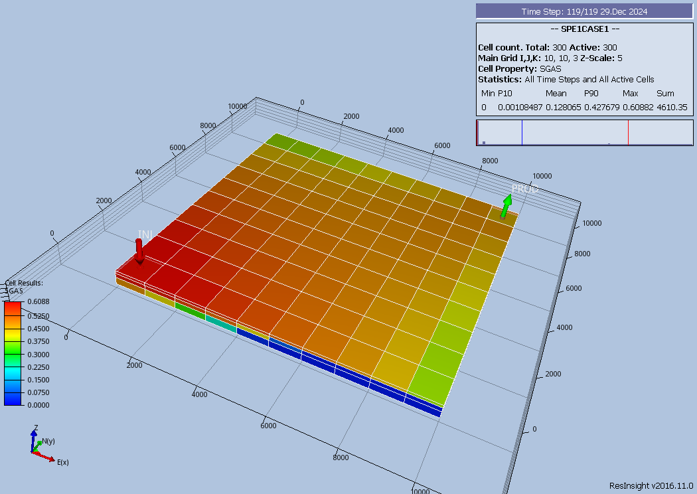
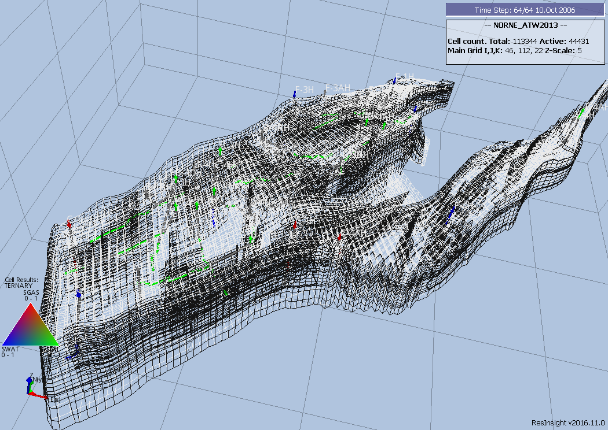
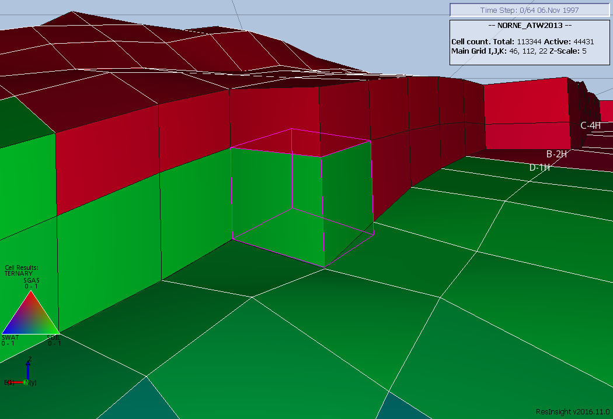
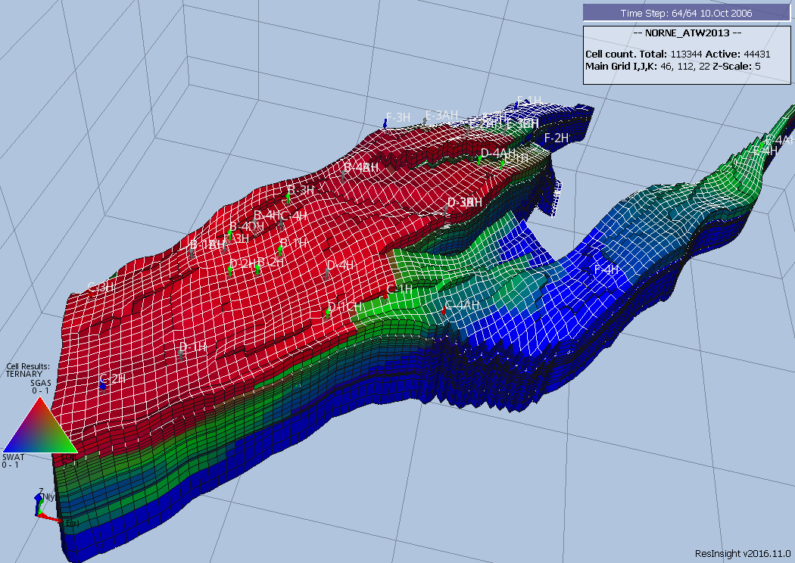
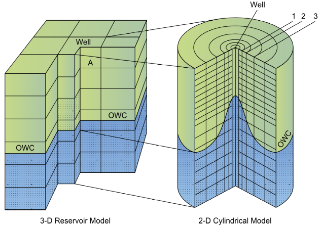
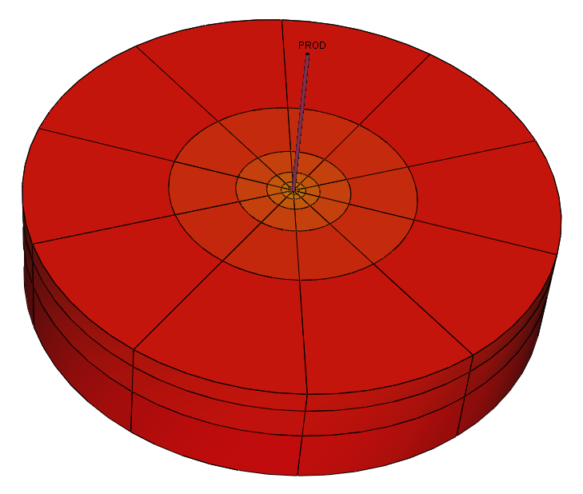
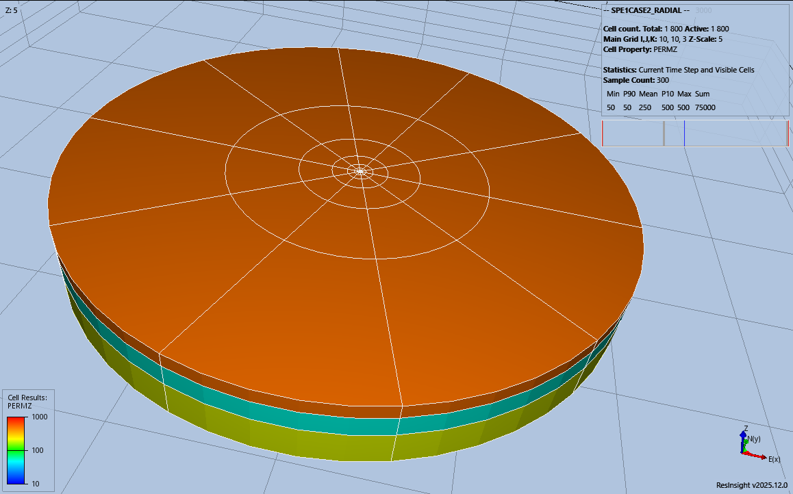
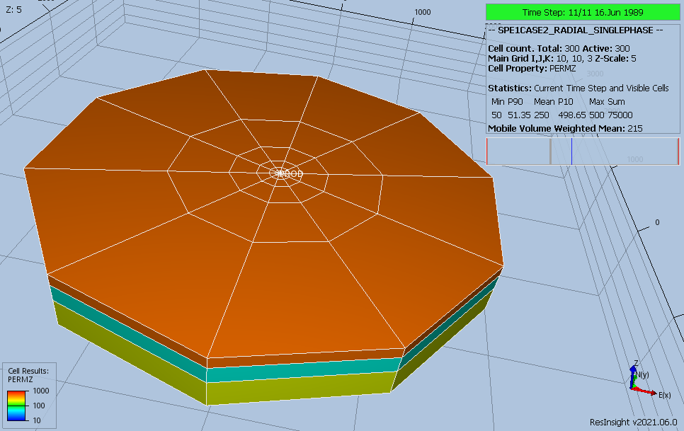
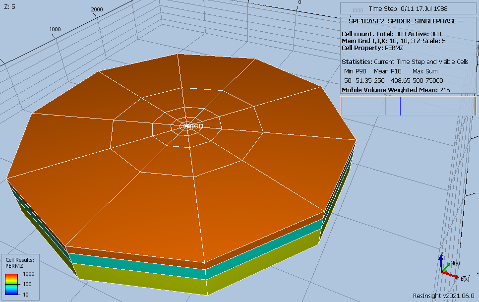

## Data Requirements


### Cartesian Regular Grids

This type of grid defines a regular orthogonal grid based on defining the sizes of all the cells in the x, y, and z directions and is normally employed when a complex structural model is not required. Figure 6.2 shows the SPE  Comparative Solution Project Number 1 (“SPE-CSP01”) as documented by Odeh [Odeh, A. “Comparison of Solutions to a Three Dimensional Black‐Oil Reservoir Simulation Problem.” JPT 33 (1981):13‐25.].




The model consists of a simple 10 x 10 x 3 (NX, NY, NZ) grid and is defined using the following GRID section keywords to define the grid geometry:


```
-- ==============================================================================
--
-- GRID SECTION
--
-- ==============================================================================
GRID
--
--       DEFINE GRID BLOCK SIZES IN THE X DIRECTION BASED ON NX x NY x NZ = 300)
--       (There Are In Total 300 Cells With Length 1000ft In X-Direction)
DX
         300*1000                                                               /
--
--       DEFINE GRID BLOCK SIZES IN THE Y DIRECTION (BASED ON NX x NY x NZ = 300)
--       (There Are In Total 300 Cells With Length 1000ft In Y-Direction)
DY
         300*1000                                                               /
--
--       DEFINE GRID BLOCK SIZES IN THE Z DIRECTION (BASED ON NX x NY x NZ = 300)
--
DZ
         100*20.0   100*30.0   100*50.0                                         /
--
--       DEFINE GRID BLOCK TOPS FOR THE TOP LAYER (BASED ON NX = 100, NY = 100)
--       (Layer 2 and 3 TOPS Calculated by Simulator)
TOPS
         25*3100  25*3105  25*3110                                              /
```


The rock property data required to complete the GRID section is as follows:


```
--
--      DEFINE POROSITY DATA FOR ALL CELLS (BASED ON NX x NY x NZ = 300)
--
PORO
        300*0.300                                                               /
--
--      DEFINE PERMY DATA FOR ALL CELLS (BASED ON NX x NY x NZ = 300)
--
PERMX
        100*500.0   100*50.0   100*200.0                                        /                                                                                 --
--      DEFINE PERMY DATA FOR ALL CELLS (BASED ON NX x NY x NZ = 300)
--
PERMY
        100*500.0   100*50.0   100*200.0                                        /
--
--      DEFINE PERMZ DATA FOR ALL CELLS (BASED ON NX x NY x NZ = 300)
--      (Not Defined in Original Paper So Assume That PERMX = PERMY = PERMZ)
PERMZ
        100*500.0   100*50.0   100*200.0                                        /
```


The above keywords define all the properties required for the GRID section for this type of grid geometry.


### Irregular Corner-Point Grids

This type of grid is an industry standard grid used to represent the structure of complex reservoirs [K. Ponting, D,  Corner Point Geometry in Reservoir Simulation,  Conference Proceedings, ECMOR I - 1st European Conference on the Mathematics of Oil Recovery, Jul 1989, cp-234-00003 dDOI= "https://doi.org/10.3997/2214-4609.201411305", European Association of Geoscientists & Engineers.]. Here a static modeling application is used to build the grid which is then exported and imported into a dynamic simulation model.  Figure 6.3 illustrates the skeleton grid for the Norne Field which has dimensions of 46 x 112 x 22 in the x, y, and z dimensions respectively. This results in a total of 113,344 cells although not all of these cells will be active in the model.




Similar to a Cartesian Regular Grid the grid geometry and properties must be defined for each cell. The formulation of the grid geometry is based on a corner-point geometry, where basically the coordinate lines or pillars are given, then the top and bottom surfaces for the cell are defined by specifying the depth (z-coordinates) of the cell’s corner points along each of the four adjacent pillars. The cell then forms an irregular hexahedron as depicted in Figure 6.4.  Note that the figure shows a corner-point cell which is more or less orthogonal, which is ideally what we want to minimize grid orientation effects.

The data required to define this type of grid consists of the SPECGRID keyword to define the dimensions of the grid, that is:


```
--       MAX     MAX     MAX     MAX     GRID
--       NDIVIX  NDIVIY  NDIVIZ  NUMRES  TYPE
SPECGRID
         46      112     22      1       F                                     /

```

A portion of the coordinate line data defined by the COORD keyword from the Norne model is shown on the next page.





```
COORD
-- X1           Y1             Z1          X2           Y2             Z2
-- ---          ---            ----        ---          ---            ----
   453114.000   7319921.000    3037.473    453114.000   7319921.000    3132.831
   453155.031   7319840.000    2983.933    453142.750   7319864.000    3173.572
   453196.094   7319759.000    3005.969    453171.500   7319807.500    3215.836
   453237.156   7319678.000    3000.265    453200.250   7319751.000    3217.250
   453278.188   7319597.000    2989.348    453229.031   7319694.000    3213.951
   453319.250   7319516.500    2995.680    453257.781   7319637.500    3215.323
   453356.250   7319443.500    3000.855    453308.750   7319537.000    3220.549
   453393.250   7319370.500    3005.252    453359.688   7319436.500    3210.393
   453423.969   7319310.000    3030.862    453394.219   7319368.500    3203.438
   453454.688   7319249.500    3036.870    453428.719   7319300.500    3190.770
   453485.406   7319189.000    3038.017    453463.219   7319232.500    3190.660
   453516.125   7319128.000    3045.027    453497.750   7319164.500    3188.813
   453546.844   7319067.500    3055.410    453532.250   7319096.500    3185.966
   453577.562   7319007.000    3066.541    453566.750   7319028.500    3184.325
   453608.281   7318946.500    3076.624    453601.250   7318960.500    3183.584
   453639.000   7318886.000    3086.938    453635.781   7318892.500    3184.057
   453669.719   7318825.500    3096.153    453670.281   7318824.500    3185.988
   453700.438   7318765.000    3104.703    453704.781   7318756.500    3188.598
   453731.156   7318704.500    3097.016    453739.281   7318688.500    3180.484
   453761.875   7318644.000    3088.539    453773.812   7318620.500    3177.091
   453780.000   7318608.000    3098.118    453796.562   7318575.500    3176.401
   453798.125   7318572.500    3096.691    453819.344   7318530.500    3172.299
…………………………………….
/
```

The final keyword to define an Irregular Corner-Point geometry grid is the ZCORN keyword that defines the depths of the cell corners. A portion of the ZCORN data from the Norne model is shown below.


```
ZCORN
   3037.473    2983.933    2983.933    3005.969    3005.969    3000.265
   3000.265    2989.348    2989.348    2995.680    2995.680    3000.855
   3000.855    3005.252    3005.252    3030.862    3030.862    3036.870
   3036.870    3038.017    3038.017    3045.027    3045.027    3055.410
   3055.410    3066.541    3066.541    3076.624    3076.624    3086.938
   3086.938    3096.153    3096.153    3104.703    3104.703    3097.016
   3097.016    3088.539    3088.539    3098.118    3098.118    3096.691
   3096.691    3093.886    3093.886    3085.393    3085.393    3081.957
   3081.957    3080.645    3080.645    3115.021    3115.021    3130.474
   3130.474    3204.674    3204.674    3193.187    3193.187    3169.512
   3169.512    3101.928    3101.928    3044.277    3044.277    3023.930
   3023.930    2964.244    2964.244    2900.178    2900.178    2875.715
   2875.715    2864.913    2864.913    2855.256    2855.256    2841.119
   2841.119    2826.261    2826.261    2806.556    2806.556    2781.052
   2781.052    2791.720    2791.720    2817.940    2817.940    2813.308
   2813.308    2788.492
…………………………………………………………………………………………………
/

```

The rock property data required to complete the GRID section is the same as for a Cartesian Regular grid, as defined in section 6.2.1 Cartesian Regular Grids and the data is defined using the same keywords.  The resulting Norne model showing the ternary solution variable is displayed in Figure 6.5.





### Radial Grids

Radial flow exists near the wellbore and linear or Cartesian flow occurs within the reservoir away from the wellbore.  For field-wide studies the growth or decay of reservoir volumes activated by unsteady-state flow is small and hence linear flow is modeled via a linear grid,  using either a Cartesian Regular Grid or an Irregular Corner-Point Grid, in these type of studies.  On the other hand, for converging flow near wells the growth or decay of reservoir volumes activated by unsteady-state flow is large and radial flow should modeled.  Thus, radial flow is important in only very localized areas around the wells and linear flow is modeled in most reservoir studies, for example in full field or sector models. Consequently for investigating near well bore effects, radial models are used to investigate the behavior around the wellbore, for example in gas cusping and water conning studies, as one can see from Figure 6.6.




In both Cartesian Regular and  Irregular Corner-Point grids the dimension nomenclature is (x, y, z) for the x, y, and z planes. The corresponding nomenclature for Radial Grids is (r, theta, and z) for r or radius plane, theta for the angular plane measured in degrees, and z for the z plane.

In Figure 6.6 the radial grid has been labeled as a 2-D Cylindrical grid because there is no flow in the theta direction only in the r and z planes, whereas the 3-D Reservoir grid in the figure has flow in both the x and y planes as well as the z plane.  Figure 6.7 shows a typical 3-D radial grid with dimensions (10, 10, 3) in the (r, theta, z) dimensions taken from Odeh [Comparison of Solutions to a Three-Dimensional Black-Oil Reservoir Simulation Problem by Aziz S. Odeh,-- Journal of Petroleum Technology, January 1981.].




Radial grids normally have a fine grid near the wellbore which then expands logarithmically away from the wellbore. This is illustrated in Figure 6.7 where one can clearly see the four most outer rings, but not the inner six. This type of grid makes solving the flow equations more challenging than conventional Cartesian and Irregular Corner-Point grids, where the cell pore volume distribution is relatively similar for neighboring cells, compared with Radial grids. For comparison, a typical conventional grid will have grid blocks size of 300, 300, 3 feet (or approximately 100m x 100m x 1m) spacing in the (x, y,  z) plane;  whereas a radial grid will utilize an inner most radius of between 0.25 to 1.0 foot in the R direction, and then logarithmically expand from the inner radius.  The Odeh110 example employs 0.25 ft. for the inner radius, and 1.75, 2.32, 5.01, 10.84, 23.39,  50.55, 109.21, 235.92, 509.68, and 1101.08 ft. for the outer radii.

Figure 6.7 is based on a 10 x 10 x 3 grid, where NX is the R dimensions, NY the THETA dimensions, and NZ the z dimensions on the DIMENS keyword in the RUNSPEC section. Thus, in order to fully define this radial grid the following RUNSPEC and GRID section keywords are required:


```
-- ==============================================================================
--
-- RUNSPEC SECTION
--
-- ==============================================================================
RUNSPEC
--
--       MAX     MAX     MAX
--       NDIVIX  NDIVIY  NDIVIZ
DIMENS
         10      10      3                                                     /
--
--       DEFINE RADIAL GRID GEOMETRY
--
RADIAL
-- ==============================================================================
--
-- GRID SECTION
--
-- ==============================================================================
GRID
--
--       INNER RADIUS OF FIRST GRID BLOCK IN THE RADIAL DIRECTION
--
INRAD
         0.25
/
--
--       DEFINE GRID BLOCK SIZES IN THE R DIRECTION
--
DRV
         1.75  2.32  5.01  10.84  23.39  50.55  109.21  235.92  509.68  1101.08 /
--
--       DEFINE GRID BLOCK SIZES IN THE THETA DIRECTION (BASED ON NY = 10)
--
DTHETAV
         10*36                                                                  /
--
--       DEFINE GRID BLOCK Z DIRECTION CELL SIZE (BASED ON NX x NY x NZ = 300)
--
DZ
         100*20.0   100*30.0   100*50.0                                         /
--
--       DEFINE GRID BLOCK TOPS FOR THE TOP LAYER (NX=10,NY=10,and NZ=3)
--
TOPS
         100*8325                                                               /
```

The rock property data required to complete the GRID section is as follows:


```
--
--       DEFINE POROSITY DATA FOR ALL CELLS (BASED ON NX x NY x NZ = 300)
--
PORO
         300*0.300                                                              /
--
--       DEFINE GRID BLOCK PERMR DATA FOR ALL CELLS (BASED ON NR x NY x NZ = 300)
--
PERMR
         100*500.0   100*50.0   100*200.0                                       /
--
--       DEFINE GRID BLOCK PERMTHT DATA FOR ALL CELLS (NX x NY x NZ = 300)
--
PERMTHT
         100*500.0   100*50.0   100*200.0                                       /
--
--        DEFINE GRID BLOCK Z DIRECTION CELL SIZE (BASED ON NX x NY x NZ = 300)
--
PERMZ
         100*500.0   100*50.0   100*200.0                                       /
```


The above keywords define all the properties required for the RUNSPEC and GRID sections for this type of grid geometry.


| Note Radial grids are currently not fully implemented in OPM Flow as the completion of the circle in the THETA direction is not supported. For reference only, this feature is activated via the COMPLETE parameter on the COORDSYS keyword in the GRID section. |
| --- |


OPM ResInsight is the 3D visualization software that is used to view the grid block property data and OPM Flow results (grid block pressures, fluid saturations, etc.). If the radial grid has a low number of angular cells, OPM ResInsight will automatically create a temporary Local Grid Refinement ("LGR") with higher angular refinement for improved visualization.  Figure 6.8 shows how the Odeh [Comparison of Solutions to a Three-Dimensional Black-Oil Reservoir Simulation Problem by Aziz S. Odeh,-- Journal of Petroleum Technology, January 1981.] radial model is rendered in OPM ResInsight.




The previous figure (Figure 6.8) shows how the model would be displayed if the commercial simulator run was loaded into OPM ResInsight. Support for displaying radial grids was added to OPM ResInsight in version 2025.12.

To overcome the display limitation in versions of OPM ResInsight prior to version 2025.12, OPM Flow converts radial grids to Irregular Corner-Point Grids (Cartesian coordinates) and adjusts the model to reflect radial coordinates. Thus, the OPM Flow radial model has the same pore volumes as the commercial simulator radial model. However, since this conversion is no longer necessary it is anticipated that it will be removed in a future version of OPM Flow.




Figure 6.9 shows how the OPM Flow run is displayed in OPM ResInsight. As will be shown in section 6.2.4 Spider Grids, both Spider and Radial grids generated by OPM Flow will be displayed the same, as they both use Irregular Corner-Point Grid geometry. The difference is that the radial model’s pore volumes are adjusted to match the radial geometry pore volumes, whereas, the Spider grid volumes are not adjusted.


### Spider Grids

Spider Grids have been implemented as an alternative to Radial Grids. They convert standard radial geometry keywords in the grid section into an Irregular Corner-Point Grid, which can then be visualized in OPM ResInsight. The only difference is that in the RUNSPEC section the SPIDER keyword is used instead of the RADIAL keyword.




Figure 6.10 illustrates the spider grid for the Odeh111 example, which is not dissimilar to the conventional radial model shown in Figure 6.7 and is identical to OPM Flow’s radial model implementation shown in Figure 6.9.

Naturally, there will be differences in the results between radial and spider grid formulations, but the user should use their own judgement if the differences are relevant.

Again, Figure 6.10 is based on a 10 x 10 x 3 grid, where NX is the R dimensions, NY the THETA dimensions and NZ the z dimensions on the DIMENS keyword in the RUNSPEC section. The only difference between this example and the previous example for radial grids is that the RADIAL keyword has been replaced by the SPIDER keyword in the RUNSPEC section, all the other keywords are exactly the same.


```
-- ==============================================================================
--
-- RUNSPEC SECTION
--
-- ==============================================================================
RUNSPEC
--
--       MAX     MAX     MAX
--       NDIVIX  NDIVIY  NDIVIZ
DIMENS
         10      1       3                                                     /
--
--       DEFINE SPIDER GRID GEOMETRY (OPM FLOW RADIAL GRID KEYWORD)
--
SPIDER
-- ==============================================================================
--
-- GRID SECTION
--
-- ==============================================================================
GRID
--
--       INNER RADIUS OF FIRST GRID BLOCK IN THE RADIAL DIRECTION
--
INRAD
         0.25
/
--
--       DEFINE GRID BLOCK SIZES IN THE R DIRECTION
--
DRV
         1.75  2.32  5.01  10.84  23.39  50.55  109.21  235.92  509.68  1101.08 /
--
--       DEFINE GRID BLOCK SIZES IN THE THETA DIRECTION (BASED ON NY = 10)
--
DTHETAV
         1*45                                                                   /
--
--       DEFINE GRID BLOCK Z DIRECTION CELL SIZE (BASED ON NX x NY x NZ = 30)
--
DZ
         10*20.0   10*30.0   10*50.0                                            /
--
--       DEFINE GRID BLOCK TOPS FOR THE TOP LAYER (NX=10,NY=1,and NZ=3)
--
TOPS
         10*8325                                                               /
```


The rock property data required to complete the GRID section is as follows:


```
--
--       DEFINE POROSITY DATA FOR ALL CELLS (BASED ON NX x NY x NZ = 30)
--
PORO
         30*0.300                                                              /
--
--       DEFINE GRID BLOCK PERMR DATA FOR ALL CELLS (BASED ON NR x NY x NZ = 30)
--
PERMR
         10*500.0   10*50.0   10*200.0                                         /

--
--       DEFINE GRID BLOCK PERMTHT DATA FOR ALL CELLS (NX x NY x NZ = 30)
--
PERMTHT
         10*500.0   10*50.0   10*200.0                                        /
--
--        DEFINE GRID BLOCK Z DIRECTION CELL SIZE (BASED ON NX x NY x NZ = 300)
--
PERMZ
         10*500.0   10*50.0   10*200.0                                       /

```

The above keywords define all the properties required for the GRID section for this type of grid geometry.


### Rock Properties

Regardless of the grid type used to define the structural component of the model, certain static properties must be specified to complete the grid definition. These include identifying active and inactive grid blocks, porosity, permeability, and reservoir quality through the net-to-gross fraction (“NTG”). These parameters must be set for each cell in the model


| Property | Description | Cartesian and Irregular Corner-Point Grids Keywords | Radial Grid Keywords |
| --- | --- | --- | --- |
| Active and Inactive cells | Defines if a cell in the model is active by setting the ACTNUM property for a cell to either one or inactive by setting the value to zero. Cells that are inactive in the model are ignored computationally and can act as barriers to flow.  Thus, a shale in a conventional reservoir is normally treated as non-reservoir and is made inactive either by setting the ACTNUM, PORO, or NTG to zero for the cells representing the shale. | ACTNUM |  |
| Porosity | Porosity is a measure of the space in a reservoir rock. It is defined as the fraction of the total bulk volume of the rock not occupied by solids, that is it is the fraction of the cell that is porous and contains the reservoir fluids. | PORO |  |
| Reservoir Quality | Reservoir quality of the cell in terms of the gross volume derived from the structural grid and the net volume available for fluid flow in the model is expressed as a fraction from zero to one. A zero values means the cell does not contribute to flow and therefore is made inactive. A value of one means the gross and net volumes are identical for the cell | NTG |  |
| Permeability | Permeability is a measure of the ease with which a fluid will flow through a porous medium. In numerical models permeability is dependent on the direction of flow, that is x, y, and z directions in Cartesian and Irregular Corner-Point Grids, and the radial, theta, and z directions in radial grids. There are various formulations for permeability, absolute permeability, effective permeability, gas permeability, liquid permeability, etc., and the values are saturation dependent. Thus, values entered should be consistent with the relative permeability entered in the PROPS section. Normally Kair (Sg=1.0) should be entered for the cell permeability and the values may or not be corrected for overburden or humidity drying effects. Correcting for liquid flow and saturation end points etc., is accomplished by the relative permeability curves. For example, if Kair (Sg=1.0) has been entered for the cell permeability when Krg (Sg=1-Swc) should be less than one. | PERMX PERMY PERMZ | PERMR PERMTHT PERMZ |

*Table 6.1: Key Static Grid Properties*


| Note Static grid properties are frequently generated from a static earth model using petrophysical evaluation of the well logs and propagated through to the model based on a variety of geostatistical techniques. Petrophysical evaluations are conducted in either the  “Total” or the “Effective” porosity domain, and it is important that all the rock property data entered into the model is of the same basis. It is not important which porosity domain is used, as long as all the data is in the same domain. |
| --- |


Pore volume and transmissibility are common terms in the reservoir simulation vernacular. Pore volume is self-explanatory, that is, given the grid property data the pore volume for each cell is calculated using:


| $\mathit{PV} = \mathit{Cell}\mathit{Gross}\mathit{Volume}\times \mathit{PORO}\times \mathit{NTG}\times \mathit{ACTNUM}$ | (6.1) |
| --- | --- |

Where

PV 			= the pore volume of a cell,

Cell Gross Volume 	= the gross volume (or bulk volume) calculated from the structural

parameters of the cell,

PORO			= cell porosity,

NTG			= cell net-to-gross ratio, and

ACTNUM			= active and inactive cell indicator.


Any cell with a pore volume equal to zero is made inactive automatically in the model. However, there may be some cells that have small pore volumes that may negatively impact computational performance of the model. If this is the case then the MINPV and MINPORV keywords in the GRID section can be used to make these cells inactive.

There has been a trend in the industry in recent years to not apply petrophysical cut-offs to determine net volumes in static models. This results in large models with numerous cells with very low porosity values (less than 0.01 for example) and corresponding very low permeabilities. The theory behind this approach is that the numerical model will determine the effective (or net) reservoir. However, the approach is questionable as by not applying net pay cut-offs, the in-place and recoverable volumes may not satisfy Reserve reporting requirements and guidelines to various agencies. Secondly, although this may be appropriate in unconventional reservoirs, as all the cells in the model will have similar values of porosity and permeability, but in conventional reservoirs this methodology will lead to severe computational issues when attempting to run the model, due to very tight cells being next to relative high permeability cells. Again, the MINPV and MINPORV keywords can be used to resolve this issue.

Transmissibility on the other hand is more complex as it relates the flow from one cell face to another cell face and is a function of the area open to flow, the direction of flow, the permeability, saturation, and viscosity of the phases flowing between the cells. For single phase flow in a Cartesian grid the x-direction transmissibility is of the form:


| ${T}_{{x}_{i+½, j}} = {\left[\frac{{k}_{x} h (\mathit{Δy})}{μ (\mathit{Δx})}\right] }_{i+½, j}$ | (6.2) |
| --- | --- |


As transmissibility is a property of the flow between two cell faces, not a block centered grid cell property like porosity or permeability, then the nomenclature for transmissibility is different. In OPM Flow, the transmissible of cell face Tx(i, j, k) is the transmissibility between cells (i, j, k) and (i+1, j, k).  In some simulators it would be between (i, j, k) and (i-1, j, k).  This is important to note if manual modifications to cell connections are to be made in the model.


Modifications to basic grid property data (porosity, permeability, etc.) can only be done in the GRID section, thereafter only the calculated pore volumes and transmissibilities are available for adjustment in the EDIT section. Some engineers use the GRID section for the basic model formulation, and the EDIT section to document the changes to the “base” model using the PORV, TRANX, TRANY, TRANZ, etc. keywords.
