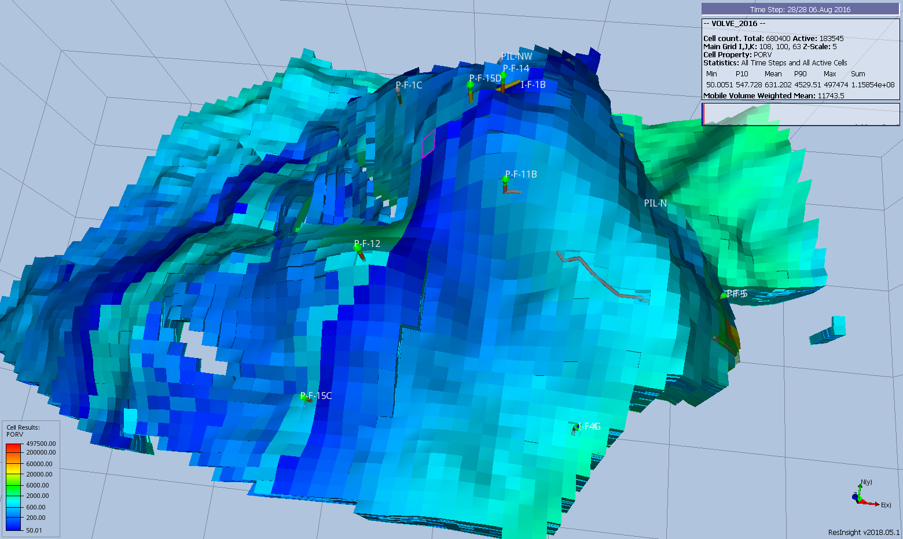
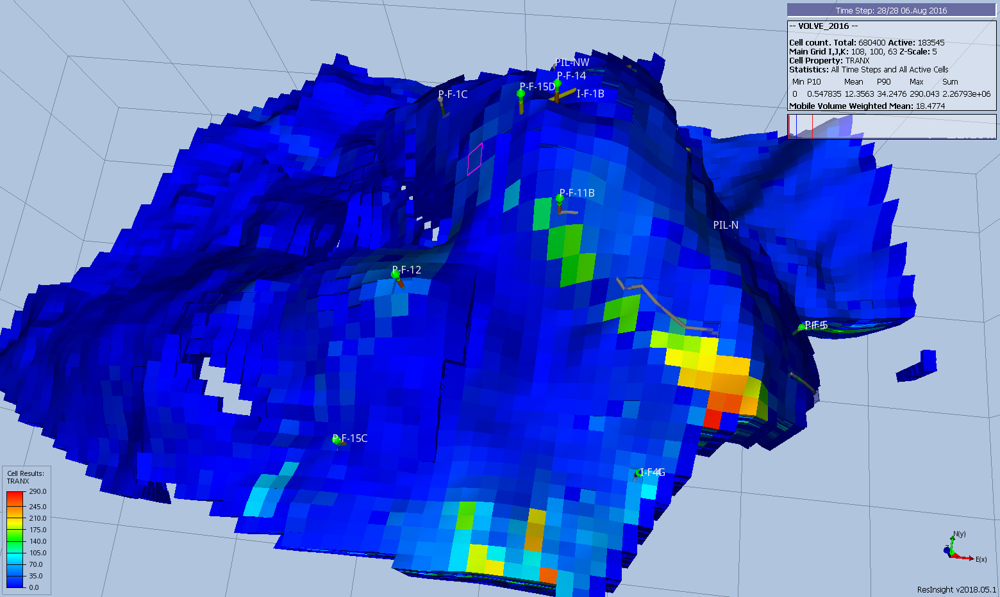

## Data Requirements

As the primary purpose of this section is to modify the simulator’s calculated pore volumes and transmissibilities, then the properties used to define these arrays must have been fully defined in the [GRID](#kw-GRID) section.  The arrays available for modification in the [EDIT](#kw-EDIT) section are listed in @tbl-7-1 together with the associated [GRID](#kw-GRID) arrays used to generate the [EDIT](#kw-EDIT) property array.

| Cartesian and Irregular Corner-Point Grids Keywords | Radial Grid Keywords |  |  |
| --- | --- | --- | --- |
| [GRID](#kw-GRID) | [EDIT](#kw-EDIT) | [GRID](#kw-GRID) | [EDIT](#kw-EDIT) |
| [TOPS](#kw-TOPS) | [DEPTH](#kw-DEPTH) | [TOPS](#kw-TOPS) | [DEPTH](#kw-DEPTH) |
| [DX](#kw-DX) | [PORV](#kw-PORV) | [DR](#kw-DR) | [PORV](#kw-PORV) |
| [DY](#kw-DY) | [DTHETA](#kw-DTHETA) |  |  |
| [DZ](#kw-DZ) | [DZ](#kw-DZ) |  |  |
| [DZNET](#kw-DZNET) | [DZNET](#kw-DZNET) |  |  |
| [PORO](#kw-PORO) | [PORO](#kw-PORO) |  |  |
| [NTG](#kw-NTG) | [NTG](#kw-NTG) |  |  |
| [PERMX](#kw-PERMX) | [TRANX](#kw-TRANX) | [PERMR](#kw-PERMR) | [TRANR](#kw-TRANR) |
| [MULTX](#kw-MULTX) | [MULTR](#kw-MULTR) |  |  |
| [PERMY](#kw-PERMY) | [TRANY](#kw-TRANY) | [PERMTHT](#kw-PERMTHT) | [TRANTHT](#kw-TRANTHT) |
| [MULTY](#kw-MULTY) | [MULTTHT](#kw-MULTTHT) |  |  |
| [PERMZ](#kw-PERMZ) | [TRANZ](#kw-TRANZ) | [PERMZ](#kw-PERMZ) | [TRANZ](#kw-TRANZ) |
| [MULTZ](#kw-MULTZ) | [MULTZ](#kw-MULTZ) |  |  |
| Notes: |  |  |  |
: EDIT Section Arrays Available for Modification {#tbl-7-1}
An example pore volume array ([PORV](#kw-PORV) property) from the Volve^[The Volve Data was approved for data sharing in 2018 by the initiative of the last Operating company, Equinor and approved by the license partners ExxonMobil E&P Norway AS and Bayerngas Norge AS in the end of 2017.] field is shown in Figure 7.1 and Figure 7.2 illustrates the model’s transmissibility in the x-direction ([TRANX](#kw-TRANX)).

