## Data Requirements

For all phases activated in the model a complete description of the PVT behavior (PVT tables) and fluid flow behavior (saturations tables) is required. As the data is fluid type dependent, the next two sections attempt to define the appropriate keywords for the various activated fluid types. The first section outlines the fluid PVT property requirements and the second section summarizes the keywords associated with fluid flow property data, namely the relative permeability and capillary pressure data.

### Fluid Properties

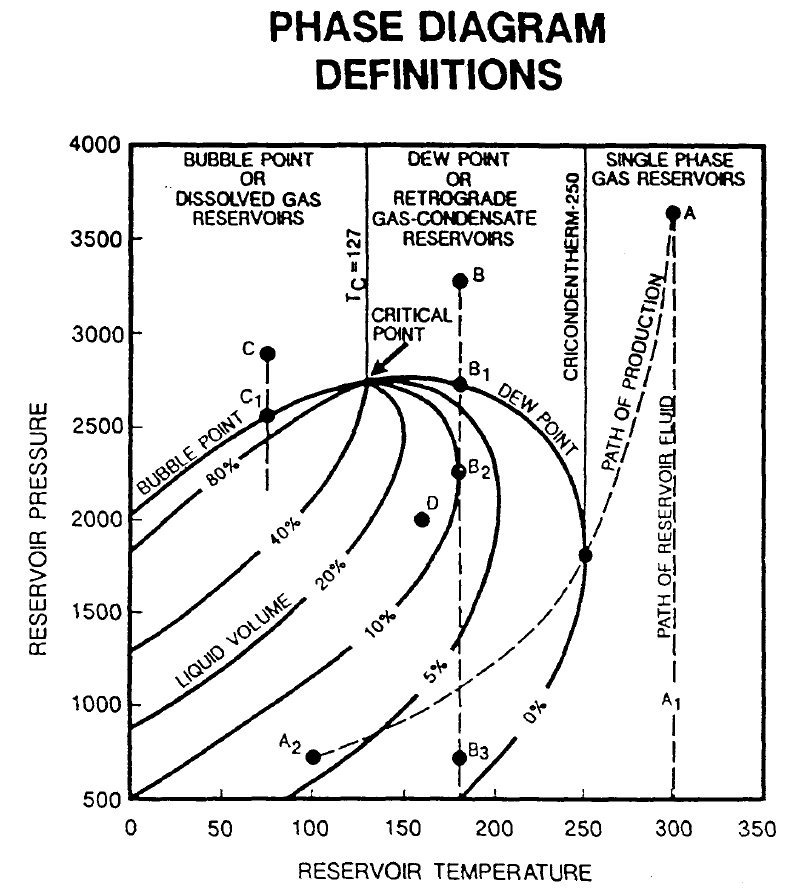

A phase is a portion of a system which is (1) homogeneous in composition, (2) bounded by a physical surface, and (3) mechanically separable from other phases which may be present. The most important phases which occur in petroleum production are liquid phases (oil, distillate, condensate, and water) and a vapor or gas phase (natural gas) component. Separators are used to separate the gas, water, and hydrocarbon liquid phases produced from wells. Solid phases also occur in petroleum production, mainly as:

(1) paraffin or other deposits within the producing formation, in the tubing, and in the surface equipment;

(2) gas hydrates which may freeze and clog gas-flow lines and equipment; and

(3) sand or reservoir rock [Bradley, H. B.: “Petroleum Engineering Handbook”, Society of Petroleum Engineers, Richardson, Texas, USA.].

The phase behavior of petroleum systems is represented by a Pressure-Volume-Temperature (“PVT”) phase diagram, as illustrated in Figure 8.1, which shows a typical phase diagram after Clark [Clark, Norman, “It Pays to Know Your Petroleum”,   World Oil,  March and April,  1953.].

Several important definitions should be noted from Figure 8.1 that describes how a fluid behaves with respect to the composition, pressure, and temperature,  namely:

- Bubble Point: Pressure at which the first bubble of gas is formed.
- Dew Point: Pressure at which the last drop of liquid turns to gas.
- Critical Point: Point at which all properties of liquid and gas are identical, the point where the dew point and bubble point curves join.
- Cricondentherm: Temperature above which two phases cannot co-exist regardless of pressure.
- Cricondenbar:	Pressure above which two phases cannot co-exist regardless of the temperature

Multi-component hydrocarbon systems are most accurately defined by their compositions, which are usually expressed as mole fractions of the components methane, ethane, propane, isobutane, n-butane, iso-pentane, n-pentane, hexanes, and heptanes and heavier (heptanes plus). The heptanes-plus fraction is usually defined by its average molecular weight, its specific gravity, and/or the fractions which boil off in selected temperature ranges. In addition to hydrocarbons, many naturally occurring petroleum systems also contain hydrogen sulphide, nitrogen, carbon dioxide, and helium in quantities which are sufficiently large to appreciably affect the phase behavior of the system (see GPA Standard 2145 [Gas Processors Association, GPA, "Standard 2145 - Physical Constants of Paraffin Hydrocarbons and Other Components of Natural gas", 1986.] and Standing (1952) [Standing, M. B.:” Volumetric and Phase Behaviour of Oil Field Hydrocarbon Systems”, Renihold Publishing Corp., New York City (1952).] for additional information).

#### Gas Fluid Properties

The Ideal Gas Law is based on the theory of gases, a mathematical equation called an Equation-of-State that can be derived to express the relationship existing between pressure, volume, and temperature, for a given quantity of gas. This relationship is called the Ideal Gas Law, and is expresses mathematically as:

|  | (8.1) |
| --- | --- |

where

P 	= 	pressure (psia or Pa),

T 	= 	temperature (oR = 459.67 + oF or K = 273.15 + oC),

V 	= 	volume of the gas (ft3 or m3),

n	= 	number of moles of gas (lb-mole or g-mol), and

R	= 	universal gas constant which has the value of approximately

10.732 psi.ft3/lb-mole/oR or 8.314 Pa.m3/g-mol/K.

However, the above equation of state is not applicable for Real Gases observed in petroleum reservoirs. In dealing with gases at a very low pressure, the ideal gas relationship (equation of state) is a convenient and accurate, within 2 - 3% at atmospheric conditions, while for pressures and temperatures found in petroleum reservoirs the physical properties calculated can lead to errors in excess of 500%. This is because real gases (natural gases) do not behave as an ideal gas. Basically the magnitude of deviations of real gases from the conditions of the ideal gas law increases with increasing pressure and temperature, and varies widely with the composition of the gas. The reason for this is that the perfect gas law was derived under the assumption that the volume of molecules is insignificant and no molecular attraction or repulsion takes place. This is not the case for real gases.

In order to express a more exact relationship between the variables P, V, and T, a correction factor called the gas compressibility factor (the gas deviation factor, or simply the Z-factor) must be introduced into the ideal gas law, that is:

|  | (8.2) |
| --- | --- |

where

P 	= 	pressure (psia or Pa),

T 	= 	temperature (oR = 459.67 + oF or K = 273.15 + oC),

V 	= 	volume of the gas (ft3 or m3),

n	= 	number of moles of gas (lb-mole or g-mol),

R	= 	universal gas constant which has the value of approximately

10.732 psi.ft3/lb-mole/oR or 8.314 Pa.m3/g-mol/K, and

Z 	=  	compressibility factor for the real gas.

For an ideal gas, the gas compressibility factor is equal to one, while for a real gas, the Z-factor is greater or less than one depending on the pressure, temperature, and composition of the gas.  The Z-factor can be calculated from the composition of the gas or from various correlations including Standing [Standing, M.B. and Katz, D.L.: “Density of Natural Gases,” Trans., AIME (1942) 146, 140-44.] and Dranchuk, P. M., Purvis, R. A., and Robinson [Dranchuk, P. M., Purvis, R. A., and Robinson, D. B., "Computer Calculations of Natural Gas Compressibility Factors Using the Standing and Katz Correlation", Institute of Petroleum Technical Series, No. IP 74-008, 1974.].

Gas Density (ρg): Depends on composition, temperature, and pressure at which the gas is measured, it is defined as the ratio of mass (m) to volume (V), that is:

|  | (8.3) |
| --- | --- |

where [MW](#REF_HEADING_KEYWORD_MW) is the molecular weight of the gas and ρg has units of lbm/ft3 and kg/m3 for field and metric units, respectively in equation (8.3). Gas density is often reported as Relative Density, that is relative to air, as per 0.65 (air = 1).

Gas Formation Volume Factor (E): Is used to relate the volume of gas, as measured at reservoir conditions, to the volume of gas as measured at standard conditions (60 oF and 14.7 psia, or 15 oC and 101.325 kPa). This gas property is then defined as the actual volume occupied by a certain amount of gas at a specified pressure and temperature, divided by the same amount of gas at standard conditions.  Thus the gas formation volume factor can be expressed as:

|  | (8.4) |
| --- | --- |

and substituting equation (8.3) into (8.4) we can derive the gas formation volume factor for a given reservoir pressure and temperature:

|  | (8.5) |
| --- | --- |

| Note In oilfield units when we are dealing with oil reservoirs the gas formation volume factor is more commonly denoted as Bg and has the units of rb/scf. Whereas for gas reservoirs, the gas formation volume factor is Eg and has the units scf/rcf and is often described as the Gas Expansion Factor or GEF. |
| --- |

Gas Isothermal Compressibility: A knowledge of the variability of a fluid compressibility with pressure and temperature is essential in performing many reservoir engineering calculations. For a liquid phase, the compressibility is small and is usually assumed to be constant. Whereas for a gas phase, the compressibility is neither small nor constant. By definition the isothermal gas compressibility, cg, of a substance is the change in volume per unit volume, for a unit change in pressure, i.e.

|  | (8.6) |
| --- | --- |

Most simulators calculate the isothermal gas compressibility based on the entered PVT data, so it is not necessary to enter this variable directly. If needed the correlation of Meehan, D. N., and Lyons, W. K. [Meehan, D. N., and Lyons, W. K., “Programmable Calculations for Gas Compressibility”, Oil and Gas Journal, Oct. 8, 1979.] may be used to estimate the values.

Gas Viscosity (μg): The gas viscosity of a fluid is a measure of the internal fluid friction (resistance) to flow. If the friction between layers of the fluid is small, i.e., low viscosity, an applied shearing force will result in a large velocity gradient. As viscosity increases, each fluid layer exerts a larger frictional drag on the adjacent layers and velocity gradient increases. The viscosity of a fluid is generally defined as the ratio of the shear force per unit area to the local velocity gradient. Note that gas viscosity is not normally measured in the laboratory because it can be estimated precisely from empirical correlations. Gas viscosity increases with increasing temperature and pressure. Usually it is not measured but is obtained from the Carr, Kobayashi and Burrows [Carr, N.L., Kobayshi, R., and Burrows, D.B.; “Viscosity of Natural Cases Under Pressure”, Trans. A.I.M.E. (1954), 201 pp. 264-272.] correlation, which include corrections for H2S, CO2, and N2.  For sour gases, this correlation is preferred to the Lee, Gonzalez and Eakin [Lee, A.L., Gonzalez M.H. and Eakin B.E.: “The Viscosity of Natural Gases”, J.Pet.Tech. (1966) 18, pp. 997-1000.] formulation (which does not account for H2S, CO2 and N2).  Typically, gas viscosity is in the range of 0.015 to 0.03 cp.

Condensate-Gas Ratio (“CGR”): Defines the volume of hydrocarbon liquid that will dissolve in a unit volume of gas at a certain pressure and temperature and has units of stb/MMscf and sm3/sm3 for field and metric units, respectively.  Field units values range from 1 or 2 stb/MMscf for dry gas reservoirs, up to 100 stb/MMscf for wet gas reservoirs.  The empirical correlation of Meethan Vogel [Meehan, D. N., and Vogel, E. L, HP-41 Reservoir Engineering Manual, PennWell Books, 1982.] can be used to estimate CGR (Rv).

Water Gas Ratio (“WGR”): Gas in the reservoir is usually saturated with water vapor, but as the gas moves up the wellbore, the temperature and pressure decrease, and water condenses out of the gas.  Often, water that is produced at the surface is not formation water but is water of condensation.  Confirmation of this is a low water-gas ratio (1 – 5 bbl/MMscf) and low water salinity (less than 100 ppm NaCl). The water vapor content of a gas depends on pressure, temperature, and composition of the gas. As pressure decreases, the water vapor content increases. Conversely, as temperature decreases, the water vapor content decreases. Units are stb/Mscf (although often quoted as stb/MMscf) and sm3/sm3 for field and metric units, respectively.  Bubacek’s [Bukacek, R.F.: “Equilibrium Moisture Content of Natural Gases,” Bull., Inst. of Gas Technology Bulletin (1955).] empirical correlation for sweet natural gas (methane) may be used for gases without H2S to calculate WGR or McKetta and Wehe’s [McKetta, J.J. and Wehe, A.H.: “Use This Chart for Water Vapor Content of Natural Gases,” Petroleum Refiner (Aug. 1958) 153-54.] correlation that takes into account water salinity and gas gravity.  Finally Robinson et al [Robinson, J. N., et al., “Estimation of the Water Content of Sour Natural Gases”, Paper Number SPE 6098, 51st Annual Fall Technical Conference, SPE, New Orleans, Oct. 3–6, 1976.] and Wichert and Wichert’s [Wichert, G. C. and Wichert, E., “Chart Estimates Water Content of Sour Natural Gas”, O&GJ, March 29, 1993, pp. 61-64.] correlations may be used for sour natural gases (those containing H2S).

#### Oil Fluid Properties

For oil and condensate fluids we have a similar set of properties; however, oil properties are nearly always measured experimentally in the laboratory, as although there are many correlations available, they generally have low predictability unless tuned with the laboratory measured data. Thus, the main oil properties are:

Oil Density (ρo): Like gas density, oil density depends on composition, temperature, and pressure at which the fluid is measured, it is defined as the ratio of mass (m) to volume (V), that is:

|  | (8.7) |
| --- | --- |

with units of lbm/ft3, kg/m3, and g/cm3. Note that density is quoted in various units even within a given unit system. In oilfield (English) units it is quite common to quote density as a gradient that is psi/ft, this is because fluid gradients are a common form of in-situ measurement that can be easily related to density by:

|  | (8.8) |
| --- | --- |

For example, for an oil density measured as 0.338 psi/ft, the actual in-situ density would simply be:

|  | (8.9) |
| --- | --- |

Oil density can range from as low as about 0.270 psi/ft (0.62 g/cc) in the Malay Basin (offshore Malaysia) to as high as 0.429 psi/ft (0.99 g/cc) in the heavy oil deposits in Cold Lake (Canada). However, most common oil densities range from around 0.78 - 0.85 g/cc (0.338 - 0.369 psi/ft). When using oil field units most engineers  drop the m in the lbm units term, and therefore quote density as lb/ft3 (or lb/cu. ft.), as lbm is implied.

Oil Relative Density (γo) defines the ratio of the density of a known material to the density of reference material, at standard conditions of pressure and temperature. Standard conditions vary throughout the world, but for oil field units one normally uses14.7 psia and 60 oF, while for SI units some areas use 101.325 kPa and 15 oC . The reference material for liquids is always water, and thus the Oil Relative Density is defined as:

|  | (8.10) |
| --- | --- |

Since the density of water at 14.7 psia and 60 oF is 62.4 lb/ft3, then we have:

|  | (8.11) |
| --- | --- |

For SI units, with density measured in kg/m3, relative density is:

|  | (8.12) |
| --- | --- |

Commonly relative density is quoted with reference to the reference phase, for example, γo = 0.780 (water = 1).

The American Petroleum Institute (“API”) classifies oils based on an API gravity (γAPI), or degrees API (oAPI), the relationship between relative density (γo) of oil and API gravity (γAPI) is given by:

|  | (8.13) |
| --- | --- |

where

γo	= oil gravity (water = 1.0),

ρo	= oil density (lb/ft3 or kg/m3), and

γAPI	= API gravity (oAPI).

API density is commonly reported at the well site.

Bubble Point (Saturation Pressure):  The bubble point pressure, or saturation pressure (Pb or Psat), is defined as the pressure at which the first bubbles of gas appear from a liquid as the pressure declines. The correlations given in the oil formation volume section (later on), also have the equivalent bubble point pressure correlations. It should be noted that the comments addressing the application of these correlations in the oil formation volume factor section, are equally applicable here.

Gas-Oil Ratio (“GOR”): The GOR, (Rs) is defined as the number of standard cubic meters of gas that will dissolve in one stock tank meter cubed of crude oil at a certain pressure and temperature. The solubility of a natural gas in a crude oil is a strong function of the pressure, the temperature, the API gravity, and gas gravity. For a particular gas and crude oil to exist at a constant temperature, the solubility increases with pressure until the saturation pressure is reached. At the saturation pressure (bubble point pressure) all the available gases are dissolved in the oil, and the gas solubility reaches its maximum value. Rather than measuring the amount of gas that will dissolve in given stock tank crude oil as the pressure is increased, it is customary to determine the amount of gas that will come out of the sample of reservoir crude oil.

Oil Formation Volume Factor (Bo): The oil formation factor, Bo, is defined as the ratio of the volume of oil (plus the gas in solution) at the prevailing reservoir pressure and temperature, to the volume of oil at standard conditions. Oil formation volume factor is generally greater than or equal to one. Mathematically we can express the oil formation volume factor as:

|  | (8.14) |
| --- | --- |

where

Bo	= oil formation volume factor (rb/stb or m3/Sm3),

Vrc	= volume of oil at reservoir conditions (rb or m3), and

Vsc	= volume of oil at standard conditions (stb or Sm3).

Values of oil FVF at reservoir temperature and various reservoir pressures can be obtained from a standard PVT analysis of a reservoir fluid sample. However, if this data is unavailable, the geologist/engineer must then resort to empirical correlations, such as Standing [Standing, M. B.: “A Pressure-Volume-Temperature Correlation for Mixtures of California Oils and Gases”, Drill, and Prod. Prac., API (1947).], Vasquez and Beggs [Vasquez M. and Beggs H. D.: “Correlations for Fluid Physical Property Prediction”, J. Pet. Tech. (June 1980).], or Glasø [Glasø, O.: “Generalized Pressure-Volume-Temperature Correlations”, J.Pet.Tech. (May 1980).]. Generally Bo ranges from a low of 1.05 for heavy oils to a high of 2.5 rb/stb for volatile oils. Care should be exercised when applying any of the aforementioned correlations, as there is significant variation between the various correlations. In general, a given correlation may be more appropriate for a geological basin based on comparing actual measured PVT data from other fields with the correlation predicted results.

Oil Isothermal Compressibility (co): The oil isothermal compressibility is defined as the rate of change in volume with pressure increase per unit volume of liquid, all variables other than pressure being constant. Thus, by definition, isothermal compressibility of a substance is defined mathematically by the following expression:

|  | (8.15) |
| --- | --- |

where

co	= 	oil isothermal compressibility (1/kPa),

V	= 	oil volume (m3), and

P	= 	pressure (kPa).

In terms of the oil formation volume factor, we can derive:

|  | (8.16) |
| --- | --- |

where

co	= 	oil compressibility (1/kPa), and

Bo	= 	oil formation volume factor (m3/Sm3).

Generally, the isothermal compressibility is determined from a laboratory PVT study. In cases where a study has not been performed, the correlations of Vasquez and Beggs [Vasquez M. and Beggs H. D.: “Correlations for Fluid Physical Property Prediction”, J. Pet. Tech. (June 1980).] or Ramey [Ramey, H. J.: “Rapid Methods for Estimating Reservoir Compressibilities”, J.Pet.Tech. (April 1964).] may be used.

Oil Viscosity (μo): Crude oil viscosity is an important physical property that controls and influences the flow of oil through porous media and pipes. The viscosity, in general, is defined as the internal resistance of the fluid to flow, and oil viscosity is a strong function of the temperature, pressure, oil gravity, gas gravity, and gas solubility. Oil viscosity can be classified into three main groups, based on the nature or state of the crude with respect to pressure, these are:

|  | The dead oil viscosity is defined as the viscosity of the oil at atmospheric pressure and temperature conditions (no gas in solution). |
| --- | --- |
|  | The saturated (bubble point) oil viscosity is defined as the viscosity of oil at the bubble point pressure and reservoir temperature. |
|  | The undersaturated oil viscosity is defined as the viscosity of the oil at a pressure above the bubble point and at reservoir temperature. |

Whenever possible, oil viscosity should be determined in the laboratory at reservoir conditions, and is normally included in a standard PVT analysis of the crude. However, if no data is available, the correlations of  Beggs and Robinson [Beggs, H. D. and Robinson J. R.: “Estimating the Viscosity of Crude Oil Systems”, J. Pet. Tech. (Sept., 1975).] and Andrade-Guzman-Reynolds [Andrade, E. N. da C., Nature, 125 (1930), 309.] may be employed.

#### Water Fluid Properties

Water fluid properties are similar to the oil fluid properties, and include:

Water Density (ρw): Water density has the same definition as oil density, equation (8.7), with units of lbm/ft3, kg/m3, and g/cm3.  Fresh water density at 14.7 psia and 60 oF is 62.4 lb/ft3, and for SI units at 101. 3 kPa and 15 oC, the density is 1000 kg/m3.  Note that density is quoted in various units even within a given unit system. In oilfield (English) units it is quite common to quote density as a gradient that is psi/ft, when laboratory data or actual water samples are unavailable. The density of formation water at reservoir conditions can be estimated roughly (usually to within +/−10%) from correlations such as McCain’s [McCain, W.D. Jr.: McCain, W.D. Jr. 1990. The Properties of Petroleum Fluids, second edition. Tulsa, Oklahoma: PennWell Books.] and  [Cain Jr., W.D. 1991. Reservoir-Fluid Property Correlations-State of the Art (includes associated papers 23583 and 23594 ). SPE Res Eng 6 (2): 266-272. SPE-18571-PA. http://dx.doi.org/10.2118/18571-PA.] correlations.

Water Formation Volume Factor (Bw): The water formation volume factor has the same definition as for the oil formation volume factor. Normally this property is estimated from correlations based on salt content, for example the Numbere et al [Numbere, D., Brigham, W. E., and Standing, M. B., Correlations for Physical Properties of Petroleum Reservoir Brines, Petroleum Research Institute, Stanford University, November, 1977).] correlation.

Water Viscosity (μw): Again, the definition is the same as for oil and is normally estimated from correlations based on salt content, for example by the Meehan [Meehan, D. N., “Estimating Water Viscosity at Reservoir Conditions”, Petroleum Engineer, July 1980.].

### Classification of Reservoirs by Fluid Type

Reservoir classification by fluid type includes the following reservoir fluids:

- Low Shrinkage Oil Reservoirs.
- High Shrinkage Oil Reservoirs.
- Volatile Oil Reservoirs.
- Dry Gas Reservoirs.
- Wet Gas Reservoirs.
- Retrograde Condensate Gas Reservoirs.

The following sections briefly outline the various reservoir types based on their fluid properties.

#### Low Shrinkage Oil Reservoirs

The phase diagram for a typical low shrinkage oil is shown in Figure 8.2 (after Clark [Clark, Norman, “It Pays to Know Your Petroleum”,   World Oil,  March and April,  1953.]), in this case the two-phase region covers a wide range of pressure and temperature (the critical temperature is above the reservoir temperature). The line marked 1 and 2 shows the effect of pressure reduction, with constant reservoir temperature, as the reservoir is produced. The dashed line shows the conditions encountered as the fluid travels up the tubing string and into the surface facilities.

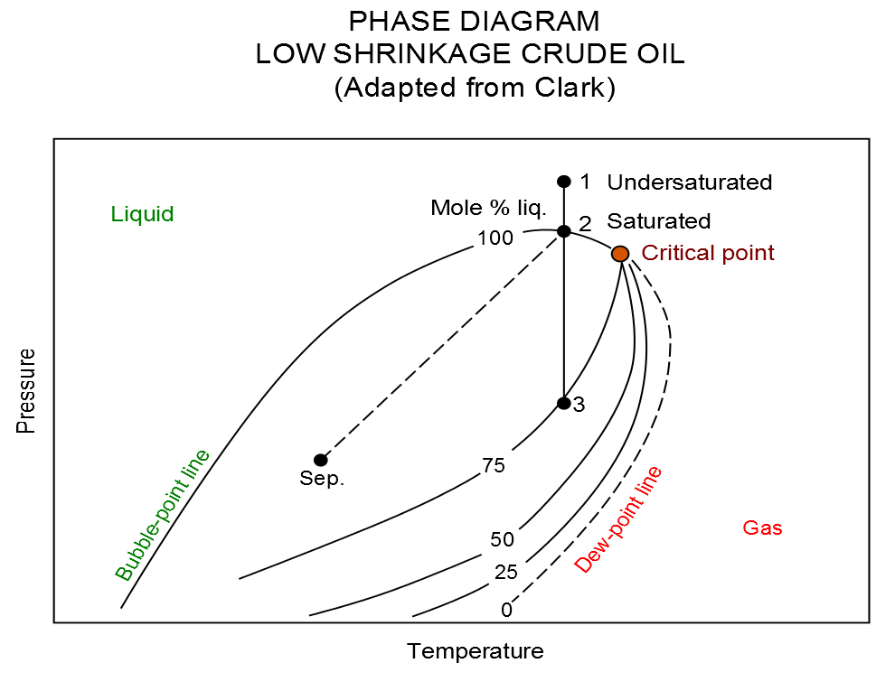

If the reservoir pressure and temperature is at point 2 on the phase diagram, then the oil is at bubble point pressure and is said to be saturated, i.e., the oil contains the maximum amount of dissolved gas at the given conditions. However, if the reservoir conditions are at point 1 on the phase diagram, then the oil is said to be undersaturated. That is the oil is able to dissolve more gas at the current reservoir pressure and temperature.

The term low shrinkage oil is derived from the fact that oil shrinkage is small, i.e., with an oil formation volume factors less than 1.5. This oil can be described as having a broad based phase envelope, high percentage of liquid, high proportion of heavier hydrocarbons, GOR's less than 500 scf/stb or 100 Sm3/m3, oil gravity 30 oAPI or heavier, and the stock tank liquid being black or a deep color. If the oil has a very low GOR and therefore has an oil formation volumes factor close to one, as observed in heavy oil reservoirs, then it is common to model this type of reservoir neglecting the gas phase. That is this type of reservoir fluid is typically modeled as a two-phase oil-water system using a black-oil formulation, which results in greater computational efficient due to having only two phases as opposed to the three phases in an oil-gas-water system.

#### High Shrinkage Oil Reservoirs

A high shrinkage oil's phase diagram is shown in Figure 8.3.

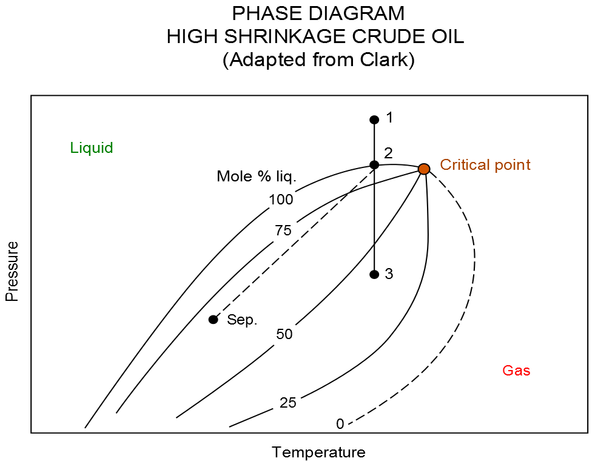

This type of reservoir fluid is characterized by not so broad a phase envelope, fewer heavier hydrocarbons, deep colored stock tank fluid, oil gravity lighter than 50 oAPI, GOR less than 8000 scf/stb or 1500 Sm3/m3, and oil formation volume factors greater than 1.5 Sm3/m3.

#### Dry Gas Reservoirs

Natural gas that occurs in the absence of condensate or liquid hydrocarbons, or gas that had condensable hydrocarbons removed, is called dry gas. It is primarily methane with some intermediates. The hydrocarbon mixture is solely gas in the reservoir and there is no liquid (condensate surface liquid) formed either in the reservoir or at surface.

The phase diagram for a dry gas reservoir is illustrated in Figure 8.4.

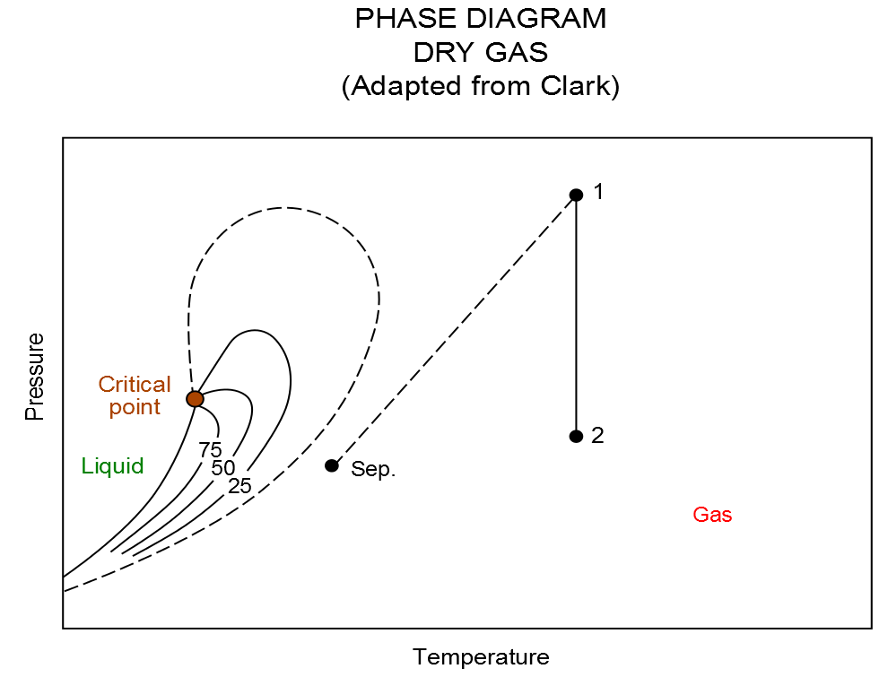

Notice that the separator conditions lie outside the phase envelope in the gas region. The term dry indicates that the gas does not contain heavier hydrocarbons to form liquids at the surface conditions. Dry gas typically has a GOR greater than 100,000 scf/stb or 18,000 Sm3/m3.

These type of reservoirs are typically modeled as two-phase gas-water systems in black-oil formulations, which results in greater computational efficient due to having only two phases as oppose to three phases in an oil-gas-water system. Also it is not uncommon to model dry gas reservoirs using analytical models, for example material balance, as often the reservoirs behave like “tanks” either with or without aquifer influx.

#### Wet Gas Reservoirs

Natural gas that contains significant heavy hydrocarbons such as propane, butane, and other liquid hydrocarbons is known as wet gas or rich gas. The general rule of thumb is if the gas contains less methane (typically less than 85% methane) and more ethane, and other more complex hydrocarbons, it is labelled as wet gas.

As can be seen from the figure below, wet gas exists in the gas phase in the reservoir throughout depletion of the reservoir pressure. However, the separator conditions lie in the two-phase region, resulting in liquid production (condensate).

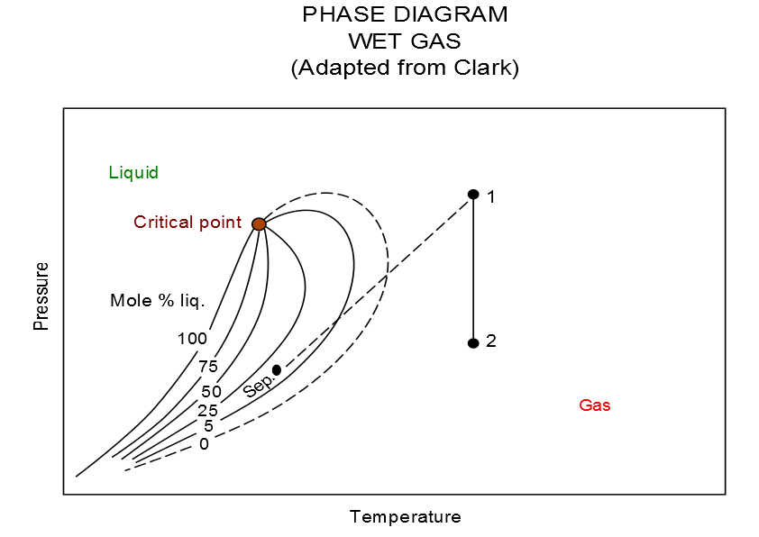

Wet gas normally has a GOR less than 100,000 scf/stb or 18,000 Sm3/m3, with the condensate having a gravity greater than 50 oAPI.

#### Retrograde Condensate Gas Reservoirs

If the reservoir temperature lies between the critical point and the cricondentherm, a retrograde reservoir exists. As the pressure declines to point 2, which is the dew point, liquids begin to form in the reservoir. As the pressure further declines to point 3, the liquid yield increases. Further reduction in the pressure causes the liquid to vaporize back into the gas phase.

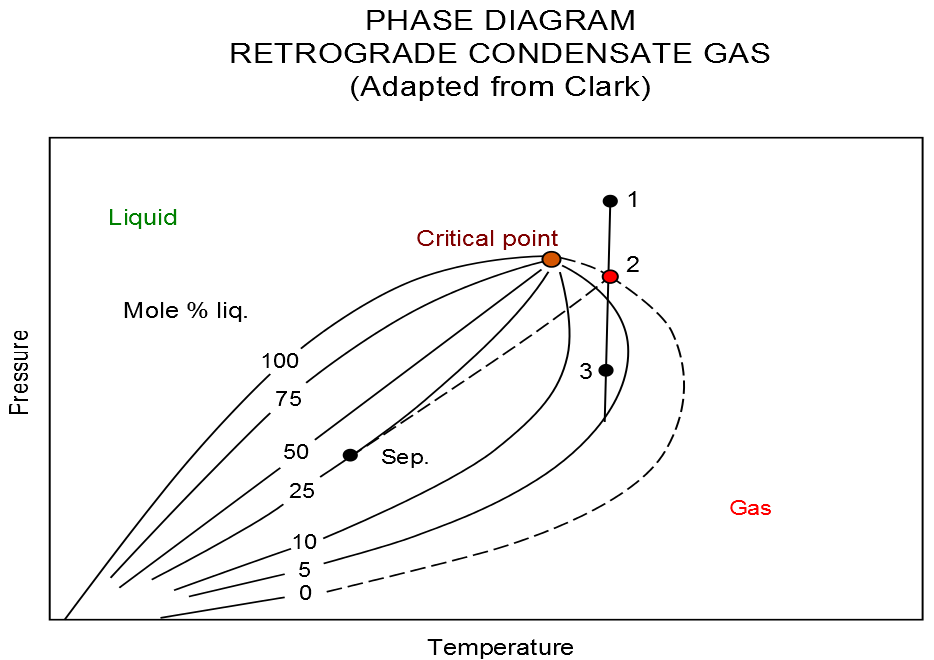

The liquid drop out in the reservoir can cause a well's productivity to be reduced, due to the system moving from a two-phase relative permeability effect, to a three phase effect. This is normally diagnosed by the well having a high skin factor.

This type of fluid has more lighter hydrocarbons than high shrinkage oils, and fewer heavier hydrocarbons than high shrinkage oils. The gravity can be as high as 60 oAPI, with GOR up to 70,000 scf/stb or 13,000 Sm3/m3. Generally the stock tank liquid is water-white, or slightly colored.

#### Reservoir Classification

The following tables outline some general parameters used to classify reservoir fluids. Table 8.1 outlines some general producing characteristics used to define reservoir fluids.

| Item | Crude Oil | Volatile Oil | Gas Condensate | Gas |
| --- | --- | --- | --- | --- |
| Initial Separator Gas-Liquid Ratio (scf/stb) | < 2,000 | 2,000 – 6,000 | 6,000 – 100,000 Generally  7,000 – 15,000 | > 100,000 Usually below 300,000 |
| Color of Produced Liquid | Black to Light Green | Dark Straw Colored | Colorless to Light Straw Colored | Colorless |
| Usual API Gravity Range of Produced Fluid | 10 – 45+ | 40 – 50 | 45 – 65 | – |
| Composition of Produced Fluid | C7+: usually > 40% | C7+: 10 – 40% | C7+: 2 – 10% | Primarily Methane |
| Oil Formation Volume Factor (rb/stb) | < 2.0 frequently < 1.5 | > 2.0 often > 2.5 |  |  |

*Table 8.1: General Reservoir Fluid Classification*

In terms of fluid composition reservoir fluids can be indicated by the values shown in Table 8.2 below.

| Item | Gas | Gas Condensate | Volatile Oil | Crude Oil |
| --- | --- | --- | --- | --- |
| Methane (mole%) | 96 | 87 | 64 | 49 |
| Ethane (mole %) | 3 | 4 | 8 | 3 |
| Heptanes Plus (mole %) | 1 | 3 | 15 | 42 |
| Solution GOR (scf/stb) | 105,000 | 18,200 | 2,000 | 625 |
| Stock Tank Oil oAPI | 68 | 61 | 50 | 34 |

*Table 8.2: Reservoir Fluids Composition Indicators*

In addition reservoir oil is further divided into Light, Medium, Heavy, Extra Heavy, and Bituman (Wilmon [Wilmon, G. J. : “Economic Outlook for Extra-heavy Oils, Natural Bitumens and Shale Oils”, World Petroleum Congress (1987).]) as shown in Table 8.3 below:

| temperature | Stock Tank Oil oAPI | In Situ Viscosity (cp) |
| --- | --- | --- |
| Light | > 31.1 |  |
| Medium | 22.3 – 31.1 |  |
| Heavy | 10.0 – 22.3 | 100 – 10,000 |
| Extra Heavy | < 10.0 | < 10,000 |
| Bitumen | < 10.0 | > 10,000 |

*Table 8.3: Oil Sub-Classification (after Wilmon)*

### Fluid Property Tables

Table 8.4 outlines the oil, gas, and water fluid types that can be active in the model, together with the related [RUNSPEC](#__RefHeading___Toc55591_1778172979) section keywords that activate the phases, versus the PVT keywords that can be used to define the PVT behavior.  The table also includes several water types, the standard water phase used in most simulations models, the Brine water phase used in the Brine Tracking model to track the flow of brine through the simulation grid and the effect of brine on reservoir performance, and finally OPM Flow’s Vaporized Water phase that is used in the simulator’s Salt Precipitation model. The latter water phase is not available in the commercial simulator.

| Fluid Property Keywords versus Oil, Gas & Water Fluid Types |
| --- |

| Item | Oil | Gas | Water |  |  |  |  |  |
| --- | --- | --- | --- | --- | --- | --- | --- | --- |
| Fluid Type | Dead Oil | Live Oil | Dry Gas | Wet Gas | Dry / Wet Gas with Vaporized Water | CO2 (EOR) | Water | Brine |
| [RUNSPEC](#__RefHeading___Toc55591_1778172979) Keywords | [OIL](#__RefHeading___Toc97439_1778172979) | [OIL](#__RefHeading___Toc97439_1778172979) | [GAS](#__RefHeading___Toc38607_2267116897) | [GAS](#__RefHeading___Toc38607_2267116897) | [GAS](#__RefHeading___Toc38607_2267116897) | [GAS](#__RefHeading___Toc38607_2267116897) | [WATER](#__RefHeading___Toc38611_2267116897) | [WATER](#__RefHeading___Toc38611_2267116897) |
|  | [DISGAS](#__RefHeading___Toc39767_2267116897) |  | [VAPOIL](#__RefHeading___Toc56610_2267116897) | None / [VAPOIL](#__RefHeading___Toc56610_2267116897) |  |  |  |  |
|  |  |  |  | [VAPWAT](#__RefHeading___Toc317543_3149455253)5 |  |  |  |  |
|  |  |  |  | [WATER](#__RefHeading___Toc38611_2267116897) |  |  |  |  |
|  |  |  |  | [BRINE](#__RefHeading___Toc162083_289573908) |  |  | [BRINE](#__RefHeading___Toc162083_289573908) |  |
| Pressure Dependent PVT | [PVCDO](#__RefHeading___Toc104054_57619843) | [PVCO](#__RefHeading___Toc325700_501926209) | [PVDG](#__RefHeading___Toc104056_57619843) | [PVTG](#__RefHeading___Toc104060_57619843) | [PVTWSALT](#__RefHeading___Toc331848_501926209) | [PVTSOL](#__RefHeading___Toc414279_1093985484) | [PVTW](#__RefHeading___Toc2086106_3315222525) | [PVTWSALT](#__RefHeading___Toc331848_501926209) |
| [PVDO](#__RefHeading___Toc45803_719036256) | [PVTO](#__RefHeading___Toc104062_57619843) | [PVZG](#__RefHeading___Toc350298_501926209) |  | [PVTGW](#__RefHeading___Toc355649_3149455253)5 | [PVDS](#__RefHeading___Toc104058_57619843) |  |  |  |
|  |  |  |  | [PVTGWO](#__RefHeading___Toc356776_4176551521)5 |  |  |  |  |
| Miscellaneous | [RSCONST](#__RefHeading___Toc138398_332691817) |  | [RVCONST](#__RefHeading___Toc329587_516898843) |  | [RWGSALT](#__RefHeading___Toc304264_1667959253)5 |  |  |  |
| [RSCONSTT](#__RefHeading___Toc138400_332691817) |  | [RVCONSTT](#__RefHeading___Toc138400_3326918171) |  |  |  |  |  |  |
| Surface Density | [DENSITY](#__RefHeading___Toc45799_719036256) | [BDENSITY](#__RefHeading___Toc223317_1539708736) | [SDENSITY](#__RefHeading___Toc121471_83452205) | [DENSITY](#__RefHeading___Toc45799_719036256) | [BDENSITY](#__RefHeading___Toc223317_1539708736) |  |  |  |
| [GRAVITY](#__RefHeading___Toc45801_719036256) |  |  | [GRAVITY](#__RefHeading___Toc45801_719036256) |  |  |  |  |  |

| Notes: |
| --- |

*Table 8.4: Fluid Property Keywords versus Oil, Gas and Water Fluid Type*

For the Dead Oil phases the [RSCONST](#__RefHeading___Toc138398_332691817) and [RSCONSTT](#__RefHeading___Toc138400_332691817) keywords are used to set a constant gas-oil ratio (Rs). In this case the Rs is independent of the reservoir pressure and Rs is also negligible, as in for example heavy oil type fluids.

Similarly for the Dry Gas phase, where the [RVCONST](#__RefHeading___Toc329587_516898843) and [RVCONSTT](#__RefHeading___Toc138400_3326918171) keywords are used to set a condensate-gas ratio (Rv) which is independent of the reservoir pressure and is also negligible, as in for example dry gas type fluids.

For the Vaporized Water phase and model, both dry and wet gas can be incorporated. Note that the [PVTGW](#__RefHeading___Toc355649_3149455253), [PVTGWO](#__RefHeading___Toc356776_4176551521), [RWGSALT](#__RefHeading___Toc304264_1667959253), and [VAPWAT](#__RefHeading___Toc317543_3149455253) keywords are OPM Flow specific keywords.

In addition for the Brine phase, then either the [SALT](#__RefHeading___Toc593214_516898843) or [SALTVD](#__RefHeading___Toc605882_516898843) keywords in the [SOLUTION](#__RefHeading___Toc43947_784232322) section should be used to define the initial equilibration salt concentration for the model.

CO2 can either be used as Enhanced Oil Recovery (“EOR”) fluid by injecting the CO2 into an oil reservoir, or injected for CO2 storage. For the former, CO2 is declared via the [GAS](#__RefHeading___Toc38607_2267116897) keyword in the [RUNSPEC](#__RefHeading___Toc55591_1778172979) section and the PVT data is entered via the standard gas fluid properties for the hydrocarbon gas and either the [PVDS](#__RefHeading___Toc104058_57619843) or the [PVTSOL](#__RefHeading___Toc414279_1093985484) keywords are used to describe the interaction of the in situ oil and the injected CO2.

In addition to the above the [ROCK](#__RefHeading___Toc45809_719036256) keyword should be used to define the rock compressibility.

Similarly, Table 8.5 outlines the fluid property data keywords for the CO2 storage,  foam, polymer, solvent, and [MICP](#__RefHeading___Toc383375_111689907) phases. Note that for these phases multiple keywords can be used to define the desired property behavior.

| Fluid Property Keywords versus CO2 (Storage), Foam, Polymer, Solvent,  and MICP Fluid Types |  |  |  |  |  |
| --- | --- | --- | --- | --- | --- |
| Fluid Type | CO2 (Storage) | Foam | Polymer | Solvent | MICP7 |
| [RUNSPEC](#__RefHeading___Toc55591_1778172979) Keywords | [CO2STORE](#__RefHeading___Toc387968_1616145207) | [FOAM](#__RefHeading___Toc171586_289573908) | [POLYMER](#__RefHeading___Toc38609_2267116897) | [SOLVENT](#__RefHeading___Toc62787_1778172979) | [MICP](#__RefHeading___Toc383375_111689907) |
| [GAS](#__RefHeading___Toc38607_2267116897) |  |  |  | [WATER](#__RefHeading___Toc38611_2267116897) |  |
| [WATER](#__RefHeading___Toc38611_2267116897) |  |  |  |  |  |
| Pressure Dependent PVT | Not required, calculated via correlations |  |  | [PVDS](#__RefHeading___Toc104058_57619843) | [PVTW](#__RefHeading___Toc2086106_3315222525) |
|  |  | [PVTSOL](#__RefHeading___Toc414279_1093985484)6 |  |  |  |
| Surface Density |  |  |  | [SDENSITY](#__RefHeading___Toc121471_83452205) | [DENSITY](#__RefHeading___Toc45799_719036256) |
| Miscellaneous | [SALINITY](#__RefHeading___Toc405185_1616145207)5 | [FOAMADS](#__RefHeading___Toc224974_3519154785) | [PLMIXPAR](#__RefHeading___Toc93833_3812137098) |  | [BIOFPARA](#REF_HEADING_KEYWORD_BIOFPARA) |
|  | [FOAMDCYO](#__RefHeading___Toc296070_803326780) | [PLYADS](#__RefHeading___Toc121087_57619843) |  |  |  |
|  | [FOAMDCYW](#__RefHeading___Toc296072_803326780) | [PLYADSS](#__RefHeading___Toc121089_57619843) |  |  |  |
|  | [FOAMFCN](#__RefHeading___Toc301319_803326780) | [PLYATEMP](#__RefHeading___Toc787898_2928331029) |  |  |  |
|  | [FOAMFRM](#__RefHeading___Toc301321_803326780) | [PLYCAMAX](#__RefHeading___Toc239634_501926209) |  |  |  |
|  | [FOAMFSC](#__RefHeading___Toc224976_3519154785) | [PLYDHFLF](#__RefHeading___Toc110212_2939291539) |  |  |  |
|  | [FOAMFSO](#__RefHeading___Toc311825_803326780) | [PLYESAL](#__RefHeading___Toc245784_501926209) |  |  |  |
|  | [FOAMFST](#__RefHeading___Toc311827_803326780) | [PLYKRRF](#__RefHeading___Toc245845_501926209) |  |  |  |
|  | [FOAMFSW](#__RefHeading___Toc311829_803326780) | [PLYMAX](#__RefHeading___Toc110214_2939291539) |  |  |  |
|  | [FOAMMOB](#__RefHeading___Toc224978_3519154785) | [PLYMWINJ](#__RefHeading___Toc473331_2124352571)8 |  |  |  |
|  | [FOAMMOBP](#__RefHeading___Toc311835_803326780) | [PLYRMDEN](#__RefHeading___Toc252003_501926209) |  |  |  |
|  | [FOAMMOBS](#__RefHeading___Toc311837_803326780) | [PLYROCK](#__RefHeading___Toc110216_2939291539) |  |  |  |
|  | [FOAMOPTS](#__RefHeading___Toc224982_3519154785) | [PLYSHEAR](#__RefHeading___Toc110218_2939291539) |  |  |  |
|  | [FOAMROCK](#__RefHeading___Toc224980_3519154785) | [PLYSHLOG](#__RefHeading___Toc110220_2939291539) |  |  |  |
|  |  | [PLYTRRF](#__RefHeading___Toc258118_501926209) |  |  |  |
|  |  | [PLYTRRFA](#__RefHeading___Toc258120_501926209) |  |  |  |
|  |  | [PLYVISC](#__RefHeading___Toc110222_2939291539) |  |  |  |
|  |  | [PLYVISCS](#__RefHeading___Toc270347_501926209) |  |  |  |
|  |  | [PLYVISCT](#__RefHeading___Toc270349_501926209) |  |  |  |
|  |  | [PLYVMH](#__RefHeading___Toc473331_21243525712)8 |  |  |  |
|  |  | [PLYVSCST](#__RefHeading___Toc270351_501926209) |  |  |  |
|  |  | [SKPRPOLY](#__RefHeading___Toc473331_21243525711)8 |  |  |  |
| Miscellaneous |  |  | [SKPRWAT](#__RefHeading___Toc473331_212435257111)8 |  |  |
| Notes: |  |  |  |  |  |

*Table 8.5: Fluid Property Keywords versus CO2 (Storage), Foam, Polymer, Solvent, and MICP Fluid Types*

As mentioned previously, CO2 can either be used as an EOR fluid by injecting the gas into an oil reservoir, or injected for CO2 storage. For the latter, CO2 is declared via the [GAS](#__RefHeading___Toc38607_2267116897) and [CO2STORE](#__RefHeading___Toc387968_1616145207) keywords in the [RUNSPEC](#__RefHeading___Toc55591_1778172979) section, and, except for the [SALINITY](#__RefHeading___Toc405185_1616145207) keyword, all the remaining PVT data is calculated automatically via correlations by the simulator. A full description of the underlying PVT models is described by Sandve at al. [Sandve, T. H., Gasda, S. E., Rasmussen, A., and Rustad, A. B. Convective dissolution in field scale CO2 storage simulation using the OPM Flow simulator. Submitted to TCCS 11 – Trondheim Conference on CO2 Capture, Transport and Storage Trondheim, Norway – June 21-23, 2021.]

Typical live oil and dry gas PVT data from the Volve [The Volve Data was approved for data sharing in 2018 by the initiative of the last Operating company, Equinor and approved by the license partners ExxonMobil E&P Norway AS and Bayerngas Norge AS in the end of 2017.] field is shown in Figure 8.7 and Figure 8.8, respectively. To fully define the live oil, dry gas, and water PVT properties for Volve the [DENSITY](#__RefHeading___Toc45799_719036256), [PVDG](#__RefHeading___Toc104056_57619843), [PVTO](#__RefHeading___Toc104062_57619843), and [PVTW](#__RefHeading___Toc2086106_3315222525) keywords are employed.

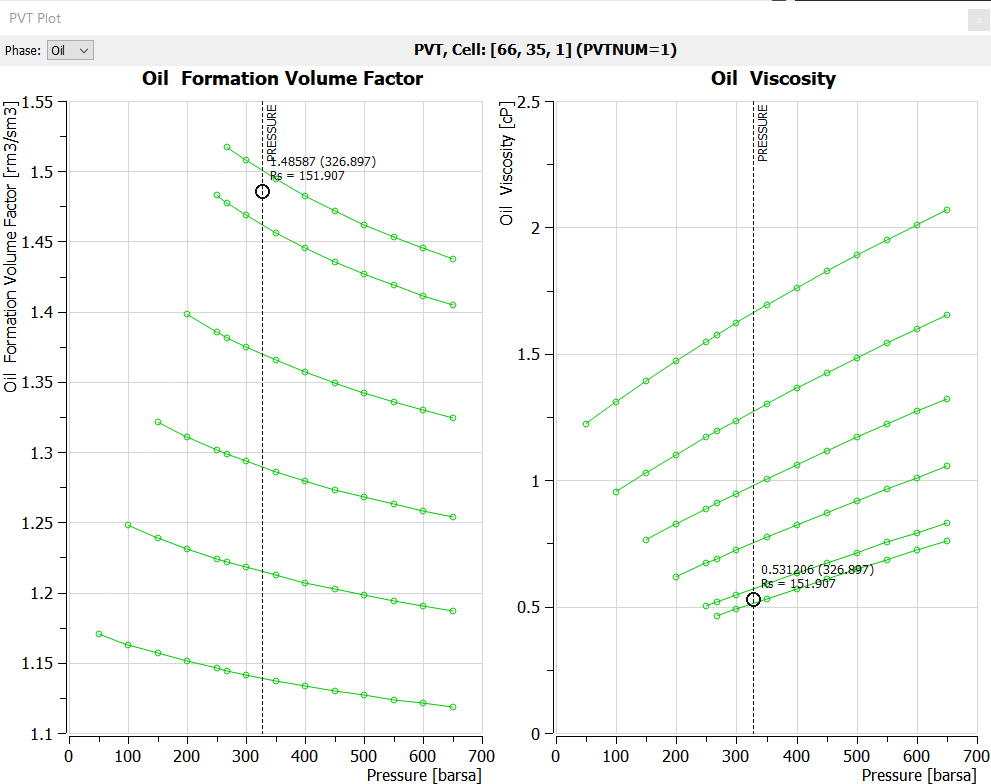

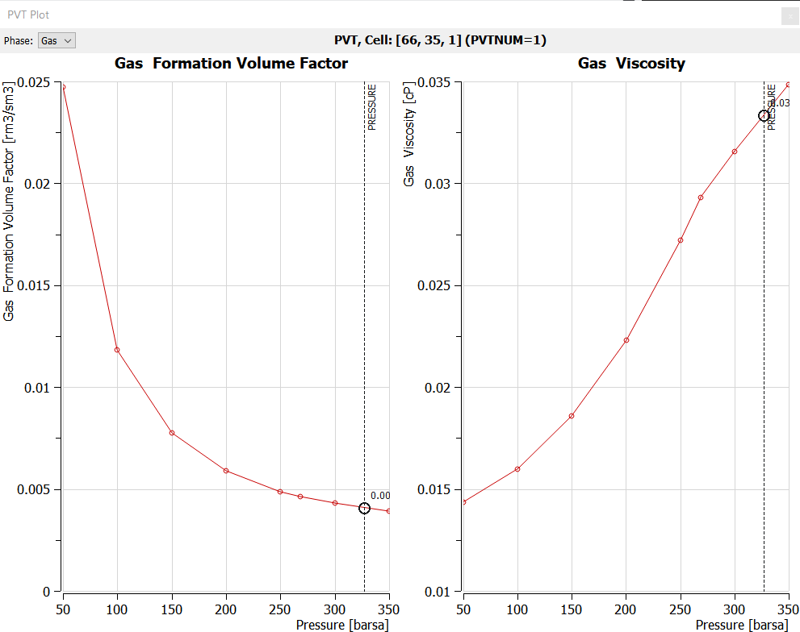

### Saturation Tables (Relative Permeability and Capillary Pressure Tables)

Saturation tables contain the relative permeability and capillary pressure data as a function of fluid saturation and are used to both initialize the model and to describe multi-phase flow in the reservoir. Multiple saturation tables can be entered and allocated to various areas in the model, based on rock typing. Alternatively, a limited number of saturation tables may be entered and allocated by region and combined with end-point scaling option to enable a more robust reservoir rock characterization.

| Note Confusion abounds with the terms: critical water saturation, connate water saturation, and irreducible water saturation definitions, as the terms are extensively used interchangeably to define the maximum water saturation at which the water phase will remain immobile.  For reference: Connate Water Saturation:  Water trapped in the interstices of the sediments at the time of deposition, as opposed to water that migrated into the formations after deposition [https://wiki.seg.org/wiki/Dictionary:Connate_water]. Normally the nomenclature of Swc is used to describe this type of water saturation. Irreducible Water Saturation: The fraction of the pore volume occupied by water in a reservoir at maximum hydrocarbon saturation. It represents water that has not been displaced by hydrocarbons because it is trapped by adhering to rock surfaces, trapped in small pore spaces and narrow interstices, etc. Irreducible water saturation is an equilibrium situation. It differs from residual water saturation, the value measured by core analysis, because of filtrate invasion and the gas expansion that occurs when a core is removed from the bottom of the hole to the surface. Also called immovable water [https://wiki.seg.org/wiki/Dictionary:Irreducible_water_saturation].  Here the nomenclature for irreducible water saturation is Swirr. Critical Water Saturation: Defines the largest water saturation for which the water relative permeability is zero. |
| --- |

In addition to the above definitions, the simulator uses the term [SWL](#__RefHeading___Toc22881_7842323221), which is lowest water saturation in a relative permeability table.  Thus, [SWL](#__RefHeading___Toc22881_7842323221) can represent either the connate water saturation or the irreducible water saturation in the relative permeability tables and functions.

Secondly, the term irreducible water saturation is replaced by term critical water saturation ([SWCR](#__RefHeading___Toc27248_784232322)) in the relative permeability tables and function, as both terms are equivalent with regards to the mobility of the water phase. This terminology is also consistent with the critical values of the oil and gas phases, which are dependent on the displacing phase.

Thirdly, it is not uncommon for [SWL](#__RefHeading___Toc22881_7842323221) to be set equal to the critical water saturation; however, care should be taken in this instance if end-point scaling is being used to ensure that the cell scaled relative permeability curves are as one might expect.

A typical set of oil-water relative permeability curves is shown in Figure 8.9 indicating the oil end-point data ([KRO](#__RefHeading___Toc97395_621662414), [KRORW](#__RefHeading___Toc70191_335817223), and (1 – [SOWCR](#__RefHeading___Toc30436_784232322))) and the water end-point data ([KRWR](#__RefHeading___Toc70193_335817223), [KRW](#__RefHeading___Toc97397_621662414), [SWL](#__RefHeading___Toc22881_7842323221), and [SWCR](#__RefHeading___Toc27248_784232322)).

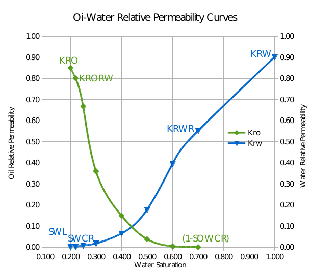

The associated oil-water end-point definitions are outlined in the following table:

| Type | End-Point Keyword | Oil-Water End-Point Definitions |
| --- | --- | --- |
| Saturation | [SOWCR](#__RefHeading___Toc30436_784232322) | Critical oil-in-water saturation, that is the largest oil saturation for which the oil relative permeability is zero in an oil-water system. |
| [SWL](#__RefHeading___Toc22881_7842323221) | Connate water saturation, that is the lowest water saturation in a water saturation function table. |  |
| [SWCR](#__RefHeading___Toc27248_784232322) | Critical water saturation, that is the largest water saturation for which the water relative permeability is zero. |  |
| [SWU](#__RefHeading___Toc22883_7842323221) | Maximum water saturation in a water saturation table.  This is commonly set equal to one, unless there is a residual oil saturation below the defined OWC. |  |
| Relative Permeability | [KRO](#__RefHeading___Toc97395_621662414) | Relative permeability of oil at the maximum oil saturation. |
| [KRORW](#__RefHeading___Toc70191_335817223) | Relative permeability of oil at the critical water saturation |  |
| [KRW](#__RefHeading___Toc97397_621662414) | Relative permeability of water at the maximum water saturation (normally the maximum water saturation is one). |  |
| [KRWR](#__RefHeading___Toc70193_335817223) | Relative permeability of water at the residual oil saturation (or at the residual gas saturation in a gas-water run). |  |
| Capillary Pressure | [SWLPC](#__RefHeading___Toc179514_1371377330) | Capillary pressure connate water saturation, that is the lowest water saturation in a water saturation function table to be scaled independently from the [SWL](#__RefHeading___Toc22881_7842323221) relative permeability end-point value. |

*Table 8.6: Oil-Water Relative Permeability End-Point Data Definitions*

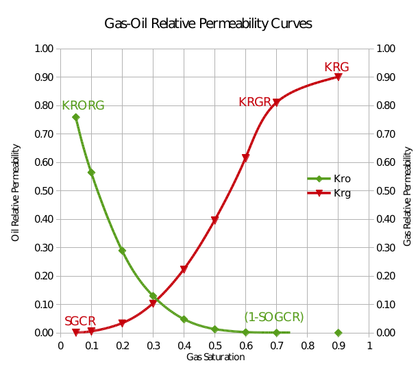

Similarly for gas-oil systems, Figure 8.10 illustrates a typical gas-oil relative permeability set of curves indicating the oil end-point data ([KRORG](#__RefHeading___Toc70189_335817223) and (1 – [SOGCR](#__RefHeading___Toc30434_784232322))) and the gas end-point data ([KRGR](#__RefHeading___Toc70187_335817223), [KRG](#__RefHeading___Toc97393_621662414), and [SGCR](#__RefHeading___Toc20428_784232322)).

The gas-oil end-point definitions are outlined in the following table:

| Type | End-Point Keyword | Gas-Oil End-Point Definitions |
| --- | --- | --- |
| Saturation | [SOGCR](#__RefHeading___Toc30434_784232322) | Critical oil-in-gas saturation, that is the largest oil saturation for which the oil relative permeability is zero in an oil-gas-connate-water system. |
| [SGL](#__RefHeading___Toc22881_784232322) | Connate gas saturation, that is the lowest gas saturation in a gas saturation function table. |  |
| [SGCR](#__RefHeading___Toc20428_784232322) | Critical gas saturation, that is the largest gas saturation for which the gas relative permeability is zero. |  |
| [SGU](#__RefHeading___Toc22883_784232322) | Maximum gas saturation in a gas saturation table. This is generally set equal to one minus the connate water saturation. |  |
| Relative Permeability | [KRG](#__RefHeading___Toc97393_621662414) | Relative permeability of gas at the maximum gas saturation. |
| [KRGR](#__RefHeading___Toc70187_335817223) | Relative permeability of gas at the residual oil saturation (or the critical water saturation in a gas-water run). |  |
| [KRORG](#__RefHeading___Toc70189_335817223) | Relative permeability of oil at the critical gas saturation. |  |
| Capillary Pressure | [SGLPC](#__RefHeading___Toc170136_1371377330) | Capillary pressure connate gas saturation, that is the smallest gas saturation in a gas saturation function table to be scaled independently from the [SGL](#__RefHeading___Toc22881_784232322) relative permeability end-point value. |

*Table 8.7: Gas-Oil Relative Permeability End-Point Data Definitions*

Finally, for two phase gas-water systems, Figure 8.11 illustrates a typical set of gas-water relative permeability curves indicating the gas end-point data ([KRG](#__RefHeading___Toc97393_621662414), [KRGR](#__RefHeading___Toc70187_335817223), and (1 – SGWCR)) and the water end-point data ([KRW](#__RefHeading___Toc97397_621662414), [KRWR](#__RefHeading___Toc70193_335817223), [SWL](#__RefHeading___Toc22881_7842323221), and SWGCR).

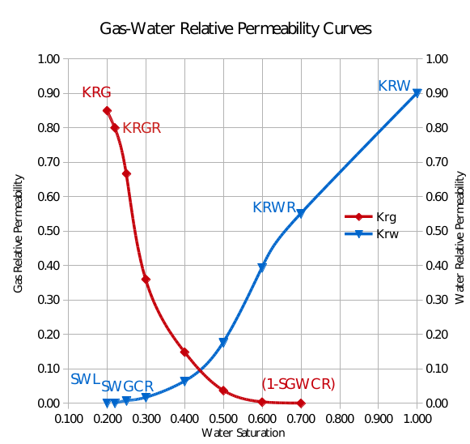

The gas-oil end-point definitions are outlined in the following table:

| Type | End-Point Keyword | Gas-Water End-Point Definitions |
| --- | --- | --- |
| Saturation | [SGL](#__RefHeading___Toc22881_784232322) | Connate gas saturation, that is the lowest gas saturation in a gas saturation function table. |
| [SGU](#__RefHeading___Toc22883_784232322) | Maximum gas saturation in a gas saturation table. |  |
| SGWCR | Critical gas-in-water saturation, that is the largest gas saturation for which the gas relative permeability is zero in a gas-water system. |  |
| [SWL](#__RefHeading___Toc22881_7842323221) | Connate water saturation, that is the lowest water saturation in a water saturation function table. |  |
| SWGCR | Critical water saturation, that is the largest water saturation for which the water relative permeability is zero in a gas-water system. |  |
| [SWU](#__RefHeading___Toc22883_7842323221) | Maximum water saturation in a water saturation table. |  |
| Relative Permeability | [KRG](#__RefHeading___Toc97393_621662414) | Relative permeability of gas at the maximum gas saturation. |
| [KRGR](#__RefHeading___Toc70187_335817223) | Relative permeability of gas at the residual oil saturation (or the critical water saturation in a gas-water run). |  |
| [KRWR](#__RefHeading___Toc70193_335817223) | Relative permeability of water at the residual oil saturation (or the residual gas saturation in a gas-water run). |  |
| Capillary Pressure | [SWLPC](#__RefHeading___Toc179514_1371377330) | Capillary pressure connate water saturation, that is the smallest water saturation in a water saturation function table to be scaled independently from the [SWL](#__RefHeading___Toc22881_7842323221) relative permeability end-point value. |

*Table 8.8: Gas-Water Relative Permeability End-Point Data Definitions*

End-point scaling is activated in the [RUNSPEC](#__RefHeading___Toc55591_1778172979) section with the [ENDSCALE](#__RefHeading___Toc68146_2267116897) keyword and the data used to apply end-point scaling is entered in the [PROPS](#__RefHeading___Toc39329_784232322) section using the end-point keywords defined in Table 8.6, Table 8.7, and Table 8.8 to define each grid block’s end-point data. There are also direction dependent versions of these keywords for when directional end-point scaling has been activated. For example for critical water saturation, [SWCR](#__RefHeading___Toc27248_784232322) is used with non-directional end-point scaling and the [SWCRX](#__RefHeading___Toc27248_784232322), [SWCRX-](#__RefHeading___Toc27248_784232322), [SWCRY](#__RefHeading___Toc27248_784232322), [SWCRY-](#__RefHeading___Toc27248_784232322), [SWCRZ](#__RefHeading___Toc27248_784232322), and [SWCRZ-](#__RefHeading___Toc27248_784232322) series of keywords is used for when directional end-point scaling has been activated. In addition, there is also the facility to incorporate end-point scaling based on the drainage and/or imbibition process which again can be either non-directional or directional.

| Note If the hysteresis model option has been activated on the [SATOPTS](#__RefHeading___Toc37029_327352552) keyword in the [RUNSPEC](#__RefHeading___Toc55591_1778172979) section, then the standard end-point scaling arrays, for example [KRORW](#__RefHeading___Toc70191_335817223), can be used to scale the drainage tables, and the equivalent imbibition arrays suffixed with the letter I, for example [IKRORW](#__RefHeading___Toc70191_3358172231), can be used to scale the imbibition tables. However, if the hysteresis model option has not been activated, then only the standard keywords can be used to define the end-point scaling parameters, that is [KRORW](#__RefHeading___Toc70191_335817223) should be used and not [IKRORW](#__RefHeading___Toc70191_3358172231), even though an imbibition process with the wetting phase (normally water) increasing is usually being modelled. |
| --- |

Saturation functions can be entered via several keywords consisting of two format types as depicted in the following table:

| Format Type One | Format Type Two |  |  |  |  |  |  |
| --- | --- | --- | --- | --- | --- | --- | --- |
| Keyword | Oil | Gas | Water | Keyword | Oil | Gas | Water |
| [SGOF](#__RefHeading___Toc106870_335817223) | Pcog |  | [SGFN](#__RefHeading___Toc106868_335817223)3 |  | Pcog |  |  |
| [SLGOF](#__RefHeading___Toc106874_335817223) | Pcog |  | [SGWFN](#__RefHeading___Toc106872_335817223) |  | Pcgw |  |  |
| [SWOF](#__RefHeading___Toc45811_7190362561) | Pcwo |  | Pcwo | [SOF2](#__RefHeading___Toc106876_335817223)4 | No Pc |  |  |
|  |  |  |  | [SOF3](#__RefHeading___Toc106878_335817223)5 | No Pc |  |  |
|  |  |  |  | [SOF32D](#__RefHeading___Toc765497_4250154414) | No Pc |  |  |
|  |  |  |  | [SWFN](#__RefHeading___Toc106882_335817223) |  |  | Pcwo |
| OPM Flow LET6 | Format Type Three7 |  |  |  |  |  |  |
| Keyword | Oil | Gas | Water | Keyword | Oil | Gas | Water |
| [SGOFLET](#__RefHeading___Toc398952_3017686537) | Pcog |  | [GSF](#__RefHeading___Toc524656_3603161511) |  | Pcgw |  |  |
| SWGFLET |  | Pcgw | [WSF](#__RefHeading___Toc524656_3603161511 Copy 1) |  |  | No Pc |  |
| [SWOFLET](#__RefHeading___Toc398954_3017686537) | Pcwo |  | Pcwo |  |  |  |  |
| Notes: |  |  |  |  |  |  |  |

*Table 8.9: Saturation Table Formats and Phases*

Note that only one format type can be used in each run to define the required saturation functions, that is one cannot combine the keywords from the different format types in the same input deck.

Figure 8.12 shows an unscaled oil-water relative permeability curve from the Volve model, and Figure 8.13 displays the corresponding scaled relative permeability curves after applying the end-point scaling parameters. Similarly for the gas-oil curves, Figure 8.14 illustrates the unscaled curves and Figure 8.15 the scaled curves. The plots indicate that the end-point scaling has been applied correctly.

|  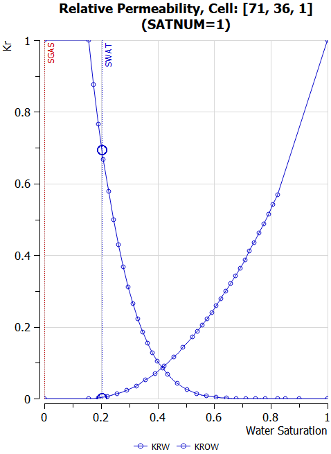 | 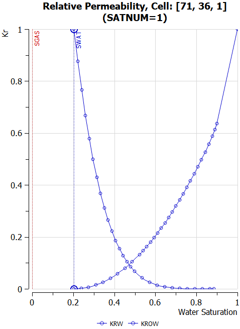  |
| --- | --- |
|  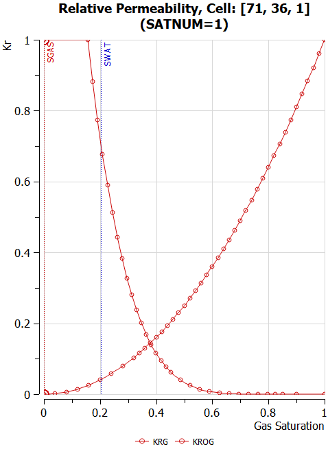 | 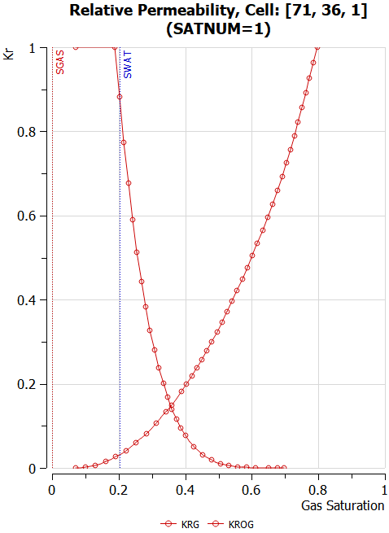  |

### Saturation Table Generation - Corey Curves

As mentioned in the [2.4.1 Data Quality and Assurance](#2.4.1.Data Quality and Assurance|outline) section, Corey relative permeability curves are often used to "smooth" the intended relative permeability curves to be used in the simulator in order to improve convergence.

Corey [Corey,  A. T. : “The Interrelation Between gas and Oil Relative Permeabilities”, Production  Mon., 19. 38. (1954).] combined the work of Purcell [Purcell, W. R., “Capillary Pressures- Their Measurement Using Mercury and the Calculation of Permeability Therefrom”, Transactions AIME, 186,  39 (1949).] and Burdine [Burdine, N. T., “Relative Permeability Calculations from Pore Size Distribution Data”, , Transactions AIME, 198,  71 (1953).] that was widely accepted for its simplicity.  His original equations were developed for the drainage cycle in water-wet sandstones, but have also been used in carbonate formations.  Corey's original water-oil equations were as follows:

|  | (8.17) |
| --- | --- |

|  | (8.18) |
| --- | --- |

where

kro(Sw) 	= relative permeability to oil,

krw(Sw) 	= relative permeability to water,

no	= Corey oil exponent, set to four in the original paper,

nw	= Corey water exponent, set to four in the original paper,

Sw 	= water saturation, and

Swcr 	= critical water saturation.

The denominator in equations (8.17) and (8.18) scales the water saturation to the mobile water phase. There are several forms of these equations, with the most common normalizing the saturation over the mobile hydrocarbon phase,  as depicted in equations (8.19) and (8.20).

|  | (8.19) |
| --- | --- |

|  | (8.20) |
| --- | --- |

where

krow		= maximum oil relative permeability at Swcr,

krw		= maximum water relative permeability st Sorw,

Swcr		= critical water saturation, and

Sorw 		= residual oil saturation under a water flood ([SOWCR](#__RefHeading___Toc30436_784232322)).

Similar equations exist for gas-oil and water-oil systems. As mentioned above, the denominator in the equations, normalizes the saturation to the mobile phase, as a consequence, it is still necessary to extend the  resulting Corey water curve to 100% water saturation in order to correctly model the water leg.   In terms of the values for the various Corey exponents, Table 8.10 offers some guidelines based on the rock's wettability.

| Corey Guide (Water-Oil) | Corey Guide (Gas-Oil) |  |  |  |  |
| --- | --- | --- | --- | --- | --- |
| Wettability | Kro | Krw | Wettability | Kro | Krg |
| Water wet | 2 - 4 | 5 - 8 | Water wet |  |  |
| Intermediate | 3 - 6 | 3 - 5 | Intermediate |  |  |
| Oil wet | 6 - 8 | 2 - 3 | Oil wet | 4 - 8 | 2 - 4 |

*Table 8.10: Corey Exponent Values*

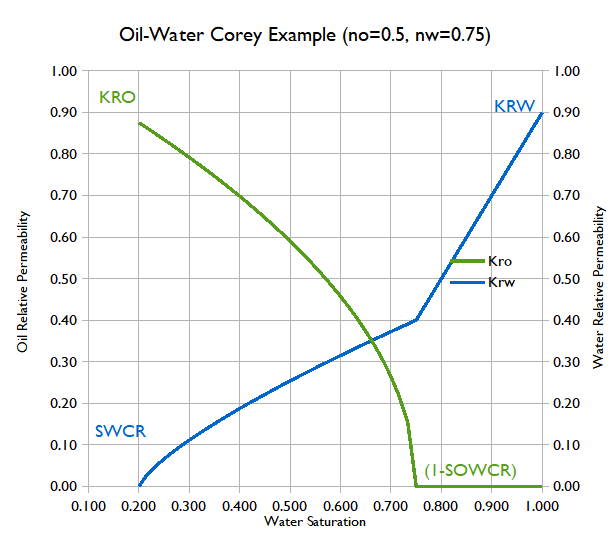

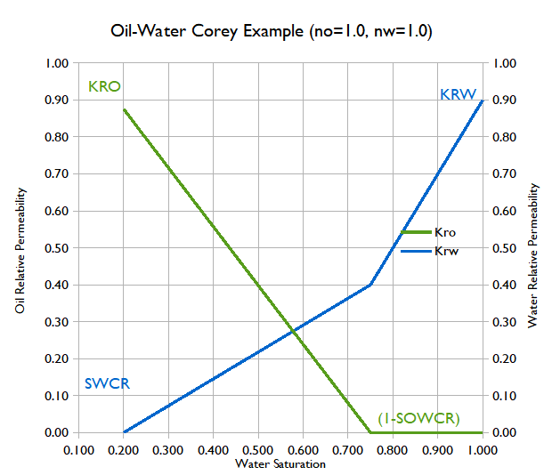

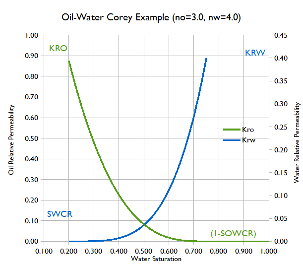

As can be seen in Figure 8.16 to Figure 8.18, the Corey exponents less than one result in a concave curve, and values great than one result in a convex curve, where as a value of one gives a straight line.

Unfortunately, neither OPM Flow nor the commercial simulator, unlike some other simulators, support the direct entry of Corey type curves, and thus Corey curves have to be generated outside of the simulator.  Fortunately, OPM Flow does support the more advanced and flexible LET family of models instead, which are described in the next section.

### Saturation Table Generation - LET Functions

OPM Flow has implemented the LET family of saturation functions models, based on the work of Lomeland et al.  [Lomeland F., Ebeltoft E. and Thomas W.H., 2005. A New Versatile Relative Permeability Correlation. Paper SCA2005-32 presented at the International Symposium of the Society of Core Analysts held in Toronto, Canada, 21-25 August, 2005.], [Lomeland F. and Ebeltoft E., 2008. A New Versatile Capillary Pressure Correlation. Paper SCA2008-08 presented at the International Symposium of the Society of Core Analysts held in Abu Dhabi, UAE, 29 Oct. – 2 Nov., 2008.]  [Lomeland F., Hasanov B., Ebeltoft E. and Berge M., 2012. A Versatile Representation of Up-scaled Relative Permeability for Field Applications. Paper SPE 154487-MS presented at the EAGE Annual Conference & Exhibition incorporating SPE Europec held in Copenhagen, Denmark, 4-7 June 2012.] and  [Lomeland F., 2018.Overview Of The Let Family Of Versatile Correlations For Flow Functions. Paper SCA2018-056 presented at the International Symposium of the Society of Core Analysts held in Trondheim, Norway, 27-30 August 2018.] via the [SGOFLET](#__RefHeading___Toc398952_3017686537) and [SWOFLET](#__RefHeading___Toc398954_3017686537) keywords in this section. The keywords are used as replacements for the [SGOF](#__RefHeading___Toc106870_335817223) and [SWOF](#__RefHeading___Toc45811_7190362561) keywords for three-phase oil-gas-water systems, and the [SGWFN](#__RefHeading___Toc106872_335817223) keyword for gas-water systems.  Note there are two versions of the LET functions, LET168 for two-phase flowing conditions and LETx [Lomeland F. and Ebeltoft E., 2013. Versatile Three-phase Correlations for Relative Permeability and Capillary Pressure. Paper SCA2013-034 presented at the International Symposium of the Society of Core Analysts held in Napa Valley, California, USA, 16-19 September, 2013.] for three-phase flowing conditions.  All three keywords implement the LET version for two phase systems.

The functions are dependent on the drainage and imbibition cycle of the wetting phase as well as drainage and inhibition cycle number, since a reservoir may undergo several flooding events. To account for this the system defines the flooding event using the three saturations: Sw, So, and Sg together with the state of the three saturations during the flooding event. The saturation state can be increasing, decreasing, or constant for a given flooding event cycle number (n).   Thus, Sw(D), So(I), Sg(C)1, or DIC1, means the water phase is decreasing, the oil phase is increasing, and the gas phase is constant for the primary or first cycle (n equals one). This is the case when oil is migrating into the reservoir rock and displacing the initial water contained with the reservoir.  The various flooding processes are outlined in Table 8.11

| Modeling of flooding processes |  |  |  |  |
| --- | --- | --- | --- | --- |
| Oil Field | Gas Field | Comment |  |  |
| Oil-Water Oil Leg | Oil-Gas Oil-Leg | Gas-Water Gas Cap | Oil-Gas Gas Cap | Nomenclature LET(Sw, So, Sg, n) |
| DIC1 | CDI2 | DCI1 | CDI2 | Primary starting point. |
| IDC2 | CID3 | ICD2 | CID3 | Second event |
| DIC3 | CID4 | DCI3 | CID4 | Third event |

*Table 8.11: LET Modeling of Flooding Processes*

Thus, DIC1 is the well-known primary (first inflow number) drainage for an oil/water system, and IDC2 is the well-known (second general inflow number) imbibition for an oil/water system.

The following section describe the various flooding scenarios and the standard LET equations used in the literature.

#### Oil Displacing Water: Primary Drainage Cycle (DIC1)

For the Primary Drainage, assuming water is the wetting phase, then, Sw(D), So(I), Sg(C)1, or DIC1, means the water phase is decreasing, the oil phase is increasing and the gas phase is constant for the primary or first cycle (n equals one). This is the case for when oil is migrating into the reservoir rock and displacing the initial water contained within the reservoir.  Under these circumstance the LET normalized water saturation and relative permeability functions are defined as:

|  | (8.21) |
| --- | --- |

|  | (8.22) |
| --- | --- |

|  | (8.23) |
| --- | --- |

where

	=	empirical E parameter for the α phase,

	= 	oil relative permeability with respect to water saturation,

	= 	base or top oil relative permeability, used to scale the maximum oil

permeability,

	=	water relative permeability,

	=	base or top water relative permeability, used to scale the maximum water

permeability,

	=	empirical L parameter for the α phase,

	=	empirical T parameter for the α phase,

	=	water saturation,

	=	irreducible water saturation, and

	=	normalize water saturation.

The LET empirical parameters E, L, and T influence the shape of the relative permeability curves, as depicted in Figure 8.19

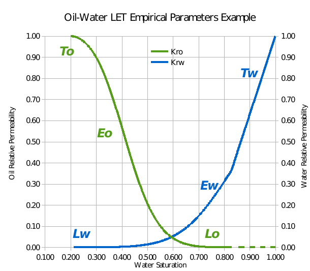

For the primary drainage or first cycle, DIC1, with the water phase decreasing, the oil phase increasing and the gas phase constant, the LET capillary pressure functions are:

|  | (8.24) |
| --- | --- |

|  | (8.25) |
| --- | --- |

|  | (8.26) |
| --- | --- |

where

	= 	empirical E parameter,

	=	empirical L parameter,

	= 	capillary pressure at irreducible water saturation,

	= 	capillary threshold / entry pressure,

	=	empirical T parameter,

	=	water saturation,

	=	irreducible water saturation, and

	=	normalize water saturation.

The capillary pressure LET functions with either L or T equal to one are called a semi-simple LET functions, and LET functions with both L and T equal to one are called a simple LET function. The simple LET function is equal to the Pc correlation of Honapour et al. [Honarpour M.M., Djabbarah N.F. and Kralik J.G., 2004. Expert-Based Methodology for Primary Drainage Capillary Pressure Measurements and Modeling. Paper SPE-88709 presented at the 11th Abu Dhabi International Petroleum Exhibition and Conference held in Abu Dhabi, UAE, 10-13 Oct., 2004.] except for the arrangement of the empirical coefficients.

The L parameter describes the lower part of the curve, whereas the T parameter describes the top part of the curve in a similar to how the L parameter describes the lower part of the curve. Finally, the E parameter  describes the position of the slope of the curve, that is the elevation.  An E value of one is neutral, and the position of the slope is governed by the L and T parameters in this case. Whereas, increasing the value of the E moves the slope towards the high end of the curve, and decreasing the value of the E moves the slope towards the lower end of the curve.  Lombard et al.169 noted that experience using the LET correlation indicate that L, E, and T values should be greater than or equal to 0.01, with no upper limit.

Figure 8.20 shows a typical LET derived drainage oil-water capillary pressure curve,  and Figure 8.21 shows a typical imbibition curves, the later is discussed in the following section.

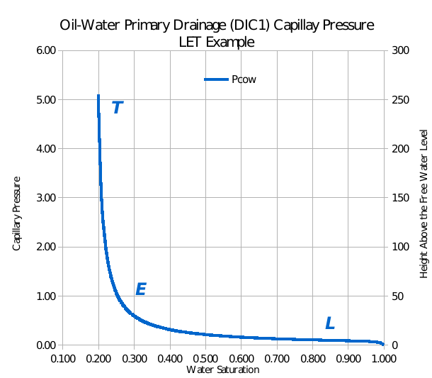

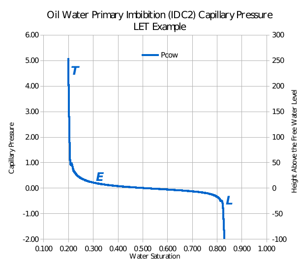

OPM has implemented a more restrictive form of the general LET functions, more akin to the original paper168, as depicted in Figure 8.20.  Table 8.12 relates the general LET equations presented previously with the parameters on the [SWOFLET](#__RefHeading___Toc398954_3017686537) keyword.

| LET Function (DIC1) versus SWOFLET Keyword |  |  |  |  |  |
| --- | --- | --- | --- | --- | --- |
| SWOFLET | LET Function | SWOFLET | LET Function | SWOFLET | LET Function |
| [SWL](#__RefHeading___Toc22881_7842323221) |  | SORW |  | PCIR |  |
| [SWCR](#__RefHeading___Toc27248_784232322) |  | [SOWCR](#__RefHeading___Toc30436_784232322) |  | PCIT |  |
| LWAT |  | LOIL |  | LPC |  |
| EWAT |  | EOIL |  | EPC |  |
| TWAT |  | TOIL |  | TPC |  |
| KRTWAT |  | KRTOIL |  |  |  |
| Notes: |  |  |  |  |  |

*Table 8.12:  LET Functions (DIC1) versus SWOFLET Keyword*

#### Water Displacing Oil: Primary Imbibition Cycle (IDC2)

Similarly for the oil producing phase, where the water phase is increasing either by replacing the displaced oil or via water injection, that is Sw(I), So(D), Sg(C), for the second flooding event, IDC2. Under this scenario the LET equations are:

|  | (8.27) |
| --- | --- |

|  | (8.28) |
| --- | --- |

|  | (8.29) |
| --- | --- |

where

	=	empirical E parameter for the α phase,

	=	oil relative permeability with respect to water saturation,

	=	base or top oil relative permeability, used to scale the maximum oil

permeability,

	=	water relative permeability,

	=	base or top water relative permeability, used to scale the maximum water

permeability,

	=	empirical L parameter for the α phase,

	=	empirical T parameter for the α phase,

	= 	residual oil saturation under water displacement,

	=	water saturation,

	=	irreducible water saturation, and

	=	normalize water saturation.

For the primary imbibition or second cycle, IDC2, with the water phase increasing, the oil phase decreasing and the gas phase constant, the LET capillary pressure functions are:

|  | (8.30) |
| --- | --- |

|  | (8.31) |
| --- | --- |

|  | (8.32) |
| --- | --- |

where

	= 	forced imbibition empirical E parameter,

	= 	spontaneous imbibition empirical E parameter,

	=	forced imbibition empirical L parameter,

	=	spontaneous imbibition empirical L parameter,

	= 	capillary pressure at irreducible water saturation,

	= 	capillary threshold / entry pressure,

	=	forced imbibition empirical T parameter,

	=	spontaneous imbibition empirical T parameter,

	=	residual oil saturation under water displacement,

	=	water saturation,

	=	irreducible water saturation, and

	=	normalize water saturation.

Spontaneous imbibition refers to the wetting phase displacing the non-wetting phase, resulting in capillary pressure values greater than zero. For example, in a water wet oil reservoir under water drive, the water will easily imbibe into the pore space and displace the non-wetting oil phase.  Forced imbibition is when the non-wetting phase displaces the wetting phase, and results in a negative capillary pressure values necessary to overcome the capillary force holding the wetting phase in-place. Thus, for a water wet oil reservoir, with the oil zone expanding into the water zone, an additional force is required to displace the water.

Table 8.13 relates the general LET equations presented previously with the parameters on the [SWOFLET](#__RefHeading___Toc398954_3017686537) keyword.

| LET Function (IDC2) versus SWOFLET Keyword |  |  |  |  |  |
| --- | --- | --- | --- | --- | --- |
| SWOFLET | LET Function | SWOFLET | LET Function | SWOFLET | LET Function |
| [SWL](#__RefHeading___Toc22881_7842323221) |  | SORW |  | PCIR |  |
| [SWCR](#__RefHeading___Toc27248_784232322) |  | [SOWCR](#__RefHeading___Toc30436_784232322) |  | PCIT |  |
| LWAT |  | LOIL |  | LPC |  |
| EWAT |  | EOIL |  | EPC |  |
| TWAT |  | TOIL |  | TPC |  |
| KRTWAT |  | KRTOIL |  |  |  |
| Notes: |  |  |  |  |  |

*Table 8.13:  LET Functions (IDC2) versus SWOFLET Keyword*

#### Gas Displacing Oil: Primary Imbibition (CDI2)

For the oil producing phase, where the gas phase is increasing either by replacing the displaced oil or via gas injection, CDI2, the LET equations are:

|  | (8.33) |
| --- | --- |

|  | (8.34) |
| --- | --- |

|  | (8.35) |
| --- | --- |

where

	=	empirical E parameter for the α phase,

	=	oil relative permeability with respect to gas saturation,

	=	base or top oil relative permeability, used to scale the maximum oil

permeability,

	=	gas relative permeability,

	=	base or top gas relative permeability, used to scale the maximum gas

permeability,

	=	empirical L parameter for the α phase,

	=	empirical T parameter for the α phase,

	=	gas saturation,

	=	normalize gas saturation,

	= 	residual oil saturation under gas displacement, and

	=	irreducible water saturation.

Similarly for the capillary pressure CDI2, with the water phase constant, the oil phase decreasing and the gas phase increasing, the LET capillary pressure functions are:

|  | (8.36) |
| --- | --- |

|  | (8.37) |
| --- | --- |

|  | (8.38) |
| --- | --- |

where

	= 	forced imbibition empirical E parameter,

	= 	spontaneous imbibition empirical E parameter,

	=	forced imbibition empirical L parameter,

	=	spontaneous imbibition empirical L parameter,

	= 	capillary pressure at irreducible water saturation,

	= 	capillary threshold/entry pressure,

	=	forced imbibition empirical T parameter,

	=	spontaneous imbibition empirical T parameter,

	=	gas saturation,

	=	normalize gas saturation,

	=	residual oil saturation under gas displacement, and

	=	irreducible water saturation.

Table 8.14 relates the general LET equations presented previously with the parameters on the [SGOFLET](#__RefHeading___Toc398952_3017686537) keyword.

| LET Function (CDI2) versus SGOFLET Keyword |  |  |  |  |  |
| --- | --- | --- | --- | --- | --- |
| SGOFLET | LET Function | SGOFLET | LET Function | SGOFLET | LET Function |
| [SGL](#__RefHeading___Toc22881_784232322) |  | SORG |  | PCIR |  |
| [SGCR](#__RefHeading___Toc20428_784232322) |  | [SOGCR](#__RefHeading___Toc30434_784232322) |  | PCIT |  |
| LGAS |  | LOIL |  | LPC |  |
| EGAS |  | EOIL |  | EPC |  |
| TGAS |  | TOIL |  | TPC |  |
| KRTGAS |  | KRTOIL |  |  |  |
| Notes: |  |  |  |  |  |

*Table 8.14:  LET Functions (CDI2) versus SGOFLET Keyword*

#### Gas Displacing Water: Primary Drainage Cycle (DCI1)

For the Primary Drainage, assuming water is the wetting phase, then, Sw(D), So(C), Sg(I)1, or DCI1, means the water phase is decreasing, the oil phase is constant, and the gas phase is increasing for the primary or first cycle (n equals one). This is the case for when gas is migrating into the reservoir rock and displacing the initial water contained within the reservoir.  Under these circumstance the LET normalized water saturation and relative permeability functions are defined as:

|  | (8.39) |
| --- | --- |

|  | (8.40) |
| --- | --- |

|  | (8.41) |
| --- | --- |

where

	=	empirical E parameter for the α phase,

	= 	gas relative permeability with respect to water saturation,

	= 	base or top gas relative permeability, used to scale the maximum gas

permeability,

	=	water relative permeability,

	=	base or top water relative permeability, used to scale the maximum water

permeability,

	=	empirical L parameter for the α phase,

	=	empirical T parameter for the α phase,

	=	water saturation,

	=	irreducible water saturation, and

	=	normalize water saturation.

For the primary drainage or first cycle, DCI1, with the water phase decreasing, the oil phase constant and the gas phase increasing, the LET capillary pressure functions are:

|  | (8.42) |
| --- | --- |

|  | (8.43) |
| --- | --- |

|  | (8.44) |
| --- | --- |

where

	= 	empirical E parameter,

	=	empirical L parameter,

	= 	capillary pressure at irreducible water saturation,

	= 	capillary threshold/entry pressure,

	=	empirical T parameter,

	=	water saturation,

	=	irreducible water saturation, and

	=	normalize water saturation.

Table 8.15 relates the general LET equations presented previously with the parameters on the [SGWFLET](__RefHeading___Toc548127_947687768) keyword.

| LET Function (DCI1) versus SGWFLET Keyword |  |  |  |  |  |
| --- | --- | --- | --- | --- | --- |
| SGWFLET | LET Function | SGWFLET | LET Function | SGWFLET | LET Function |
| [SGL](#__RefHeading___Toc22881_784232322) |  | [SWL](#__RefHeading___Toc22881_7842323221) |  | PCIR |  |
| [SGCR](#__RefHeading___Toc20428_784232322) |  | [SWCR](#__RefHeading___Toc27248_784232322) |  | PCIT |  |
| LGAS |  | LWAT |  | LPC |  |
| EGAS |  | EWAT |  | EPC |  |
| TGAS |  | TWAT |  | TPC |  |
| KRTGAS |  | KRTWAT |  |  |  |
| Notes: |  |  |  |  |  |

*Table 8.15:  LET Functions (DCI1) versus SGWFLET Keyword*

| Note The [SGWFLET](#__RefHeading___Toc548127_947687768) keyword has not been implemented, as of this current release. |
| --- |

#### Water Displacing Gas: Primary Imbibition Cycle (ICD2)

Similarly for the gas producing phase, where the water phase is increasing either by replacing the displaced gas or via water influx from the aquifer, that is Sw(I), So(C), Sg(D), for the second flooding event, IDC2. Under this scenario the LET equations are:

|  | (8.45) |
| --- | --- |

|  | (8.46) |
| --- | --- |

|  | (8.47) |
| --- | --- |

where

	=	empirical E parameter for the α phase,

	=	gas relative permeability with respect to water saturation,

	=	base or top gas relative permeability, used to scale the maximum gas

permeability,

	=	water relative permeability,

	=	base or top water relative permeability, used to scale the maximum water

permeability,

	=	empirical L parameter for the α phase,

	=	empirical T parameter for the α phase,

	= 	residual gas saturation under water displacement,

	=	water saturation,

	=	irreducible water saturation, and

	=	normalize water saturation.

For the primary imbibition or second cycle, IDC2, with the water phase increasing, the oil phase decreasing and the gas phase constant, the LET capillary pressure functions are:

|  | (8.48) |
| --- | --- |

|  | (8.49) |
| --- | --- |

|  | (8.50) |
| --- | --- |

where

	= 	forced imbibition empirical E parameter,

	= 	spontaneous imbibition empirical E parameter,

	=	forced imbibition empirical L parameter,

	=	spontaneous imbibition empirical L parameter,

	= 	capillary pressure at irreducible water saturation,

	= 	capillary threshold / entry pressure,

	=	forced imbibition empirical T parameter,

	=	spontaneous imbibition empirical T parameter,

	= 	residual gas saturation under water displacement,

	=	water saturation,

	=	irreducible water saturation, and

	=	normalize water saturation.

Table 8.16 relates the general LET equations presented previously with the parameters on the [SGWFLET](__RefHeading___Toc548127_947687768) keyword.

| LET Function (DCI1) versus SGWFLET Keyword |  |  |  |  |  |
| --- | --- | --- | --- | --- | --- |
| SGWFLET | LET Function | SGWFLET | LET Function | SGWFLET | LET Function |
| [SGL](#__RefHeading___Toc22881_784232322) |  | [SWL](#__RefHeading___Toc22881_7842323221) |  | PCIR |  |
| [SGCR](#__RefHeading___Toc20428_784232322) |  | [SWCR](#__RefHeading___Toc27248_784232322) |  | PCIT |  |
| LGAS |  | LWAT |  | LPC |  |
| EGAS |  | EWAT |  | EPC |  |
| TGAS |  | TWAT |  | TPC |  |
| KRTGAS |  | KRTWAT |  |  |  |
| Notes: |  |  |  |  |  |

*Table 8.16:  LET Functions (DCI1) versus SGWFLET Keyword*

| Note The [SGWFLET](#__RefHeading___Toc548127_947687768) keyword has not been implemented, as of this current release. |
| --- |

### Saturation Table Allocation

If none of the relative permeability assignment options have been activated on the [SATOPTS](#__RefHeading___Toc37029_327352552) keyword in the [RUNSPEC](#__RefHeading___Toc55591_1778172979) section then saturation tables may be alloacted to each cell using the [SATNUM](#__RefHeading___Toc71136_2752266063) keyword in the [REGIONS](#__RefHeading___Toc40648_784232322) section.

If the directional relative permeability option has been activated by the DIRECT parameter on the [SATOPTS](#__RefHeading___Toc37029_327352552) keyword then direction dependent relative permeability tables may be allocated to each cell using the [KRNUMX](#__RefHeading___Toc273792_2369005893), [KRNUMY](#__RefHeading___Toc273792_2369005893), and [KRNUMZ](#__RefHeading___Toc273792_2369005893) series of keywords in the [REGIONS](#__RefHeading___Toc40648_784232322) section. If the irreversible directional relative permeability option has also been activated by the DIRECT and IRREVERS parameters on the [SATOPTS](#__RefHeading___Toc37029_327352552) keyword then relative permeability tables may be allocated to each face of each cell using the [KRNUMX](#__RefHeading___Toc273792_2369005893), [KRNUMX-](#__RefHeading___Toc273792_2369005893), [KRNUMY](#__RefHeading___Toc273792_2369005893), [KRNUMY-](#__RefHeading___Toc273792_2369005893), [KRNUMZ](#__RefHeading___Toc273792_2369005893), and [KRNUMZ-](#__RefHeading___Toc273792_2369005893) series of keywords.

If the hysteresis option has been activated by the HYSTER parameter on the [SATOPTS](#__RefHeading___Toc37029_327352552) keyword then the "drainage" and imbibition saturation function tables may be allocated to each cell using the [SATNUM](#__RefHeading___Toc71136_2752266063) and [IMBNUM](#__RefHeading___Toc129665_83452205) keywords respectively in the [REGIONS](#__RefHeading___Toc40648_784232322) section.

If both the hystersis and directional relative permeability options have been activated then the "drainage" relative permeabilities can be allocated using the [KRNUMX](#__RefHeading___Toc273792_2369005893), [KRNUMY](#__RefHeading___Toc273792_2369005893), and [KRNUMZ](#__RefHeading___Toc273792_2369005893) series of keywords, and the imbibition relative permeabilities can be allocated using the [IMBNUMX](#__RefHeading___Toc129665_83452205), [IMBNUMY](#__RefHeading___Toc129665_83452205), and [IMBNUMZ](#__RefHeading___Toc129665_83452205) series of keywords.

If the hystersis, directional, and irreversible relative permeability options have been activated then the "drainage" relative permeabilities can be allocated using the [KRNUMX](#__RefHeading___Toc273792_2369005893), [KRNUMX-](#__RefHeading___Toc273792_2369005893), [KRNUMY](#__RefHeading___Toc273792_2369005893), [KRNUMY-](#__RefHeading___Toc273792_2369005893), [KRNUMZ](#__RefHeading___Toc273792_2369005893), and [KRNUMZ-](#__RefHeading___Toc273792_2369005893) series of keywords, and the imbibition relative permeabilities can be allocated using the [IMBNUMX](#__RefHeading___Toc129665_83452205), [IMBNUMX-](#__RefHeading___Toc129665_83452205), [IMBNUMY](#__RefHeading___Toc129665_83452205), [IMBNUMY-](#__RefHeading___Toc129665_83452205), [IMBNUMZ](#__RefHeading___Toc129665_83452205), and [IMBNUMZ-](#__RefHeading___Toc129665_83452205) series of keywords.

The above discussion assumes that the model has a Cartesian grid; however, if the model has a radial grid then the equivalent radial saturation table allocation keywords should be used. Thus, the equivalent [KRNUM](#__RefHeading___Toc273792_2369005893) keywords would be [KRNUMR](#__RefHeading___Toc273792_2369005893), [KRNUMR-](#__RefHeading___Toc273792_2369005893), [KRNUMT](#__RefHeading___Toc273792_2369005893), [KRNUMT-](#__RefHeading___Toc273792_2369005893), [KRNUMZ](#__RefHeading___Toc273792_2369005893), and [KRNUMZ-](#__RefHeading___Toc273792_2369005893), and the equivalent [IMBNUM](#__RefHeading___Toc129665_83452205) keywords would be IMBNUMR, IMBNUMR-, IMBNUMT, IMBNUMT-, [IMBNUMZ](#__RefHeading___Toc129665_83452205), and [IMBNUMZ-](#__RefHeading___Toc129665_83452205). Note that the [KRNUMZ](#__RefHeading___Toc273792_2369005893), [KRNUMZ-](#__RefHeading___Toc273792_2369005893), [IMBNUMZ](#__RefHeading___Toc129665_83452205), and [IMBNUMZ-](#__RefHeading___Toc129665_83452205) keywords are the same for both Cartesian and radial grids.
