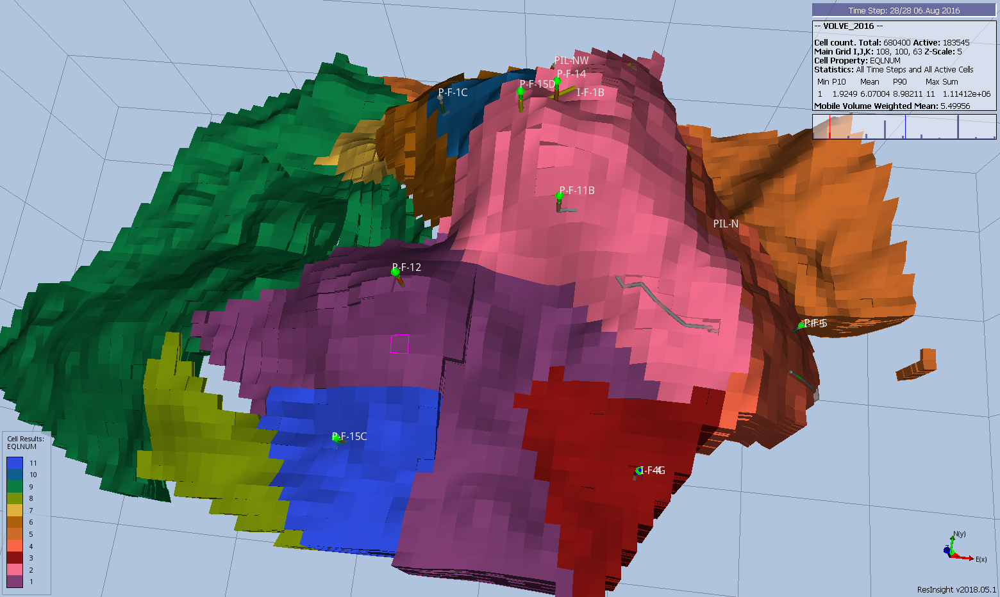

## Data Requirements

OPM Flow, like most numerical modeling software, uses a default value of one for the various region arrays and thus if there is only one PVT data set for example, then there is no need to define the region array associated with allocating the PVT tables (via the [PVTNUM](#__RefHeading___Toc68366_2752266063) keyword in the [REGIONS](#__RefHeading___Toc40648_784232322) section), as all cells will be allocated PVT table number one. However, if there are more than one PVT table entered in the [PROPS](#__RefHeading___Toc39329_784232322) section and [PVTNUM](#__RefHeading___Toc68366_2752266063) is not defined in the model, then PVT tables greater than one will not be used and there will be no warning message indicating the fact.

Table 9.1 summarizes the various property region data and their associated keywords.

| No. | REGIONS Keyword | Standard Property Regions | Property Section |
| --- | --- | --- | --- |
| 1 | [EQLNUM](#__RefHeading___Toc73734_2752266063) | [EQLNUM – Define the Equilibration Region Numbers](#0.Description\|outline). Equilibrium region allocation based on the [EQUIL](#__RefHeading___Toc135617_1317547213) keyword in the [SOLUTION](#__RefHeading___Toc43947_784232322) section. | [SOLUTION](#__RefHeading___Toc43947_784232322) |
| 2 | [FIPNUM](#__RefHeading___Toc77229_2752266063) | [FIPNUM – Define the Fluid In-Place Region Numbers](#8.2.2.FIPNUM – Defines the Fluid In-Place Region Numbers\|outline). Fluid In-Place reporting via the [FIPNUM](#__RefHeading___Toc77229_2752266063) array that divides the model into different fluid in-place reporting regions. | [REGIONS](#__RefHeading___Toc40648_784232322) |
| 3 | [PVTNUM](#__RefHeading___Toc68366_2752266063) | [PVTNUM – Define the PVT Regions](#7.2.15.PVTNUM – Defines the PVT Regions\|outline). PVT table allocation of the [DENSITY](#__RefHeading___Toc45799_719036256), [PVDG](#__RefHeading___Toc104056_57619843), [PVDO](#__RefHeading___Toc45803_719036256), [PVTG](#__RefHeading___Toc104060_57619843), [PVTO](#__RefHeading___Toc104062_57619843), [PVCO](#__RefHeading___Toc325700_501926209), [PVTW](#__RefHeading___Toc2086106_3315222525), and [ROCK](#__RefHeading___Toc45809_719036256) tables. | [PROPS](#__RefHeading___Toc39329_784232322) |
| 4 | [SATNUM](#__RefHeading___Toc71136_2752266063) | [SATNUM – Define the Saturation Table Region Numbers](#8.1.5.SATNUM – Defines the Saturation Table Region Numbers\|outline). Saturation (relative permeability) table allocation of the [SGFN](#__RefHeading___Toc106868_335817223), [SWFN](#__RefHeading___Toc106882_335817223), [SOF2](#__RefHeading___Toc106876_335817223), [SOF3](#__RefHeading___Toc106878_335817223), [SGOF](#__RefHeading___Toc106870_335817223), and [SWOF](#__RefHeading___Toc45811_7190362561) tables. This array is for the standard drainage, as oppose to the imbibition curves,  used in all models. There are separate region arrays for alternative relative permeability curves. | [PROPS](#__RefHeading___Toc39329_784232322) |
|  | Function Specific Regions |  |  |
| 5 | [ENDNUM](#__RefHeading___Toc123125_83452205) | [ENDNUM – Define the End-Point Scaling Depth Region Numbers](#8.2.1.ENDNUM – Define the End-Point Scaling Depth Region Numbers\|outline). [ENPTVD](#__RefHeading___Toc69789_621662414) and [ENKRVD](#__RefHeading___Toc69787_621662414) versus depth table allocation for when [ENDSCALE](#__RefHeading___Toc68146_2267116897) option has been activated in the [RUNSPEC](#__RefHeading___Toc55591_1778172979) section. | [PROPS](#__RefHeading___Toc39329_784232322) |
| 6 | [FIP](#__RefHeading___Toc250560_252421755) | [FIP – Define the Fluid In-Place Names and Region and Numbers](#9.3.15.FIP– Define the Fluid In-Place Names and Region and Numbers\|outline). Fluid In-Place reporting via the [FIP](#__RefHeading___Toc250560_252421755) array that divides the model into different fluid in-place reporting regions. | [REGIONS](#__RefHeading___Toc40648_784232322) |
| 7 | [FIPOWG](#__RefHeading___Toc93831_3812137098) | [FIPOWG – Activate Oil, Gas, and Water FIP Zone Reporting](#8.2.4.FIPOWG – Activate Oil, Gas, and Water FIP Zone Reporting\|outline). Fluid In-Place reporting for the total oil, gas, and water in the model. There is no region property array for this keyword, as the simulator calculates the total phase volumes based on the contacts entered via the [EQUIL](#__RefHeading___Toc135617_1317547213) keyword in the [SOLUTION](#__RefHeading___Toc43947_784232322) section. | [REGIONS](#__RefHeading___Toc40648_784232322) |
| 8 | [HBNUM](#__RefHeading___Toc290467_870710203) | [HBNUM – Define Herschel-Bulkley Region Numbers](#9.3.19.HBNUM – Define Herschel-Bulkley Region Numbers\|outline). Herschel-Bulkley rheological property table region numbers. | [PROPS](#__RefHeading___Toc39329_784232322) |
| 9 | [HWSNUM](#__RefHeading___Toc269892_4219267791) | [HWSNUM – Define the Saturation Table Region Numbers (High Salinity and Water Wet)](#9.3.20.HWSNUM – Define the Saturation Table Region Numbers (High Salinity and Water Wet)\|outline). High salinity water wet saturation table allocation using the high salinity water wet saturation [SWFN](#__RefHeading___Toc106882_335817223) and SOFN tables.  This is an alias for the [SURFWNUM](#__RefHeading___Toc1179776_4250154414) property region which is also not supported by OPM Flow. | [PROPS](#__RefHeading___Toc39329_784232322) |
| 10 | [IMBNUM](#__RefHeading___Toc129665_83452205) | [IMBNUM – Define the Imbibition Saturation Table Region Numbers](#8.2.5.IMBNUM – Define the Imbibition Saturation Table Region Numbers\|outline). Imbibition saturation table allocation of the [SWFN](#__RefHeading___Toc106882_335817223), [SOF2](#__RefHeading___Toc106876_335817223), [SOF3](#__RefHeading___Toc106878_335817223), or [SWOF](#__RefHeading___Toc45811_7190362561) imbibition tables. | [PROPS](#__RefHeading___Toc39329_784232322) |
| 11 | [IMBNUMMF](#__RefHeading___Toc523278_2135714711) | [IMBNUMMF – Define the Imbibition Saturation Table Region Numbers (Matrix-Fracture)](#9.3.29.IMBNUMMF – Define the Imbibition Saturation Table Region Numbers (Matrix-Fracture)\|outline). Imbibition saturation tables region numbers for flow between the matrix and fracture blocks, for when the Hysteresis option has been activated in Dual Porosity or Dual Permeability runs. | [PROPS](#__RefHeading___Toc39329_784232322) |
| 12 | [KRNUM](#__RefHeading___Toc273792_2369005893) | [KRNUM – Define the Directional Saturation Table Region Numbers](#9.3.32.KRNUM – Define the Directional Saturation Table Region Numbers\|outline). Direction dependent saturation tables region numbers for when  Directional Dependent Saturation Function option has been activated by the DIRECT parameter on the [SATOPTS](#__RefHeading___Toc37029_327352552). | [PROPS](#__RefHeading___Toc39329_784232322) |
| 13 | [KRNUMMF](#__RefHeading___Toc279351_2369005893) | [KRNUMMF – Define the Saturation Table Region Numbers (Matrix-Fracture)](#9.3.33.KRNUMMF – Define the Saturation Table Region Numbers (Matrix-Fracture)\|outline). Drainage saturation tables region numbers for flow between the matrix and fracture blocks in a Dual Porosity or Dual Permeability model. | [PROPS](#__RefHeading___Toc39329_784232322) |
| 14 | [LSLTWNUM](#__RefHeading___Toc355130_2843394514) | [LSLTWNUM – Define the Low Salt Water Wet Saturation Table Region Numbers](#9.3.34.LSLTWNUM – Define the Low Salt Water Wet Saturation Table Region Numbers\|outline). Low salt water wet saturation tables region numbers for when the Low Salinity option for the Brine model and the Surfactant Wettability option have been activated for the model. | [PROPS](#__RefHeading___Toc39329_784232322) |
| 15 | [LSNUM](#__RefHeading___Toc355132_2843394514) | [LSNUM – Define the Low Salt Oil Wet Saturation Table Region Numbers](#9.3.35.LSNUM – Define the Low Salt Oil Wet Saturation Table Region Numbers\|outline). Low salt oil wet saturation tables region numbers for the Low Salinity  Brine model. | [PROPS](#__RefHeading___Toc39329_784232322) |
| 16 | [LWSLTNUM](#__RefHeading___Toc470660_3181922006) | [LWSLTNUM – Define the Low Salt Oil Wet Saturation Table Region Numbers](#9.3.30.LWSLTNUM – Define the Low Salt Oil Wet Saturation Table Region Numbers\|outline). Low salt oil wet saturation table region numbers for the Low Salinity  Brine model. | [PROPS](#__RefHeading___Toc39329_784232322) |
| 17 | [LWSNUM](#__RefHeading___Toc355132_28433945141) | [LWSNUM – Define the Low Salt Water Wet Saturation Table Region Numbers](#9.3.31.LWSNUM – Define the Low Salt Water Wet Saturation Table Region Numbers\|outline). Low salt water wet saturation table region numbers for when the Low Salinity option for the Brine model and the Surfactant Wettability option have been activated for the model. | [PROPS](#__RefHeading___Toc39329_784232322) |
| 18 | [MISCNUM](#__RefHeading___Toc129667_83452205) | [MISCNUM – Define the Miscibility Region Numbers](#8.2.6.MISNUM – Define the Miscibility Region Numbers\|outline). Miscible regions based on the [TLMIXPAR](#__RefHeading___Toc121483_83452205) records when the [MISCIBLE](#__RefHeading___Toc61978_4106839650) or [SOLVENT](#__RefHeading___Toc62787_1778172979) keywords have been activated in the [RUNSPEC](#__RefHeading___Toc55591_1778172979) section. | [PROPS](#__RefHeading___Toc39329_784232322) |
| 19 | [OPERNUM](#__RefHeading___Toc67857_718313858) | [OPERNUM – Define Regions for Mathematical Operations on Arrays](#5.3.60.OPERNUM – Define Regions for Mathematical Operations on Arrays\|outline). [OPERATER](#__RefHeading___Toc155507_332691817) keyword region numbers that can also be used with the [EQUALREG](#__RefHeading___Toc296593_1576177388), [ADDREG](#__RefHeading___Toc4414_421927891), [COPYREG](#__RefHeading___Toc296589_1576177388), [MULTIREG](#__RefHeading___Toc296613_1576177388), [MULTREGP](#__RefHeading___Toc296617_1576177388), and [MULTREGT](#__RefHeading___Toc296621_1576177388) keywords, as well as the [OPERATER](#__RefHeading___Toc155507_332691817) keyword in calculating various grid properties in the [GRID](#__RefHeading___Toc38674_784232322) and [REGIONS](#__RefHeading___Toc40648_784232322) section. | [GRID](#__RefHeading___Toc38674_784232322) [EDIT](#__RefHeading___Toc40641_784232322) [PROPS](#__RefHeading___Toc39329_784232322) [REGIONS](#__RefHeading___Toc40648_784232322) [SOLUTION](#__RefHeading___Toc43947_784232322) |
| 20 | [PENUM](#__RefHeading___Toc301590_2928331029) | [PENUM – Define the Petro-Elastic Region Numbers](#9.3.38.PENUM – Define the Petro-Elastic Region Numbers\|outline). Petro-elastic region numbers for petro-elastic coefficients, bulk modulus functions and shear modulus functions. | [PROPS](#__RefHeading___Toc39329_784232322) |
| 21 | [PLMIXNUM](#__RefHeading___Toc107258_3812137098) | [PLMIXNUM – Define the Polymer Region Numbers](#9.3.39.PLMIXNUM – Define the Polymer Region Numbers\|outline). Polymer region numbers for the mixing tables, and the maximum polymer and salt concentrations for the Polymer option. | [PROPS](#__RefHeading___Toc39329_784232322) |
| 22 | [RESIDNUM](#__RefHeading___Toc655956_501926209) | [RESIDNUM – Define Vertical Equilibrium Residual Flow Region Numbers](#9.3.43.RESIDNUM – Define Vertical Equilibrium Residual Flow Region Numbers\|outline). Vertical Equilibrium residual flow calculation saturation tables or when region numbers for the Vertical Equilibrium option. | [PROPS](#__RefHeading___Toc39329_784232322) |
| 23 | [ROCKNUM](#__RefHeading___Toc118210_2939291539) | [ROCKNUM – Define Rock Compaction Table Region Numbers](#8.2.5.ROCKNUM – Define Rock Compaction Table Region Numbers\|outline). Rock compaction table allocation for when the [ROCKCOMP](#__RefHeading___Toc55593_1778172979) keyword as been activated in the [RUNSPEC](#__RefHeading___Toc55591_1778172979) section, that allocates the [ROCKTAB](#__RefHeading___Toc107256_3812137098) series of tables to a cell. | [PROPS](#__RefHeading___Toc39329_784232322) |
| 24 | [SURFNUM](#__RefHeading___Toc896940_4250154414) | [SURFNUM – Define the Surfactant Miscible Saturation Table Region Numbers](#9.3.47.SURFNUM – Define the Surfactant Miscible Saturation Table Region Numbers\|outline). Surfactant saturation (relative permeability) tables allocation allocating the [SWFN](#__RefHeading___Toc106882_335817223), [SOF2](#__RefHeading___Toc106876_335817223), [SOF3](#__RefHeading___Toc106878_335817223), or [SWOF](#__RefHeading___Toc45811_7190362561) as miscible tables. | [PROPS](#__RefHeading___Toc39329_784232322) |
| 25 | [SURFWNUM](#__RefHeading___Toc1179776_4250154414) | [SURFWNUM – Define the Saturation Table Region Numbers (High Salinity and Water Wet)](#9.3.48.SURFWNUM – Define the Saturation Table Region Numbers (High Salinity and Water Wet)\|outline). High salinity water wet saturation table allocation using the high salinity water wet saturation [SWFN](#__RefHeading___Toc106882_335817223) and SOFN tables. | [PROPS](#__RefHeading___Toc39329_784232322) |
| 26 | [TNUM](#__RefHeading___Toc95487_3812137098) | [TNUM – Define Passive Tracer Concentration Regions](#8.2.13.TNUM – Define Passive Tracer Concentration Regions\|outline). Partitioned Tracer option region numbers for this option. | [PROPS](#__RefHeading___Toc39329_784232322) |
| 27 | [TRKPF](#__RefHeading___Toc1607157_4250154414) | [TRKPF – Define Partitioned Tracer Regions](#9.3.50.TRKPF – Define Partitioned Tracer Regions\|outline). Defines the regions associated with partition tracers and the partitioning tables allocated to grid blocks for when the Partitioned Tracer option has been enabled by the [PARTTRAC](#__RefHeading___Toc264979_2928331029) keyword in the [RUNSPEC](#__RefHeading___Toc55591_1778172979) section. | [PROPS](#__RefHeading___Toc39329_784232322) |
| 28 | [WH2NUM](#__RefHeading___Toc1046874_487874538) | [WH2NUM – Define WAG Hysteresis Saturation Table Region Numbers (Two Phase)](#9.3.51.WH2NUM – Define WAG Hysteresis Saturation Table Region Numbers (Two Phase)\|outline). Two phase Water-Alternating-Gas (“WAG”) hysteresis saturation table region numbers for when the hysteresis option has been activated by the [WAGHYSTR](#__RefHeading___Toc207827_2026549522) variable on the [SATOPTS](#__RefHeading___Toc37029_327352552) keyword in the [RUNSPEC](#__RefHeading___Toc55591_1778172979). | [PROPS](#__RefHeading___Toc39329_784232322) |
| 29 | [WH3NUM](#__RefHeading___Toc1046876_487874538) | [WH3NUM – Define WAG Hysteresis Saturation Table Region Numbers (Three Phase)](#9.3.52.WH3NUM – Define WAG Hysteresis Saturation Table Region Numbers (Three Phase)\|outline). Three phase WAG hysteresis saturation table region numbers for when the hysteresis option has been activated by the [WAGHYSTR](#__RefHeading___Toc207827_2026549522) variable on the [SATOPTS](#__RefHeading___Toc37029_327352552) keyword in the [RUNSPEC](#__RefHeading___Toc55591_1778172979). | [PROPS](#__RefHeading___Toc39329_784232322) |
| Notes: |  |  |  |

*Table 9.1: REGIONS Section Allocation Array Summary*

| Note Earth modeling software may export the region arrays to be loaded into the simulator with values starting from zero instead of one.  This may result in an error message if these cells are active in the model, if the cells are inactive then the zero values will be ignored by the simulator. |
| --- |

A complete property data set associated with a region keyword is required for each region number allocated to the cells. For example, if the fluid properties for the model are the same (for example, [PVTO](#__RefHeading___Toc104062_57619843) and [PVDG](#__RefHeading___Toc104056_57619843) keyword data), but the rock compressibility is varying with depth resulting in, say three different [ROCK](#__RefHeading___Toc45809_719036256) keyword records, then there has to be three [PVTNUM](#__RefHeading___Toc68366_2752266063) regions and three complete PVT data sets in order to allocate the three [ROCK](#__RefHeading___Toc45809_719036256) records. This would mean that the [PVTO](#__RefHeading___Toc104062_57619843) and [PVDG](#__RefHeading___Toc104056_57619843) records, in this instance, would have to be repeated three times to match the three [ROCK](#__RefHeading___Toc45809_719036256) keyword records.

Example [SATNUM](#__RefHeading___Toc71136_2752266063) and [EQLNUM](#__RefHeading___Toc73734_2752266063) arrays from the Volve [The Volve Data was approved for data sharing in 2018 by the initiative of the last Operating company, Equinor and approved by the license partners ExxonMobil E&P Norway AS and Bayerngas Norge AS in the end of 2017.] field are displayed in Figure 9.1 and Figure 9.2, respectively.

