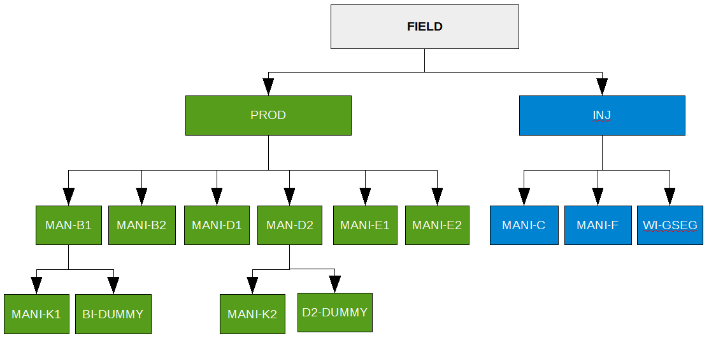

### GRUPTREE – Define Group Tree Hierarchy {#kw-GRUPTREE}


| [RUNSPEC](#kw-RUNSPEC) | [GRID](#kw-GRID) | [EDIT](#kw-EDIT) | [PROPS](#kw-PROPS) | [REGIONS](#kw-REGIONS) | [SOLUTION](#kw-SOLUTION) | [SUMMARY](#kw-SUMMARY) | [SCHEDULE](#kw-SCHEDULE) |
| --- | --- | --- | --- | --- | --- | --- | --- |


#### Description

GRUPTREE defines the group hierarchy of groups that have been created by having wells assigned to them via the [WELSPECS](#kw-WELSPECS) keyword in the [SCHEDULE](#kw-SCHEDULE) section, By default three group levels are defined that sets the wells as level three, reporting directly to defined groups at level two, and the level two groups reporting to the [FIELD](#kw-FIELD) group at level one.  If a different configuration is required then the GRUPTREE keyword should be used to define the group hierarchy by defining a lower level group that reports directly to a higher level group.


| No. | Name | Description | Default |
| --- | --- | :------ | --- |
| 1 | LOWER | A character string of up to eight characters in length that defines the group name which belongs to the HIGHER group. The group named [FIELD](#kw-FIELD) is the top most group and should NOT be used as as a group name for the LOWER group name. Undefined group relationships are automatically assigned to the [FIELD](#kw-FIELD) group. | None |
| 2 | HIGHER | A character string of up to eight characters in length that defines the HIGHER group name that the LOWER group belongs to. The group named [FIELD](#kw-FIELD) is the top most group and can be used as as the HIGHER group name. Undefined group relationships are automatically assigned to the [FIELD](#kw-FIELD) group. | None |
| Notes: |  |  |  |
: GRUPTREE Keyword Description {#tbl-12-44}
A group hierarchy can have any number of levels but groups that have other groups as LOWER groups cannot also have wells for the HIGHER group. Thus,  a group either contains wells or has LOWER groups

See also the [GCONPROD](#kw-GCONPROD) and [GCONINJE](#kw-GCONINJE) for defining group production and injection volumes, and the [WELSPECS](#kw-WELSPECS) keywords to allocate wells to groups. All the aforementioned keywords are described in the [SCHEDULE](#kw-SCHEDULE) section.


#### Examples

The first example defines PLAT01 and PLAT03 reporting to the [FIELD](#kw-FIELD) level (default if these records are omitted) and PLAT02 reporting to PLAT01.


```
--
--       DEFINE GROUP TREE HIERARCHY
--
--       LOWER     HIGHER
--       GROUP     GROUP
GRUPTREE
         PLAT01    FIELD                                                       /
         PLAT02    PLAT01                                                      /
         PLAT03    FIELD                                                       /
/
```


The next example is more complex and is taken form the Norne model.


```
--
--       DEFINE GROUP TREE HIERARCHY
--
--       LOWER      HIGHER
--       GROUP      GROUP
GRUPTREE
        'INJE'     'FIELD'                                                     /
        'PROD'     'FIELD'                                                     /
        'MANI-B2'  'PROD'                                                      /
        'MANI-B1'  'PROD'                                                      /
        'MANI-D1'  'PROD'                                                      /
        'MANI-D2'  'PROD'                                                      /
        'MANI-E1'  'PROD'                                                      /
        'MANI-E2'  'PROD'                                                      /
        'MANI-K1'  'MANI-B1'                                                   /
        'MANI-K2'  'MANI-D2'                                                   /
        'MANI-C'   'INJE'                                                      /
        'MANI-F'   'INJE'                                                      /
        'WI-GSEG'  'INJE'                                                      /
        'B1-DUMMY' 'MANI-B1'                                                   /
        'D2-DUMMY' 'MANI-D2'                                                   /
/
```


The group hierarchy for this example is shown below.





Here groups PROD, INJ, MAN-B1, and MAN-D2 report to higher level groups and the other remaining groups all have individual wells allocated to them instead.