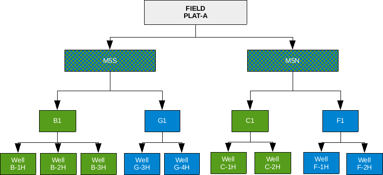

### NODEPROP – Define Network Node Properties for Extended Network {#kw-NODEPROP}


| [RUNSPEC](#kw-RUNSPEC) | [GRID](#kw-GRID) | [EDIT](#kw-EDIT) | [PROPS](#kw-PROPS) | [REGIONS](#kw-REGIONS) | [SOLUTION](#kw-SOLUTION) | [SUMMARY](#kw-SUMMARY) | [SCHEDULE](#kw-SCHEDULE) |
| --- | --- | --- | --- | --- | --- | --- | --- |


#### Description

This keyword defines the network node properties for the extended network option for when the Extended Network Model has been invoked by the [NETWORK](#kw-NETWORK) keyword in the [RUNSPEC](#kw-RUNSPEC) section. There are two types of network facilities in the simulator, the Standard Network model, which is defined with the GRUPNET keyword in the [SCHEDULE](#kw-SCHEDULE) section and the Extended Network Model defined by the [BRANPROP](#kw-BRANPROP) and NODEPROP keywords, again in the [SCHEDULE](#kw-SCHEDULE) section.

For the Extended Network Model the group hierarchy can be different to that defined by the [GRUPTREE](#kw-GRUPTREE) keyword; however, the bottom most nodes in the network tree associated with wells, must be the same as that defined by the [GRUPTREE](#kw-GRUPTREE) keyword.


| No. | Name | Description | Default |
| --- | --- | :------ | --- |
| Field | Metric | Laboratory |  |
| 1 | NODE | A character string of up to eight characters in length that defines the  node name for the data on this keyword record. | None |
| 2 | PRESS | A real value that sets the terminal fixed pressure for the node, this should be set to: | 1* |
| psia | bars | atm |  |
| 3 | CHOKE | CHOKE is a defined character string that sets if the downstream branch (or uptree branch, being the one closer towards the terminal node) from this node should have the capability to choke back the flow rate in order impose a flow constraint. Here the downstream branch is the node furthermost from the wells. Thus for a production network,  this will be an outlet branch as the wells are exporting fluid from the branch node. Whereas for an injection node, this is an inlet branch as the wells are importing the injection fluid. | NO |
| 4 | GASLIFT | A defined character string that sets if the associated subordinate well’s produced gas lift gas should be included in the node’s flow stream (YES), or not (NO).  GASLIFT should be set to either: If NODE does not have any subordinate wells or satellite groups (see the  [GSATPROD](#kw-GSATPROD) keyword in the [SCHEDULE](#kw-SCHEDULE) section) directly attached to the node, then GASLIFT should be defaulted (1*) or set to NO.  The option is only valid for producing networks | NO |
| 5 | GROUP | A character string of up to eight characters in length that defines the group for which the automatic choke will be applied in order to match the group’s target rate (the TARGET variable on the [GCONPROD](#kw-GCONPROD) keyword in the [SCHEDULE](#kw-SCHEDULE) section). The target rate is matched by adjusting the pressure drops across the automatic choke. The default value of 1* uses NODE (item one) as the group if it exists in the run. In addition, if NODE is just connected to subordinate wells then GROUP should also be defaulted. | 1* |
| 6 | GRPNAME | GRPNAME defines the name of the source or sink group in the commercial compositional simulator; however, the variable is not used as sources and sinks nodes must have the same name as their comparable groups in the Extended Network Model in both OPM Flow and the commercial black-oil simulator. | 1* |
| 7 | NETYPE | NETYPE defines the network type in the commercial compositional simulator: PROD, WINJ or GINJ. However, the variable is not used as only production networks are supported in the Extended Network Model in both OPM Flow and the commercial black-oil simulator. | 1* |
| Notes: |  |  |  |
: NODEPROP Keyword Description {#tbl-12-57}
See also the [NETWORK](#kw-NETWORK) keyword in the [RUNSPEC](#kw-RUNSPEC) section and the [BRANPROP](#kw-BRANPROP) in the [SCHEDULE](#kw-SCHEDULE) section.


#### Example

Given the following Extended Network model in Figure 12.5.




First the Extended Network model should be used invoked in the [RUNSPEC](#kw-RUNSPEC) section, and then the [BRANPROP](#kw-BRANPROP) keyword should be used to define the branch network, and finally the NODEPROP keyword is used to describe the node properties with the network.


```
-- ==============================================================================
--
-- RUNSPEC SECTION
--
-- ==============================================================================
RUNSPEC
--
--       ACTIVATE THE EXTENDED NETWORK OPTION AND DEFINE PARAMETERS
--
--       MAX.    MAX     NOT
--       NODE    LINK    USED
NETWORK
         3        2      1*                                                    /
…..…………..
..……..…..
-- ==============================================================================
--
-- SCHEDULE SECTION
--
-- ==============================================================================
SCHEDULE
--
--       EXTENDED NETWORK BRANCH PROPERTIES
--
-- DOWN  UP       VFP    VFP
-- NODE  NODE     TABLE  ALFQ
BRANPROP
B1       PLAT-A   5      1*                                                   /
C1       PLAT-A   4      1*                                                   /
/
--
--       EXTENDED NETWORK NODE PROPERTIES
--
-- NODE  NODE   CHOKE  GAS   CHOKE  SOURCE  NETWORK
-- NAME  PRESS  OPTN   LIFT  GROUP  SINK    TYPE
NODEPROP
PLAT-A   21.0   NO     NO                                                     /
B1       1*     NO     NO                                                     /
C1       1*     NO     NO                                                     /
/
```


Here the main platform for the field, PLAT-A, has a fixed 21 barsa pressure applied as an operating constraint.