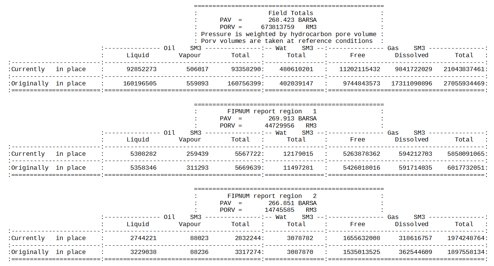
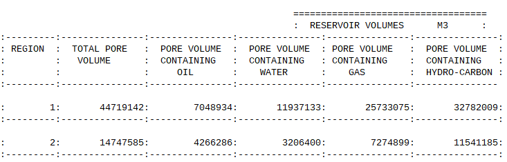
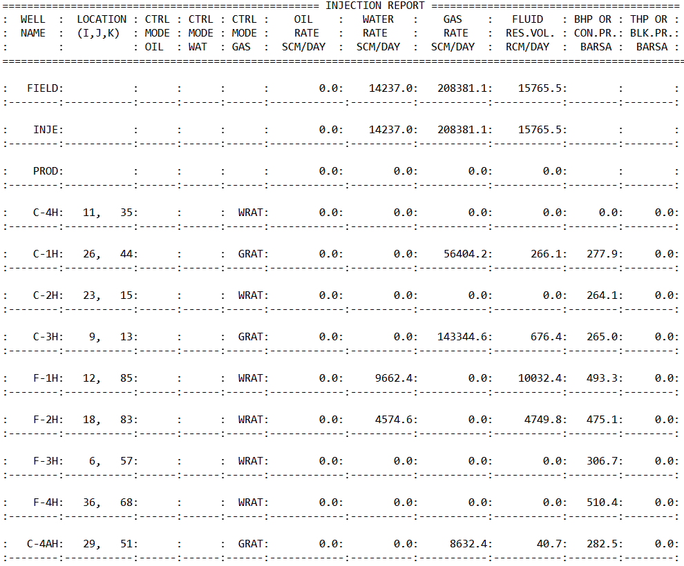
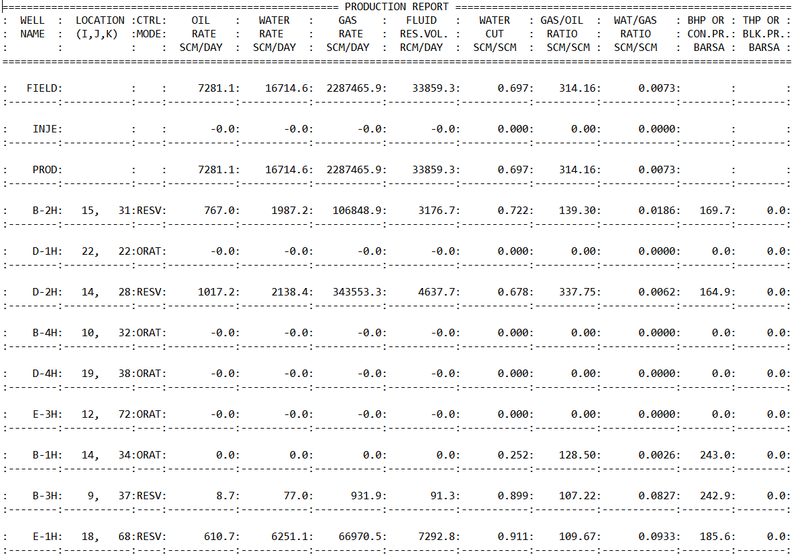
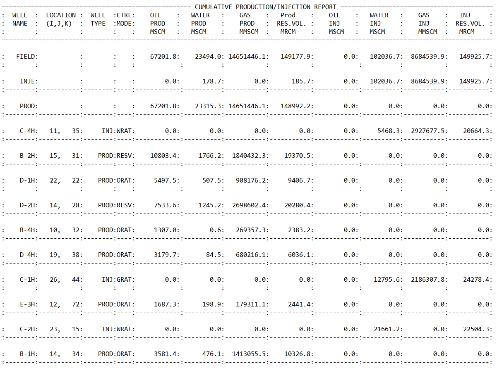
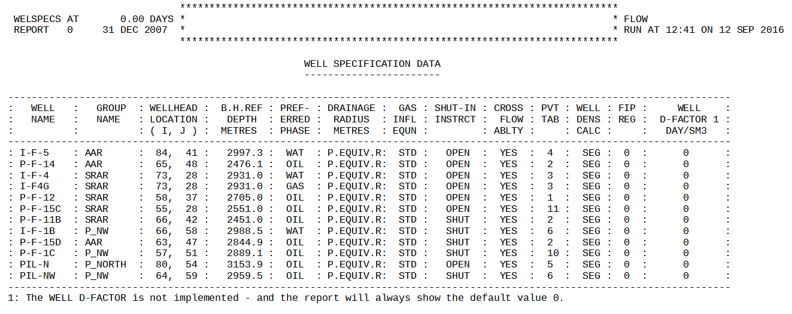
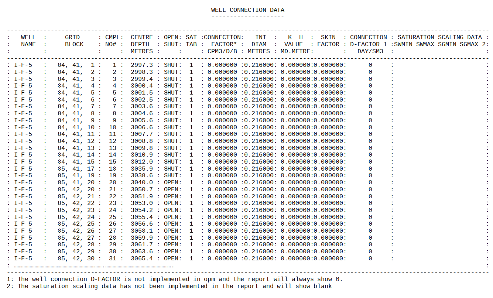
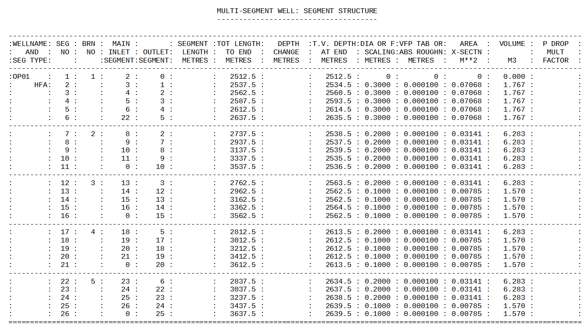
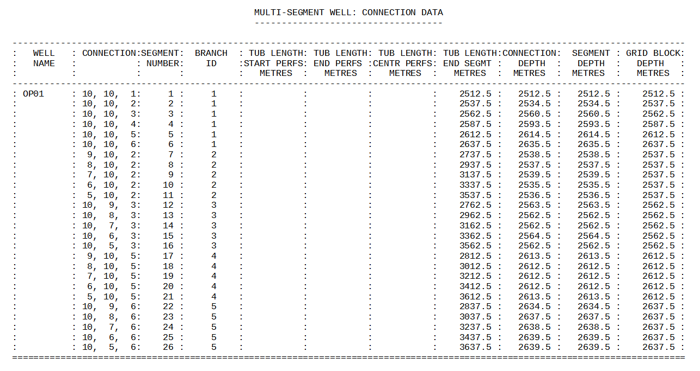

### RPTSCHED – Define SCHEDULE Section Reporting


| RUNSPEC | GRID | EDIT | PROPS | REGIONS | SOLUTION | SUMMARY | SCHEDULE |
| --- | --- | --- | --- | --- | --- | --- | --- |


#### Description

This keyword defines the data in the SCHEDULE section that is to be printed to the output print file in human readable format. The keyword has two distinct forms, the first of which consists of the keyword followed by a series of integers on the next line indicating the data to be printed (see the first example). This is the original format in the commercial simulator and was subsequently superseded by the second format. The second format consists of the keyword followed by a series of character strings that indicate the data to be printed. In most cases the character string is the keyword used to define the data in the OPM Flow input deck, for example WELSPECS to defined the basic well definitions.


| No. | Name | Description | Default |
| --- | --- | --- | --- |
| 1 | FIP | Print the fluid in-place report. The parameter is assigned a value, OPTION, using the form FIP = OPTION, where OPTION is an integer variable set to: | FIP=2 |
| 2 | FIPRESV | Print the reservoir volumes in-place report. | None |
| 3 | NOTHING | Switches off all printed reports in the SCHEDULE section. | N/A |
| 4 | SALT | Print grid block salt concentration values. Note this is an OPM Flow specific keyword. | N/A |
| 5 | RESTART | RESTART defines the frequency at which the restart data for restarting a run is written to the RESTART file. The parameter is assigned a value, OPTION, using the form RESTART = OPTION, where OPTION is an integer variable set to: See the RPTRST keyword in the SOLUTION section for a more flexible way to write out restart files. |  |
| 6 | WELLS | The WELLS option turns on production and injection rate and cumulative volume reporting for produced and injected fluids. The parameter has several levels of reporting details set by the assigned OPTION value, using the form WELLS = OPTION, where OPTION is an integer variable set to: Only OPTION equal to one is supported by OPM Flow. | WELLS=1 |
| 7 | WELSPECS | WELSPECS switches on reporting of the well connections, wells and groups at each report time step. There are numerous reports associated with this option. Unlike the other reporting parameters that produce a report for each reporting time step, the WELSPECS report option only produces a report if an associated keyword has been activated at the current reporting time step. For example, if the reporting time steps are January, February,  and March 2020, and the RPTSCHED WELSPECS option is activated in January, with wells OP01 and OP02 being declared via the WELSPECS and COMPDAT keywords,  then a report will be printed for January for these two wells. If there are no further well activations until March, with well OP03 being declared, then there will be no report for February, and only well OP03 will reported at the March reporting time step. |  |
| Notes: |  |  |  |

*Table 12.62: RPTSCHED Keyword Description*


Development is current progressing on developing reports in a similar format to the commercial simulator and this section will be updated as additional reports are added to OPM Flow’s functionality.


::: {.callout-note}
Unlike the other reporting keywords in the RUNSPEC, GRID, EDIT, PROPS and SOLUTION keywords, the requested reports on the this keyword remain in effect until they are switched off by this keyword, that is, the reports are written out every report time step until requested to stop. Use the ‘NOTHING’ parameter to switch off all reporting.
:::


An example FIP report is shown in Figure 12.6 from the Norne field, note only the field and the first two region reports are shown.




Figure 12.7 illustrates the reservoir volumes in-place report for the first two regions from the Norne field.




::: {.callout-note}
Note that the “PORV” quantity in the FIP (Balance) Report, as shown in Figure 12.6, is reported at reference conditions, meaning there is no pressure dependence involved. However, the “TOTAL PORE VOLUME” values in the Reservoir Volumes Report (Figure 12.7) are pressure dependent pore volumes.  Thus, for region one the “PORV” value is 44,729,956 rm3 (Figure 12.6) and the “TOTAL PORE VOLUME” (Figure 12.7) is 44,719,142 rm3. This is the same as the commercial simulator.
:::


The WELLS report consists of several sub-reports depending on the selected option for this report type. Figure 12.8 and Figure 12.9 show example Injection and Production sub-reports






The third and final report is the Cumulative Production and Injection sub-report, shown in Figure 12.10.




Similarly as for the WELLS report, the WELSPECS report consists of several sub-reports, including the Well Production Control report shown in Figure 12.11 for the Volve field.




The COMPDAT keyword data is listed on the Well Connection Data sub-report as depicted in Figure 12.12 for the I-F-5 well. Note that the data is repeated for all connections and for all wells declared at the reporting time step.




For multi-segment wells both the Production Well Control and Well Connection sub-reports are printed as per Figure 12.11 and Figure 12.12, and in addition the equivalent multi-segment well data is printed as well, as shown in Figure 12.13 and Figure 12.14, as shown on the following page.

Figure 12.13 shows the Multi-Segment Well Segment Structure sub-report for a single multi-segment well, OP01. See the WELSEGS keyword Example in the SCHEDULE section to see how the OP01 well is defined.




And Figure 12.14 depicts Multi-Segment Well Connection Data sub-report for the same well.




#### Example

The first example shows the original format of this keyword.


```
--
--       DEFINE SCHEDULE SECTION REPORT OPTION (ORIGINAL FORMAT)
--
RPTSCHED
         1        2*0      1        3*1                                        /
```


The next example shows the second format of the keyword.


```
-- ==============================================================================
--
-- SCHEDULE SECTION
--
-- ==============================================================================
SCHEDULE

-- ------------------------------------------------------------------------------
-- SCHEDULE SECTION - 2000-01-01
-- ------------------------------------------------------------------------------
RPTSCHED
         'WELLS=2'    'WELSPECS'    'CPU=2'     'FIP=2'                        /

DATES
         1  JAN   2000  /
/

RPTSCHED
         'NOTHING'                                                             /

DATES
         1  FEB   2000  /
         1  MAR   2000  /
         1  APR   2000  /
         1  MAY   2000  /
         1  JUN   2000  /
         1  JLY   2000  /
         1  AUG   2000  /
         1  SEP   2000  /
         1  OCT   2000  /
         1  NOV   2000  /
         1  DEC   2000  /
/
```


In the above example monthly reporting time steps have been used with a SCHEDULE section report on the January 1, 2000;  after which all reports are switched off for the subsequent reporting time steps.
