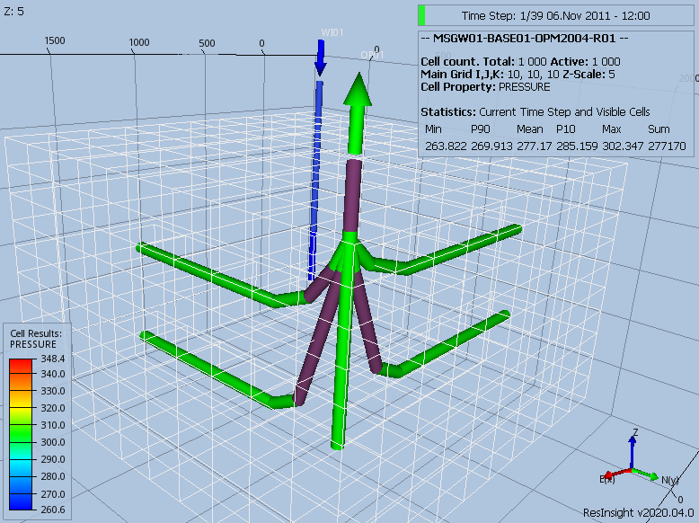

### WELSEGS – Define Multi-Segment Wells and Their Segment Structure


| RUNSPEC | GRID | EDIT | PROPS | REGIONS | SOLUTION | SUMMARY | SCHEDULE |
| --- | --- | --- | --- | --- | --- | --- | --- |


#### Description

The WELSEGS keyword defines a well to be a multi-segment well and defines the well’s segment structure. Note that the well must have previously been defined by the WELSPECS keyword in the SCHEDULE section and that the WELSEGS keyword should be repeated for each multi-segment well in the model.


| No. | Name | Description | Default |
| --- | --- | :------ | --- |
| Field | Metric | Laboratory |  |
| 1-1 | WELNAME | A character string of up to eight characters in length that defines the well name for which a multi-segment well is being defined. Note that the well name (WELNAME) must have been declared previously using the WELSPECS keyword in the SCHEDULE section, otherwise an error may occur. | None |
| 1-2 | TOPDEP | A real value that defines the depth of the nodal point of the top segment. This is used as the reference depth for reporting the bottom-hole pressure for the multi-segment well. If the keyword is entered multiple times for the same well, due to for example the well configuration changing through time, then it is only necessary to enter this data the first time the keyword is used for a well. | None |
| feet | m | cm |  |
| 1-3 | TOPLEN | A real positive value that defines the length of the tubing from the tubing reference point (for example Measured Depth Relative to Kelly Bushing, MDRKB) to the nodal point of the top segment. Tubing pressures between the nodal point of the top segment and the well head are not calculated by the multi-segment well option as these are taken into account by the VFP tables allocated to the well and entered via the VFPPROD and VFPINJ keywords in the SCHEDULE section. If TOPLEN is set to zero or defaulted then the tubing length is measured from the nodal point of the top segment. | 0 |
| feet | m | cm |  |
| 1-4 | WBORVOL | A real positive value that defines the effective wellbore volume for the top segment, that is from the tubing head or wellhead at the surface to the nodal point of the top segment. The default value of 1.0 x 10-5 results in minimal wellbore storage. | 1.0E-5 |
| ft3 | m3 | cm3 |  |
| 1-5 | TUBOPT | A defined character string that specifies the type of length and depth data entered for LENGTH and DEPTH on the second record and should be set to one of the following: As there is no default value for TUBOPT one of the above options must be explicitly defined. | None |
| 1-6 | PRESOPT | A defined character string that specifies the pressure drop calculation used for each well segment and should be set to one of the following: The default value for PRESOPT of HFA sets the pressure calculation to include the hydrostatic, friction and acceleration terms. | HFA |
| 1-7 | FLOWOPT | A defined character string that specifies the type of multi-phase calculation used for each well segment and should be set to one of the following: OPM Flow only supports the default value of HO. | HO |
| 1-8 | TOPX | A real positive value equal to or greater than zero that defines the coordinate in the x-direction of the nodal point of the top segment that is used for display purposes only. Currently this option is not supported by OPM Flow. | None |
| feet | m | cm |  |
| 1-9 | TOPY | A real positive value equal to or greater than zero that defines the coordinate in the y-direction of the nodal point of the top segment that is used for display purposes only. Currently this option is not supported by OPM Flow. | None |
| feet | m | cm |  |
| 1-10 | XAREATH | A real positive value equal to or greater than zero that defines the cross-sectional area of the pipe wall used in thermal conductivity calculations for when the temperature calculation is activated by the TEMP keyword in the RUNSPEC section. Currently this option is not supported by OPM Flow. | None |
| ft2 | m2 | cm2 |  |
| 1-11 | VHEATCAP | A real positive value equal to or greater than zero that defines the volumetric heat capacity of the pipe wall used in thermal conductivity calculations for when the temperature calculation is activated by the TEMP keyword in the RUNSPEC section. Currently this option is not supported by OPM Flow. | None |
| Btu/ft/day/°R | kJ/m/day/K | J/cm/hr/K |  |
| 1-12 | THCON | A real positive value equal to or greater than zero that defines the thermal conductivity of the pipe wall used in thermal conductivity calculations for when the temperature calculation is activated by the TEMP keyword in the RUNSPEC section. Currently this option is not supported by OPM Flow. | None |
| Btu/ft/day/°R | kJ/m/day/K | J/cm/hr/K |  |
| 1-13 | / | Record terminated by a “/” | Not Applicable |
| 2-1 | ISEG1 | A positive integer greater than or equal to two and less than or equal to MXSEGS on WSEGDIMS keyword in the RUNSPEC section that defines the start of the segment range. | None |
| 2-2 | ISEG2 | A positive integer greater than or equal to ISEG1 on this record and less than or equal to MXSEGS on the WSEGDIMS keyword in the RUNSPEC section that defines the end of the segment range. | None |
| 2-3 | IBRANCH | A positive integer greater than or equal to one and less than or equal to MXBRAN on WSEGDIMS keyword in the RUNSPEC section that defines the branch number of a segment. All segments on the main stem must have IBRANCH set to one, and those on lateral branches should have IBRANCH set to between two and MXBRAN. | None |
| 2-4 | ISEG3 | A positive integer greater than or equal to one and less than or equal to  MXSEGS on the WSEGDIMS keyword in the RUNSPEC section that defines the outlet segment for the segment at the start of the segment range (ISEG1). | None |
| 2-5 | LENGTH | A real positive value that: | None |
| feet | m | cm |  |
| 2-6 | DEPTH | A real positive value that: |  |
| feet | m | cm | None |
| 2-7 | ID | A real positive value that defines the tubing internal diameter of each segment in the segment range. | None |
| feet | m | cm |  |
| 2-8 | EPSILON | A real positive value that defines the tubing absolute roughness of each segment in the segment range. | None |
| feet | m | cm |  |
| 2-9 | XAREA | A real positive value equal to or greater than zero that defines the cross-sectional area for fluid flow. Currently this option is not supported by OPM Flow. | None |
| ft2 | m2 | cm2 |  |
| 2-10 | VOLSEG | VOLSEG is a real positive value that defines the effective segment volume for the this segment. Currently this option is not supported by OPM Flow. | None |
| ft3 | m3 | cm3 |  |
| 2-11 | XCORDS | A real positive value that: Currently this option is not supported by OPM Flow. | None |
| feet | m | cm |  |
| 2-12 | YCORDS | A real positive value that: Currently this option is not supported by OPM Flow. | None |
| feet | m | cm |  |
| 2-13 | XAREAS | A real positive value equal to or greater than zero that defines the cross-sectional area of the pipe wall for this segment, that is used in thermal conductivity calculations for when the temperature calculation is activated by the TEMP keyword in the RUNSPEC section. Currently this option is not supported by OPM Flow. | None |
| ft2 | m2 | cm2 |  |
| 2-14 | VHEATSEG | A real positive value equal to or greater than zero that defines the volumetric heat capacity of the pipe wall for this segment, that is used in thermal conductivity calculations for when the temperature calculation is activated by the TEMP keyword in the RUNSPEC section. Currently this option is not supported by OPM Flow. | None |
| Btu/ft/day/°R | kJ/m/day/K | J/cm/hr/K |  |
| 2-15 | THCSEG | A real positive value equal to or greater than zero that defines the thermal conductivity of the pipe wall for this segment, that is used in thermal conductivity calculations for when the temperature calculation is activated by the TEMP keyword in the RUNSPEC section. Currently this option is not supported by OPM Flow. | None |
| Btu/ft/day/°R | kJ/m/day/K | J/cm/hr/K |  |
| 2-16 | / | Record terminated by a “/” | Not Applicable |
| Notes: |  |  |  |

*Table 12.90: WELSEGS Keyword Description*


The maximum number of wells should be defined via the WELLDIMS keyword and the maximum number of multi-segment wells should be declared on the WSEGDIMS keyword, both keywords are in the RUNSPEC section.

See also the WELSPECS keyword to define wells, the COMPDAT keyword to define the well completions for both ordinary wells and multi-segment wells, and the COMPSEGS keyword to define multi-segment well  segment completions. All the aforementioned keywords are described in the SCHEDULE section.


#### Example

The following example defines one multi-segment oil production well (OP01) using the WELSPECS, WELSEGS, COMPDAT and COMPSEGS keywords, and one standard water injection well (WI01) using the WELSPECS and COMPDAT keywords.


```
--
--       WELL SPECIFICATION DATA
--
-- WELL  GROUP     LOCATION  BHP    PHASE  DRAIN  INFLOW  OPEN  CROSS  PVT
-- NAME  NAME        I    J  DEPTH  FLUID  AREA   EQUANS  SHUT  FLOW   TABLE
WELSPECS
OP01     PLATFORM   10   10   1*     OIL                                       /
WI01     PLATFORM    1    1   1*     WATER                                     /
/
--
--       WELL CONNECTION DATA
--
-- WELL  --- LOCATION ---  OPEN   SAT   CONN   WELL   KH    SKIN   D     DIR
-- NAME   II  JJ  K1  K2   SHUT   TAB   FACT   DIA    FACT  FACT   FACT  PEN
COMPDAT
OP01      10  10   1   1   OPEN   1*    200.   0.5                             /
OP01      10  10   2   2   OPEN   1*    200.   0.5                             /
OP01      10  10   3   3   OPEN   1*    200.   0.4                             /
OP01      10  10   4   4   OPEN   1*    200.   0.4                             /
OP01      10  10   5   5   OPEN   1*    200.   0.4                             /
OP01      10  10   6   6   OPEN   1*    200.   0.4                             /

OP01       9  10   2   2   OPEN   1*    200.   0.4                             /
OP01       8  10   2   2   OPEN   1*    200.   0.4                             /
OP01       7  10   2   2   OPEN   1*    200.   0.4                             /
OP01       6  10   2   2   OPEN   1*    200.   0.4                             /
OP01       5  10   2   2   OPEN   1*    200.   0.4                             /

OP01      10   9   3   3   OPEN   1*    200.   0.4                             /
OP01      10   8   3   3   OPEN   1*    200.   0.4                             /
OP01      10   7   3   3   OPEN   1*    200.   0.4                             /
OP01      10   6   3   3   OPEN   1*    200.   0.4                             /
OP01      10   5   3   3   OPEN   1*    200.   0.4                             /

OP01       9  10   5   5   OPEN   1*    200.   0.4                             /
OP01       8  10   5   5   OPEN   1*    200.   0.4                             /
OP01       7  10   5   5   OPEN   1*    200.   0.4                             /
OP01       6  10   5   5   OPEN   1*    200.   0.4                             /
OP01       5  10   5   5   OPEN   1*    200.   0.4                             /

OP01      10   9   6   6   OPEN   1*    200.   0.4                             /
OP01      10   8   6   6   OPEN   1*    200.   0.4                             /
OP01      10   7   6   6   OPEN   1*    200.   0.4                             /
OP01      10   6   6   6   OPEN   1*    200.   0.4                             /
OP01      10   5   6   6   OPEN   1*    200.   0.4                             /

WI01       1   1   7   9   OPEN   1*    200.   0.5                             /
/
--
--       WELL SEGMENT SPECIFICATION DATA
--
-- WELL  NODAL       LEN     WELL    DEPH    PRESS   FLOW
-- NAME  DEPTH       TUBING  VOLM    OPTN    CALC    MODEL
WELSEGS
OP01     2512.5      2512.5  1.0E-5  ABS     HFA     HO                        /
--
--       SEG   SEG   BRAN    SEG     TUBING  NODAL   TUBE   TUBE     XSEC  VOL
--       ISTR  IEND  NO      NO      LENGTH  DEPTH   ID     ROUGH    AREA  SEG
           2     2    1       1      2537.5  2534.5  0.3    0.00010            /
           3     3    1       2      2562.5  2560.5  0.3    0.00010            /
           4     4    1       3      2587.5  2593.5  0.3    0.00010            /
           5     5    1       4      2612.5  2614.5  0.3    0.00010            /
           6     6    1       5      2637.5  2635.5  0.3    0.00010            /

           7     7    2       2      2737.5  2538.5  0.2    0.00010            /
           8     8    2       7      2937.5  2537.5  0.2    0.00010            /
           9     9    2       8      3137.5  2539.5  0.2    0.00010            /
          10    10    2       9      3337.5  2535.5  0.2    0.00010            /
          11    11    2      10      3537.5  2536.5  0.2    0.00010            /

          12    12    3       3      2762.5  2563.5  0.2    0.00010            /
          13    13    3      12      2962.5  2562.5  0.1    0.00010            /
          14    14    3      13      3162.5  2562.5  0.1    0.00010            /
          15    15    3      14      3362.5  2564.5  0.1    0.00010            /
          16    16    3      15      3562.5  2562.5  0.1    0.00010            /

          17    17    4       5      2812.5  2613.5  0.2    0.00010            /
          18    18    4      17      3012.5  2612.5  0.1    0.00010            /
          19    19    4      18      3212.5  2612.5  0.1    0.00010            /
          20    20    4      19      3412.5  2612.5  0.1    0.00010            /
          21    21    4      20      3612.5  2613.5  0.1    0.00010            /

          22    22    5       6      2837.5  2634.5  0.2    0.00010            /
          23    23    5      22      3037.5  2637.5  0.2    0.00010            /
          24    24    5      23      3237.5  2638.5  0.2    0.00010            /
          25    25    5      24      3437.5  2639.5  0.1    0.00010            /
          26    26    5      25      3637.5  2639.5  0.1    0.00010            /
/
--
--       COMPLETION SEGMENT SPECIFICATION DATA
--
-- WELL
-- NAME
COMPSEGS
OP01                                                                           /
--
--      --LOCATION--  BRAN  START   END     DIR  LOC    MID    COMP    ISEG
--       II  JJ  K1   NO    LENGTH  LENGTH  PEN  I,J,K  PERFS  LENGTH  NO.
         10  10   1    1    2512.5  2525.0                                     /
         10  10   2    1    2525.0  2550.0                                     /
         10  10   3    1    2550.0  2575.0                                     /
         10  10   4    1    2575.0  2600.0                                     /
         10  10   5    1    2600.0  2625.0                                     /
         10  10   6    1    2625.0  2650.0                                     /

          9  10   2    2    2637.5  2837.5                                     /
          8  10   2    2    2837.5  3037.5                                     /
          7  10   2    2    3037.5  3237.5                                     /
          6  10   2    2    3237.5  3437.5                                     /
          5  10   2    2    3437.5  3637.5                                     /

         10   9   3    3    2662.5  2862.5                                     /
         10   8   3    3    2862.5  3062.5                                     /
         10   7   3    3    3062.5  3262.5                                     /
         10   6   3    3    3262.5  3462.5                                     /
         10   5   3    3    3462.5  3662.5                                     /

          9  10   5    4    2712.5  2912.5                                     /
          8  10   5    4    2912.5  3112.5                                     /
          7  10   5    4    3112.5  3312.5                                     /
          6  10   5    4    3312.5  3512.5                                     /
          5  10   5    4    3512.5  3712.5                                     /

         10   9   6    5    2737.5  2937.5                                     /
         10   8   6    5    2937.5  3137.5                                     /
         10   7   6    5    3137.5  3337.5                                     /
         10   6   6    5    3337.5  3537.5                                     /
         10   5   6    5    3537.5  3737.5                                     /
/
```

Note the use of both the COMPDAT and COMPSEGS keywords to fully define a multi-segment well’s completion.


Finally,  Figure 12.15 depicts the resulting well configuration for both wells, with the conventional water injection well shown in blue and the multi-segment oil producer shown in green.



