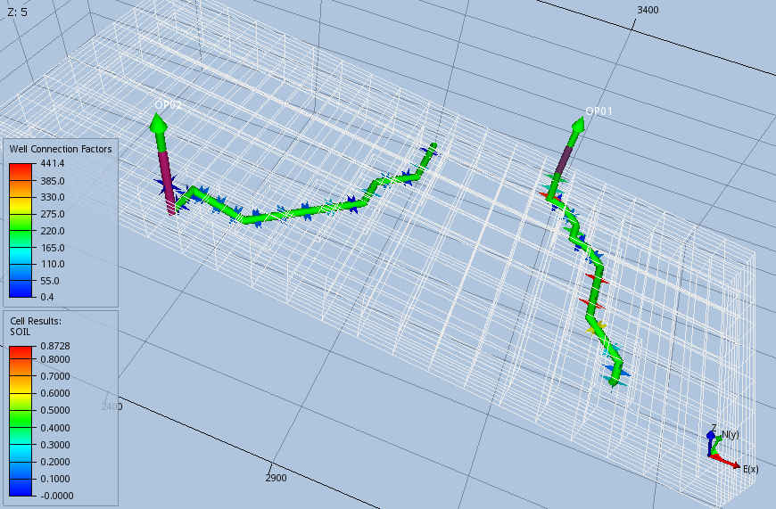

### WSEGAICD – Define Multi-Segment Well Autonomous ICD Connections


| RUNSPEC | GRID | EDIT | PROPS | REGIONS | SOLUTION | SUMMARY | SCHEDULE |
| --- | --- | --- | --- | --- | --- | --- | --- |


#### Description

The WSEGAICD keyword defines a multi-segment well segment to be an autonomous Inflow Control Device (“ICD”) as part of a completion for a multi-segment well. Note that the well must have been previously defined by the WELSPECS and WELSEGS keywords in the SCHEDULE section and that the data for the keyword should be repeated for each multi-segment completion that contains an autonomous ICD.

An ICD is a well completion component usually installed along the producing section of a well to minimize the unwanted water and gas breakthrough in an oil well, or early water production in a gas well, due to an uneven inflow profile over the completed interval.  Permeability variations over the producing interval cause the high permeability zones to produce higher quantities of fluids than the lower permeability zones and this uneven producing fluid profile may result in bypassed hydrocarbons. Secondly, for horizontal wells, the pressure loss from the “toe” to the “heel” of the well again results in an uneven fluid profile over the producing interval. In order to rectify this ICDs can be installed so that the well fluids have to flow through an ICD before entering the tubing; thus, creating an additional “designed” pressure loss.

An autonomous ICD inhibits the production of high-mobility fluids such as water and gas since the pressure drop in each unit is dependent on fluid properties and mobility, the device automatically increases the pressure differential across zones with high water or gas saturations, thus choking back production from these zones.


| No. | Name | Description | Default |
| --- | --- | --- | --- |
| Field | Metric | Laboratory |  |
| 1 | WELNAME | A character string of up to eight characters in length that defines the well name for which a multi-segment well is being defined. Note that the well name (WELNAME) must have been declared previously using both the WELSPECS and WELSEGS keywords in the SCHEDULE section, otherwise an error may occur. | None |
| 2 | ISEG1 | An integer greater than or equal to two and less than or equal to MXSEGS on the WSEGDIMS keyword in the RUNSPEC section that defines the start of the segment range. | None |
| 3 | ISEG2 | An integer greater than or equal to two and not less then ISEG1 on this record and less than or equal to MXSEGS on the WSEGDIMS keyword in the RUNSPEC section, that defines the end of the segment range. | None |
| 4 | ICDSTREN | A positive real value that defines an empirical constant for the strength of the given ICD as determined from measurements using the calibrated fluid. | None |
| psi/((lb/ft3)(rft3/day)2) | bars/((kg/m3)(rm3/day)2) | atm/((gm/cc)(rcc/hr)2) |  |
| 5 | ICDLEN | A real value that defines the length of the ICD used in conjunction with NSCALFAC to calculate a scaling factor to be applied to the reservoir flow to adjust the flow through each ICD, that is: NSCALFAC explicitly sets which of the above three options is used. If NSCALFAC is defaulted, then option 1) is used whenever ICDLEN is positive and option 2) when ICDLEN is negative. | Defined |
| feet 39.37 | m 12.00 | cm 1,2000 |  |
| 6 | CALDEN | A positive real value that defines the density of the calibrating fluid at surface conditions. | Defined |
| lb/ft3 62.416 | kg/m3 1000.25 | gm/cc 1.00025 |  |
| 7 | CALVISC | A positive real value that defines the viscosity of the calibrating fluid at surface conditions. | 1.45 |
| cP | cP | cP |  |
| 8 | EMLCRT | A positive real value that defines the “local water” in liquid fraction used to determine whether the “water-in-oil” or “oil-in-water” emulsion viscosity equation should be applied. | 0.5 |
| dimensionless | dimensionless | dimensionless |  |
| 9 | EMLTRANS | A positive real value that defines the width of the transition zone around EMLCRT and is used to ensure that the calculated viscosity forms a continuous function of water in liquid fraction.  Within this region, the emulsion viscosity is a linear interpolation between the “water-in-oil” and “oil-in-water” viscosity values either side of the region. | 0.05 |
| dimensionless | dimensionless | dimensionless |  |
| 10 | EMLMAX | A positive real value that defines the maximum emulsion viscosity to continuous phase viscosity (oil or water) ratio. | 5.0 |
| dimensionless | dimensionless | dimensionless |  |
| 11 | NSCALFAC | An integer value greater than or equal to zero, that specifies the method to be used when applying the scaling factor and should be set to one of the following: NSCALFAC explicitly sets which of the above three options is used. If NSCALFAC is negative, then option 1) is used whenever ICDLEN is positive and option 2) when ICDLEN is negative. | -1 |
| dimensionless | dimensionless | dimensionless |  |
| 12 | CALRATE | A positive real value that defines the maximum surface flow rate for which the ICD was calibrated. Values calculated greater than CALRATE will use linear extrapolation. | None |
| scf/d | sm3/day | scc/hour |  |
| 13 | RATEXP | A real value greater than or equal to zero that defines the flow rate exponent in equation (12.35). | None |
| dimensionless | dimensionless | dimensionless |  |
| 14 | VISCEXP | A real value that defines the viscosity exponent in equation (12.35). | None |
| dimensionless | dimensionless | dimensionless |  |
| 15 | STATUS | A defined character string that specifies the ICD’s operational status, STATUS should be set to one of the following character strings: | OPEN |
| 16 | A1 | A real value that defines the density mixture OIL flowing fraction exponent in equation (12.36) | 1.0 |
| 17 | A2 | A real value that defines the density mixture WATER flowing fraction exponent in equation (12.36) | 1.0 |
| 18 | A3 | A real value that defines the density mixture GAS flowing fraction exponent in equation (12.36) | 1.0 |
| 19 | B1 | A real value that defines the viscosity mixture OIL flowing fraction exponent in equation (12.37) | 1.0 |
| 20 | B2 | A real value that defines the viscosity mixture WATER flowing fraction exponent in equation (12.37) | 1.0 |
| 21 | B3 | A real value that defines the viscosity mixture GAS flowing fraction exponent in equation (12.37) | 1.0 |
| 22 | DENEXP | A real value that defines the density exponent in equation (12.35). | 1.0 |
| dimensionless | dimensionless | dimensionless |  |
| Notes: |  |  |  |

*Table 12.118: WSEGAICD Keyword Description*


The total number of wells should be defined via the WELLDIMS keyword and the number of multi-segment wells should be declared on the WSEGDIMS keyword, both keywords are in the RUNSPEC section. In addition, the WELSPECS keyword should be used to define wells, the COMPDAT keyword to define the well completions for both standard wells and multi-segment wells, and the COMPSEGS keyword to define a multi-segment well segment completions.  Finally, the WSEGSICD keyword can be used to define spiral ICD connections for the well.  All the aforementioned keywords are described in the SCHEDULE section.

The equations used to calculate the pressure drop across the ICD are given below and illustrate how the pressure reduction is dependent on the density and viscosity of the fluid flowing through the device.


| $$ \mathrm{Δ}P = \left(\frac{{\mathrm{ρ}}_{\mathit{mixture}}}{{\mathrm{ρ}}_{\mathit{calibrated}}}\right){\mathrm{ρ}}_{exp}⋅{\left(\frac{{\mathrm{μ}}_{\mathit{calibrated}}}{{\mathrm{μ}}_{\mathit{mixture}}}\right)}^{{\mathrm{μ}}_{exp}}⋅ {\mathrm{ρ}}_{\mathit{mixture}} ⋅ \mathrm{β} ⋅ {\left(\frac{q}{{q}_{\mathit{calibrated}}}\right)}^{({Q}_{exp}- 2)} ⋅ {q}^{2} $$ | (12.35) |
| --- | --- |

Where:

ΔP	=  the pressure drop across the device.

ρmixture	=  the density of the mixture, as per:


| $$ {\mathrm{ρ}}_{\mathit{mixture}} = \left({\mathrm{α}}_{\mathit{oil}}^{{a}_{1}}⋅{\mathrm{ρ}}_{\mathit{oil}}\right) + \left({\mathrm{α}}_{\mathit{wat}}^{{a}_{2}}⋅{\mathrm{ρ}}_{\mathit{wat}}\right) + \left({\mathrm{α}}_{\mathit{gas}}^{{a}_{3}}⋅{\mathrm{ρ}}_{\mathit{gas}}\right) $$ | (12.36) |
| --- | --- |


ρcalibrated	=  CALDEN, the density of the calibrating fluid at surface conditions.

μcalibrated	=  CALVISC, the viscosity of the calibrating fluid at surface conditions.

μmixture	=  the viscosity of the mixture, as per:


| $$ {\mathrm{μ}}_{\mathit{mixture}} = \left({\mathrm{α}}_{\mathit{oil}}^{{b}_{1}}⋅{\mathrm{μ}}_{\mathit{oil}}\right) + \left({\mathrm{α}}_{\mathit{wat}}^{{b}_{2}}⋅{\mathrm{μ}}_{\mathit{wat}}\right) + \left({\mathrm{α}}_{\mathit{gas}}^{{b}_{3}}⋅{\mathrm{μ}}_{\mathit{gas}}\right) $$ | (12.37) |
| --- | --- |


β	=  ICDSTREN, the strength of the ICD as measured using the calibrated fluid.

q	=  the local flow rate through the ICD at local conditions adjusted for scaling

based on the ICDLEN and NSCALFAC parameters in Table 12.118.

qcalibrated	=  CALRATE, the maximum surface flow rate for which the ICD was

calibrated.

ρexp	=  DENEXP, the density exponent in Table 12.118.

μexp	=  VISCEXP, the viscosity exponent in Table 12.118.

Qexp	=  RATEXP,  the flow rate exponent in Table 12.118.


In equation (12.8) αi represent the volume fractions of oil, water and gas at local conditions and ai the density exponents of the three phases (A1, A2 and A3 in Table 12.118). Similarity for equation (12.37), αi represent the volume fractions of oil, water and gas at local conditions and bi the viscosity exponents of the three phases (B1, B2 and B3 in Table 12.118).

See also the WSEGSICD keyword in the SCHEDULE section for spiral ICDs, that operate in a similar fashion to autonomous ICDs.


#### Example

The following example defines a multi-segment oil production well (OP01) using the WELSPECS, WELSEGS COMPDAT and COMPSEGS keywords, followed by the WSEGAICD keyword to define the autonomous inflow control devices for the well.


```
--
--       WELL SPECIFICATION DATA
--
-- WELL  GROUP   LOCATION  BHP   PHASE  DRAIN  INFLOW  OPEN  CROSS PVT   DEN  FIP
-- NAME  NAME      I    J  DEPTH FLUID  AREA   EQUANS  SHUT  FLOW  TABLE CAL  NUM
WELSPECS
OP01     PLATFORM 14    8  1*    OIL    0.0    STD     SHUT  YES   0     SEG  0 /
/
--
--       WELL CONNECTION DATA
--
-- WELL  --- LOCATION ---  OPEN   SAT  CONN         WELL  KH    SKIN   D    DIR
-- NAME   II  JJ  K1  K2   SHUT   TAB  FACT         DIA   FACT  FACT   FACT PEN
COMPDAT
OP01      14   8   1    1  OPEN   1*   1.972960E+2 0.216  1*    0.00   1*   'Z' /
OP01      14   7   1    1  OPEN   1*   1.619450E+2 0.216  1*    0.00   1*   'Z' /
OP01      14   7   2    2  OPEN   1*   4.126449E+2 0.216  1*    0.00   1*   'Z' /
OP01      14   7   3    3  OPEN   1*   2.033290E+1 0.216  1*    0.00   1*   'Z' /
OP01      15   7   3    3  OPEN   1*   9.095613E+1 0.216  1*    0.00   1*   'Z' /
OP01      15   6   3    3  OPEN   1*   2.090607E+2 0.216  1*    0.00   1*   'Y' /
OP01      15   6   4    4  OPEN   1*   3.010669E+1 0.216  1*    0.00   1*   'Y' /
OP01      16   6   4    4  OPEN   1*   7.123814E+1 0.216  1*    0.00   1*   'Y' /
OP01      16   5   4    4  OPEN   1*   4.414386E+2 0.216  1*    0.00   1*   'Y' /
OP01      16   4   4    4  OPEN   1*   4.345126E+2 0.216  1*    0.00   1*   'Y' /
OP01      16   3   4    4  OPEN   1*   2.894573E+2 0.216  1*    0.00   1*   'Y' /
OP01      17   3   4    4  OPEN   1*   1.329523E+2 0.216  1*    0.00   1*   'Y' /
OP01      17   2   4    4  OPEN   1*   6.981252E+1 0.216  1*    0.00   1*   'Y' /
OP01      17   2   5    5  OPEN   1*   1.392382E+2 0.216  1*    0.00   1*   'Y' /
/
--
--       WELL SEGMENT SPECIFICATION DATA
--
-- WELL  NODAL       LEN     WELL    DEPH    PRESS   FLOW
-- NAME  DEPTH       TUBING  VOLM    OPTN    CALC    MODEL
WELSEGS
   OP01  2041.56259  0.0000  1*      INC     'HF-'          /
--
--       SEG   SEG   BRAN    SEG     TUBING  NODAL   TUBE   TUBE     XSEC  VOL
--       ISTR  IEND  NO      NO      LENGTH  DEPTH   ID     ROUGH    AREA  SEG
          2     2    1        1     9.56005  0.61168 0.152  0.0000100         /
          3     3    1        2    17.40714  1.11376 0.152  0.0000100         /
          4     4    1        3    41.24996  2.38255 0.152  0.0000100         /
          5     5    1        4    38.35922  2.06899 0.152  0.0000100         /
          6     6    1        5    27.13029  1.02248 0.152  0.0000100         /
          7     7    1        6    73.45099  2.40389 0.152  0.0000100         /
          8     8    1        7    54.95304  1.64832 0.152  0.0000100         /
          9     9    1        8    12.37381  0.23781 0.152  0.0000100         /
         10    10    1        9    62.61459  0.73403 0.152  0.0000100         /
         11    11    1       10    106.9805  1.37749 0.152  0.0000100         /
         12    12    1       11    88.42739  0.90931 0.152  0.0000100         /
         13    13    1       12    51.59899  0.27327 0.152  0.0000100         /
         14    14    1       13    24.75582  0.30814 0.152  0.0000100         /
         15    15    1       14    29.77334  0.49371 0.152  0.0000100         /

--
-- PERFORATION VALVE SEGMENTS
--
--       SEG   SEG   BRAN    SEG     TUBING  NODAL   TUBE   TUBE     XSEC  VOL
--       ISTR  IEND  NO      NO      LENGTH  DEPTH   ID     ROUGH    AREA  SEG
         16    16    2        2    0.10000   0       0.152  0.0000100         /
         17    17    3        3    0.10000   0       0.152  0.0000100         /
         18    18    4        4    0.10000   0       0.152  0.0000100         /
         19    19    5        5    0.10000   0       0.152  0.0000100         /
         20    20    6        6    0.10000   0       0.152  0.0000100         /
         21    21    7        7    0.10000   0       0.152  0.0000100         /
         22    22    8        8    0.10000   0       0.152  0.0000100         /
         23    23    9        9    0.10000   0       0.152  0.0000100         /
         24    24   10       10    0.10000   0       0.152  0.0000100         /
         25    25   11       11    0.10000   0       0.152  0.0000100         /
         26    26   12       12    0.10000   0       0.152  0.0000100         /
         27    27   13       13    0.10000   0       0.152  0.0000100         /
         28    28   14       14    0.10000   0       0.152  0.0000100         /
         29    29   15       15    0.10000   0       0.152  0.0000100         /
/
--
--       MULTISEGMENT WELL COMPLETION SEGMENT SPECIFICATION DATA
--
-- WELL
-- NAME
COMPSEGS
OP01                                                                           /
--
--      --LOCATION--  BRAN  TUBING     NODAL    DIR  LOC    MID    COMP    ISEG
--       II  JJ  K1   NO    LENGTH     DEPTH    PEN  I,J,K  PERFS  LENGTH  NO.
         14   8   1   2     0.000000   0.10000                                 /
         14   7   1   3     0.000000   0.10000                                 /
         14   7   2   4     0.000000   0.10000                                 /
         14   7   3   5     0.000000   0.10000                                 /
         15   7   3   6     0.000000   0.10000                                 /
         15   6   3   7     0.000000   0.10000                                 /
         15   6   4   8     0.000000   0.10000                                 /
         16   6   4   9     0.000000   0.10000                                 /
         16   5   4   10    46.76168  46.86168                                 /
         16   4   4   11    0.000000   0.10000                                 /
         16   3   4   12    0.000000   0.10000                                 /
         17   3   4   13    0.000000   0.10000                                 /
         17   2   4   14    0.000000   0.10000                                 /
         17   2   5   15    42.50573  42.60573                                 /
/
--
--       MULTI-SEGMENT WELL ICD SEGMENT SPECIFICATION DATA
--
-- WELL SEG  SEG  ICD    ICD      CAL  CAL  EML  EML  EML SCAL CAL RATE VISC OPEN
-- NAME ISTR IEND STREN  LEN      DEN  VISC CRIT TRAN MAX FAC  RAT EXP  EXP CLOSE
WSEGAICD
OP01    16   16  7.5e-5 -0.028975 1020 0.48 0.7  1*   1*  1*   1*  2.2  0.5  7* /
OP01    17   17  7.5e-5 -0.023783 1020 0.48 0.7  1*   1*  1*   1*  2.2  0.5  7* /
OP01    18   18  7.5e-5 -0.101240 1020 0.48 0.7  1*   1*  1*   1*  2.2  0.5  7* /
OP01    19   19  7.5e-5 -0.015022 1020 0.48 0.7  1*   1*  1*   1*  2.2  0.5  7* /
OP01    20   20  7.5e-5 -0.067205 1020 0.48 0.7  1*   1*  1*   1*  2.2  0.5  7* /
OP01    21   21  7.5e-5 -0.155410 1020 0.48 0.7  1*   1*  1*   1*  2.2  0.5  7* /
OP01    22   22  7.5e-5 -0.011141 1020 0.48 0.7  1*   1*  1*   1*  2.2  0.5  7* /
OP01    23   23  7.5e-5 -0.026362 1020 0.48 0.7  1*   1*  1*   1*  2.2  0.5  7* /
OP01    24   24  7.5e-5 -0.163410 1020 0.48 0.7  1*   1*  1*   1*  2.2  0.5  7* /
OP01    25   25  7.5e-5 -0.160830 1020 0.48 0.7  1*   1*  1*   1*  2.2  0.5  7* /
OP01    26   26  7.5e-5 -0.107180 1020 0.48 0.7  1*   1*  1*   1*  2.2  0.5  7* /
--
-- WELL SEG  SEG  ICD    ICD      CAL  CAL  EML  EML  EML SCAL CAL RATE VISC OPEN
-- NAME ISTR IEND STREN  LEN      DEN  VISC CRIT TRAN MAX FAC  RAT EXP  EXP CLOSE
OP01    27   27  7.5e-5 -0.049206 1020 0.48 0.7  1*   1*  1*   1*  2.2  0.5  7* /
OP01    28   28  7.5e-5 -0.025824 1020 0.48 0.7  1*   1*  1*   1*  2.2  0.5  7* /
OP01    29   29  7.5e-5 -0.064414 1020 0.48 0.7  1*   1*  1*   1*  2.2  0.5  7* /
/

```

The WSEGAICD keyword defines the autonomous ICD over segments 16 to 29 using the default value for NSCALFAC of -1, which sets the scale factor equal to the absolute value of ICDLEN, as all the ICDLEN values are negative.  Note that the WSEGAICD should be repeated for each multi-segment well that has this type of ICD. So for example for two wells one would have:


```
--
--       MULTI-SEGMENT WELL ICD SEGMENT SPECIFICATION DATA
--
-- WELL SEG  SEG  ICD    ICD      CAL  CAL  EML  EML  EML SCAL CAL RATE VISC OPEN
-- NAME ISTR IEND STREN  LEN      DEN  VISC CRIT TRAN MAX FAC  RAT EXP  EXP CLOSE
WSEGAICD
OP01    16   16  7.5e-5 -0.028975 1020 0.48 0.7  1*   1*  1*   1*  2.2  0.5  7* /
...
OP01    28   28  7.5e-5 -0.025824 1020 0.48 0.7  1*   1*  1*   1*  2.2  0.5  7* /
/

-- WELL SEG  SEG  ICD    ICD      CAL  CAL  EML  EML  EML SCAL CAL RATE VISC OPEN
-- NAME ISTR IEND STREN  LEN      DEN  VISC CRIT TRAN MAX FAC  RAT EXP  EXP CLOSE
WSEGAICD
OP02    17   17  1.75E-4 .0049945 1020 0.48 1*   1*   1*  1*   1*  2.1  1.2  7* /
...
OP02    31   31  1.75E-4 .0038583 1020 0.48 1*   1*   1*  1*   1*  2.1  1.2  7* /
/

```

Figure 12.16 shows the layout of the two example wells.



