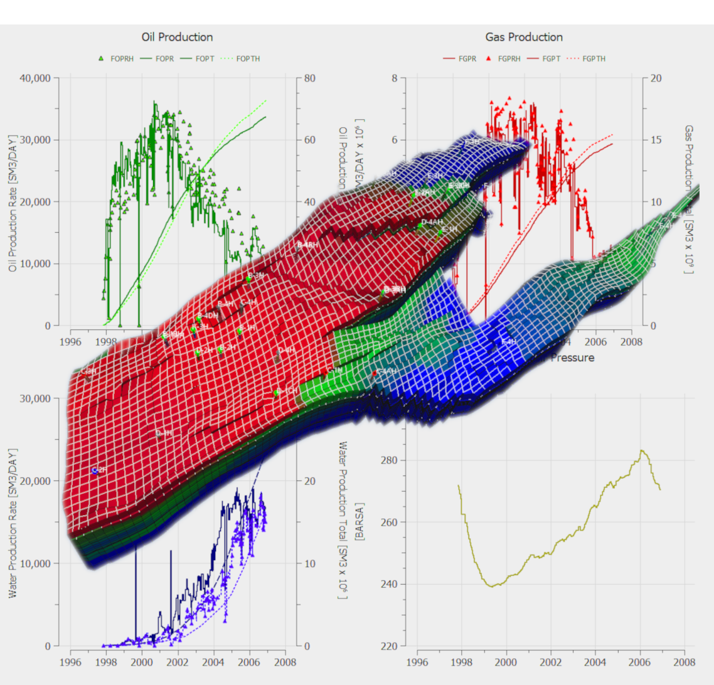

OPEN POROUS MEDIA

OPM Flow Reference Manual

OPM FLOW VERSION: 2025-04

MANUAL REVISION: Rev-A

OPEN POROUS MEDIA

OPM Flow Reference Manual

(2025-04)

| Document Control |  |  |  |
| --- | --- | --- | --- |
| Company | Equinor ASA |  |  |
| Confidentiality, copyright and reproduction | This document is Copyright 2025 by the OPEN POROUS MEDIA team. Documentation Contributors and Developers: |  |  |
| Tobias Meyer Andersen | Jostein Alvestad | Kai Bao | David Baxendale |
| Markus Blatt | Artur Castiel Reis de Souza | Joshua Charles Bowden | Paul Egberts |
| Joakim Hove | Håkon Hægland | Matthew Goodfield | Negar Khoshnevis Gargar |
| Vegard Kippe | Peter Kirkham | Stein Krogstad | Arne Morten Kvarving |
| Kjetil Olsen Lye | Robert Klöfkorn | David Landa-Marbán | Andreas Lauser |
| Cintia Goncalves Machado | Lisa Julia Nebel | Halvor Møll Nilsen | Santiago Ospina De Los Ríos |
| Atgeirr Flø Rasmussen | Antonella Ritorto | Alf Birger Rustad | Tor Harald Sandve |
| Erik Hide Sæternes | Ove Sævareid | Bård Skaflestad | Torbjørn Skille |
| Jakob Torben | Michal Tóth | Svenn Tveit | Pieter J.Verveer |
| One may distribute or modify the document under the terms of the Creative Commons Attribution-ShareALike 4.0 International License, version 4.0 or later (http://creativecommons.org/licenses/by/4.0/). All trademarks within this guide belong to their legitimate owners. |  |  |  |
| Document Type | OPEN POROUS MEDIA |  |  |
| Document Title | OPM Flow Reference Manual (2025-04) |  |  |
| Document Version | Rev-0 |  |  |
| Document Ref. | 2024-04-RPT |  |  |
| Author and Editor | OPM-OP AS Oscars Gate 27, 0352 Oslo, Norway |  |  |
| 2023–present: Matthew Goodfield, 2017–2023 David Baxendale |  |  |  |
| Please report problems, errors, and suggestions on [GitHub.](https://github.com/OPM/opm-reference-manual/issues) |  |  |  |
| Document Name | OPM_Flow_Reference_Manual_2025-04_Rev-A.fodt |  |  |

OPEN POROUS MEDIA

OPM Flow Reference Manual

(2025-04)

| Document Control |  |  |  |
| --- | --- | --- | --- |
| Document Revision | Date | Version and Revision | Status |
| December 11, 2025 | 2025-10 Rev-0 | Final version |  |
| November 12, 2025 | 2025-10 Rev-A | Developer's review draft |  |
| August 27, 2025 | 2025-04 Rev-1 | Final version |  |
| August 15, 2025 | 2025-04 Rev-0 | Final version |  |
| July 18, 2025 | 2025-04 Rev-A | Developer's review draft |  |
| March 19, 2025 | 2024-10 Rev-0 | Final version |  |
| February 27, 2025 | 2024-10 Rev-A | Developer's review draft |  |
| September 17, 2024 | 2024-04 Rev-0 | Final version |  |
| August 21, 2024 | 2024-04 Rev-B | Pre-release Review Version for Developers |  |
| July 5, 2024 | 2024-04 Rev-A | Preliminary version with H2/CO2STORE documentation |  |
| March 15, 2024 | 2023-10 Rev-0 | Final |  |
| February 15, 2024 | 2023-10 Rev-A | Developer's Review Version |  |
| June 8, 2023 | 2023-04 Rev-0 | Final |  |
| 19. Mai 2023 | 2023-04 Rev-D | Developer’s Review Draft |  |
| 8. Mai 2023 | 2023-04 Rev-C | Developer’s Release Notes Review Draft |  |
| 31. Januar 2023 | 2023-04 Rev-A/B | Working Drafts |  |
| 14. Dezember 2022 | 2022-10 Rev-0 | Final |  |
| 18. November 2022 | 2022-10 Rev-A | Developer’s Review Draft |  |
| May 18, 2022 | 2022-04 Rev-0 | Final |  |
| 6. Mai 2022 | 2022-04 Rev-A | Developer’s Review Draft |  |
| 17. November 2021 | 2021-10 Rev-0 | Final |  |
| October 22, 2021 | 2021-10 Rev-A | Developer’s Review Draft |  |
| June 28, 2021 | 2021-04 Rev-1 | Final (Fixed Keyword Footer) |  |
| June 17, 2021 | 2021-04 Rev-0 | Final |  |
| June 7, 2021 | 2021-04 Rev-A | Developer’s Review Draft |  |
| December 23, 2020 | 2020-10 Rev-0 | Final |  |
| December 10, 2020 | 2020-10 Rev-A | Developer’s Review Draft |  |
| July 9, 2020 | 2020-04 Rev-1 | Final |  |
| June 25, 2020 | 2020-04 Rev-B | Developer’s Review Draft for Appendix D |  |
| May 20, 2020 | 2020-04 Rev-0 | Final |  |
| May 8, 2020 | 2020-04 Rev-A | Developer’s Review Draft |  |
| December 5, 2019 | 2019-10 Rev-0 | Final |  |
| November 6, 2019 | 2019-10 Rev-0 | Final Draft |  |
| June 20, 2019 | 2019-04 Rev-0 | Final |  |
| December 31, 2018 | 2018-10 Rev-2 | Fix Broken Links etc. |  |
| November 6, 2018 | 2018-10 Rev-1 | Final (DRSDTR & DRVDTR) |  |
| November 5, 2018 | 2018-10 Rev-0 | Final |  |
| October 4, 2017 | 2017-04 Rev-0 | Final |  |

Table of Contents

End of Document
